## 프록시 설정 방법

1. **크롬 브라우저 위주 설정 (크롬 설정 → 시스템)**

    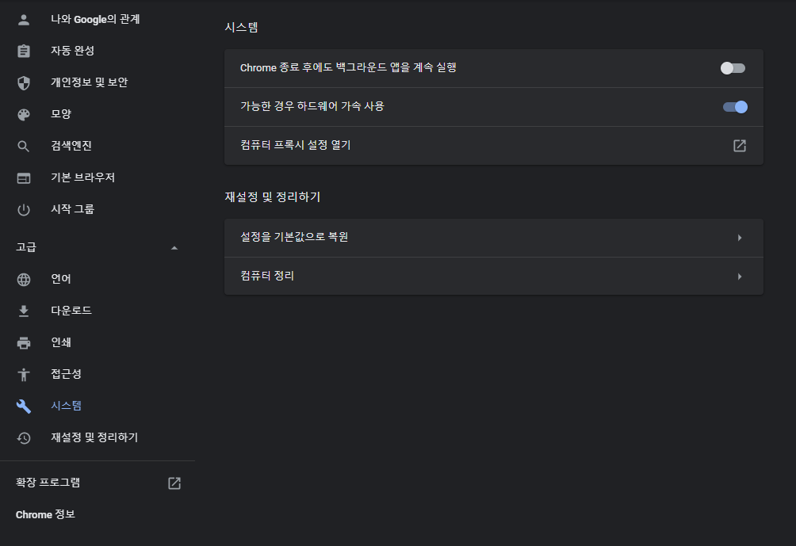

2. **수동 프록시 설정**

    기본적으로 127.0.0.1:8080을 사용한다.

    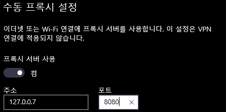

# Burp Suite CA 인증서 설치 과정 (Chrome 인증 과정)

Burp Suite를 바탕으로 SSL/TLS 암호화 기반의 HTTPS 웹 사이트를 탐색 할 경우 프록시는 인증 기관 (CA)으로 공유키 인증서로 서명된 각 호스트에 대해 SSL 인증서를 생성하게 된다.

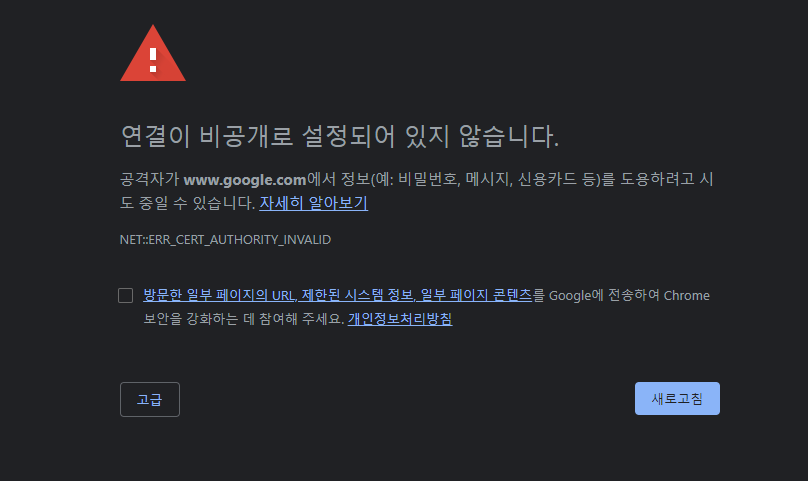


CA 으로 발급된 인증서는 Burp Suite를 처음 구동하였을 때 로컬 환경에 저장이 된다. HTTPS 웹 사이트에서 Burp Suite Proxy를 사용하려면 브라우저에서 Burp Suite CA 인증서를 `신뢰할 수 있는 루트 인증 기관` 에 설치를 해야 된다.


## Burp Suite CA 인증서 발급 과정

*Burp Suite 프록시 서버를 기점으로 로컬 환경 프록시가 세팅되어 있는 상태*

1. **Burp Suite CA 다운로드**
- 크롬 웹 브라우저를 실행 시킨 후 주소창에 `[http://burp](http://burp)` 를 입력한다.
- Burp Suite 웹 사이트가 나타나면 오른쪽 상단에 CA Certificate 버튼을 클릭한다.
- 설치를 한후 해당 경로는 다운로드 파일에 있을 것이다.

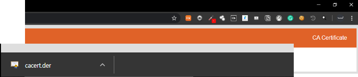


**2. Burp Suite CA 인증서 로컬 환경에 적용**

- 크롬 브라우저 설정 메뉴에 들어간후 검색 창에 `인증서` 를 입력하면 맨 하단에 `인증서 관리` 를 클릭한다.

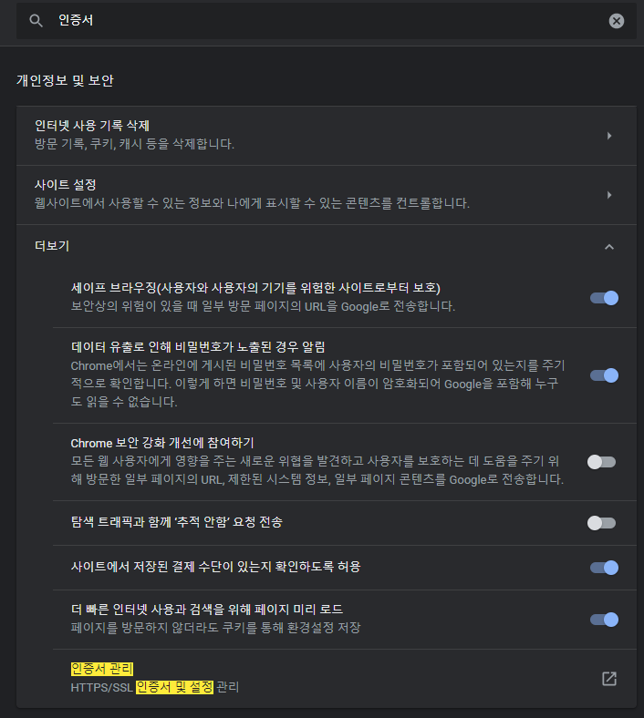

- `인증서 관리`를 클릭하면 현재 설치되어 있는 인증서 목록이 나타나며 다운로드 받은 Burp Suite CA 인증서를 설치하기 위해 `가져오기`를 눌른다.

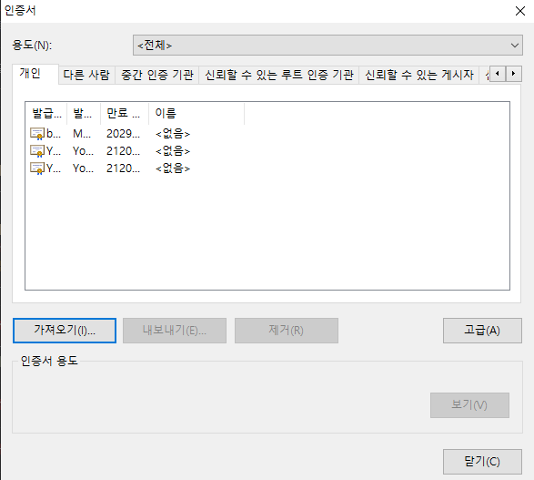

- 인증서 가져오기 마법사가 구동되고 계속 `다음`을 클릭한다.

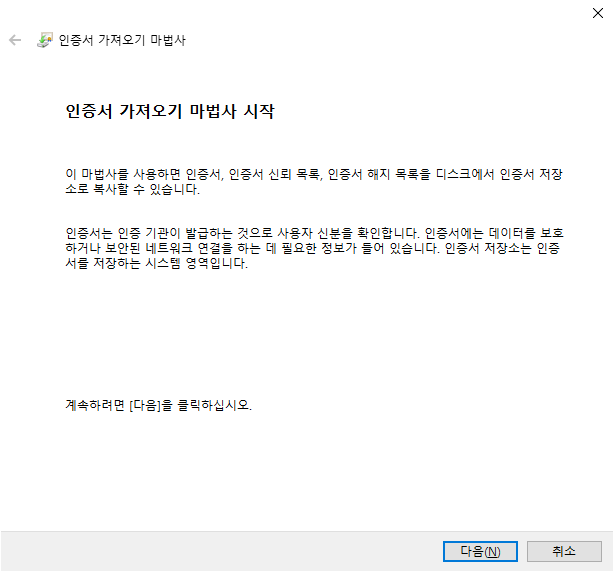

- Burp Suite CA 인증서가 저장된 경로를 `찾아보기`를 통해 파일을 로드 한다.

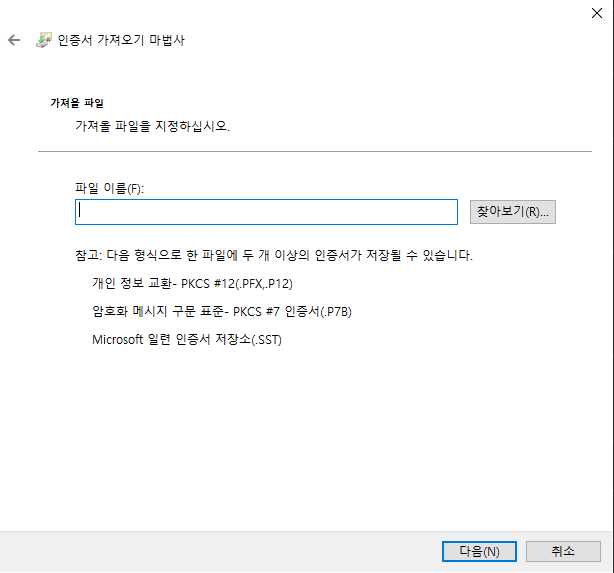

- `인증서 저장소` 에서 인증서가 저장될 위치를 선택한다.
- Burp Suite CA 인증서를 `신뢰할 수 있는 루트 인증기관` 저장소에 저장하기 위해 `모든 인증서를 다음 저장소에 저장`을 선택한 후 `찾아보기`를 클릭한다.
- 클릭 후 인증서 저장소 목록이 나타나며 `신뢰할 수 있는 루트 인증기관`을 선택한 후 확인을 누른다.

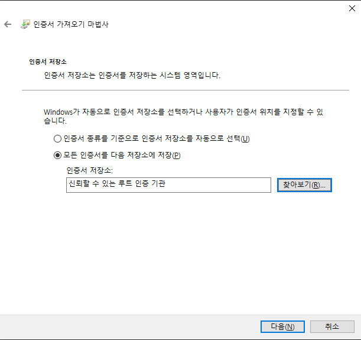

- 인증서 저장소를 선택 후 `다음`을 클릭하면 아래와 인증서 가져오기가 완료된다. `마침`을 눌러 닫아준다.

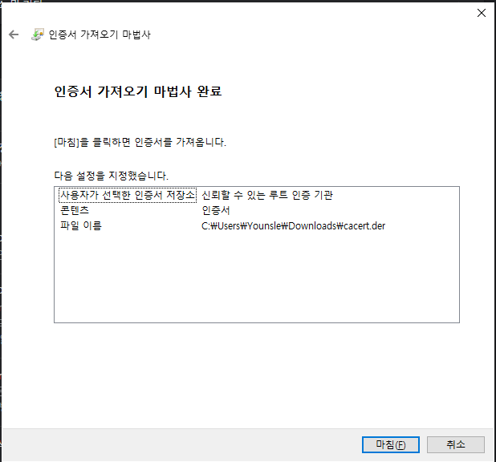

- `마침`을 누른 후 보안 경고 메시지가 보일 것이다. 본인이 확인한 신뢰할 수 있는 인증서 임으로 허용하도록 한다.

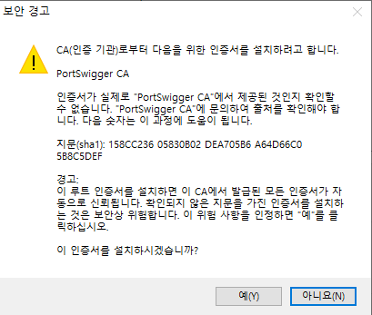

- `가져오기`가 완료되면 `신뢰할 수 있는 루트 인증기관` 저장소에 Burp Suite CA 인증서가 존재하게 된다.
- 인증이 완료되어 인증 경고창이 안뜨는 것을 확인할 수 있겠다.

**Reference**
[Burp Suite Support Center](https://support.portswigger.net/)

```toc
```