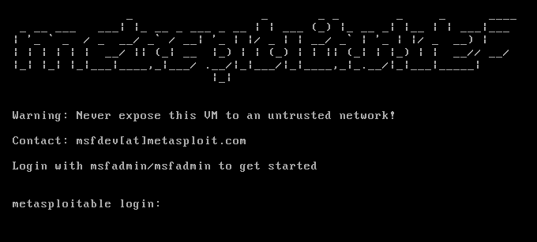
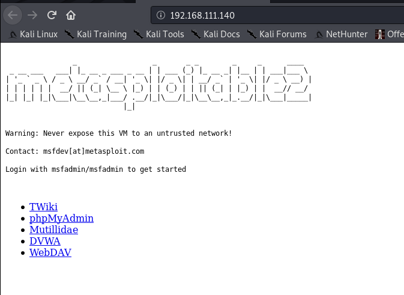

```ruby
root@kali:~# msfconsole
                                                  
IIIIII    dTb.dTb        _.---._
  II     4'  v  'B   .'"".'/|\`.""'.
  II     6.     .P  :  .' / | \ `.  :
  II     'T;. .;P'  '.'  /  |  \  `.'
  II      'T; ;P'    `. /   |   \ .'
IIIIII     'YvP'       `-.__|__.-'

I love shells --egypt

       =[ metasploit v5.0.2-dev                           ]
+ -- --=[ 1852 exploits - 1046 auxiliary - 325 post       ]
+ -- --=[ 541 payloads - 44 encoders - 10 nops            ]
+ -- --=[ 2 evasion                                       ]
+ -- --=[ ** This is Metasploit 5 development branch **   ]
```

### 하드 드라이브 공간

- 10 GB 이상의 사용 가능한 저장 공간
- 대용량 파일 시스템을 지원하는 NTFS, EXT3 또는 기타 파일 시스템 형식을 선택 해야 한다.
- 필요한 권장 공간 30 GB 정도

### 사용 가능한 메모리

- 호스트 OS에 RAM과 각 가상 머신에 할당하는 RAM의 충분한 양이 필요한다.
- Linux 호스트 최소 메모리 요구 사항
    - 1GB의 시스템 메모리 (2GB 정도면 적당)
- Kali Linux Guest 최소 메모리 요구 사항
    - 최소 1GB의 RAM (2GB 권장)

### 프로세서

- 64 bit 쿠드 코어 CPU 이상을 권장한다.

AWS (Amazon Web Server) 상에서 칼리 리눅스, 메타스폴로잇을 구동을 하여 외부 서비스를 점검을 하게 된다. 대외적으로 클라우드 서비스 환경에서도 올려 사용하고 있다.


---

## METASPLOITABLE (피해자 환경)

악용 프레임 위크를 사용하는 방법을 배울 때 발생하는 문제 중 하나는 검색하고 공격 할 대상을 찾고 구성하는 것 해당 이미지는 의도적으로 취약한 Linux 가상 머신으로, 보안 교육, 보안 툴 테스트 및 일반적인 침투 테스트 기술을 수행하는데 사용할 수 있다.

- 공격을 당할 희생자 라고 보면 된다.
- metasploitable은 희생자 PC를 제공해 주고 있다.
- 외부 네트워크로 올리지 말고 내부 네트워크 에서 테스트를 진행 한다.

**다운로드 주소**

[Metasploitable](http://sourceforge.net/projects/metasploitable/files/Metasploitable2/)

해당 이미지 파일을 가상화 할 경우 네트워크에 노출 시키면 안된다.!! 반드시 NAT 또는 호스트 전용 모드로 사용 바람





VM 구성에 있어서는 자세한 내용 Rapid7 공식 홈 페이지에 가이드가 있으니 참고 바람

[Metasploitable 2 Exploitability Guide](https://community.rapid7.com/docs/DOC-1875)

---

## Window  피해자 환경 구축

윈도우 환경에서는 각각의 애플리케이션 취약점을 바탕으로 점검을 진행하는데 해당 환경을 구축하기 위해 윈도우 서버나 일반 테스트 윈도우를 설치하여 실습을 진행한다.

**윈도우 테스트**

[Virtual Machines](https://developer.microsoft.com/en-us/microsoft-edge/tools/vms/)

**윈도우 2016 서버 테스트**

[Microsoft Evaluation Center에서 Windows Server 2016 시도](https://www.microsoft.com/ko-kr/evalcenter/evaluate-windows-server-2016/)

```toc
```