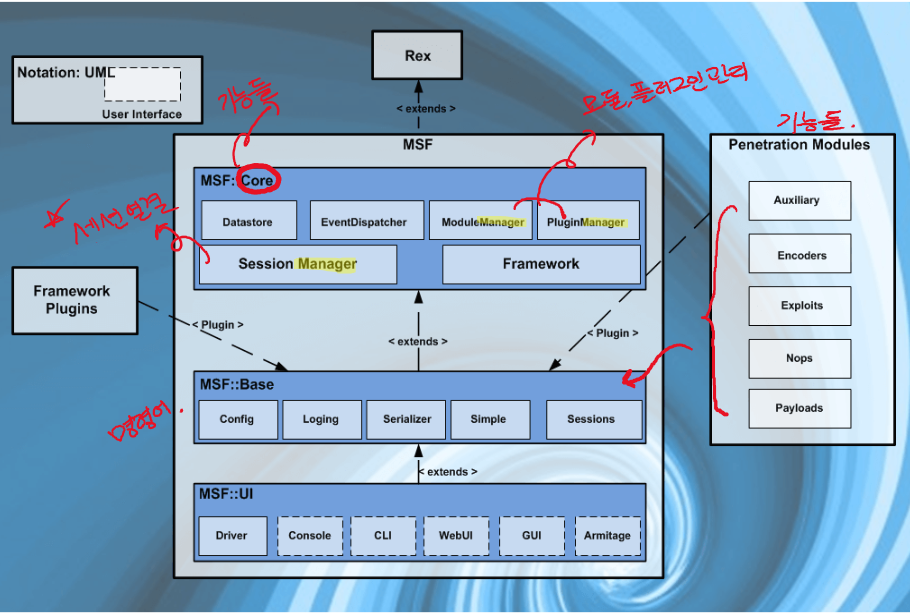
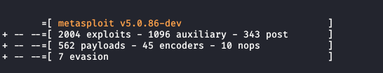

# Metasploit 아키텍처

Metasploit은 Ruby로 작성되었으며 수년 동안 개발되었다. 언뜻보기에 프로젝트의 규모는 어려울 수 있지만 아키텍처를 깊게는 파고들 필요가 없다.



Metasploit 파일 시스템 및 라이브러리에 익숙해지면 좀더 능숙하게 작성할 수 있겠다. Kali Linux에서 Metasploit은 metasploit-framework 패키지로 제공되며 `/usr/share/metasploit-framework` 디렉토리에 설치된다.

```ruby
root@kali:/usr/share/metasploit-framework# ls -lt
total 148
drwxr-xr-x  3 root root  4096 May 26 08:57 config
lrwxrwxrwx  1 root root    27 Feb 11  2019 documentation -> ../doc/metasploit-framework
drwxr-xr-x 11 root root  4096 Feb 11  2019 tools
drwxr-xr-x  3 root root  4096 Feb 11  2019 vendor
drwxr-xr-x  6 root root  4096 Feb 11  2019 scripts
drwxr-xr-x  2 root root  4096 Feb 11  2019 plugins
drwxr-xr-x  9 root root  4096 Feb 11  2019 modules
drwxr-xr-x 14 root root  4096 Feb 11  2019 lib
drwxr-xr-x  3 root root  4096 Feb 11  2019 db
drwxr-xr-x 21 root root  4096 Feb 11  2019 data
drwxr-xr-x  4 root root  4096 Feb 11  2019 app
-rw-r--r--  1 root root  9359 Jan 25  2019 Gemfile.lock
-rw-r--r--  1 root root  8652 Jan 25  2019 metasploit-framework.gemspec
-rwxr-xr-x  1 root root  1263 Jan 25  2019 msfconsole
-rwxr-xr-x  1 root root  2813 Jan 25  2019 msfd
-rwxr-xr-x  1 root root  5326 Jan 25  2019 msfdb
-rw-r--r--  1 root root   635 Jan 25  2019 msf-json-rpc.ru
-rwxr-xr-x  1 root root  2229 Jan 25  2019 msfrpc
-rwxr-xr-x  1 root root  9677 Jan 25  2019 msfrpcd
-rwxr-xr-x  1 root root   166 Jan 25  2019 msfupdate
-rwxr-xr-x  1 root root 12921 Jan 25  2019 msfvenom
-rw-r--r--  1 root root   551 Jan 25  2019 msf-ws.ru
-rwxr-xr-x  1 root root   604 Jan 25  2019 ruby
-rwxr-xr-x  1 root root   140 Jan 25  2019 script-exploit
-rwxr-xr-x  1 root root   141 Jan 25  2019 script-password
-rwxr-xr-x  1 root root   138 Jan 25  2019 script-recon
-rwxr-xr-x  1 root root  1209 Jan 24  2019 Gemfile
-rwxr-xr-x  1 root root  1299 Jan 24  2019 Rakefile
```

## Metasploit FileSystem

MSF 파일 시스템은 직관적 인 방식으로 배치된다.

### Data

Data 디렉터리는 특정 공격, 단어 목록, 이미지 및 더 필요한 바이너리에 MSF에서 사용하는 편집 가능한 파일이 포함되어 있다.

```ruby
oot@kali:/usr/share/metasploit-framework/data# ls -lt
total 1172
drwxr-xr-x   2 root root   4096 Feb 11  2019 wordlists
drwxr-xr-x   2 root root   4096 Feb 11  2019 wmap
drwxr-xr-x   2 root root   4096 Feb 11  2019 webcam
drwxr-xr-x   4 root root   4096 Feb 11  2019 templates
drwxr-xr-x   3 root root   4096 Feb 11  2019 sounds
drwxr-xr-x   3 root root   4096 Feb 11  2019 snmp
drwxr-xr-x   4 root root   4096 Feb 11  2019 post
drwxr-xr-x   2 root root   4096 Feb 11  2019 php
drwxr-xr-x   2 root root   4096 Feb 11  2019 meterpreter
drwxr-xr-x   2 root root   4096 Feb 11  2019 msfcrawler
drwxr-xr-x   2 root root   4096 Feb 11  2019 passivex
drwxr-xr-x   2 root root   4096 Feb 11  2019 logos
drwxr-xr-x   2 root root   4096 Feb 11  2019 markdown_doc
drwxr-xr-x   2 root root   4096 Feb 11  2019 lab
drwxr-xr-x   2 root root   4096 Feb 11  2019 ipwn
drwxr-xr-x 132 root root  12288 Feb 11  2019 exploits
drwxr-xr-x   2 root root   4096 Feb 11  2019 flash_detector
drwxr-xr-x   3 root root   4096 Feb 11  2019 headers
drwxr-xr-x  10 root root   4096 Feb 11  2019 SqlClrPayload
-rwxr-xr-x   1 root root     68 Jan 24  2019 eicar.com
-rwxr-xr-x   1 root root    963 Jan 24  2019 eicar.txt
-rwxr-xr-x   1 root root   1288 Jan 24  2019 emailer_config.yaml
-rwxr-xr-x   1 root root  29548 Jan 24  2019 isight.bundle
-rwxr-xr-x   1 root root  63031 Jan 24  2019 john.conf
-rwxr-xr-x   1 root root  10628 Jan 24  2019 mime.yml
-rwxr-xr-x   1 root root 475136 Jan 24  2019 vncdll.x64.dll
-rwxr-xr-x   1 root root 401920 Jan 24  2019 vncdll.x86.dll
-rw-r--r--   1 root root 108964 Jan 24  2019 ysoserial_payloads.json
```

### Documentation

Documentation 디렉터리에는 프레임 워크에 사용 가능한 문서가 포함된다.

```ruby
root@kali:/usr/share/metasploit-framework/documentation# ls -lt
total 404
drwxr-xr-x 7 root root   4096 Feb 11  2019 modules
drwxr-xr-x 3 root root   4096 Feb 11  2019 api
-rw-r--r-- 1 root root   7496 Jan 25  2019 changelog.Debian.gz
-rw-r--r-- 1 root root  23006 Jan 25  2019 copyright
-rw-r--r-- 1 root root   2509 Jan 24  2019 CODE_OF_CONDUCT.md
-rw-r--r-- 1 root root   2408 Jan 24  2019 CONTRIBUTING.md.gz
-rw-r--r-- 1 root root 358142 Jan 24  2019 developers_guide.pdf.gz
-rw-r--r-- 1 root root   1597 Jan 24  2019 README.md
```

### LIB

LIB 디렉터리는 프레임 워크 코드 기반의 라이브리들이 포함 된다.

```ruby
root@kali:/usr/share/metasploit-framework/lib# ls -lt
total 112
drwxr-xr-x  2 root root  4096 Feb 11  2019 sqlmap
drwxr-xr-x  2 root root  4096 Feb 11  2019 tasks
drwxr-xr-x  2 root root  4096 Feb 11  2019 telephony
drwxr-xr-x  2 root root  4096 Feb 11  2019 snmp
drwxr-xr-x 13 root root  4096 Feb 11  2019 rex
drwxr-xr-x  2 root root  4096 Feb 11  2019 rabal
drwxr-xr-x  2 root root  4096 Feb 11  2019 rbmysql
drwxr-xr-x  4 root root  4096 Feb 11  2019 net
drwxr-xr-x  3 root root  4096 Feb 11  2019 postgres
drwxr-xr-x  7 root root  4096 Feb 11  2019 msf
drwxr-xr-x  3 root root  4096 Feb 11  2019 metasploit
drwxr-xr-x  6 root root  4096 Feb 11  2019 anemone
-rw-r--r--  1 root root   143 Jan 24  2019 anemone.rb
-rw-r--r--  1 root root  2217 Jan 24  2019 enumerable.rb
-rw-r--r--  1 root root   722 Jan 24  2019 msfenv.rb
-rw-r--r--  1 root root   367 Jan 24  2019 postgres_msf.rb
-rw-r--r--  1 root root 23897 Jan 24  2019 rbmysql.rb
-rw-r--r--  1 root root  3824 Jan 24  2019 rex.rb
-rw-r--r--  1 root root  4322 Jan 24  2019 robots.rb
-rw-r--r--  1 root root   294 Jan 24  2019 snmp.rb
-rw-r--r--  1 root root    71 Jan 24  2019 telephony.rb
-rw-r--r--  1 root root  1660 Jan 24  2019 windows_console_color_support.rb
```

### Module

Module 은 공격, 보조 및 사후 모듈, 페이로드, 인코더, 그리고 Nop, 실제 MSF 모듈을 찾을 수 있다.

```ruby
root@kali:/usr/share/metasploit-framework/modules# ls -lt
total 28
drwxr-xr-x 14 root root 4096 Feb 11  2019 post
drwxr-xr-x  5 root root 4096 Feb 11  2019 payloads
drwxr-xr-x 11 root root 4096 Feb 11  2019 nops
drwxr-xr-x 21 root root 4096 Feb 11  2019 exploits
drwxr-xr-x  3 root root 4096 Feb 11  2019 evasion
drwxr-xr-x 12 root root 4096 Feb 11  2019 encoders
drwxr-xr-x 21 root root 4096 Feb 11  2019 auxiliary
```

## Penetration Modules 종류



- Penetration Modules
    1. exploits 
        1. 악의적인 취약점을 유발하는 실제 코드 조각
        2. Exploit 모듈은 페이로드를 사용하는 모듈로 정의
    2. auxiliary 
        1. 대상 네트워크에 정보 수집, 데이터베이스 핑거 프린팅, 포트 스캔 및 배너 정보 수집 같은 특정 작업을 수행하는 보조 모듈
        2. 포트 스캐너, 퍼저, 스니퍼 등 정보 수집
    3. payloads
        1. 페이로드는 공격 후 대상 시스템에 연결하거나 대상 서버에 서비스 설치와 같은 특정 작업 등을 수행하는데 사용된다.
        2. 원격으로 실행 되는 코드로 구성
    4. encoders
        1. 인코더는 페이로드 및 공격 벡터를 인코딩하여 바이러스 탐지 솔루션 또는 방화벽으로 탐지를 피하는 데 사용된다.
    5. nops
        1. Nop 생성기는 공격이 안정적으로 진행되는데 사용된다.
        2. Nop Opcode 와 동일하다
        3. Nops 는 Exploit 시도에서 페이로드 크기를 일관되게 유지 한다.
    6. evasion 
        1. 우회 가능, 인코더의 좀더 강화된 기능
    7. 피해자 PC를 장악을 한 후 추가적인 기능을 통해 정보를 가져오는 기능들

### msfconsole 내에서 외부 모듈을 불러 올 수 있다.

```ruby
msf > loadpath
Usage: loadpath </path/to/modules>

Loads modules from the given directory which should contain subdirectories for
module types, e.g. /path/to/modules/exploits

msf > loadpath /usr/share/metasploit-framework/modules/
Loaded 399 modules:
    399 payloads
```

```ruby
msf5 > load 
load aggregator        load db_tracker        load lab               load nexpose           load sample            load sqlmap            load wmap
load alias             load event_tester      load libnotify         load openvas           load session_notifier  load thread            
load auto_add_route    load ffautoregen       load msfd              load pcap_log          load session_tagger    load token_adduser     
load beholder          load ips_filter        load msgrpc            load request           load socket_logger     load token_hunter      
load db_credcollect    load komand            load nessus            load rssfeed           load sounds            load wiki
```

### Plugins

외부 플러그인들의 집합체

```ruby
root@kali:/usr/share/metasploit-framework/modules# cd ../plugins/
root@kali:/usr/share/metasploit-framework/plugins# ls -lt
total 392
-rw-r--r-- 1 root root 16977 Jan 24  2019 aggregator.rb
-rw-r--r-- 1 root root 12581 Jan 24  2019 alias.rb
-rw-r--r-- 1 root root  1052 Jan 24  2019 auto_add_route.rb
-rw-r--r-- 1 root root  9515 Jan 24  2019 beholder.rb
-rw-r--r-- 1 root root  2726 Jan 24  2019 db_credcollect.rb
-rw-r--r-- 1 root root  1655 Jan 24  2019 db_tracker.rb
-rw-r--r-- 1 root root  1119 Jan 24  2019 event_tester.rb
-rw-r--r-- 1 root root  2213 Jan 24  2019 ffautoregen.rb
-rw-r--r-- 1 root root  2456 Jan 24  2019 ips_filter.rb
-rw-r--r-- 1 root root  4841 Jan 24  2019 komand.rb
-rw-r--r-- 1 root root 16815 Jan 24  2019 lab.rb
```

### Scripts

Meterpreter과 다른 스크립트가 포함된다.

```ruby
root@kali:/usr/share/metasploit-framework/scripts# ls -lt
total 16
drwxr-xr-x 2 root root 4096 Feb 11  2019 meterpreter
drwxr-xr-x 2 root root 4096 Feb 11  2019 ps
drwxr-xr-x 2 root root 4096 Feb 11  2019 resource
drwxr-xr-x 2 root root 4096 Feb 11  2019 shell
```

### tools

Tools 디렉터리는 여러 가지 유용한 명령 줄 유틸리티가 있다.

```ruby
root@kali:/usr/share/metasploit-framework/scripts# cd ../tools/
root@kali:/usr/share/metasploit-framework/tools# ls -lt
total 36
drwxr-xr-x 2 root root 4096 Feb 11  2019 modules
drwxr-xr-x 2 root root 4096 Feb 11  2019 password
drwxr-xr-x 3 root root 4096 Feb 11  2019 payloads
drwxr-xr-x 2 root root 4096 Feb 11  2019 recon
drwxr-xr-x 2 root root 4096 Feb 11  2019 memdump
drwxr-xr-x 2 root root 4096 Feb 11  2019 exploit
drwxr-xr-x 2 root root 4096 Feb 11  2019 hardware
drwxr-xr-x 2 root root 4096 Feb 11  2019 dev
drwxr-xr-x 2 root root 4096 Feb 11  2019 context
```

# 주요 metasploit framework 경로

lib, modules, plugin, tools, scripts등 중요한 기능들이 저장되있다.

- **주요 디렉터리 파일 구조**
    - lib
        1. Metasploit의 심장. MSF 모듈을 빌드하는 데 도움이 되는 모든 필수 라이브러리 파일이 포함된다.
    - module
        1. 모든 Metasploit 모듈이 이 디렉토리에 있다. 스캐너 부터 심화 개발 모듈에 이르기까지 Metasploit 프로젝트에 통합된 모든 모듈을 디렉토리에서 찾을 수 있다.
        2. 모듈 정보

        ```c
        Zer0Luck@Zer0Luck:/usr/share/metasploit-framework/modules$ ls
        auxiliary  encoders  evasion  exploits  nops  payloads  post
        Zer0Luck@Zer0Luck:/usr/share/metasploit-framework/modules$ cd exploits/
        Zer0Luck@Zer0Luck:/usr/share/metasploit-framework/modules/exploits$ ls
        aix      apple_ios  bsdi    example.rb                 example_webapp.rb  freebsd  irix   mainframe  netware  osx  solaris  windows
        android  bsd        dialup  example_linux_priv_esc.rb  firefox            hpux     linux  multi      openbsd  qnx  unix
        Zer0Luck@Zer0Luck:/usr/share/metasploit-framework/modules/exploits$ cd windows/
        Zer0Luck@Zer0Luck:/usr/share/metasploit-framework/modules/exploits/windows$ ls -lt
        drwxr-xr-x 2 root root 16384  5월  2 06:35 http
        drwxr-xr-x 2 root root  4096  5월  2 06:35 ibm
        drwxr-xr-x 2 root root  4096  5월  2 06:35 iis
        ...
        ```

    - tools
        1. 침투 테스트를 지원하는 명령 유틸리티가 이 폴더에 포함
        2. 패턴 생성에서 성공적인 Exploit 코드 작성을 위한 JMP ESP 주소 찾기에 이르기 까지 필요한 모든 명령 줄 유틸리티가 포함된다.
    - plugin
        1. Metasploit의 기능을 확장하는 모든 플러그인이 이 폴더에 저장.
        2. 표준 플러그인은 OpenVAS, Nexpose, Nessus 등  load 명령을 사용하여 메타스폴로잇 프레임워크에서 사용 가능
    - script
        1. 이 디렉토리에는 Meterpreter와 기타 다양한 스크립트가 포함된다.
        2. post 단계에서 사용됨 (PC에서 추가적인 정보를 얻는데 사용된다.)
        3. script 디렉터리

        ```c
        Zer0Luck@Zer0Luck:/usr/share/metasploit-framework/scripts$ ls -lt
        합계 16
        drwxr-xr-x 2 root root 4096  5월  2 06:35 meterpreter
        drwxr-xr-x 2 root root 4096  5월  2 06:35 ps
        drwxr-xr-x 2 root root 4096  5월  2 06:35 resource
        drwxr-xr-x 2 root root 4096  5월  2 06:35 shell
        ```

```toc
```