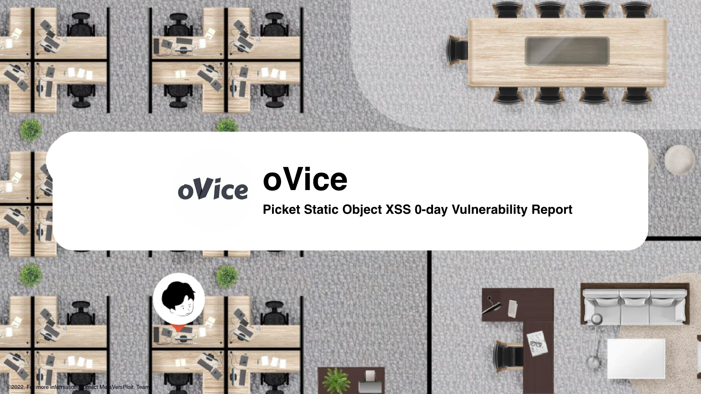
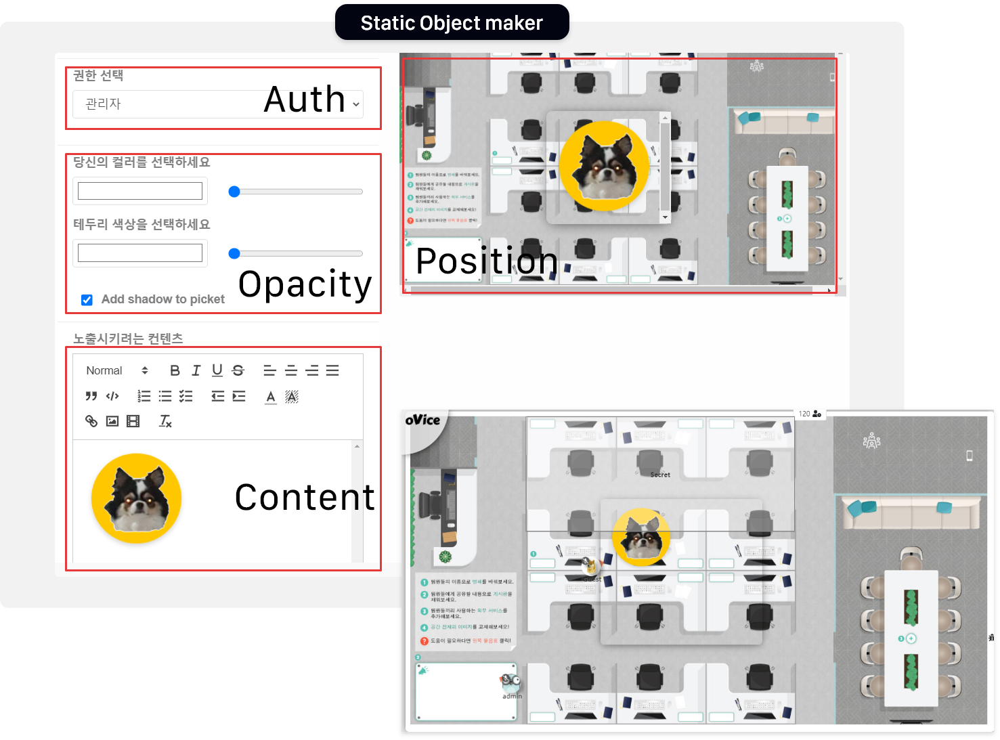
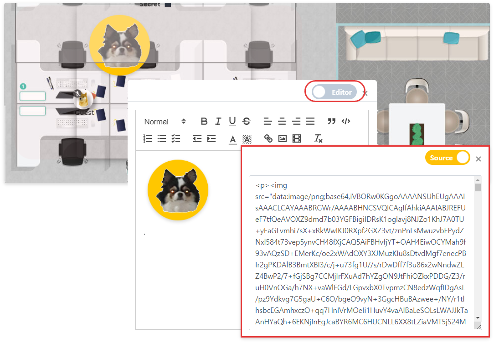
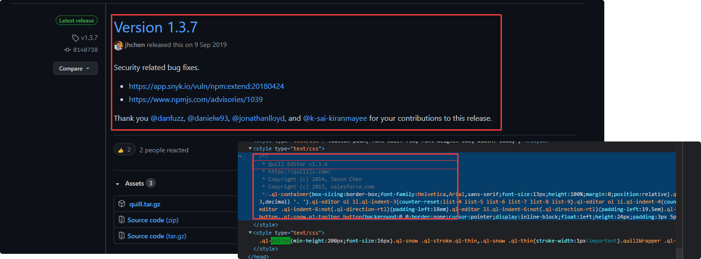
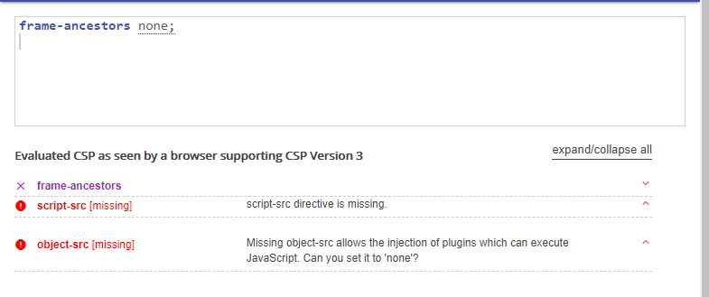
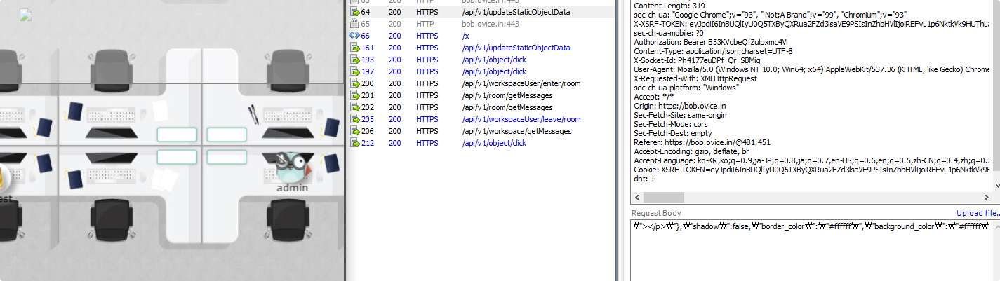
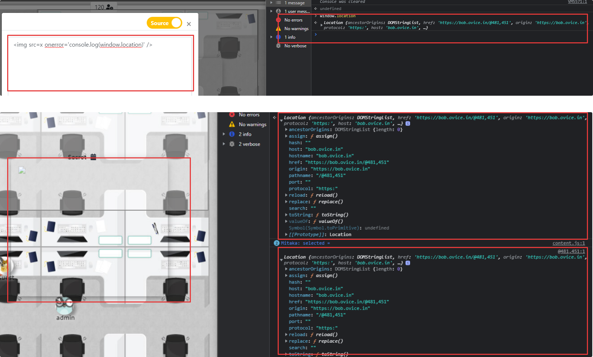

## Attack Type

- XSS
- Weak algorithm.

## Attack Effect

- Security Check Bypass
- Privilege Escalation

## Found Location

- Users of administrative authority have the authority to create static objects.
- A `Picket object` exists in a Statistic Object.
- `Picket objects` provide a variety of contents using the editor function.



```jsx
/console/objects
```

- `/api/v1/object/add` api is called when installing a static object. When clicking on the installed static object, `/api/v1/object/click` api is called. When modifying the installed static object, the `/api/v1/updateStaticObjectData` api is called.

```jsx
/api/v1/object/add
/api/v1/object/click
/api/v1/updateStaticObjectData
```

## Attack Point

- If you have a user account who has permission to modify within the workspace where the static object is installed, you can modify html by activating the function of the `editor`.



- It was confirmed that the node `quill` was used, and a 1-day attack could be performed using a version less than 1.3.7 that became a security patch.



### Picket Object function

- Administrator authority (default)
- Member's authority.
- Guest authority.
- Visitor Guohan.

## Vulnerability Description

### Client Side Security Check

**Contents-Security-Policy**

- frame-ancestors `none`
    - Defines valid sources for embedding the resource using `<frame> <iframe> <object> <embed> <applet>`. Setting this directive to 'none' should be roughly equivalent to `X-Frame-Options: DENY`
- `script-src` , `object-src` Since CSP Policy is not set, external script loading and requesting are possible.



### Problem with security setting defect in quill-editor

- When selecting an image from a Picket Object installed as a static object, the image is encoded as base 64 and interpreted as an html tag for editing.


- A space for executing javascript may be created using the html tag allowed in the white list as follows.
- Various attacks can be attempted using oVice internal script without space escape.


### Static-Object function to strengthen vulnerabilities

- Several functions can be modified when setting up a picket object. `Color, transparency, location, content, shadow,`
- If correction authority exists, transparent objects can be created to make the attack impact higher.

```python
picket_data = {
    "id": f"object_id",
    "data":{
        "auth":"visitor",    
        "width":xpos,
        "height":ypos,
        "return":{"content":"Attack Vector"},
        "shadow": false,
        "border_color":"color",
        "background_color":"color",
        "border_color_opacity":0,
        "background_color_opacity":0
    },
    "workspace_id":"9473"
}
```



- In the case of the picket object function, unlike iframe, it can be created only if it has the right to set, but it basically operates throughout the workspace and can attack invisible xss to the user through the following attribute changes.

## Payload

- An xss attack was performed within the range of tags designated as whitelist.
- Although not all of them were checked, it was confirmed that the rest of the tags were executed except for `script tags`, and based on this, the payload was created.

```jsx

<a href=<inline-javascript> />
<iframe src=<inline-javascript> />
etc ...
```

- When a static object is installed within the worskapce, the attribute can be changed if the corresponding modification authority exists.

```python
picket_data = {
    "id": f"{object_id}",
    "data":{
        "auth":"visitor",    
        "width":421,
        "height":371,
        "return":{"content":"<p></p>"},
        "shadow":true,
        "border_color":"#ffffff",
        "background_color":"#ffffff",
        "border_color_opacity":100,
        "background_color_opacity":100
    },
    "workspace_id":"9473"
}
```
## Security Countermeasure

### Quill-editor security settings are insufficient.

- The object picket can be changed to html through the editor function when an image is registered in using the quill-editor.
- However, it was an XSS attack because all tags except script tags were operated, so it is important to select the necessary tags through a white list method.
- It is recommended to establish a security policy using the functions provided by the editor.

### Let's have a safe client life by applying Content-Security-Policy security.

- Looking at the client-side security techniques of web applications, security techniques for CSPs are currently applied, but only security techniques for `iframe` are applied.
- Of course, due to the nature of the service, I don't think the security policy has been set, but script-src and object-src policies are currently not at stake, so it is possible to load external scripts or request external attacks.
- Therefore, CSP script-src, object-src policies should be set so that only script can be used within the domain ovice.in.

```python
Content-Security-Policy: default-src 'self' https://*.ovice.in
```

- As a result of web application analysis, most cases have statically inserted scripts into html internally, so it is also good to give nonce attributes to allow only the scripts.

```python
Content-Security-Policy: default-src 'nonce-ingjoigrogj/jfeo+iegi=='; base-uri
```

### X-XSS protection Header Settings

- By setting X-XSS protection in the header, it is possible to filter the user's input value through the browser end.

```python
X-XSS-Protection: 1 -> Browser XSS-Filter Enable
```

- Although it can only prevent attacks in which the user's input value is exposed as it is, it can be used as an auxiliary means.

```toc
```