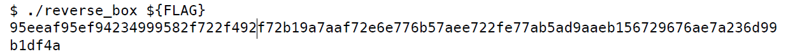
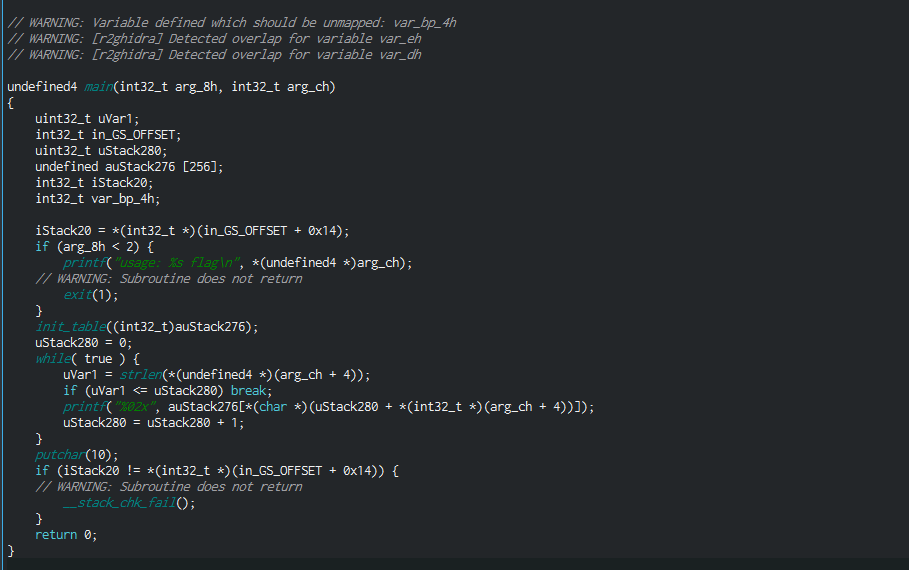
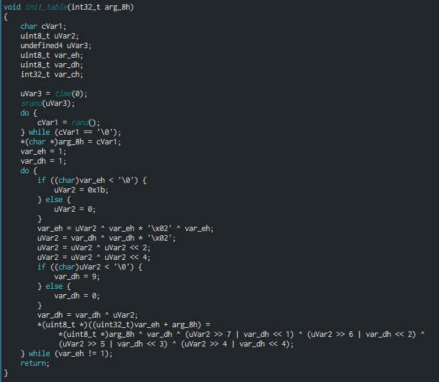
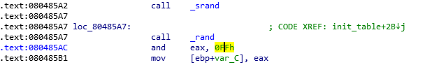
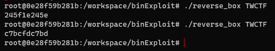
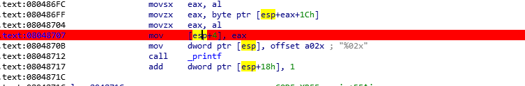
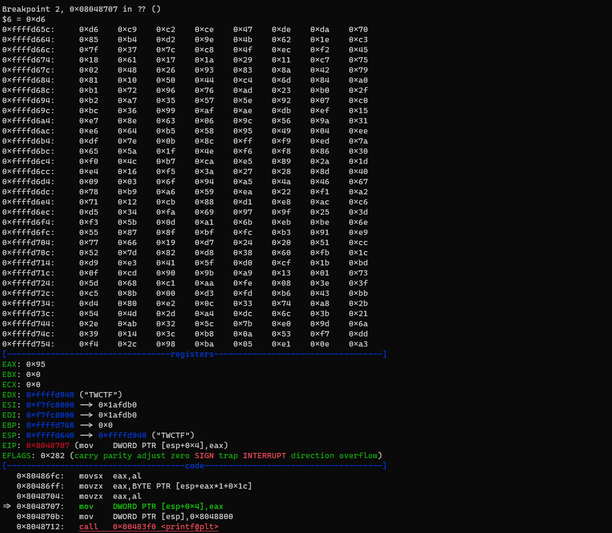

# 취약점 분석

## 바이너리 정보
```python
reverse_box: ELF 32-bit LSB executable
Intel 80386, version 1 (SYSV)
dynamically linked, interpreter /lib/ld-linux.so.2
for GNU/Linux 2.6.24, BuildID[sha1]=5403acba0427c34695b1ebda8f0c678905b33456, stripped
```

- 해당 바이너리를 올바른 플래그와 함께 실행했을 때의 아웃풀 정보를 보여준다.



## main 함수 분석



- `unsigned int` 형의 `auStack276` 배열은 `init_table` 함수로 초기화가 되어지며
- argv오 입력한 길이 만큼 루틴을 돌면서 `auStack276` 의 인덱스 로 사용되어 해당 값을 출력한다.
- 인수를 사용하여 바이너리를 실행하는지 확인하고, 계산 함수를 호출하고 마지막으로 결과를 출력한다.
- 출력 형식을 보면 16진수 형식의 결과를 알 수 있다.

## init_table 함수 분석



- do~while 문을 바탕으로 `arg_8`을 초기화한 후 나머지 `arg_8`의 값은 0번째 값을 이용해 생성하는 것을 확인할 수있다.
- `arg_8[0]`에 올 수 있는 경우의 수는 256이기 때문에 생성될 수있는 `arg_8`의 수도 256가지 이다.
- 시간을 난수 시드로 사용하며 경우의 수가 다수이다. 해당 어셈블리어를 살펴보도록 한다.



- 하위 2 비트, 즉 0-ff의 경우 다음 *ROR1* 계산 만 취해 보겠다.
- 이것은 알고리즘이며 다시 되돌리수 없다. 그렇기 때문에 블라스팅의 사용은 제한된다.
- 조건
    1. 0-ff
    2. TWCTF (지정된 플래그 형식이며, 해당 매개 변수는 런타임에 추가되고, 첫 번째 결과는 95인것을 확인할 수 있다.)
        - box의 생성은 시간에 의해 생성된 난수와 관련이 있지만 생성된 난수는 1바이트에 불과하다
        - 즉 256 개의 가능성 만 존재한다. 그렇기 때문에 모든 테이블을 탐색하여 결과를 찾을 수 있다. 개임 팁에 따르면 깃발은 `TWCTF` 로 시작한다.



- 해당 문자는 고정된 12자를 생성한다.

```cpp
movzx   eax, byte ptr [esp+eax+1Ch]
movzx   eax, al
mov     [esp+4], eax
mov     dword ptr [esp], offset a02x ; "%02x"
call    _printf
```
- eax 레지스터는 입력한 문자를 저장한다.
- 그런 다음 printf 함수는 eax 위치 에서 [esp+1ch]의 배열 요소를 전당한다.
- 그래서 해당 배열은 우리의 결과를 담고 있다.
- 스택의 해당 위치로 이동하면 268 바이트 16진수 배열이 표시되고 나중에 사용하기 
위해 array라는 이진 파일에 배열을 저장한다.

- 바이너리 파일을 몇 번 실행하면 배열도 어떤 방식 으로든 무작위 화 된다.
- 계산 함수에서 반환한 임의 값과 관련이 있을 수 있다.
- 바이너리 파일을 몇 번 더 실행하면 배열의 두 번째 요소가 계산에서 항상 난수와
동일하다는 것을 알 수 있다.
- 따라서 바이너리 파일에는 기본 배열이 있어야 하며 임의의 값을 사용하여 어떤 방식
으로든 작동해야 한다.
- 연산이 발생할 때마가 기본 배열의 두 번째 요소가 0이어야 하고 난수를 얻는다.
- 바이너리가 수행하는 작업의 종류를 이해해 보자
- 이진 배열을 파이썬 스크립트에로드하여 이를 달성한 다음 저장한 배열 요소에 대해
가정된 작업을 수행하여 기본 배열을 얻고 이진 파일을 실행할 때 알려진 임의 값을 사용
하고 마지막으로 프로세스 검증을 위해 다른 임의 값을 사용하는 다른 바이너리 실행과
비교하자

- 첫 번째 옵션은 기본 배열 값에 임의의 값을 추가하는 것이다.
- 두 번째 요소에서 작동하지만 이 프로세스를 다른 바이너리 실행과 비교하는 것은 작동
하지 않는다.
- 두 번째 추측은 바이너리 파일이 기본 배열 요소를 사용하여 임의 값을 XOR하여 두 번째
배열 요소가 임의 값과 같도록 허용한다.

- -> 우리가 저장한 배열과 바이너리 실행의 임의 값을 사용하여 기본 배열을 얻는 것이다

### gdb script

```bash
set $i=0 // $i=0 초기화
set $total=256 // 256가지의 경우의 수

while($i<$total) // 0~256 까지 한 바이트씩 루틴
  b *0x80485b4 // cmp     [ebp+var_C], 0
  b *0x8048707 // movzx   eax, al  

  run TWCTF // 인자 값 TWCTF ->
  set $i=$i+1 // $i 1씩 증가
  set *(char*)($ebp-0xc)=$i 
  continue // 계속 해서 돌리면서 0x80485b4 비교 루틴에서 1씩 증가하면서 
  if ($eax==0x95) // 출력된 값이 0x95로 시작한다 그러면 출력해주고 
    print $i
    x/256xb $esp+0x1c
    set $i=256
  end
  stop
end
end
```


- 반복 256의 경우의 수를 만족할 수 있도록





# 해결 방안

## solved Code

```python
#encoding=utf-8
correct='95eeaf95ef94234999582f722f492f72b19a7aaf72e6e776b57aee722fe77ab5ad9aaeb156729676ae7a236d99b1df4a'
box=[\
0xd6,0xc9,0xc2,0xce,0x47,0xde,0xda,0x70,\
0x85,0xb4,0xd2,0x9e,0x4b,0x62,0x1e,0xc3,\
0x7f,0x37,0x7c,0xc8,0x4f,0xec,0xf2,0x45,\
0x18,0x61,0x17,0x1a,0x29,0x11,0xc7,0x75,\
0x02,0x48,0x26,0x93,0x83,0x8a,0x42,0x79,\
0x81,0x10,0x50,0x44,0xc4,0x6d,0x84,0xa0,\
0xb1,0x72,0x96,0x76,0xad,0x23,0xb0,0x2f,\
0xb2,0xa7,0x35,0x57,0x5e,0x92,0x07,0xc0,\
0xbc,0x36,0x99,0xaf,0xae,0xdb,0xef,0x15,\
0xe7,0x8e,0x63,0x06,0x9c,0x56,0x9a,0x31,\
0xe6,0x64,0xb5,0x58,0x95,0x49,0x04,0xee,\
0xdf,0x7e,0x0b,0x8c,0xff,0xf9,0xed,0x7a,\
0x65,0x5a,0x1f,0x4e,0xf6,0xf8,0x86,0x30,\
0xf0,0x4c,0xb7,0xca,0xe5,0x89,0x2a,0x1d,\
0xe4,0x16,0xf5,0x3a,0x27,0x28,0x8d,0x40,\
0x09,0x03,0x6f,0x94,0xa5,0x4a,0x46,0x67,\
0x78,0xb9,0xa6,0x59,0xea,0x22,0xf1,0xa2,\
0x71,0x12,0xcb,0x88,0xd1,0xe8,0xac,0xc6,\
0xd5,0x34,0xfa,0x69,0x97,0x9f,0x25,0x3d,\
0xf3,0x5b,0x0d,0xa1,0x6b,0xeb,0xbe,0x6e,\
0x55,0x87,0x8f,0xbf,0xfc,0xb3,0x91,0xe9,\
0x77,0x66,0x19,0xd7,0x24,0x20,0x51,0xcc,\
0x52,0x7d,0x82,0xd8,0x38,0x60,0xfb,0x1c,\
0xd9,0xe3,0x41,0x5f,0xd0,0xcf,0x1b,0xbd,\
0x0f,0xcd,0x90,0x9b,0xa9,0x13,0x01,0x73,\
0x5d,0x68,0xc1,0xaa,0xfe,0x08,0x3e,0x3f,\
0xc5,0x8b,0x00,0xd3,0xfd,0xb6,0x43,0xbb,\
0xd4,0x80,0xe2,0x0c,0x33,0x74,0xa8,0x2b,\
0x54,0x4d,0x2d,0xa4,0xdc,0x6c,0x3b,0x21,\
0x2e,0xab,0x32,0x5c,0x7b,0xe0,0x9d,0x6a,\
0x39,0x14,0x3c,0xb8,0x0a,0x53,0xf7,0xdd,\
0xf4,0x2c,0x98,0xba,0x05,0xe1,0x0e,0xa3\
]

flag=''
for i in range(len(correct)//2):
    idx=box.index(int(correct[2*i:2*i+2],16))
    flag+=chr(idx)
print flag
```

## solved Code2

```c
#include <stdio.h>
#include <stdint.h>
#include <stdlib.h>
#include <string.h>

#define ROTL8(x, shift) ((uint8_t)((x) << (shift)) | ((x) >> (8 - (shift))))

// S-Box 계산
void init_table(uint8_t sbox[256], int t)
{
    sbox[0] = t;
    /* loop invariant: p * q == 1 in the Galois field => GF(2) */
    uint8_t p = 1, q = 1;

    do
    {
        /* multiply p by x+1 */
        p = p ^ (p << 1) ^ (p & 0x80 ? 0x1B : 0);
        /* divide q by x+1 */
        q ^= q << 1;
        q ^= q << 2;
        q ^= q << 4;
        q ^= q & 0x80 ? 0x09 : 0;
        /* compute the affine transformation */
        sbox[p] = sbox[0] ^ q ^ ROTL8(q, 1) ^ ROTL8(q, 2) ^ ROTL8(q, 3) ^ ROTL8(q, 4);
    } while (p != 1);
    /* 0 is a special case since it has no inverse */
}

int indexof(uint8_t sbox[256], uint8_t enc_c)
{
    int i;
    for (i = 0; i < 0x100; i++)
    {
        if (sbox[i] == enc_c)
        {
            return i;
        }
    }
    return 0;
}

int main(int argc, char *argv[])
{
    uint8_t sbox[256];
    uint8_t enc[] = "\x95\xee\xaf\x95\xef\x94\x23\x49\x99\x58\x2f\x72\x2f\x49\x2f\x72\xb1\x9a\x7a\xaf\x72\xe6\xe7\x76\xb5\x7a\xee\x72\x2f\xe7\x7a\xb5\xad\x9a\xae\xb1\x56\x72\x96\x76\xae\x7a\x23\x6d\x99\xb1\xdf\x4a";
    int i, j;

    for (j = 1; j < 0x100; j++)
    {
        init_table(sbox, j);
        for (i = 0; i < sizeof enc; ++i)
        {
            printf("%c", indexof(sbox, enc[i]));
        }
        putchar('\n');
    }

    return 0;
}
```
```toc
```