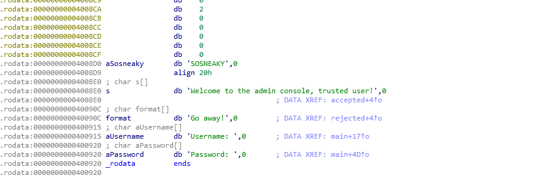
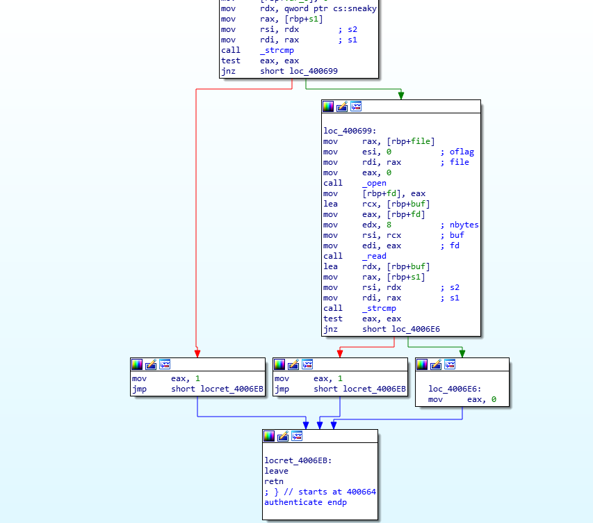
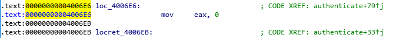
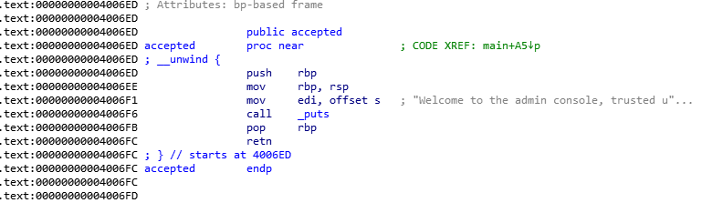
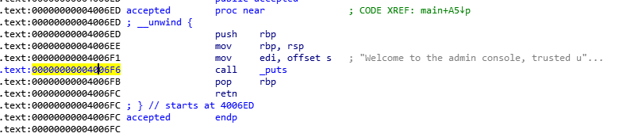
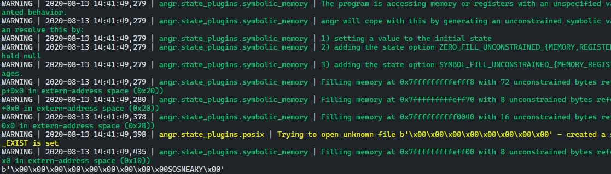
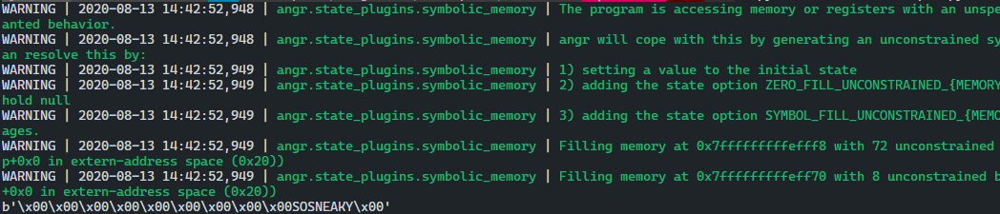

# angr fauxware 문제 풀이

> 문제 바이너리 [dnsdudrla97/angr-doc](https://github.com/dnsdudrla97/angr-doc/tree/master/examples/fauxware-SOLVED)

## data 섹션



## authenticate 함수



- `sneaky` 전역 변수가 가리키고 있는 문자열 과 유저 이름을 `strcmp` 함수를 바탕으로 비교를 통해 같으면 1을 반환하고 아닐시 유저 이름에 해당 하는 파일 이름을 `open` 함수를 바탕으로 읽고 해당 값과 유저 패스워드와 비교하여 같으면 1을 반환 아니면 0을 반환한다.
- 우리가 피해야할 주소 값은 `0x4006E6` 임을 알 수있다.



## 접근해야 하는 위치



- 기본적으로 앞에서 `authenticate` 함수에서 반환된 값이 1 일 경우 `accepted` 함수를 호출하게 된다.



## angr solve 1

```python
def solve2():
    p = angr.Project('./fauxware', auto_load_libs=False)
    state=p.factory.entry_state()
    sm=p.factory.simgr(state)
    sm.explore(find=0x4006F6, avoid=(0x4007CE, 0x4006E6))

    print(sm.found[0].posix.dumps(0))
```



## angr sovle 2

```python
def solve1():
    p = angr.Project('./fauxware', auto_load_libs=False)
    state = p.factory.entry_state()
    sm = p.factory.simgr(state)
    sm.run(until = lambda sm_: len(sm_.active) > 1)
    input_0 = sm.active[0].posix.dumps(0)
    input_1 = sm.active[1].posix.dumps(0)
    r = None
    print(input_0)
    print(input_1)
```



```python
import angr
import sys

def bse():
    # 먼저 바이너리를 Angr 프로젝트에 로드 한다.
    p = angr.Project('./fauxware', auto_load_libs=False)
    # entry_state 프로그램의 진입점에서 가능한 프로그램 상태를 매우 일반적인 표현인 SimState로 생성한다.
    state = p.factory.entry_state()

    # SimulationManager는 단지 그것들을 관리하기 위한 많은 편리한 인터페이스가 부착된
    # 다양한 태그를 가진 상태들의 모음이다
    sm = p.factory.simgr(state)

    # 실행 시작-> 두 가지 모두 만족할만한 분기 문에 도달할 때 까지 
    # 프로그램을 실행 한다. 현재 active 주소 값이 1 보다 클때 까지
    sm.run(until = lambda sm_: len(sm_.active) > 1)

    # 입력 조건
    input_0 = sm.active[0].posix.dumps(0)
    input_1 = sm.active[1].posix.dumps(0)

    r = None
    
    print(input_0)
    print(input_1)

if __name__ == "__main__":
    bse()
```
```toc
```