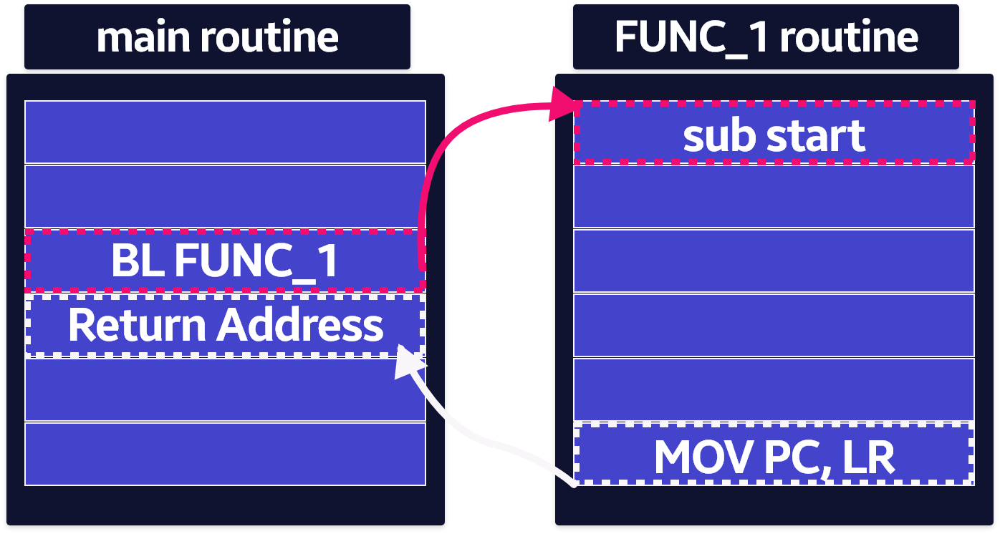

# ARM Instruction Layout

```cpp
{
	label
}
{
	instruction
|
	directive
|
pseudo-instruction
} {; comment}
```

- label이 없더라도 명령어, 의사 명령어 및 지시어에는 공간이나 탭과 같은 공백이 선행되어야 한다.

### CASE Rule

- 명령어, 지시문 및 기호 레지스터 이름은 대문자 또는 소문자로 쓸 수 는 있지만 혼합 불가

### Line Length

- Line이 길면 `\` 백 슬래시 문자를 바탕으로 여러 line으로 나누기 가능
- 백슬래시 뒤에는 다른 문자가 올 수 었다.

### Label

- 주소를 나타내는 기호이다.
- 레이블에 지정된 주소는 assembly 중에 계산된다.
- 어셈블러는 레이블이 정의 된 섹션의 원점을 기준으로 레이블의 주소를 계산한다.
- 동일한 섹션 내의 레이블에 대한 참조는 오프셋을 더하거나 뺀 프로그램 카운터를 사용할 수 있으며 이를 프로그램 기준 주소 지정이라고 한다.

### Local Label

- 지역 레이블은 레이블의 하위 클래스이다.
- 지역 레이블은 0-99 범위의 숫자로 시작한다.
- 다른 레이블과 달리 로컬 레이블은 여러 번 정의할 수 있다.
- 지역 레이블은 매크로를 사용하여 레이블을 생성할 때 유리하다.
- 어셈블러는 로컬 레이블에 대한 참조를 찾으면 해당 참조를 로컬 레이블의 가까운 인스턴스에 연결한다.

### Comment

- 줄의 첫 번째 세미클론은 세미클론이 문자열 상수 내부에 나타나는 경우를 제외하고 주석의 시작을 표시한다.
- 줄의 끝은 주석의 끝이다.
- 주석 만 유효한 줄이다.
- 어셈블러는 모든 주석을 무시한다.

### ARM Instruction Format



```cpp
AREA     ARMtest, CODE, READONLY
                                ; 해당 code block의 이름을 ARMtest 지정
        ENTRY                   ; 실행할 첫 번째 명령 표시
start
        MOV      r0, #10        ; 파라미터 설정
        MOV      r1, #3
        ADD      r0, r0, r1     ; r0 = r0 + r1
stop
        MOV      r0, #0x18      ; angel_SWIreason_ReportException
        LDR      r1, =0x20026   ; ADP_Stopped_ApplicationExit
        SWI      0x123456       ; ARM semihosting SWI
        END                     ; Mark end of file
```

### ELF 세션 및 AREA Instruction

- ELF 섹션은 코드, 데이터의 독립적이고 명명된 분할 불가능한 시퀸스이다.
- 단일 코드 섹션은 애플리케이션을 생성하는데 필요하다.
- 어셈블리 또는 컴파일의 출력에 다음이 포함될 수 있다.
    - 하나 이상의 코드 섹션, 일반적으로 읽기 전용 섹션
    - 하나 이상의 데이터 섹션, 일반적으로 읽기-쓰기 섹션, 0으로 초기화 될 수 있다.

- 링커는 섹션 배치 규칙에 따라 프로그램 이미지에 각 섹션을 배치한다.
- 소스 파일에서 인접한 섹션이 응용 프로그램 이미지에서 반드시 인접한 것은 아니다.
- ARM 어셈블리 언어 소스 파일에서 섹션의 시작은 `AREA` 지시문으로 표시된다.
- 해당 지시문은 섹션의 이름을 지정하고 해당 속성을 설정한다.
- 속성은 쉼표로 구분 된 이름 뒤에 배치된다.

### Entry Instruction

- 실행할 첫 번째 명령을 표시
- C 코드를 포함하는 응용 프로그램에서 진입 점은 C 라이브러리 초기화 코드에도 포함된다.
- 초기화 코드 및 예외 처리기에도 진입 점이 포함된다.

### Application Start

- `start` label 실행을 시작
- 여기서 10 진수 값과 10과, 3을 레지스터 r0, r1레 로드한다.
- 이러한 레지스터는 함께 추가되고 결과는 r0에 배치된다.

### Application Terminate

- 기본 코드를 실행 한 후 응용 프로그램은 디버거에 제어를 반환하여 종료된다.
- 해당 작업은 다음 매개 변수와 함께 ARM 세미 호스트 SWI()를 사용하여 수행된다.

### END Instruction

- 해당 지시문은 이 소스 파일 처리 중지하도록 어셈블러에 지시하며 모든 어셈 블리 언어 소스 모듈은 END 한줄에 지시문으로 끝나야 한다.

## Calling subroutines

- 서브 루틴을 호출하려면 분기 및 링크 명령어를 사용한다.

```cpp
BL destination
```

- `destination` 일반적으로 서브 루틴의 첫 번째 명령어에 있는 레이블은 어디에 있나?
- `destination` 프로그램 기준 또는 레지스터 기준 식일 수도 있다.

## Branch Instruction

### B (Branch == Jump)

### BL Instruction

- 링크 레지스터 r14 (lr) 에 반환 주소를 배치한다.
- PC를 서브 루틴의 주소로 설정한다.

### BX (Branch and Exchange)

### BLX (Branch with Link and Exchange)

```cpp
Branch : B{<cond>} label
Branch with Link : BL{<Cond>} sub routine label
```

- 서브 루틴 코드가 실행된 후 명령을 사용하여 반환 할 수 있다.
- 규칙에 따라 레지스터 r0 ~ r3 매개 변수를 서브 루틴에 전달하고 결과를 호출자에게 다시 전달하는 데 사용한다.

```cpp
MOV pc, lr
```

```cpp
AREA    subRoutTest, CODE, READONLY
                   
        ENTRY                     
start   MOV     r0, #10           
        MOV     r1, #3
        BL      apple             ; Call subroutine
stop    MOV     r0, #0x18         ; angel_SWIreason_ReportException
        LDR     r1, =0x20026      ; ADP_Stopped_ApplicationExit
        SWI     0x123456          ; ARM semihosting SWI
apple   ADD     r0, r0, r1        ; Subroutine code
        MOV     pc, lr            ; Return from subroutine
        END                       ; Mark end of file
```

## Thumb and ARM assembly

```cpp
AREA ThumbArm, CODE, READONLY           
        ENTRY                           
        CODE32                          ; 후속 명령어는 ARM이다.
header  ADR     r0, start + 1           ; 프로세서는 ARM 상태에서 시작된다.
        BX      r0                      ; 너무 작은 ARM 코드 헤더가 사용되었다.
                                        ; Thumb 메인 프로그램 호출
        CODE16                          ; 후속 명령어는 Thumb이다.
start
        MOV     r0, #10                 
        MOV     r1, #3
        BL      apple                   
stop
        MOV     r0, #0x18               ; angel_SWIreason_ReportException
        LDR     r1, =0x20026            ; ADP_Stopped_ApplicationExit
        SWI     0xAB                    ; Thumb semihosting SWI
apple
        ADD     r0, r0, r1              ; Subroutine code
        MOV     pc, lr                  ; Return from subroutine
        END                             ; Mark end of file
```

### CODE32 and CODE16 Instruction

- ARM(CODE32), Thumb(CODE16) 명령어로 어셈블하도록 지시한다.
- 런타임에 프로세서 상태를 변경하는 명령어로 어셈블되지 않는다.
- 어셈블러 상태만 변경한다.

### BX Instruction

- 런타임 프로세서 상태를 변경할 수 있는 분기
- 대상 주소의 최하위 비트는 ARM, Thumb 명령어인지를 구분한다.

```toc
```