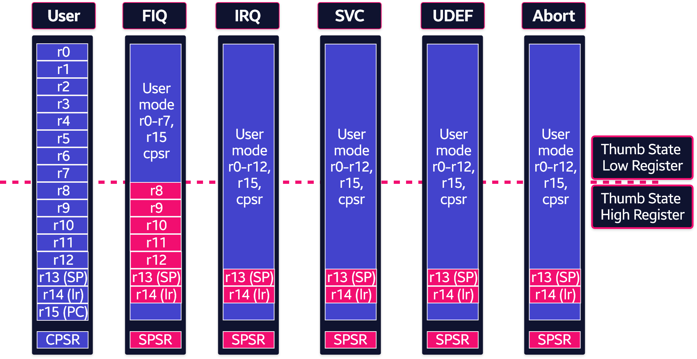
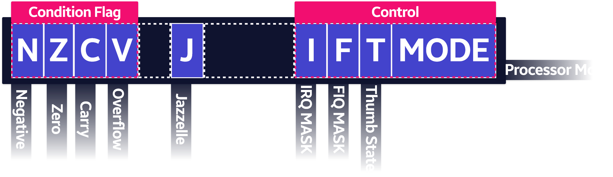

- 37개의 레지스터가 있다.
- 레지스터는 부분적으로 겹치는 bank에 배열된다.
- 프로세서 모드마다 다른 레지스터 bank가 있다.
- bank 레지스터는 프로세서 예외 및 권한있는 작업을 처리하기 위한 빠른 문맥 교환을 제공한다.



## 범용 32 bit register

- 프로세서 모드에 따라 r0, r1, ..., r13, r14와 같은 15개의 범용 레지스터가 한 번에 표시된다.
- R0 ~ R10은 범용 적으로 사용
- R11 ~ R15특별한 목적으로 사용됨

### r0 Register

- Return Value 저장

### r0 ~ r3 Register

- 함수 호출 시에 Argument를 전달하는 용도로 사용 (인자가 4개 이상일시 스택을 사용)

### r11 Register

- 현재 스택 프레임의 Frame Pointer를 저장한다.

### r13 Register

- ARM 어셈블리 언에서 스택 포인터 (SP)로 쓰인다.
- C, C++ 컴파일러는 항상 r13을 스택 포인터로 사용한다.
- PUSH, POP 명령의 의해서 값이 변화한다.

### r14 Register

- BL 명령으로 User Mode에서 r14는 서브 루틴 호출이 수행될 때 리턴 주소를 저장하기 위한 링크 레지스터(lr)로 사용된다.
- 반환 주소가 스택에 저장되어 있으면 범용 레지스터로도 사용 가능

### r15 Register 프로그램 카운터(PC)

- 프로그램 카운터 r15 (, pc) 로 접근한다.
- ARM 상태에서는 각 명령어에 대해 1 Word (4 byte)
- Thumb 상태에서는 2byte 씩 증가한다.
- 분기 명령어는 대상 주소를 프로그램 카운터에 로드한다.
- 데이터 조작 명령을 사용하여 프로그램 카운터를 직접 로드할 수 있다.

```cpp
MOV pc, lr
```

- 예를 들어 서브 루틴에서 복귀하려면 다음을 사용하여 링크 레지스터를 프로그램 카운터에 복사 할 수 있다.
- 실행 중 r15에는 현재 실행중인 명령어의 주소가 포함되지 않는다.
- 현재 실행 중인 명령어의 주소는 일반적으로 ARM인 경우 pc-8,
- Thumb인 경우 pc-4이다.

### 현재 프로그램 상태 레지스터 (CPSR)

- ALU (Arithmetic Logic Unit) 상태 플래그 사본
- 현재 프로세서 모드
- 인터럽트 비활성화 플래그
- CPSR의 ALU 상태 플래그는 조건부 명령의 실행 여부를 결정하는데 사용된다.
- Thumb 지원 프로세서에서 CPSR은 현재 프로세서 상태 (ARM 또는 Thumb) 도 보유한다.
- ARM 아키텍처 v5TE 에서 CPSR은 Q 플래그도 보유한다.



- Condition Code flags
    - N = Negative result from ALU
    - Z = Zero result from ALU
    - C = ALU operation Carried out
    - V = ALU operation overflowed

### 5개의 SPSR (Saved Program Status Register)

- SPSR 예외가 발생할 때 CPSR을 저장하는 데 사용한다.
- 각 예외 처리 모드에서 하나의 SPSR 에 액세스할 수 있다.
- 사용자 모드 및 시스템 모드는 예외 처리 모드가 아니므로 SPSR이 없다.

```toc
```