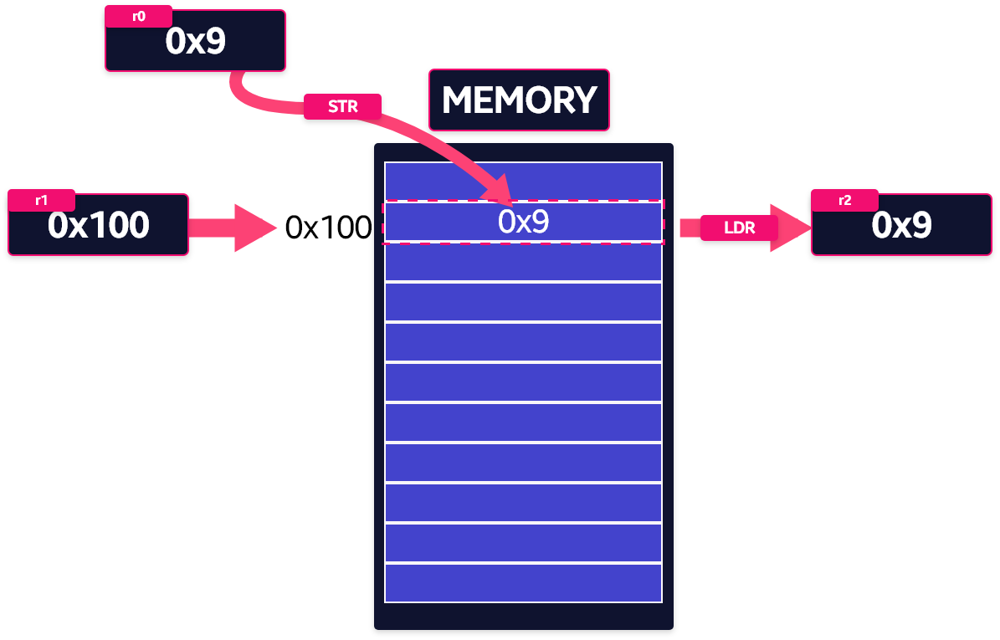
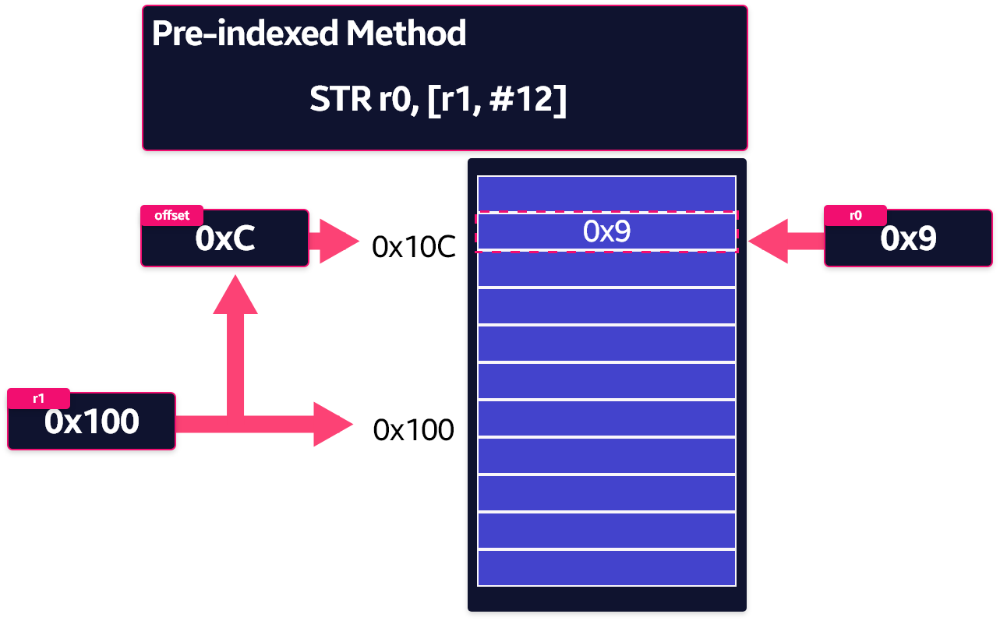
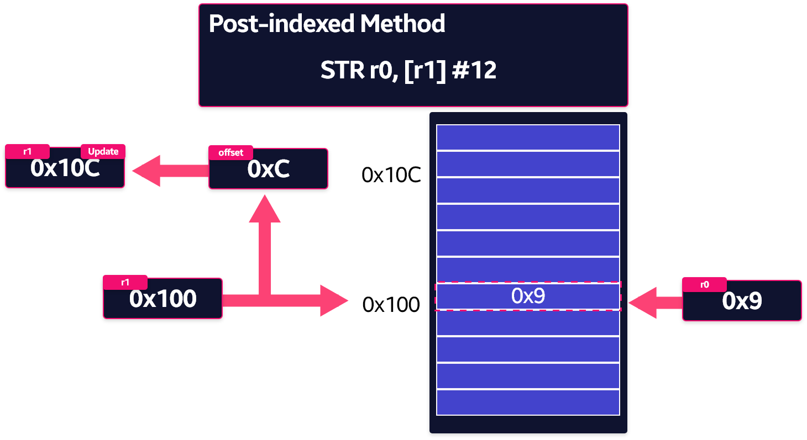

## Store, Load Instruction

- ARM 방식에서 메모리간 데이터 처리 명령이 불가능하다.
- 레지스터와 메모리 간의 데이터 전송 명령어 를 사용해야 한다.

### Load

- Memory → Register

### Store

- Register → Memory



### 단일 레지스터 데이터 전송

```wasm
<LDR | STR> {<cond>} {<size>} Rd, <address>
```

- LDR, STR, LDRB, STRB (size: WORD, BYTE)

## Pre, Post Index Addressing

### Pre-Index Method

- 데이터 전송 후 Base Register의 값은 변하지 않는다.
- `!` 연산자를 붙이면 자동으로 주소를 업데이트 할 수 있다.



### Post-Index Method

- 데이터 전송 후 Base Register와 Offset의 계산 결과가 Base Register에 적용된다.



- 연산 결과 Base Register인 r1 Register의 값이 0x100+0xc 의 값으로 변경된다.

```toc
```