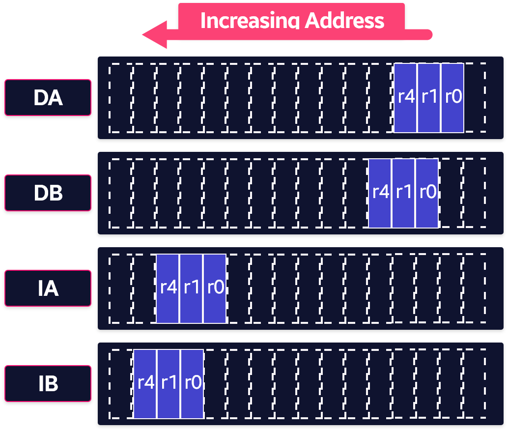

# Load, Store 다중 레지스터 명령

- ARM, Thumb 명령어 집합에는 메모리에서 여러 레지스터를 로드하고 저장하는 명령어 가 포함되어 있다.
- 다중 레지스터 전송 명령어는 여러 레지스터의 내용을 메모리로부터 효율적으로 이동하는 방법을 제공한다.
- 블록 복사, 서브루틴 진입 및 종료시 스택 작업에 가장 자주 사용된다.
- 일련의 단일 데이터 전송 명령어 대신 다중 레지스터 전송 명령어를 사용하면 여러 이득이 있다.
    - 코드의 크기를 작게 할 수 있다.
    - 여러 명령 fetch가 아닌 단일 명령 fetch overhead
    - 캐시되지 않은 ARM 프로세서에서 로드 또는 다중 저장에 의해 전송되는 첫 번째 워드는 항상 비 순차자적 메모리주기이지만 전송되는 모든 후속 word는 순차 메모리 주기 일 수 있다.
    - 대부분의 시스템에서 순차적 메모리 주기가 더 빠르다.

## ARM LDM, STM 명령

- 여러 명령어를 로드, 저장 하면 단일 명령어를 사용하여 메모리에서 16개의 범용 레지스터의 하위 집합을 로드, 저장 한다.

### LDM

```cpp
LDM {cond} address-mode Rn{!}, reg-list{^}

4 addressing modes:
LDMIA / STMIA
LDMIB / STMIA
LDMDA / STMDA
LDMDB / STMDB
```

**cond**

- 선택적 조건 코드 부분

**address-mode**

- 명령어의 주소 지정 모드를 지정한다.
    - IA : 이후 증가
    - IB : 이전에 증가
    - DA : 이후 감수
    - DB : 이전에 감소

**Rn**

- 로드 작업의 기본 레지스터이다.
- 해당 레지스터에 저장된 주소는 로드 작업의 시작 주소이다.
- r15(pc) 를 기준 레지스터로 지정하면 안된다.

!

- 기본 레지스터 쓰기를 지정하낟.
- 이것이 지정되면 기본 레지스터의 주소가 전송 후 업데이트 된다.
- 레지스터 목록의 각 레지스터에 대해 한 단어씩 감소하거나 증가한다.

**Register-list**

- 중괄호로 묶인 기호 레지스터 이름 및 레지스터 범위의 쉼표로 구분된 목록이다.
- 목록에 적어도 하나의 레지스터가 있어야 한다.
- 레지스터 범위는 대시로 지정한다.
- `{r0, r1, r4-r6, pc}`
- 기본 레지스터 Rn이 레지스터 목록에 있으면 쓰기, 저장을 하면 안된다.

**^**

- 사용자 또는 시스템 모드에서 이 옵션을 사용하면 안된다.
- STM 명령어의 구문은 ^ 옵션의 효과에 대한 일부 세부 사항을 제외하고 정확히 일치한다.

## LDM, STM으로 스택 구현

- 로드 , 저장 여려 명령어는 기본 레지스터를 업데이트 할 수 있다.
- 스택 연산의 경우 기본 레지스터는 일반적으로 스택 포인터 r13이다.
- 즉, 여러 명령어로드 및 저장을 사용하여 단일 명령어에서 여러 레지스터에 대한 푸시 및 팝 작업을 구현할 수 있다.

- 여러 유형의 스택에서 여러로드 및 저장 명령어를 사용할 수 있다.

**내림 차순, 오름차순**

- 스택은 높은 주소에서 시작해서 하위주소로 진행하거나 상위 주소에서 시작해서 상위주소로 진행하여 아래쪽으로 성장한다.

**Full, Empty**

- 스택 포인터는 스택의 미지막 항목(전체 스택) 또는 스택의 다음 여유 공간(빈 스택)을 가리킬 수 있다.

- 증가, 감소 대신 접미사 앞뒤에 스택 지향 접미사를 사용할 수 있다.

```cpp
Stack type				Push			Pop
Full descending		STMFD (STMDB)	LDMFD (LDMIA)
Full ascending		STMFA (STMIB)	LDMFA (LDMDA)
Empty descending	STMED (STMDA)	LDMED (LDMIB)
Empty ascending		STMEA (STMIA)	LDMEA (LDMDB)
```

- 연습1

```wasm
LDMXX r10, {r0, r1, r4}
STMXX r10, {r0, r1, r4}
```



- 연습 2

```cpp
STMFD    r13!, {r0-r5}  ; Full 내림차순 스택으로 PUSH
LDMFD    r13!, {r0-r5}  ; Full 내림차순 스택에서 POP
```

### 중첩 된 서브 루틴에 대한 스택 레지스터

- 스택 작업은 서브 루틴 진입 및 종료시 매우 유용하다.
- 서브 루틴을 시작할 때 필요한 작업 레지스터를 스택에 저장할 수 있다.
- 종료할 때 다시 POP off 할 수 있다.
- 또한 링크 레지스터가 진입시 스택으로 푸시되면 반환 주소를 잃지 않고 추가 서브 루틴 호출을 안전하게 수행할 수 있다.
- 이렇게 하면 lr 를 POP 한 다음 해당 값을 PC로 이동하는 대신 종료시 스택에서 PC를 POP 하여 서브 루틴으로 복귀할 수 있다.

```cpp
subroutine  STMFD   sp!, {r5-r7,lr} ; 작업 레지스터 및 lr 푸시
            ; code
            BL      somewhere_else
            ; code
             LDMFD   sp!, {r5-r7,pc} ; 작업 레지스터 및 pc POP
```

```toc
```