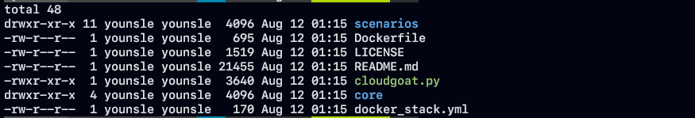
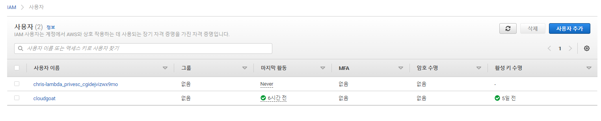
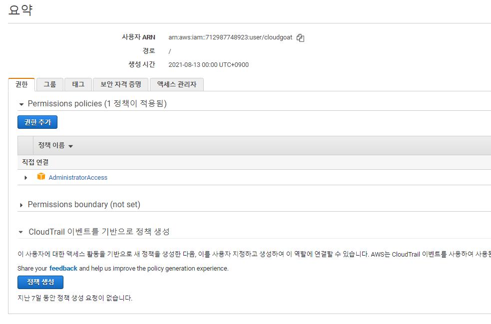

# 클라우드 서비스 취약점 분석 1

<aside>
💡  클라우드 서비스 취약점 분석 연습을 위해 Rhino Security Lab의 CloudGoat 실습을 진행하도록 하겠습니다.

다음은 참조 CloudGoat Github 링크입니다. 

[https://github.com/RhinoSecurityLabs/cloudgoat](https://github.com/RhinoSecurityLabs/cloudgoat)

</aside>

# 실습 환경 구성

### 필수 설치 패키지

- Linux or MacOS. Windows is not officially supported.
    - Argument tab-completion requires bash 4.2+ (Linux, or OSX with some difficulty).
- Python3.6+ is required.
- Terraform >= 0.14 [installed and in your $PATH](https://learn.hashicorp.com/terraform/getting-started/install.html).

[Install Terraform | Terraform - HashiCorp Learn](https://learn.hashicorp.com/tutorials/terraform/install-cli)

- The AWS CLI [installed and in your $PATH](https://docs.aws.amazon.com/cli/latest/userguide/cli-chap-install.html), and an AWS account with sufficient privileges to create and destroy resources.
- [jq](https://stedolan.github.io/jq/)

[jq](https://stedolan.github.io/jq/)

### 설치

```php
$ git clone https://github.com/RhinoSecurityLabs/cloudgoat.git
$ cd cloudgoat
$ pip3 install -r ./core/python/requirements.txt
$ chmod u+x cloudgoat.py
```





- IAM 사용자 추가를 누른 후 AWS IAM Full-Admin 권한의 사용자 생성을 진행하여 cloudgoat 환경에서 다양한 인스턴스및 여러 기능들을 수행할 수 있도록 환경 구성을 진행해야 합니다.



- AdministratorAccess 정책 권한을 설정한후 해당 access-key, secret-key를 저장하여 AWS cli profile를 설정을 진행합니다.

```python
$ aws configure --profile cloudgoat

cat ~/.aws/credentials
[cloudgoat]
aws_access_key_id = <ACCESS_KEY>
aws_secret_access_key = <ACCESS_SECRET_KEY>
cat ~/.aws/config
[cloudgoat]
region = us-east-1

```

- 설정이 완료되면 credentials, config 파일에 각각 저장이 됩니다.
- 앞에서 설정한 각 정보들을 그대로 cloudgoat 에 적용하여 설치를 마무리 합니다.

```python
$ ./cloudgoat.py config profile
$ ./cloudgoat.py config whitelist --auto
```

```toc
```