# 클라우드 서비스 취약점 분석 6

# [Scenario 5]: EC2 SSRF

```bash
Size: Medium
Difficulty: Moderate
Command: $ ./cloudgoat.py create ec2_ssrf
```

## 시나리오 개요

### 자원

- VPC (EC2)
- Lambda Function
- 1 S3 Bucket

### 취약점

- Solus IAM 사용자
- Lambda 함수 읽기 전용 권한
- Lambda 환경 변수안에 하드코딩된 Wrex Access key
- 하드코딩된 민감한 데이터 정보
- 웹 애플리케이션의 SSRF 취약점으로 인한 AWS 메타데이터 API를 통해서 다른 Credential 접근 가능 여부
- Admin Credential 정보가 S3 Bucket 내에 하드 코딩되어 저장

### 목표

- `cg-lambda-/cloud goat id/` 람다 함수를 실행합니다.
- Solus IAM 사용자로 시작해서 Lambda 함수를 읽을 수 있는 권한을 발견하였습니다.
- SSRF에 취약한 웹 애플리케이션을 실행하는 EC2 인스턴스로 유도합니다.
- 취약한 앱을 Exploit하고 EC2 Metadata Service에서 Key를 획득한 후 공격자는 Lambda 함수를 호출하고 시나리오를 완료할 수 있는 Key를 획득함으로써 권한을 탈취를 합니다.

### exploit 흐름도

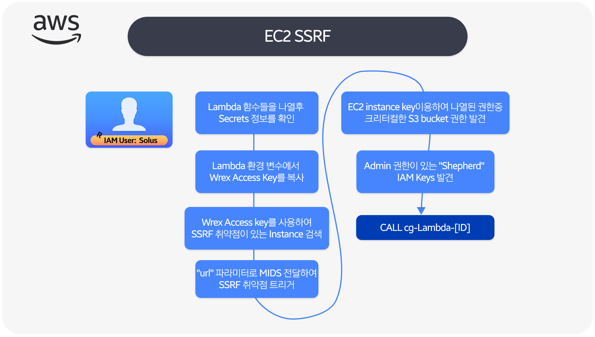

### 시나리오 환경설정

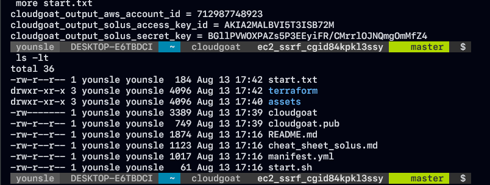

### exploit 시나리오 흐름도

1. IAM 에 포함된 Solus 계정을 토대로 AWS 환경을 분석하고 계정에서 Lambda 함수 리스트들이 있음을 확인하였습니다.
2. Lambda 함수 내에서 공격자는 다른 사용자즉 IAM 사용자 Wrex에 속한 AWS Access key를 찾습니다.
3. IAM Wrex 사용자 로 작동하는 공겨자는 SSRF 취약점에 취약한 웹 애플리케이션을 실행하는 EC2 인스턴스를 발견합니다.
4. GET 메서드로 요청을 보낼때 `url` 파라미터를 통해 SSRF 취약점을 트리거하여 공격자는 EC2 Metadata service에서 AWS 키를 탈취합니다.
5. 공격자는 EC2 인스턴스의 키를 사용하여 권한이 더 높은 사용자인 Shepard에 대한 다른 AWS Credential 가 포함된 Private S3 Bucket을 발견하였습니다.
6. Full Privilege으로 Shepeard인척 공격자는 원래의 Lambda 함수를 호출하여 시나리오가 완료됩니다

```jsx
IAM : Solus (Read Only Key Access)

Lambda function list -> Secret key

Wrex <-
```

## Exploit 시나리오

### Solus key 정보를 읽기전용을 접근

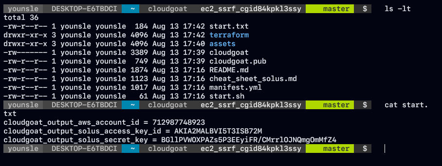

- 해당 클라우드 환경을 분석하면서 `start.txt` 문서로 AWS Credential 정보를 읽기 전용으로 해당 정보를 확인할 수 있습니다.
- AWS Credential 을 사용하여 어떤 AWS 작업을 할 수 있는지 확인하기 위해 IAM 리스트를 열거하여 정보를 확인하였습니다.

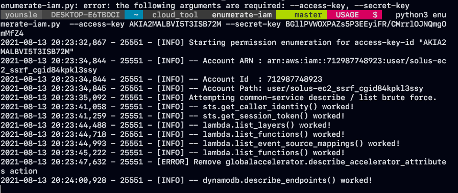

- 해당 리스트를 통해서 Lambda 서비스를 이용할 수있는 벡터가 존재하는 것을 확인할 수 있습니다. 이에 관해서 좀더 분석을 하기로 했습니다.

### Lambda 환경 변수 데이터 확인

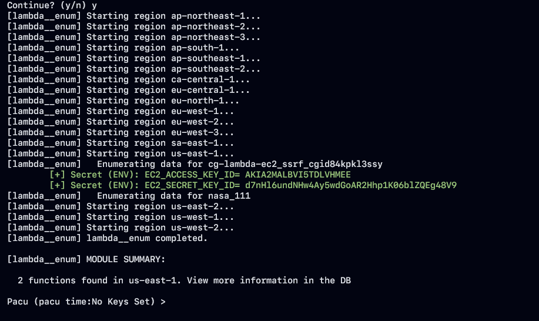

- Pacu를 통해서 lambda service 에서 `cg-lambda-id` 호출하는 값이 있는 지 확인한 결과 ENV 값으로 EC2_ACCESS_KEY_ID, SECRET_KEY_ID 가 있는 것을 확인할 수 있었습니다.

```jsx
[+] Secret (ENV): EC2_ACCESS_KEY_ID= <ACCESS_KEY>
[+] Secret (ENV): EC2_SECRET_KEY_ID= <ACCESS_SECRET_KEY>
```


- 대상 람다 함수는 AWS 계정에 존재하고 lambda 함수의 환경변수에 일부 하드 코딩이 되었이기 떄문에 이는 AWS Security Credential이 있는 것을 확인할 수 있습니다.

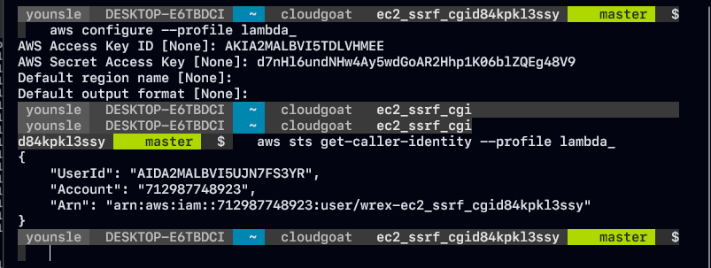

- 사용자 Solus에게 `lambda:InvokeFunction` 권한 이 없기 때문에 직접 Lambda 함수를 호출하려는 시도가 동작하지를 않습니다.

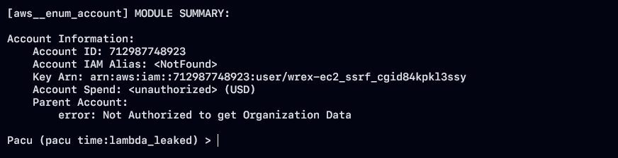

### Lambda 기능 나열 및 분석

- lambda 환경 변수에서 유출된 AWS Credential 을 PACU `run aws__enum_account` 사용해서 추가로 나열하여 어떤 Credential 이 있는지 확인하였습니다.
- 해당 Credential을 확인해보면 IAM 사용자는 wrex라는 것을 확인할수 있습니다.
- 해당 Wrex의 정보를 토대로 IAM에서 사용할 수 있는 서비스를 확인하였습니다.

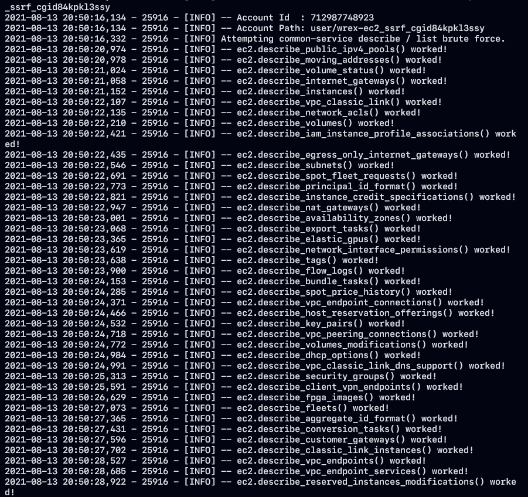

- 생각보다 많은 서비스에 대해 권한을 갖고 있는 것을 확인할 수 있습니다. 실행중인 EC2 인스턴스가 있는지를 확인하겠습니다.

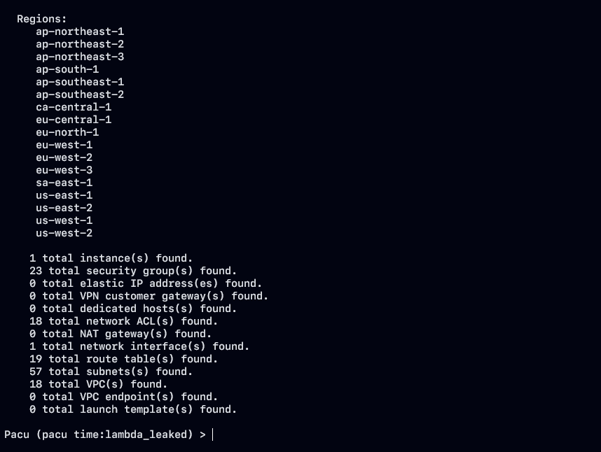

- 전체 지역을 대상으로 ec2에서 사용되고 있는 전체적인 정보를 확인하였습니다. 필요한 정보들을 추려내기위해 세세한 정보들은 aws query 문을 통해 손수 검사를 진행하였습니다.

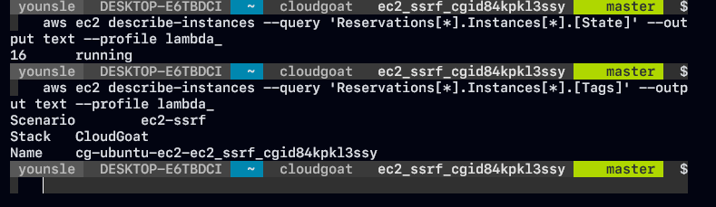

- 인스턴스의 상태와 동작중인 서비스르 확인하였지만 기존의 인스턴스르 제외하고는 정확한 서비스 정보를 확인할 수 없었습니다.

### EC2 내에서 동작중인 웹 서비스 파악 및 분석

- 좀더 정확한 서비스를 파악하기 위해서 새로운 인스턴스를 시작하고 실행 중인 서비스가 있는지 확인하겠습니다.

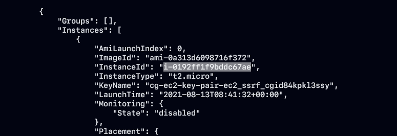

- EC2 인스턴스에 연결된 보안 그룹은 웹 서비스가 실행중인 상태로 나타납니다.

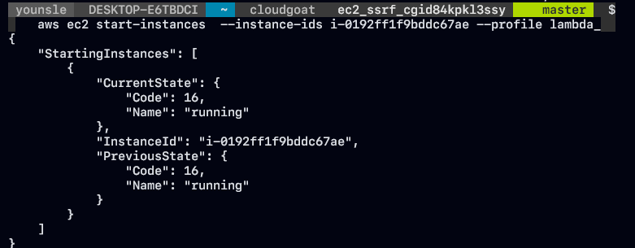

- 특정 서버의 연결하기 위해 공용 IP 주소를 확인하였습니다.

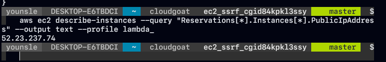

- 80 port에서 실행되는 웹 애플리케이션이 있는 것을 추정할 수 가 있고 이에 따라 Node js 에러메시지를 확인한 결과 `URL` 이라는 파라미터 값에 문자열이 아닌 NULL 값이 들어가 있어 에러가 난것을 확인할 수있으며 이에 따라 `URL` 파라미터에 특정 문자열 타입을 입력해 보았습니다.

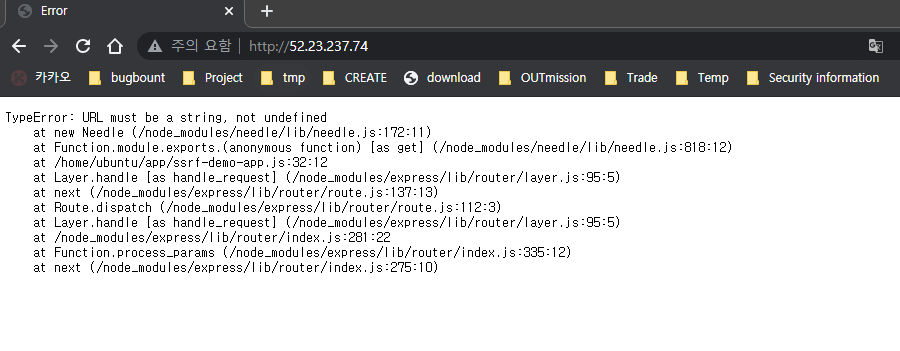

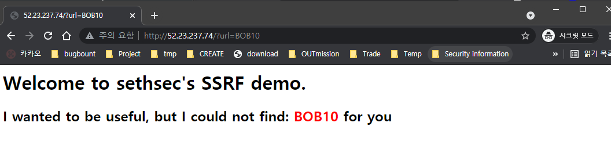

### SSRF 취약점 분석및 IMDS 기능을 이용한 정보 탈취

- 해당 웹 서버가 SSRF 취약점이 존재하는지를 확인하기 위해서 `link address` 를 입력 함으로써 출력되는 결과를 확인하였습니다.

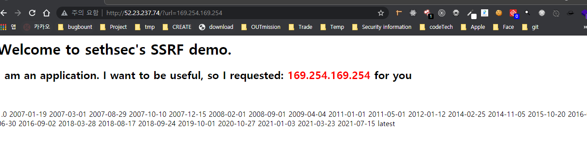

- 확인한 결과 출력되는 값에는 해당 인스턴스의 환경 정보들을 확인할 수 있었습니다.
- 이를 바탕으로 애플리케이션은 SSRF에 취약하고 EC2 인스턴스에 있기 때문에 IMDSv1을 활용하여 IAM Rule credentials을 탈취할 것입니다.

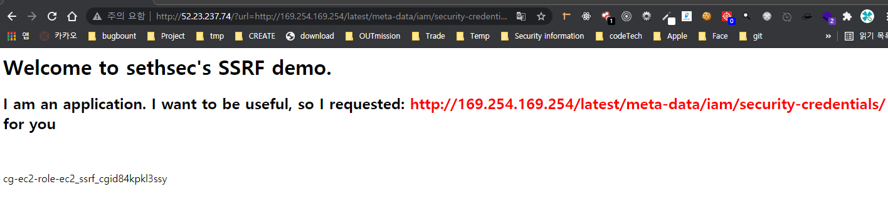

```jsx
cg-ec2-role-ec2_ssrf_cgid84kpkl3ssy
```

- 해당 Security-credential 정보를 확인할 수 있고

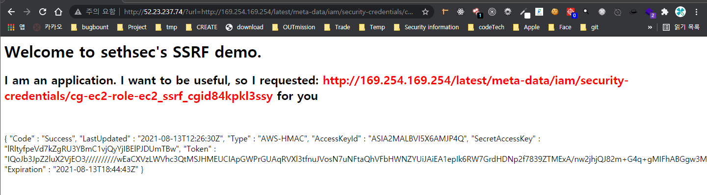

```jsx
{ "Code" : "Success",
"LastUpdated" : "2021-08-13T12:26:30Z",
"Type" : "AWS-HMAC",
"AccessKeyId" : "<ACCESS_KEY>",
"SecretAccessKey" : "<ACCESS_SECRET_KEY>",
"Token" : "<ACCESS_SESSION_KEY>",
"Expiration" : "2021-08-13T18:44:43Z" }
```

- 탈취한 IAM Rule Credential 은 다른 IAM Credential 처럼 사용이 가능합니다. 이를 이용하여 Rule Credential을 사용하여 수행할 수 있는 작업을 열거하기 위해 AWS CLI를 사용하여 새로운 프로필을 생성하지만 IAM Rule Credential 은 Life-cycle이 짧은 Session_token이 있습니다.
- 이를 통해 새롭게 추가를 하였습니다.

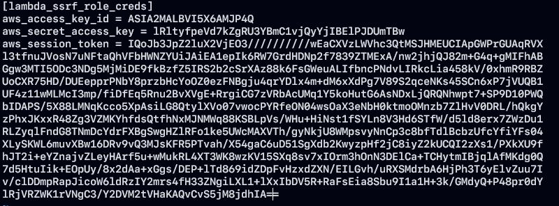

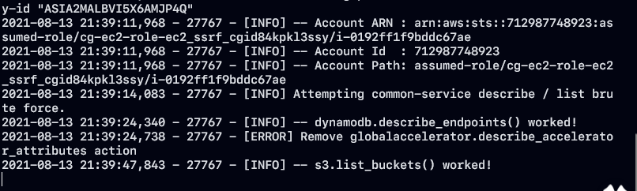

- 탈취한 IAM AWS Credential 정보를 통해서 사용가능한 나열을 하여 `s3.list_buckets` 작업이 작동 중인 것을 확인할 수 있습니다.

### S3 Bucket내에서 데이터 및 Credential 분석, 추출 및 함수 호출

- S3가 작동중이니 해당 데이터를 pacu 도구를 통해 다운로드를 받아봤습니다.

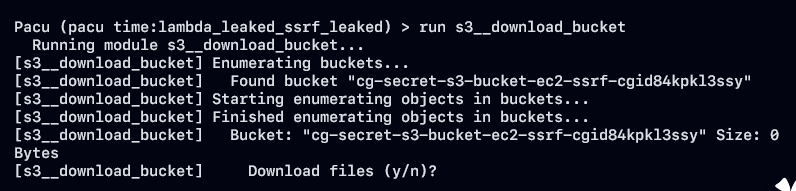

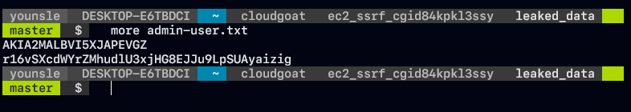

- 다운 받은 데이터를 통해 AWS Credential 값이 들어 있는 것을 확인할 수 있습니다. 또 똑같이 해당 데이터를 통해 새로운 프로필을 만들어 보겠습니다.

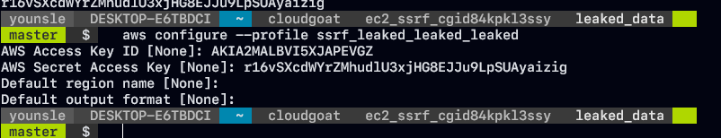

- 생성된 프로파일에 기반하여 어떤 유저에게 속하는지를 파악하기 위해 `get-caller-identity` cmd를 이용하여 확인하였습니다.

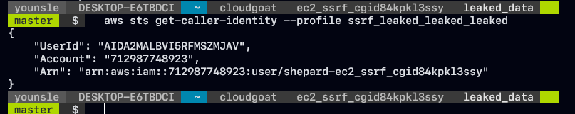

- 확인한 결과 `shepard` 유저에게 참조가 되고 있고 이에 대한 정책을 식별해봤습니다.

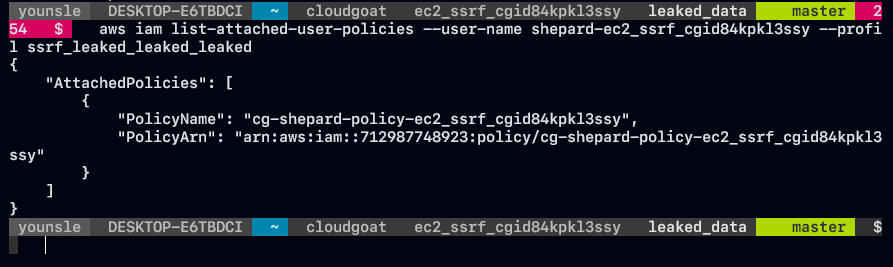

- IAM 사용자 `shepard-ec2_ssrf_cgid84kpkl3ssy` 에 연결된 정책에 대한 권한을 확인하여 다음 공격 방향을 잡았습니다.

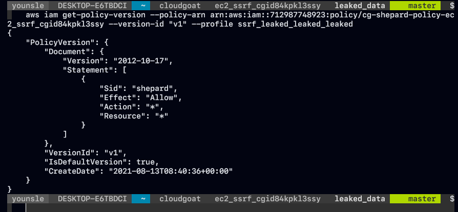

- 예상데로 IAM 사용자 "shepard"로서 AWS 계정에 대한 관리자 접근 권한을 갖고 있었습니다. 해당 AWS Credential을 사용하여 `cg-lambda-ec2_ssrf_cgid84kpkl3ssy` Lambda 함수를 호출하겠습니다.

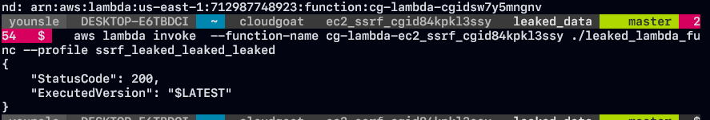

```toc
```