# 취약점 분석

## Angry Bird 바이너리 동작 결과


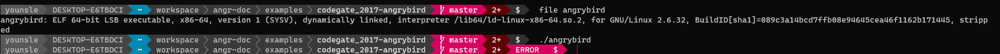

- 바이너리 실행시 아무 결과가 안나오는 것을 확인할 수 있다.

## main 함수 분석

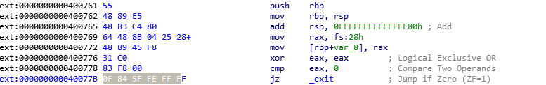

- `Stack Smahsing Protector(SSP)` 보호기법이 적용되어 있어 Stack Prlog를 거치면서 `Stack Canary` 를 `rax` 레지스터에 `TEB`에서 생성된 값을 가져와 해당 값을 스택에 집어넣는 것을 확인할 수가 있으며
- `eax` 레지스터를 0으로 초기화 한후 0과 비교를 하여 `exit` 함수로 점프하는 것을 볼 수 있다.
- 그래서, 해당 바이너리를 실행하였을 때 바로 끝나는 모습을 확인할 수 있다.

## Nop Sled 적용

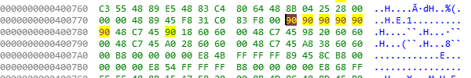

- `_exit` Hex 값을 90(Nop)으로 패치하여 점프를 뛰어도 끝날 수 없도록 진행하였다.

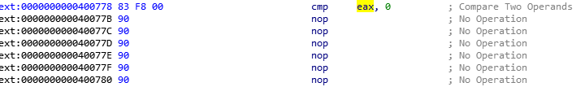

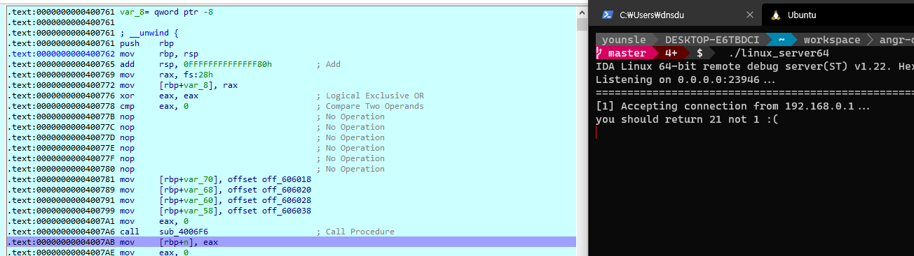

- 디버거를 바탕으로 `_exit` 함수로 점프하는 것은 우회를 하여 `you shoul return 21 not 1 :(` 문자열을 반환하는 것을 확인할 수있다.

## you should return 21 not 1 :(

- 출력된 결과를 확인해 보면 21을 반환해야 한다고 한다.
- 해당 함수를 분석해보도록 하겠다.

## Sub_4006F6 함수 분석

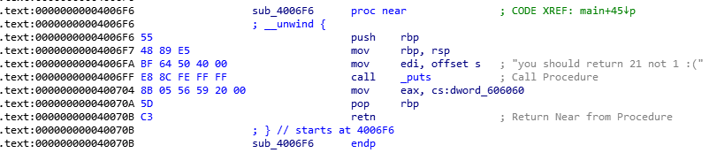

- 앞의 문자열을 출력한 함수 블록 내부이며 반환 되는 값 `dword_606060` 영역을 확인해보자

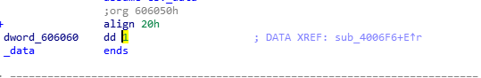

- 확인 결과 `1`을 담고 있는 것을 확인하였다.
- 우리는 21을 반환해야 하기 때문에 `21` 로 패치하도록 한다.

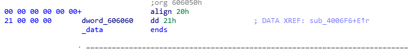

- 하지만 중요한 사실은 반환된 결과 값을 mov 명령어를 바탕으로 `[rbp+n]` 대입 하는 것을 확인할 수 있는 데 OPER2에 해당하는 `eax` 레지스터는 32bit 형식이기에 `mov` 명령을 사용하게 되면 성질이 맞지 않아 `Segment Falut` 가 뜨고 만다.

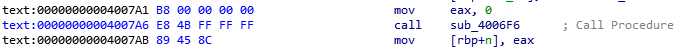

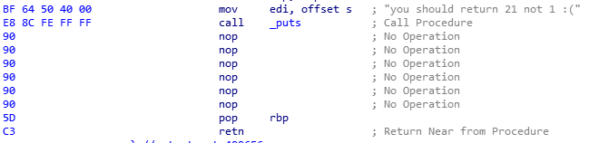

- `NOP` 명령으로 해당 값 부분을 패치하여 우회하도록 한다.
- sub_40070C  부분도 똑같이 NOP으로 채워 우회하도록 한다.

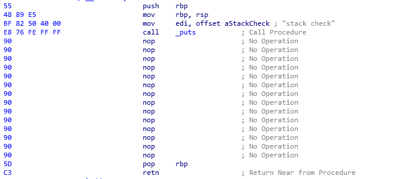

## sub_40072A 함수

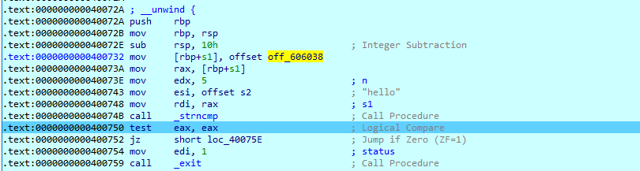

- 앞 조건을 마치고 해당 함수로 들어오는데 여기서는 `"hello"` 문자열 과 입려 값을 비교하여 동일할 경우 정상적으로 반환하는 것을 확인할 수 있다.
- `0x606038` 주소가 어디인지 확인하였으나 `__libc_start_main` got 영역의 주소  값인 것을 알았으며 해당 부분에서 어떤 문자열을 가져와 비교하는지를 모르기 때문에 `Ghidra` 디컴파일을 통해 확인하여

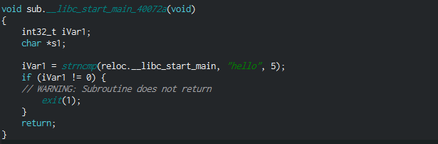

- 해당 조건을 마찬가지로 `NOP` 으로 채워 우회하도록 하겠다.

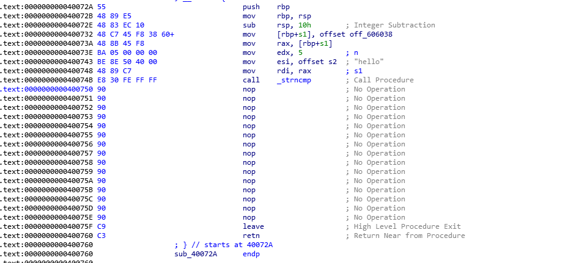

- 싹따 채워 버렸다. 😀

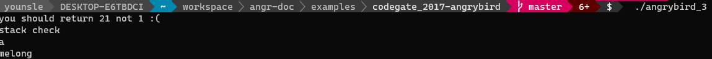

- 패치후 `fget` 함수를 바탕으로 입력을 받을 수 있도록 되었다.

## 미친 조건들


- 무수히 많은 조건들을 거치고 거쳐 마지막에 "you typed : %s\n" 출력하는 곳으로 가봐야 될 것 같다.

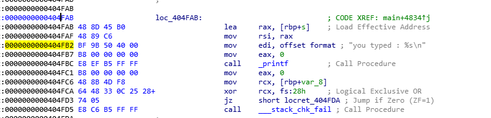

- angr 모듈을 사용하여 solve 를 작성해보겠다.

# 해결 방안
## Solved Code

```python
import angr

def solved():
    p=angr.Project('./angrybird_3', auto_load_libs=False)
		# state를 임의로 위 함수를 무시한채 해당 지역부터 시작하도록 한다.
    state = p.factory.blank_state(addr=0x4007C2)

    sm = p.factory.simgr(state)
    sm.explore(find=0x404fab) # 최하단 True 주소 값

    flag = sm.found[0].posix.dumps(0)
    print(flag[:20])
```

## Solved Code2

- 앞에서 해당 함수들을 패치를 진행하였는데 해당 패치를 하지 않고 angr 모듈을 사용하여 우회하는 방안도 존재한다.

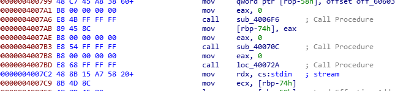

- 해당 `sub_4006F6`, `sub_40070C` 함수를 무시한채 `rbp` 기준 값을 현재 `0x4007c2` 주소로 기준을 잡도록 수정하도록 한다. 즉, 메인 함수 프롤로그를 해당 주소로 바꾸는 것이다.

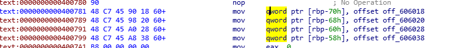

```python
import angr

START_ADDR = 0x4007c2
FIND_ADDR = 0x404fab  # This is right before the printf

def main():
    proj = angr.Project('./angrybird')

    # 해당 바이너리에서 함수 부분을 우회 한다.
    state = proj.factory.entry_state(addr=START_ADDR)
    # 함수 프롤로그 변경
    state.regs.rbp = state.regs.rsp
    # 0x40의 길이 값
    state.mem[state.regs.rbp - 0x74].int = 0x40

    state.mem[state.regs.rbp - 0x70].long = 0x1000 # strncmp@got
    state.mem[state.regs.rbp - 0x68].long = 0x1008 # puts@got
    state.mem[state.regs.rbp - 0x60].long = 0x1010 # _stack_chk_fail@got
    state.mem[state.regs.rbp - 0x58].long = 0x1018 # _lib_start_main

    sm = proj.factory.simulation_manager(state)  # 시뮬레이션 생성
    sm.explore(find=FIND_ADDR)

    found = sm.found[-1]
    flag = found.posix.dumps(0)

    print(flag[:20])    

if __name__ == '__main__':
    main()
```

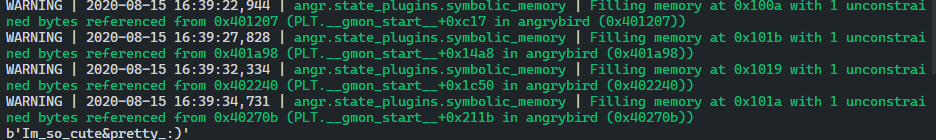

```toc
```