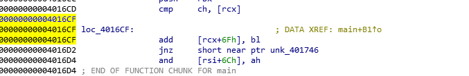
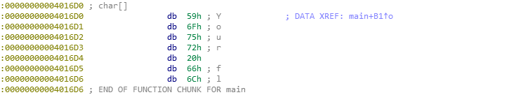
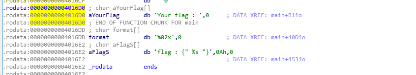
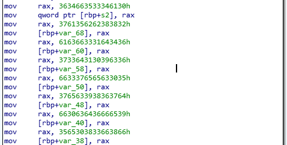
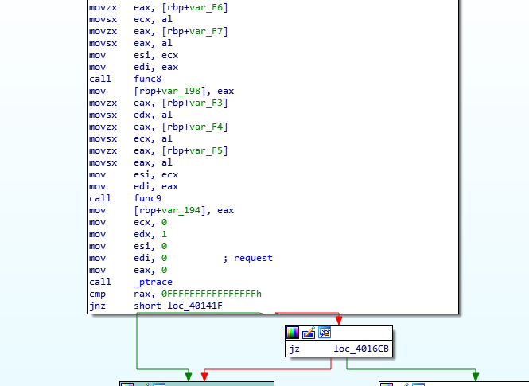
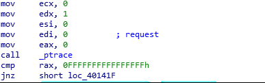
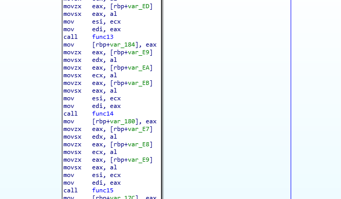
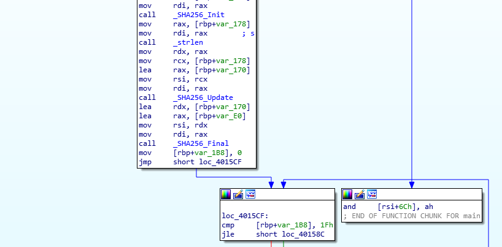
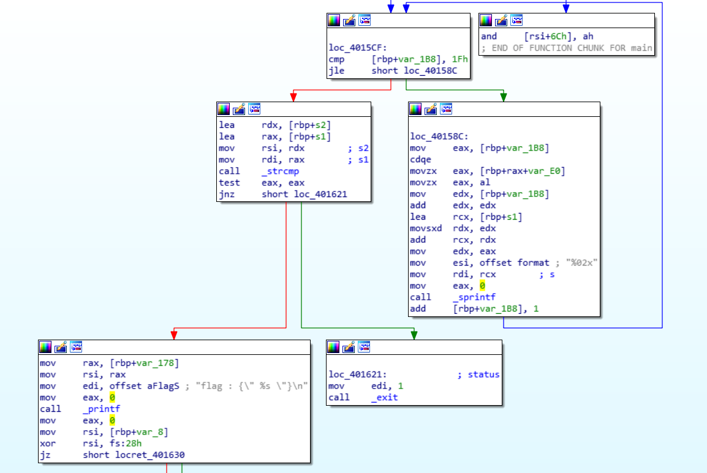

## 바이너리 정보

```c
RedVelvet:
ELF 64-bit LSB executable
x86-64, version 1 (SYSV)
dynamically linked
interpreter /lib64/ld-linux-x86-64.so.2
for GNU/Linux 2.6.32
BuildID[sha1]=84e7ef91c33878cf9eefc00a7a450895aa573494
not stripped
```

## main 함수 분석


**Undefined (U) → Create String (a) → WOW String**










```c
0a435f46288bb5a764d13fca6c901d3750cee73fd7689ce79ef6dc0ff8f380e5
```
- 인코딩되어진 값을 확인할 수 있다.
- 사용자 입력을 27바이트를 받으며
- `func1` ~ `func9` 까지 함수 호출 과정이 끝나고 `_ptrace` 를 호출하는 것을 확인할 수 있다.

    [ptrace Anti-Debugging](https://www.notion.so/ptrace-Anti-Debugging-aed6d7a2c7f748e69f7144e86b7fe3f5)





- `_ptrace` 함수는 인자 `edi:0, esi:0, edx:1, ecx:0` 을 받으며 호출되며 반환 되는 값이 `0xFFFFFFFFFFFFFFFF` 값 즉, `-1` 과 비교되어 0 이 아니게 되면 정상 루틴이 아닌 다른 루틴으로 빠지는 것을 확인할 수 있었다.
- `Ptrace` 의 `PTRACE_TRACEME` 옵션은 자기 자신에게 디버거를 붙이라는 의미로서 해당 코드에서는 `ptrace`의 결과가 -1인지 검사하고 참이라면 유효하지 않은 코드 영역으로 점프를 하게 된다. 즉 안티 디버깅을 하기 위해 `자기 자신이 디버깅 당하는 중인지 검사` 하는 것이다.



- 안티 디버깅 검사를 마친 후에 다시 `func10` ~ `func15` 까지 함수를 이용하여 입력값 검증을 시도한다.



- `func15` 함수의 반환 값을 인자로 삼아 `_SHA256_Init` 함수가 호출되는 것을 확인할 수 있으며,  `strlen` 함수를 바탕으로 rax레지스터 즉, 검증 함수를 거치고 나온 후 해당 값의 길이 값을 반환한후 `rdx` 레지스터에 넣는 것을 확인할 수 있다.
- `_SHA256_Update` 함수에서 `입력 값의 길이 값, 해시 값으로 초기화된 값` 을 인자로 하여 업데이트를 한다.
- `OpenSSL API 모듈 SHA256_Init()` , `SHA256_Update()` , `SHA256_Final()` 함수는 핵심 기능이다. 할당 `SHA256_CTX` 을 그것을 초기화 `SHA256_Init()` 와 데이터를 통해 실행, `SHA256_Update()` 그리고 마지막으로 사용하여 결과 추출 `SHA256_Final()` 하게 된다.



# solved code (with z3)

```python
# This Python file uses the following encoding: utf-8
from z3 import *

# x = Solver()
def func1(x,y,z):
    x.add(y * 2 * (z ^ y) - z == 10858, y > 85, y <= 95, z > 96, z <= 111)

def func2(x,y,z):
    x.add(y % z == 7, y > 90)

def func3(x,y,z):
    x.add(y/z+(z ^ y) == 21, y <= 99, z <= 119)

def func4(x,y,z):
    x.add((y % z) + y == 137, y > 115, z <= 99, z == 95)

def func5(x,y,z):
    x.add(((z + y)^((y ^ z ^ y)&0xff)) == 225, y > 90, z <= 89)

def func6(x, y, z1, z2):
    x.add(y<=z1, z1 <= z2, y>85, z1>110, z2>115, ((z1+z2)^(y+z1)) == 44, ((z1+z2)%y+z1) == 161)

def func7(x, y, z1, z2):
    x.add(y>=z1, z1>=z2, y<=119, z1>90, z2<=89, ((y+z2)^(z1+z2)) == 122, (y+z2)%z1+z2 == 101)

def func8(x, y, z1, z2):
    x.add(y<=z1, z1<=z2, z2<=114, (y+z1)/z2*z1 == 97, (z2^(y-z1))*z1 == -10088, z2<=114)

def func9(x, y, z1, z2):
    x.add(y==z1, z1>=z2, z2<=99, z2+y*(z2-z1)-y == -1443)

def func10(x, y, z1, z2):
    x.add(y>=z1, z1>=z2, z1*(y+z2+1)-z2 == 15514, z1 > 90, z1 <= 99)

def func11(x, y, z1, z2):
    x.add(z1>=y, y>=z2, z1>100, z1<=104, y+(z1^(z1-z2))-z2 == 70, (z1+z2)/y+y == 68)

def func12(x, y, z1, z2):
    x.add(y>=z1, z1>=z2, z1<=59, z2<=44, y+(z1^(z2+z1))-z2 == 111, (z1^(z1-z2))+z1 == 101)

def func13(x, y, z1, z2):
    x.add(y<=z1, z1<=z2, y>40, z1>90, z2<=109, z2+(z1^(z2+y))-y == 269, (z2^(z1-y))+z1 == 185)

def func14(x, y, z1, z2):
    x.add(y>=z2, z1>=z2, z1<=99, z2>90, y+(z1^(z1+y))-z2==185)

def func15(x, y, z1, z2):
    x.add(z1>=z2, z1>=y, z2>95, z1<=109,((z1-y)*z1^z2)-y==1214,((z2-z1)*z2^y)+z1==-1034)

array = [BitVec('f_%i'%i, 32) for i in range(26)]
x = Solver()

# 실 제약조건을 추가하는 과정 func 들의 결과와 인풀의 범위를 아스키 코드로 고정
func1(x, array[0], array[1])
func2(x, array[1], array[2])
func3(x, array[2], array[3])
func4(x, array[3], array[4])
func5(x, array[4], array[5])
func6(x, array[5], array[6], array[7])
func7(x, array[7], array[8], array[9])
func8(x, array[9], array[10], array[11])
func9(x, array[11], array[12], array[13])
func10(x, array[13], array[14], array[15])
func11(x, array[15], array[16], array[17])
func12(x, array[17], array[18], array[19])
func13(x, array[19], array[20], array[21])
func14(x, array[21], array[22], array[23])
func15(x, array[23], array[24], array[25])

for i in range(26):
    x.add(array[i] >= 0x20, array[i] <= 0x7e)
assert x.check() == sat

test = x.model()
string_check = {}

tmp = []
for z in test:
    string_check[int(str(z).strip('f_'))] = test[z]

for idx in range(len(string_check)):
    tmp.append(string_check[idx].as_long())

isFlag=''
for cdx in range(len(tmp)):
    isFlag+=chr(tmp[cdx])
print isFlag
```

```toc
```