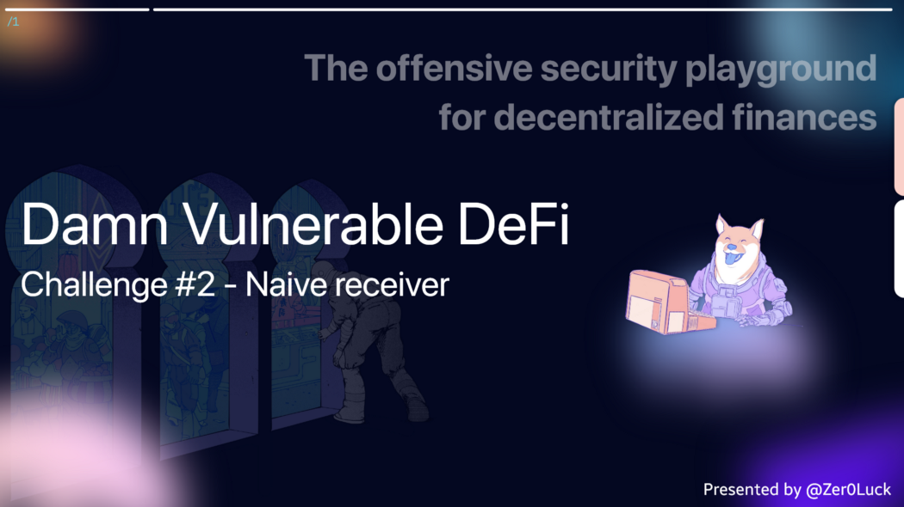
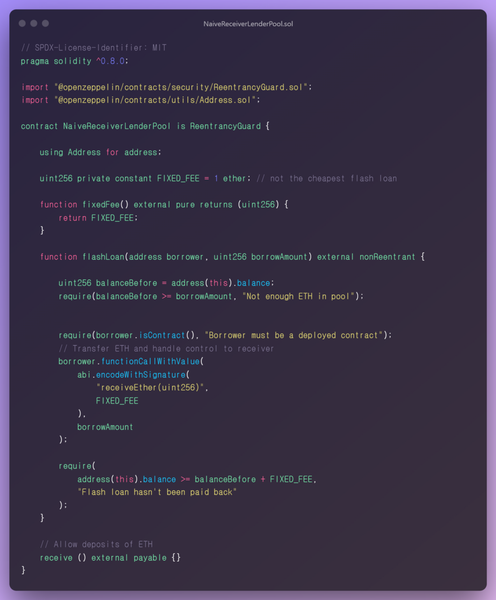
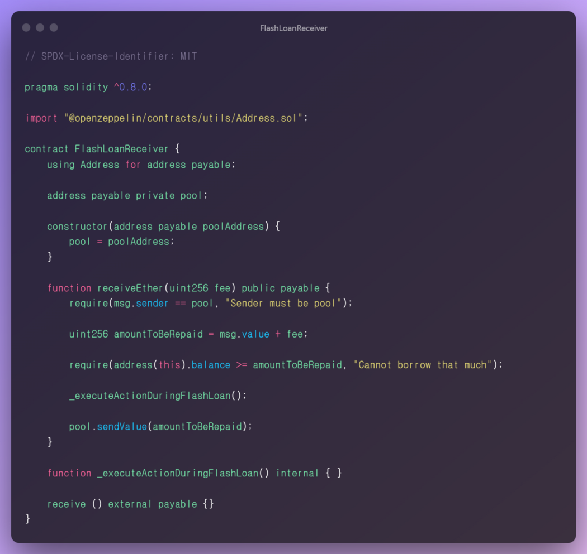
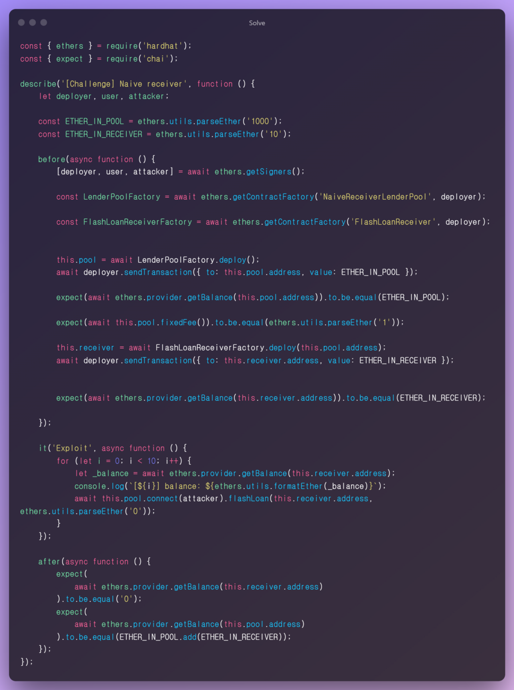

**Wargame Provider: @tinchoabbate**

> Challenge #2 — Naive receiver
There’s a lending pool offering quite expensive flash loans of Ether, which has 1000 ETH in balance.
You also see that a user has deployed a contract with 10 ETH in balance, capable of interacting with the lending pool and receiveing flash loans of ETH.
Drain all ETH funds from the user’s contract. Doing it in a single transaction is a big plus ;)


## Code Audit
> NaiveReceiverLenderPool.sol



### Dependency

- We are using the Address contract of the openzeppelin library as a dependency.

### State Variable

`uint256 private constant FIXED_FEE`

- It is assigned a value of `1 ether` and has a constant variable characteristic, so it cannot be modified as a fixed value at `compile-time`, and it is `private` and cannot be accessed from outside.

> You can define `constant, immutable `as `State Variables`. Both variables cannot modify their values after they are constructed. `constant variables` cannot be tampered with because they are fixed at `compile-time.` immutable variables are still assignable at construction-time.

### Funcitons

`function fixedFee() external pure returns (uint256)`

You can see that the State Variable value is returned as it is without modifying the state value. Used for checking the FIXED_FEE value.

`function flashLoan(address borrower, uint256 borrowAmount) external nonReentrant`

Execute the flash loan logic, which is a core function in the current contract.

- The local variable `balanceBefore` is assigned the current contract balance value.

✅ The `balanceBefore` value must be greater than or equal to the parameter `borrowAmount`, and the balance of the current contract must be higher than the borrowing price to be able to borrow.

✅ The parameter `borrower` is assigned an address type. Under the current condition, call the `isContract` function of the openzeppelin internal address contract to measure the size of the target address to measure whether the contract is activated.

The isContract function has the following characteristics.

1. It is not safe to assume that the address for which this function returns false is an External Owner Account, not a contract.
2. relies on extcodesize returning 0 for the contract being created because the code is only saved when the constructor execution ends
3. extcodesize returns 0 if called in the contract constructor
4. If you are using this in a security-sensitive setup, you should consider if it’s a problem.

- Call the `functionCallWithValue` method with the parameter borrower. In the low-level stage, the `receiveEther(uint256)` method of the target contract FlashLoanReceiver is called and used as the `FIXED_FEE` parameter and `borrowAmount` vlaue value.

✅ After the flash loan logic is completed, it is checked whether the current contract’s balance value is greater than or equal to the `balanceBefore+FIXED_FEE` value to determine whether the progress has been made normally.

> FlashLoanReceiver.sol


### Dependency

- I am using the Address contract of the openzeppelin library as a dependency.
- You can use various functions related to Address Type.

### State Variable

`address payable private pool`

- This is the contract address used for pool management in the flash loan process.

### Functions

`constructor(address payable poolAddress)`

- When creating a distribution, it is possible to assign a contract address to the State Variable pool according to the value of the parameter.

`function receiveEther(uint256 fee) pulibc payable`

✅ The address value of the `msg.sender` address and the pool variable must be the same, and you can confirm that the Sender is the contract address assigned to the pool variable.

- After adding the parameter `fee value and msg.value value`, it is assigned to the `amountToBeRepaid` variable.
- The value assigned to the fee is `1 ether`, which is the fixed fee value assigned in the `NaiveReceiverLenderPool` contract. Even if the `msg.value` value changes, you can see that the fee value is fixed.

✅ The current contract’s balance value must be greater than or equal to the `amountToBeRepaid` value to pass the condition, and the borrow amount value must not be greater than the balance in the holding pool.

- Call the meaningless `_executeActionDuringFlashLoan()` function. (gas waste)
- Use the openzeppelin library Address contract method `sendValue` to send the loan return to the `NaiveReceiverLenderPool` contract.

## Vulnerability

Vulnerable targets cause problems in the logic of flash Loan. Because the flashLoan function can be called externally, there is no way to reject a large number of incoming loans by calling the Receiver with this address. By providing the address you choose to pass on to the borrower to accept the flashLoan, you can do a fee and charge a flash Loan, which can ruin that Receiver’s pool.

## Solve
In the current state, the externally callable Flash Loan is called. At this time, since the `FIXED_FEE` value is fixedly 1 Ether, there is no need to specify the loan amount, and 10 calls are made according to the target amount of 10 Ether to exhaust the balance value of the target contract.



## next time.. 🚀

I will continue to post auditing and research on 12 challenge defi Smart Contracts.

Thank you for the @tinchoabbate that made a good wargame.
[Damn Vunlerable Defi](https://www.damnvulnerabledefi.xyz/)

```toc
```