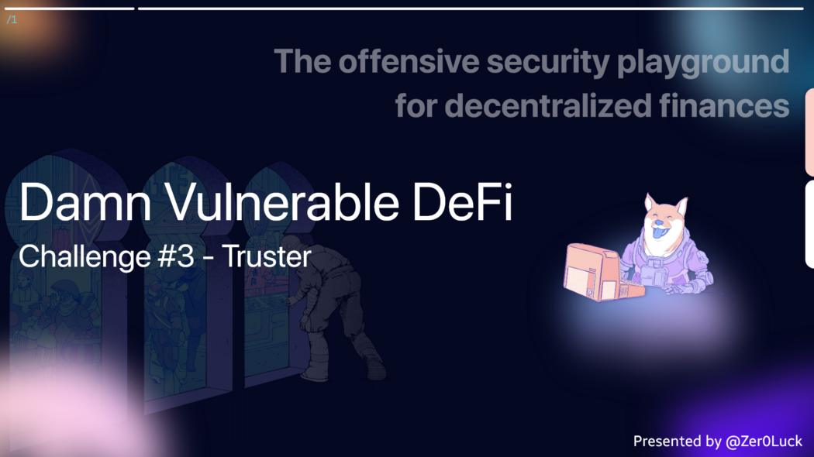
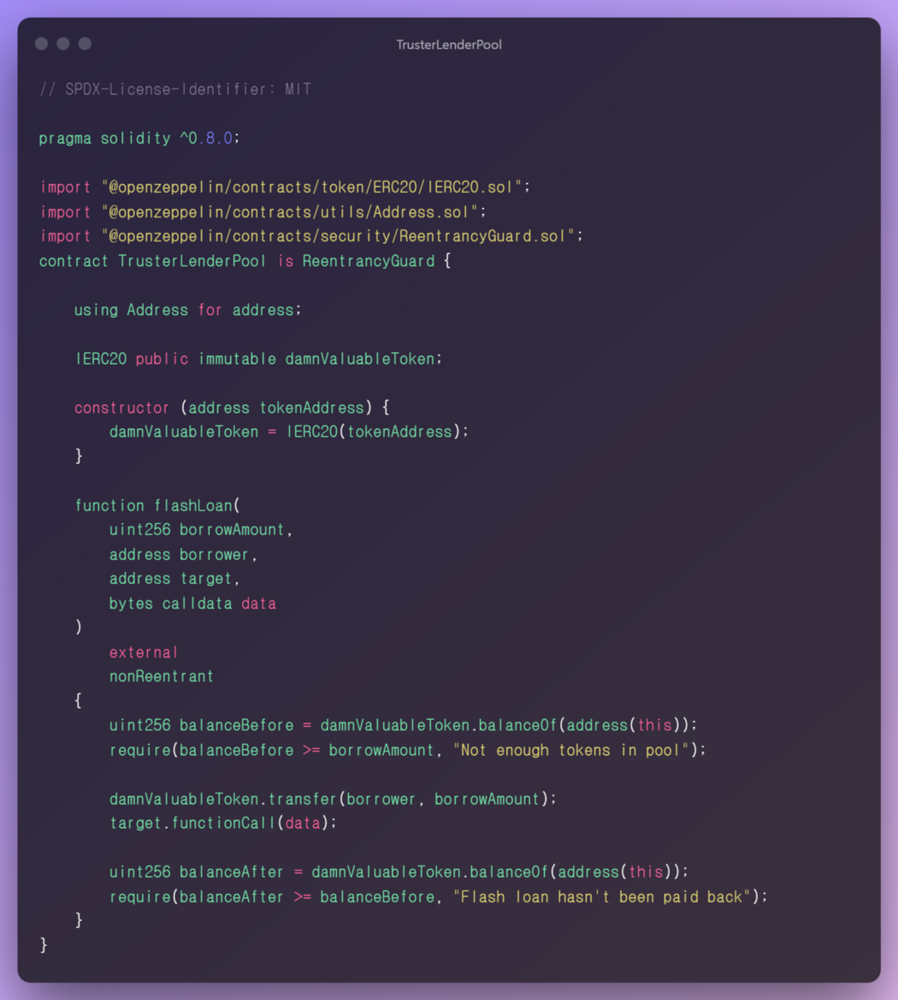
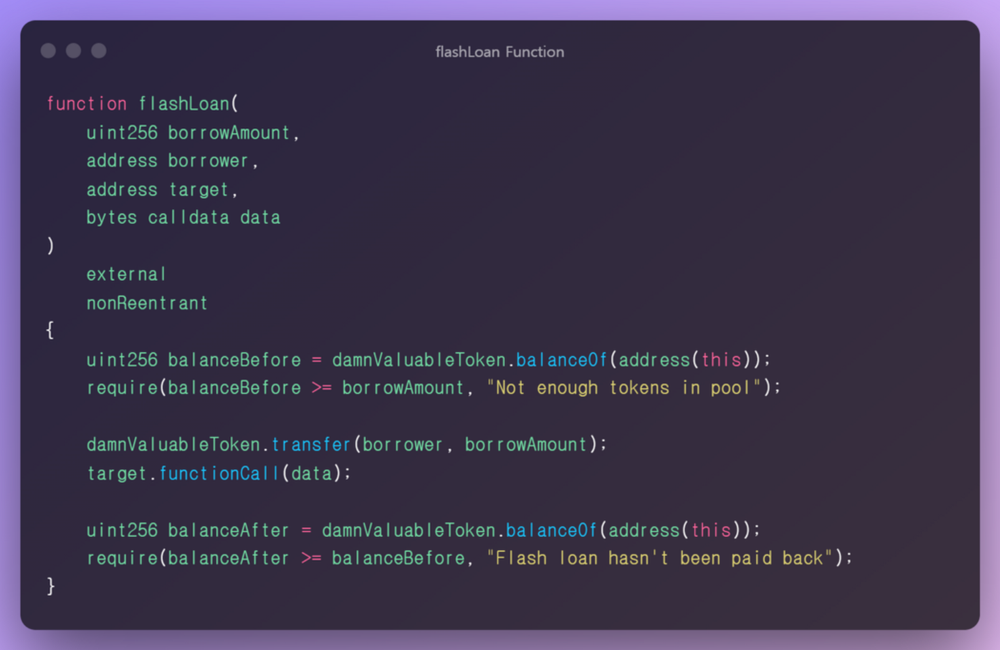
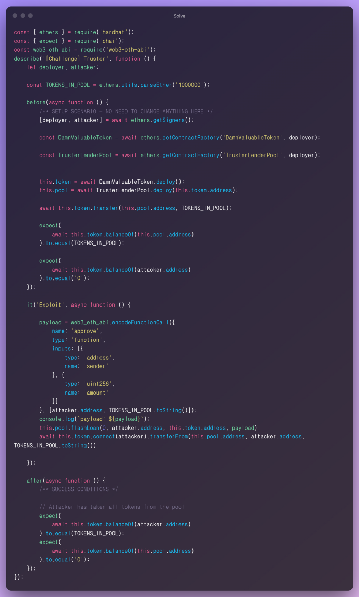

**Wargame Provider: @tinchoabbate**

> Challenge #3 — Truster
More and more lending pools are offering flash loans. In this case, a new pool has launched that is offering flash loans of DVT tokens for free.
Currently the pool has 1 million DVT tokens in balance. And you have nothing.
But don’t worry, you might be able to take them all from the pool. In a single transaction.


## Code Audit
> TrusterLenderPool.sol



### Dependency

- We are using the Address contract of the openzeppelin library as a dependency.

### State Variable

`IERC20 public immutable damnValuableToken`

- IERC20 standard damnValuableToken used globally in this challenge is used for contract address management.

### Functions

`constructor(address tokenAddress)`

- It has the token contract initialization process and instance allocation criteria.

`function flashLoan(uint256 borrowAmount, address borrower, address target, byte calldata data) external nonReentrant`

- This is the part responsible for the main logic of this contract. Let’s analyze the logic.

- The local variable `balanceBefore` receives the balance information of this contract by using the balance method of the `damnValuableToken` contract.

✅ The `balanceBefore` value must be greater than or equal to the `borrowAmount` value, and it must be greater than the value you want to borrow from the entire pool.

- Using the `transfer` method of the `dammValuableToken` contract, the parameter `borrower` is transferred as much as the `borroAmount` value.
- If the first condition is passed, you can ask for a quote that unconditionally transfer is possible.
- You can proceed with `functionCall` based on the parameter `target` address value and call it by passing `bytes calldata data` value as a parameter.
- After that, the logic proceeds to finalize the flash loan logic.

## Vulnerability

The vulnerability in this contract is that external users can construct and call any function they want. If an attacker steals the balance information of the target contract, or the attack vector that can perform a service-level attack such as DOS is universal, it is a very serious condition.



When executing the `target.functionCall(data)` line in the current code and manipulating each parameter to a desired value, it is possible to call a specific function and function parameter. However, since the before and after remnants must be the same, it is impossible to abuse the function in the form of stealing the balance value singly.

## solve

An attacker constructs a desired payload and calls functionCall inside the vulnerable `flashLoan` function to steal the balance value of the corresponding token pool. When transferring tokens forcibly, the destination address must be accepted before `transfer` because security is set in the ERC20 `Approve/Allow`Flow method. But this part is easy to fix. By calling `approve(address, amount)` using functionCall, after allowing the amount to be stolen and the address value to be taken, all funds in the pool are stolen by calling the trasferFrom function.



## next time.. 🚀

I will continue to post auditing and research on 12 challenge defi Smart Contracts.

Thank you for the @tinchoabbate that made a good wargame.
[Damn Vunlerable Defi](https://www.damnvulnerabledefi.xyz/)

```toc
```