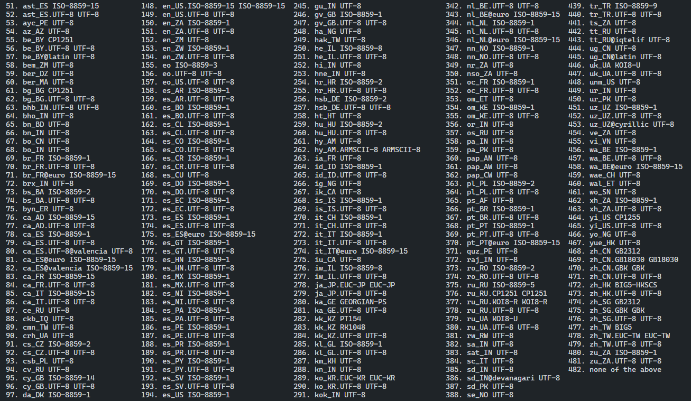
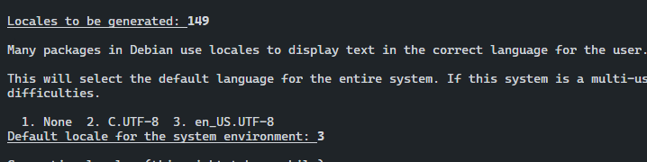
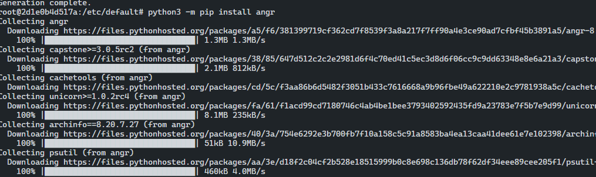

# 문제 해결 

## Step1: error check
```python
root@2d1e0b4d517a:/etc/default# cat /etc/issue
Ubuntu 16.04.7 LTS \n \l
```
```python
Traceback (most recent call last):
  File "<stdin>", line 1, in <module>
  File "/usr/lib/python3/namin.py", line 4112, in setlocale
    return _setlocale(categories, locale)
locale.Error: unsupported locale setting
```

- Docker환경에서 Ubuntu 서버를 운영하다가 `pip -install` 이 작동을 안하는 경우가 생긴다.
- 해당 에러는 `locale.Error: unsupported locale setting` 가 발생하며 local 쪽에 문제가 생긴 것으로 보인다.

## Step2
```python
$ locale
locale: Cannot set LC_CTYPE to default locale: No such file or directory
locale: Cannot set LC_ALL to default locale: No such file or directory
LANG=en_US.UTF-8
LANGUAGE=
LC_CTYPE=UTF-8
LC_NUMERIC="en_US.UTF-8"
LC_TIME="en_US.UTF-8"
LC_COLLATE="en_US.UTF-8"
LC_MONETARY="en_US.UTF-8"
LC_MESSAGES="en_US.UTF-8"
LC_PAPER="en_US.UTF-8"
LC_NAME="en_US.UTF-8"
LC_ADDRESS="en_US.UTF-8"
LC_TELEPHONE="en_US.UTF-8"
LC_MEASUREMENT="en_US.UTF-8"
LC_IDENTIFICATION="en_US.UTF-8"
LC_ALL=

$ locale -a
locale: Cannot set LC_CTYPE to default locale: No such file or directory
C
C.UTF-8
en_US.utf8
POSIX
```

- `locale -a` 명령으로 해당 파일을 찾을 수 없다는 오류 메시지가 뜬다면은 아래에 환경 설정을 해주길 바란다.

```python
/usr/sbin/dpkg-reconfigure: locales is not installed

# echo "LC_ALL=en_US.UTF-8" | tee -a /etc/environment
LC_ALL=en_US.UTF-8

# echo "en_US.UTF-8 UTF-8" | tee -a /etc/locale.gen
en_US.UTF-8 UTF-8

# echo "LANG=en_US.UTF-8" | tee -a /etc/locale.conf
LANG=en_US.UTF-8
```

## Step3

- 환경 설정을 완료하였으면 `dpkg-reconfigure` 옵션으로 사용할 locales 를 지정하도록 한다.

```python
# dpkg-reconfigure locales
```



- `en_US.UTF-8 UTF-8` 을 선택하고 `en_US.UTF-8` 을 설정하도록 한다.



- 그 후에 `pip install` 이 잘되는 것을 확인할 수있다.😊😊



``` toc
```

