# 취약점 분석 
## 안드로이드 앱의 시작점
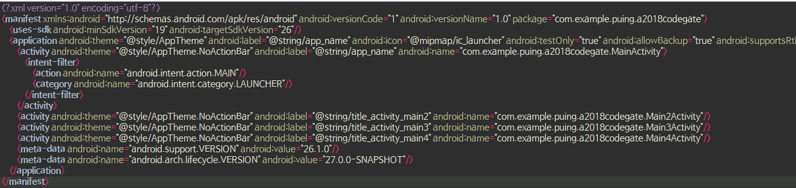
```xml
<activity android:theme="@style/AppTheme.NoActionBar" android:label="@string/app_name"
	android:name="com.example.puing.a2018codegate.MainActivity">
            <intent-filter>
                <action android:name="android.intent.action.MAIN"/>
                <categories android:name="android.intent.categories.LAUNCHER"/>
            </intent-filter>
        </activity>
```
## MainActivty1


- k() 의 반환값이 False 이면 앱 종료

## K 함수 분석
```java
public static boolean k() {
        return Build.FINGERPRINT.startsWith("generic") || \
								Build.FINGERPRINT.startsWith("unknown") || \
								Build.FINGERPRINT.contains("sdk_google") || \
								Build.MODEL.contains("google_sdk") || \
								Build.MODEL.contains("Emulator") || \
								Build.MODEL.contains("Android SDK built for x86") || \
								Build.MANUFACTURER.contains("Genymotion") || \
								(Build.BRAND.startsWith("generic") && \
								Build.DEVICE.startsWith("generic")) || \
								"google_sdk".equals(Build.PRODUCT);
    }
```
- 빌드 네임이 아래 중 하나 조건에 맞으면 통과

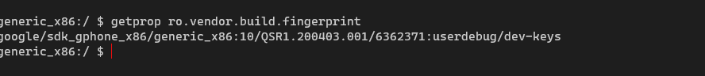

    - `"google_sdk".equals(Build.PRODUCT)` ← `google/sdk_gphone_x86`

## MainActivity2 intent 요청 조건 분석

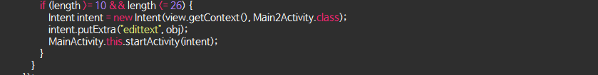

- Button을 누르면 길이가 (10 ≥ && ≤ 26) 일 경우 Main2Activity 를 호출

## MainActivity2

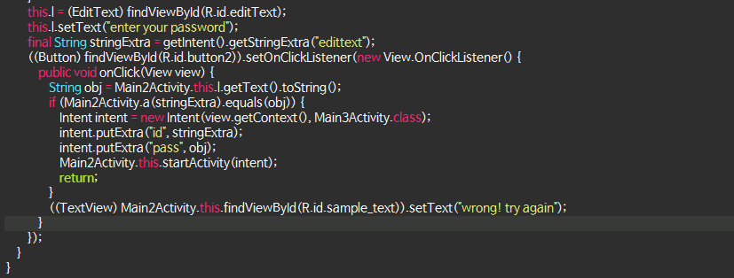

```java
final String stringExtra = getIntent().getStringExtra("edittext");
```

- MainActivty에서 입력 받은 edittext 를 stringExtra 변수에 저장

```java
String obj = Main2Activity.this.l.getText().toString();
                if (Main2Activity.a(stringExtra).equals(obj)) {
```

- obj에 Main2Activity에서 입력하는 값을 저장하고 `a` 함수를 stringExtra로 실행한 값과 일치하는지 비교한다.

```java
intent.putExtra("id", stringExtra);
intent.putExtra("pass", obj);
Main2Activity.this.startActivity(intent);
return;
```

- MainActivty에서 입력한 값이 id, Main2Acticity에서 입력한 값이 password인 것을 확인할 수 있다.

## MainActivity2 a 함수 분석

```java
public static String a(String str) {
    char[] cArr = {
        'c', 'o', 'd', 'e', 'g', 'a', 't', 'e', '2',
        '0', '1', '8', 'h', 'u', 'r', 'r', 'a', 'y',
        '!', 'H', 'A', 'H', 'A', 'H', 'A', 'L', 'O', 'L'};
    int length = str.length();
    int i = 0;

    String str2 = "";

    while (i < length) {
        int charAt = str.charAt(i) ^ String.valueOf(cArr).charAt(lengt
        h + i);
        int i2 = 0;

        while (i2 < cArr.length - 1) {
            int nextInt = String.valueOf(charAt).equals(Character.valu
            eOf(String.valueOf(cArr).charAt(i2))) ? new Random().nextInt() : charA
            t;
            i2++;
            charAt = nextInt;
        }

        for (int i3 = 0; i3 < charAt; i3 = i3 + i3 + 1) {}
        i++;
        str2 = str2 + String.valueOf(i3);
    }
    String str3 = "";

    for (int i4 = 0; i4 < length; i4++) {
        str3 = str3 + (str2.charAt(i4) ^ i4);
    }
    return str3;
}
```

- 입력 받은 str(id) 를 갖고 xor 연산을 하면서 `무언가` 연산하는 함수

## MainActivity3 분석

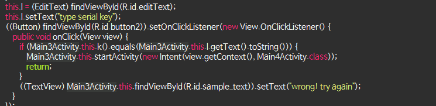

- `k` 함수 반환 값과 Main3Activity 에서 입력하는 값을 비교 후 참을 반환하면 Main4Activity 호출

## Main3Activity K 함수 분석

```java
public String k() {
        char[] cArr = {'a', 'b', 'c', 'd', 'e', 'f', 'g', 'h', 'i', 'j', 'k', 'l', 'm', 'n', 'o', 'p', 'q', 'r', 's', 't', 'u', 'v', 'w', 'x', 'y', 'z', '0', '1', '2', '3', '4', '5', '6', '7', '8', '9'};
        StringBuffer stringBuffer = new StringBuffer();
        Random random = new Random();
        for (int i = 0; i < 20; i++) {
            stringBuffer.append(cArr[random.nextInt(cArr.length)]);
        }
        return stringBuffer.toString();
    }
```

- `cArr` 배열에서 랜덤한 문자열을 반환한다

## Main4Activity 분석

```java
public class Main4Activity extends c {
    EditText l;

    /* access modifiers changed from: protected */
    public void onCreate(Bundle bundle) {
        super.onCreate(bundle);
        setContentView((int) R.layout.activity_main4);
        a((Toolbar) findViewById(R.id.toolbar));
        ((FloatingActionButton) findViewById(R.id.fab)).setOnClickListener(new View.OnClickListener() {
            public void onClick(View view) {
                Snackbar.a(view, "Replace with your own action", 0).a("Action", (View.OnClickListener) null).a();
            }
        });
        System.loadLibrary("native-lib");
        this.l = (EditText) findViewById(R.id.editText);
        this.l.setText(stringFromJNI());
    }

    public native String stringFromJNI();
}
```

- `stringFromJNI` 라는 native 함수를 실핸 후 반환 값을 EditText에 지정

## 정리

- 각 스테이지 (Main{N}Activity) 별로 체크 로직이 존재하고 통과할 경우 다음 스테이지로 이동
- Main4Activity에서 FLAG를 호출한다. → `stringFromJNI()`

# 문제 풀이 방법

1. Activity Start
    - 바로 Main4Activity 를 호출한다.
2. Hooking
    - 로직들을 통과할 수 있게 각 함수마다 후킹
3. JNI Load
    - Native 함수를 강제로 실행

### Activity Start

- Intent가 등록되어 있지 않은 액티비티 (→ exported=false)는 일반 유저가 호출할 수 없다.

!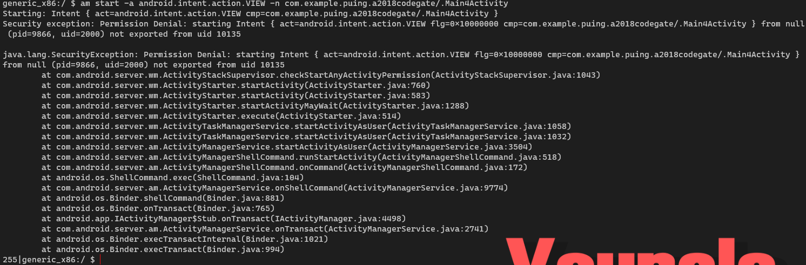

- Root 권한이 존재하는 ADV Image이기 때문에 임의 액티비티 실행이 가능하다.
- 권한 상승후 해당 액티비티를 실행하게 되면 FLAG값을 얻을 수 있다.
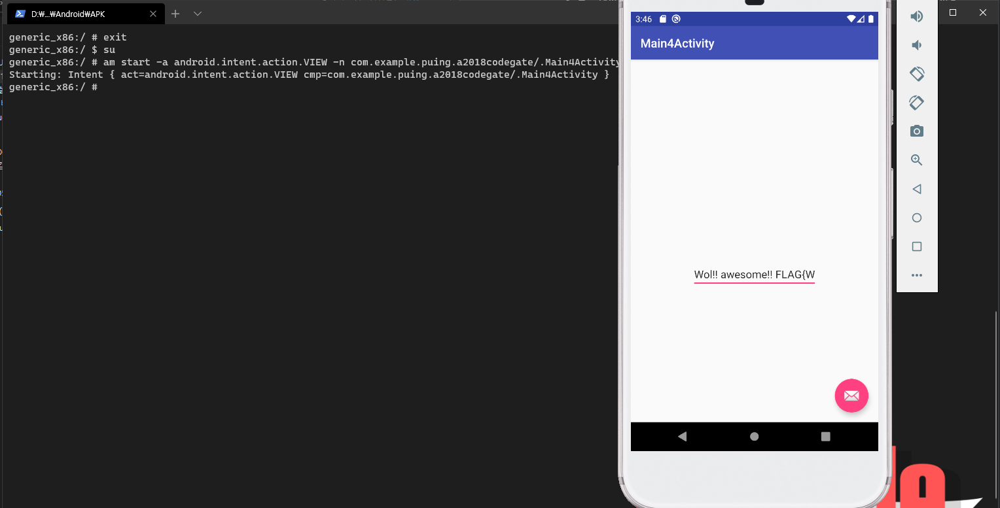
## Hooking

- Frida를 통한 Hooking을 통해 체크 로직 우회

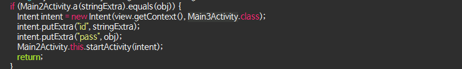

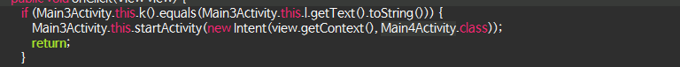
    - String.equals() 를 후킹해서 항상 true를 반환하도록 만들어도 되지만 이미 많은 곳에서 사용하기 때문에 노이즈가 심하다.

    - Main2Activity.a 와 Main3Activity.k를 후킹해 빈 문자열을 반환하도록 해보겠다.

**Frida server background**

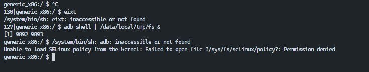

```python
import frida, sys

# print(frida.get_usb_device())

jscode = """
Java.perform(function () {
		// main2, main3 <- 해당 액티비티 패키지 선언
    var main2 = Java.use('com.example.puing.a2018codegate.Main2Activity');
    var main3 = Java.use('com.example.puing.a2018codegate.Main3Activity');
		
		// 액티비티2 a 함수 implementation(재구성) 
		// 반환되는 값을 빈 문자열 로 변경
    main2.a.implementation = function() {
        console.log('called 2');
        var str = Java.use('java.lang.String');
        var exampleStirng1 = str.$new('');
        return exampleStirng1;
    }

	  // k 함수 반환되는 값을 빈 문자열 로 변경
    main3.k.implementation = function() {
        console.log('called 3');
        var str = Java.use('java.lang.String');
        var exampleString1 = str.$new('');
        return exampleString1;
    }

});
"""

# process attach 
p = frida.get_usb_device().attach('com.example.puing.a2018codegate')
print('load done')
js = p.create_script(jscode)
js.load()
sys.stdin.read() # for interrupt
```

---

## JNI Load

- 삽입 되어 있는 JNI (네이티브 라이브러리)를 로드하는 앱을 만들어서 실행
- 실무에서도 리버싱할 때 많이 쓰인다.
    - Root Detecting 기능 혹은 디버깅 방지 기능이 많이 들어가 있다.
    - 해당 기능을 우회하는 비용보다 삽입된 JNI를 로드하는게 훨씬 쉽다.

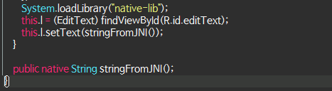

- 동일한 클래스명 생성
    - System.LoadLibrary를 호출하는 클래스의 이름으로 매핑되어 있다.
    - Java_com_example_puing_a2018codegate_Main4Activity_stringFromJNI
### Main4Activity

    ```java
    package com.example.puing.a2018codegate;

    import android.util.Log;

    public class Main4Activity {
        public native String stringFromJNI(); // stringFromJNI 선언

        static {
            System.loadLibrary("native-lib"); // JNI 로드
        }
        public Main4Activity() {
            Log.d("FLAG", stringFromJNI()); // logcat으로 해당 함수를 호출한 값을 출력
        }
    }
    ```

     

### MainActivity

    ```java
    package com.Zer0Luck.android_analysis;

    import androidx.appcompat.app.AppCompatActivity;

    import android.os.Bundle;

    import com.example.puing.a2018codegate.Main4Activity;

    public class MainActivity extends AppCompatActivity {

        @Override
        protected void onCreate(Bundle savedInstanceState) {
            super.onCreate(savedInstanceState);
            setContentView(R.layout.activity_main);

            new Main4Activity(); // MainActivity에서 바로 액티비티 4를 호출
        }
    }
    ```

``` toc
```