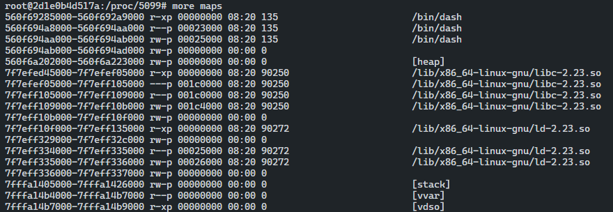
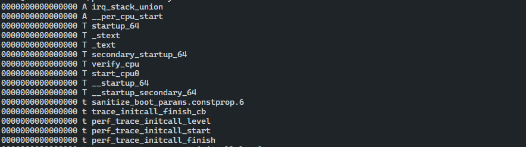

# Device File

## /proc/<pid>/maps

- 각 메모리 매핑을 표시해 프로세스 이미지에 대한 레이아웃을 가진다.
- 실행 파일, 공유 라이브러리, 스택, 힙, VDSO 등이 포함된다.
- 프로세스 주소 공간의 배치를 신속히 분석할 때 매우 중요하다.



## /proc/kcore

- proc 파일시스템에 있는 엔트리로 리눅스 커널의 동적 코어 파일처럼 행동한다.
- GDB에 커널 디버깅과 분석을 목적으로 사용할 수있는 ELF 코어 파일 형태인 로우 메모리 덤프이다.

## /boot/System.map

- 모든 리눅스 배포판에서 사용할 수 있고 커널 해커에게 아주 유용하다.
- 전체 커널의 모든 심볼이 담겨 있다.

## /proc/kallsyms

- kallsyms는 /proc 엔트리만 제외하고 커널이 관리하고 동적으로 업데이트하여 `System.map` 과 매우 유사하다.
- 새로운 LKM을 설치하면 심볼은 /proc/kallsyms에 바로 추가된다.
- /proc/kallsyms는 대부분의 심볼과 `CONFIG_KALLSYMS_ALL` 커널 설정에 명시된 것 전부가 포함된다.



## /proc/iomem

- `/proc/<pid>/maps` 와 유사하지만 시스템 메모리 전체에 대한 용도로 쓰인다.
- 물리 메모리에 매핑된 커널의 텍스트 세그먼트의 위치를 알고자 한다면 `Kernel` 문자열을 검색해 코드/텍스트 세그먼트. 데이터 세그먼트, bss 세그먼트를 확인한다.

---

``` toc
```