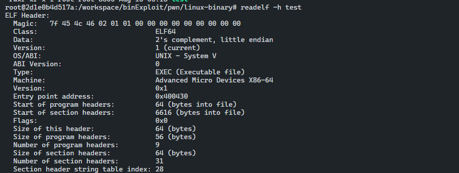

# ELF 파일 형식

## ET_NONE(ELF type none)

- `unknown type`
- 파일은 아직 정의되지 않았거나 알 수 없다.

## ET_REL(ELF Type relocatable)

- 재배열이 가능한 파일 형식
- 이 형식의 파일은 파일의 전체 또는 일부가 재배열 가능하다.
- 재배열 가능한 파일은 위치 독립 코드 (PIC, Position Independent Code) 라고 한다.
- `아직 실행 파일에 링킹되지 않은 상태`
- 코드를 컴파일 해 얻을 수 있는 `.o` 파일은 실행 파일을 생성하는 데 필요한 코드와 데이터를 포함한다.

## ET_EXEC(ELF executable)

- 실행 파일 형식이다.
- 이 형식의 파일은 실행 파일이며 프로그램이라고 부른다.
- 프로세스의 시작 지점인 Entry Point가 있다.

## ET_DYN(ELF type dynamic)

- 공유 오브젝트 파일 형식
- 동적 링킹이 가능한 오브젝트 파일로 공유 라이브러리하고도 함
- 실행 시간(runtime) 에 프로그램의 프로세스 이미지로 로드되고 링크된다.

## ET_CORE(ELF type core)

- 코어 파일 형식
- 코어 파일은 프로세스의 이미지의 전체 덤프이다.
- 주로 프로그램이 비정상적으로 종료되거나 `SIGSEGV` 시그널 (Segmentation Falut)로 인해 프로세스가 종료됐을 때 생성된다.
- GDB를 이용해 코어 파일의 정보를 읽고 프로그램이 비정상적으로 종료된 시점에서의 원인을 분석할 수 있다

## ELF 파일 헤더



- ELF 파일 헤더는 파일의 offset `0`에서 시작한다.

**헤더**

```c
1. ELF 형식
2. 아키텍처
3. 엔트리 포인트 주소
4. 섹션 헤더
5. 프로그램 헤더
6. 다른 ELF 헤더의 주소 오프셋
...
```

- 파일에 대한 주요 정보를 제공한다.

***Linux Programer;s Manual - ELF(5)***

```c
#define EI_NIDENT 16

           typedef struct {
               unsigned char e_ident[EI_NIDENT];
               uint16_t      e_type;
               uint16_t      e_machine;
               uint32_t      e_version;
               ElfN_Addr     e_entry;
               ElfN_Off      e_phoff;
               ElfN_Off      e_shoff;
               uint32_t      e_flags;
               uint16_t      e_ehsize;
               uint16_t      e_phentsize;
               uint16_t      e_phnum;
               uint16_t      e_shentsize;
               uint16_t      e_shnum;
               uint16_t      e_shstrndx;
           } ElfN_Ehdr;
```

```toc
```