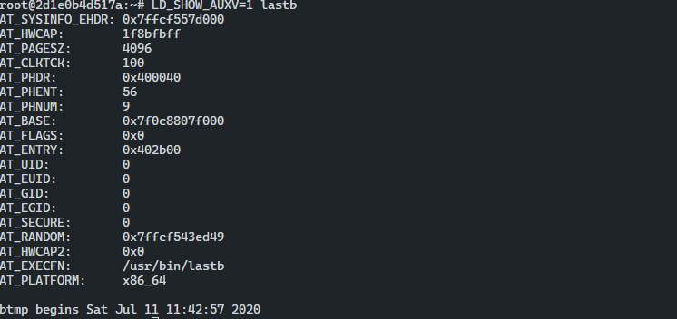

## LD_PRELOAD 환경 변수

- 다른 라이브러리보다 먼저 동적으로 링크하도록 라이브러리 경로를 지정한다.
- 해당 설정은 사전에 로드하는 라이브러리의 함수나 심볼을 나중에 링크되는 라이브러리 함수나 심볼을 오버라이드 한다.
- 공유 라이브러리 함수를 리다렉션하여 런타임 패치를 수행한다.

## LD_SHOW_AUXV 환경 변수

- 실행하는 동안 프로그램의 보조 벡터를 출력하도록 프로그램 로더에게 알린다.
- `보조 벡터` 는 프로그램의 스택 (커널의 ELF 로딩 루틴에 의한)에 위치한 정보로 프로그램에 관한 특정 정보와 함께 동적 링커로 전달된다.
- 해당 정보는 리버싱과 디버깅에 유용하다.



- 프로세스 이미지에 위치한 `VDSO` 페이지의 메모리 주소는 `AT_SYSINFO` 를 확인해야 한다.

## 링커 스크립트

- 링커 스크립트는 링커가 해석해 섹션, 메모리, 심볼 등 프로그램의 레이아웃을 구성한다.
- 기본 링커 스크립터는 `ld -verbose` 명령어로 확인한다.
- `ld` 링커 프로그램은 (재배치 가능한 객체 파일, 공유 라이브러리, 헤더 파일 등) 입력 파일을 받을 때 해석된다.
- 해당 스크립트는 실행 프로그램과 같은 출력 파일을 어떻게 구성할지 지정한다.
- 출력이 ELF 실행 파일이라면 링커 스크립트는 어떻게 배치하고 각 세그먼트에 섹션을 지정할 사용한다.
- `.bss` 섹션은 항상 데이터 세그먼트 끝에 위치하며 이는 링커 스크립트에 의해 결정된다.
- 컴파일하는 동안 링킹 과정에 대한 분석은 중요하다. `gcc` 는 해당 작업을 할 때 링커와 다른 프로그램에 의존한다.
- 일부, 실행 파일의 배치를 제어 할 수 있다는 것은 매우 중요한 사실

---

```toc
```