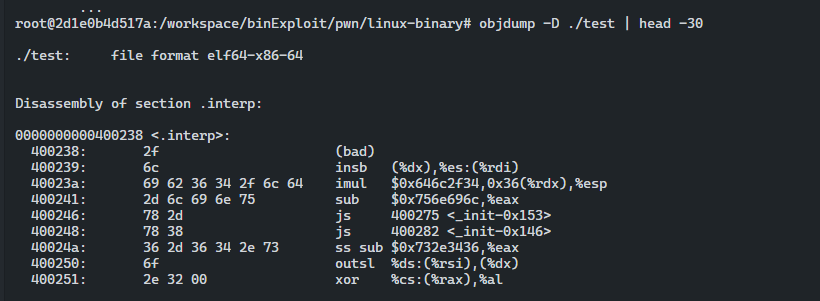
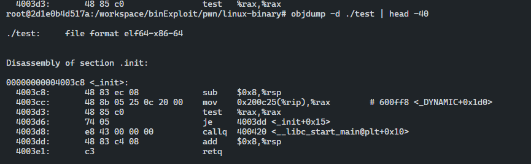
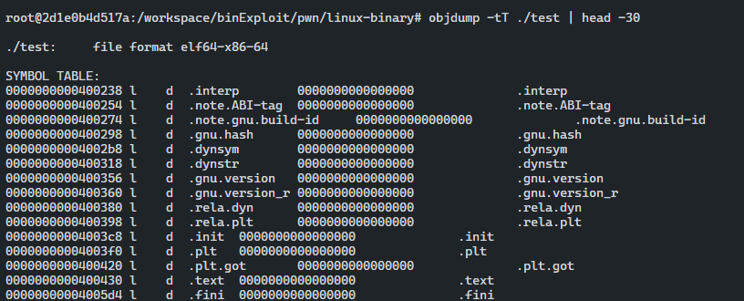
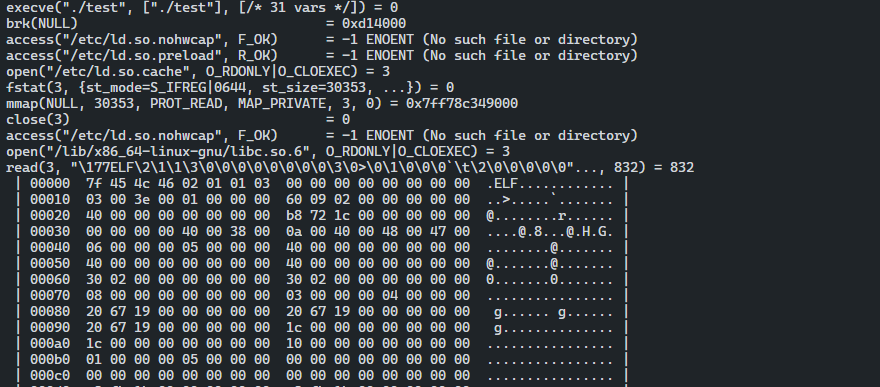
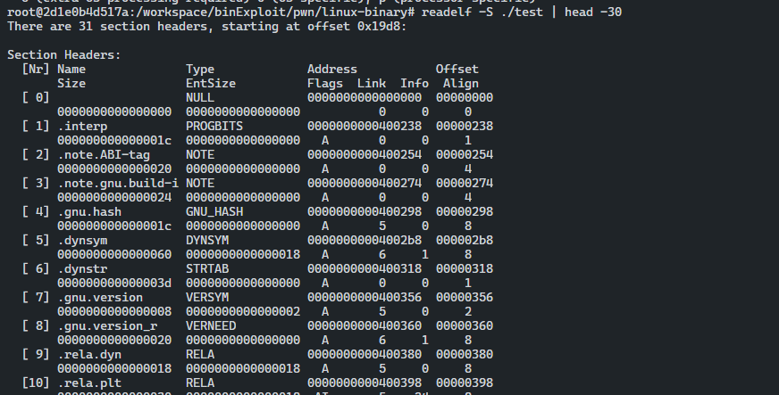
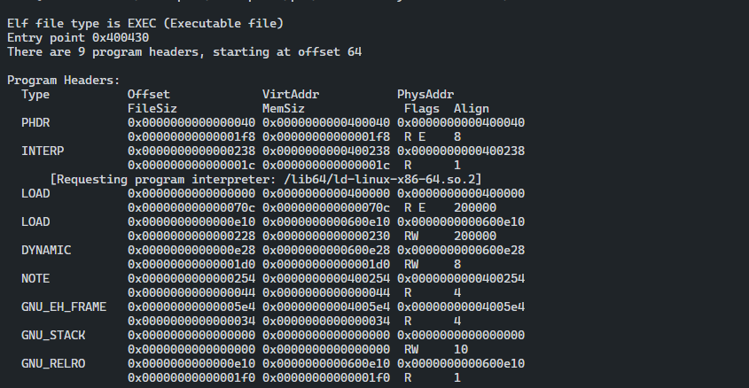
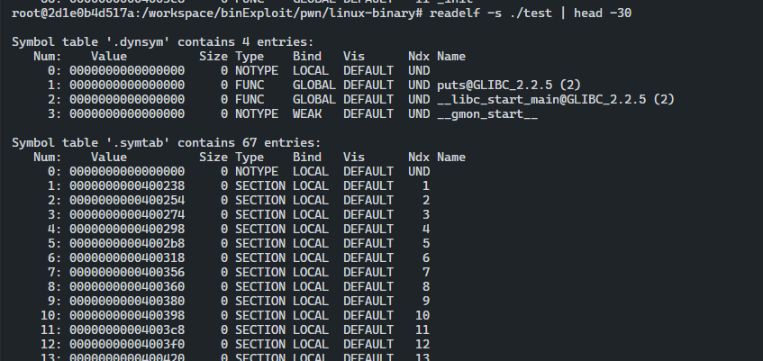
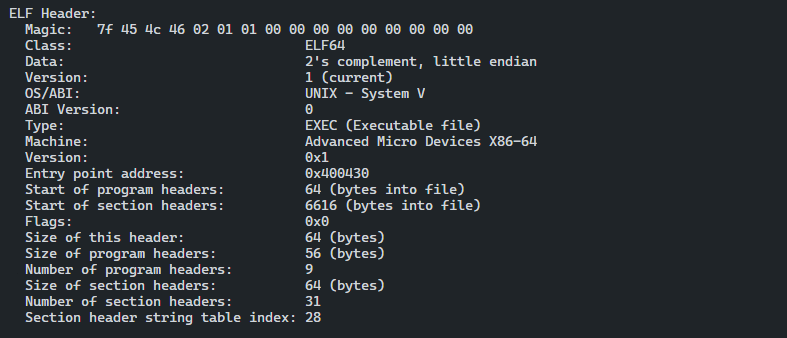
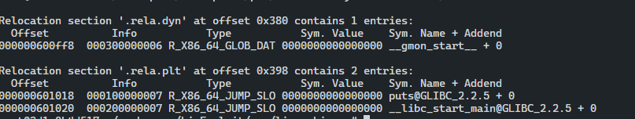
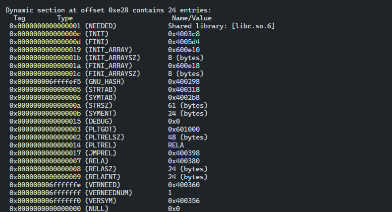

## Objdump

- GNU Binutils
- 난독화 되지 않은 일반적인 바이너리를 디스어셈블링하여 작업할 수 있다.
- 일반적인 ELF 형식이라면 모두 읽을 수 있다.

### 예제 바이너리

```c
// gcc -o test test.c
#include <stdio.h>
#include <stdlib.h>

int main(char argc, char** argv) {
        unsigned char n;
        printf("%s\n",argv[1]);
        return 0;

}
```

- ELF 파일의 모든 섹션, 데이터/코드 출력

```c
objdump -D <./binary>
```



- ELF 파일의 프로그램 코드 출력

```c
objdump -d <./binary>
```



- ELF 파일 모든 심볼 출력

```c
objdump -tT <./binary>
```



---

## Strace

- System Call Trace
- ptrace(2) 시스템 콜을 기반으로 하는 도구
- 프로그램이 실행되는 동안 `syscall` 활동에 대한 정보와 수집되는 시그널을 보여주기 위해 루프 안에서 `PTRACE_SYSCALL` 요청을 사용한다.
- 프로세스를 디버깅하거나 실행 중일 때 어떤 syscall이 호출되는지에 대해 정보 수집으로 유용하다.

```c
strace /bin/ls -o ls.out

// 프로그램을 추적할 때 사용하는 명령어
```

```c
strace -p <PID> -o daemon.out

// 프로세스에 attach에 사용하는 명령어
```

```c
SYS_read(3, buf, sizeof(buf));

// 첫 출력으로 입력값으로 파일 디스크립터를 받는 각 시스템 콜의 파일 디스크립터를 보여준다.
```

```c
strace -e read=3 ./test

// 기록한 데이터를 확인할려면 -e write=fd 를 사용한다.
```



---

## ltrace

- 라이브러리 트레이스
- strace와 유사하다.
- 프로그램의 공유 라이브러리 링킹 정보를 파싱하고 사용되는 라이브러리 함수를 출력한다.

- 시스템 콜 외에 라이브러리 함수 호출도 확인하고자 할시 `-S` 플래그를 사용한다.
- 실행 파일의 동적 세그먼트를 파싱하고 실제 공유 라이브러리와 정적 라이브러리의 심볼 및 함수를 출력해 더 자세히 정보를 출력한다.

```c
ltrace ./test -o test.out
```

---

## readelf

- ELF 바이너리를 분석하는데 가장 유용한 도구이다.
- ELF에 관한 각 데이터 비트에서 객체에 대한 정보를 추출해준다.
- 심볼, 세그먼트, 섹션, 엔트리, 데이터 동적 링킹 등의 정보를 얻기 위해 자주 사용된다.

### 섹션 헤더 테이블 추출

```c
readelf -S ./test
```



### 프로그램 헤더 테이블 추출

```c
readelf -l ./test
```



### 심볼 테이블 추출

```c
readelf -s ./test
```



### ELF 파일 헤더 데이터 추출

```c
readelf -e ./test
```



### 재배치 엔트리 추출

```c
readelf -r ./test
```



### 동적 세그먼트 추출

```c
readelf -d ./test
```



``` toc
```