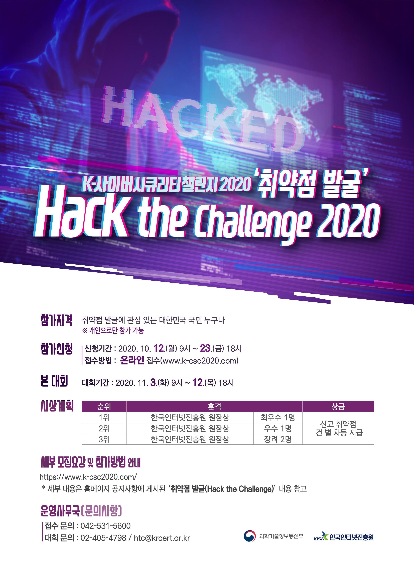
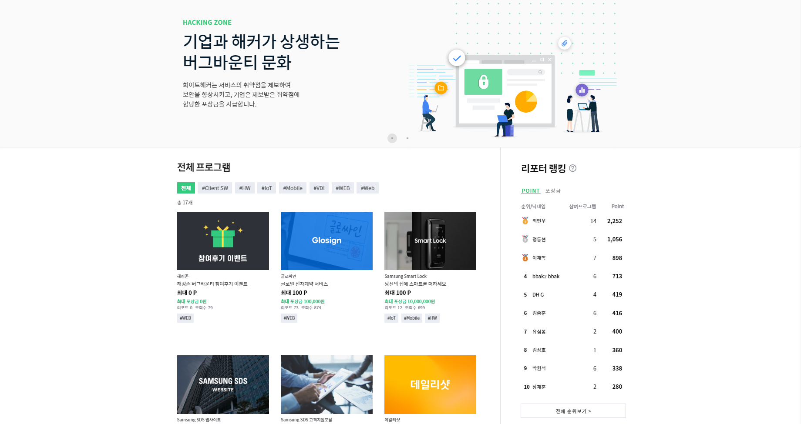
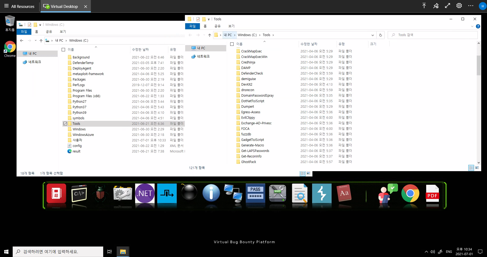
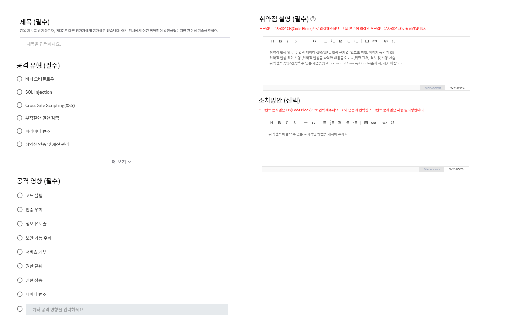
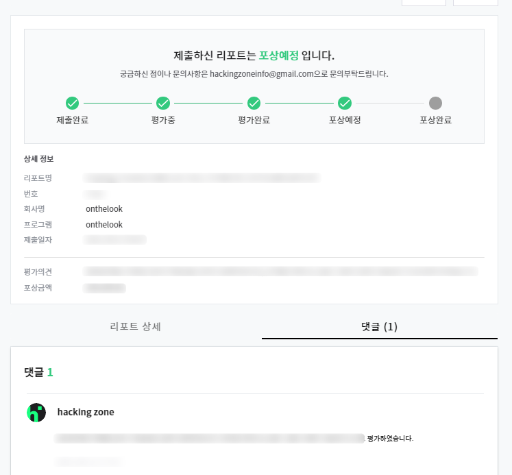
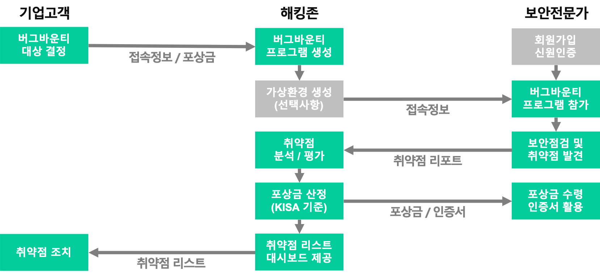

 2020년에 진행했던 Hack the Challenge 대회에 참여하면서 취약점 제보 과정을 통해 접하게 되었었습니다. 저의 생각으로 국내 버그 바운티 프로그램으로 KISA 보안 취약점 제보 서비스, 각 메이저한 기업에서 하는 곳을 제외하고는 찾아보긴 힘들었지만, 삼성 SDS 해킹 존을 새롭게 접하게 되었습니다.      

 

 해킹존 버그바운티 플랫폼 서비스는 해당 사진과 같이 취약점 점검이 필요한 기업들이 나열되어 있으며 취약점 점검 시 발견한 유효 취약점 최대 포상 금액이 명시되어 있어 화이트 해커들이 쉽게 파악할 수 있습니다. 또한, 자신의 분야와 관련된 분석을 진행할 수 있도록 태그로 명시되어 있어 직접 들어가 보지 않아도 빠르게 파악할 수 있습니다. 이처럼 사용자에게 친숙한 UI/UX를 제공함으로써 접근성이 좋아 만족도가 높습니다.      

 유효 취약점을 발견한다면 정해진 포상 금액과 포인트를 받게 됩니다. 해당 포인트 제도는 옆의 리포터 순위에 명시된 것처럼 순위 제도를 운용하여 화이트 해커들 간의 경쟁과 재미를 부여해줍니다. 순위이 높을수록 명예를 얻게 되며 또한 Private 버그 바운티에 초대를 받을 기회가 생깁니다.      

 취약점 분석 시에 Virtual Desktop Infrastructure, VDI (가상 데스크톱 인프라) 환경을 제공하여 대상 플랫폼 서비스의 취약점을 분석할 수 있는 공간과 분석에 필요한 몇 가지 기본적인 도구와 언어 등이 설치되어 있어 해킹 범위와 공격방법의 제한이 없는 가상환경을 제공하기 때문에 중요한 취약점을 더 많이 발견할 수 있습니다.       

 해킹 존 플랫폼을 활용하여 취약점 분석을 하고 유효 취약점 제보를 하면서 가장 좋았던 점은 취약점 보고서를 제출할 때 위의 사진에 명시된 주제에 맞게 내용을 적어 나가면 되어 빠르게 부분의 취약점을 보고할 수 있었던 점이었습니다.           
 

 최종적으로 보고한 취약점을 분석/평가 후 KISA 기준에 포상금을 산정하여 결과를 알려주며 해킹 존 보안 연구원들께서 해당 취약점이 어떤 영향을 끼치는지에 대한 내용과 평가 기준을 답변해주어 의사소통이 원활합니다.

[HackingZone 해킹존](https://hackingzone.net/Home)
