# 취약점 분석

## 바이너리 실행 결과
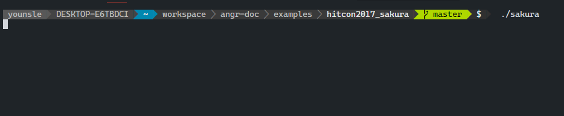

- 입력 대기중 😑

## 바이너리 정보

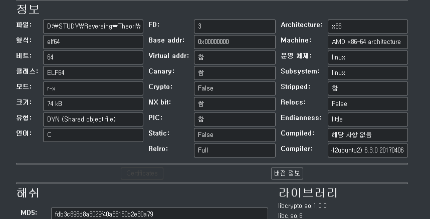

## main 함수 분석

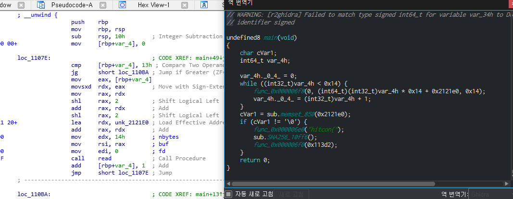

```python
Python>hex(end-fisrt)
0x18fL
Python>0x18f
399
```

- `0x14` 번 루틴을 돌면서 `read` 함수를 바탕으로 입력을 받는다. 입력을 받을시 해당 `unk_212E0` 버퍼를 사용하는데 해당 사이즈는 400바이트임을 계산할 수 있다.

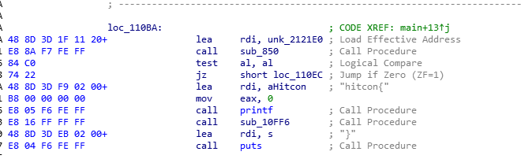

- 루틴을 돌면서 400바이트 입력을 받은후 해당 `unk_212E0` 를 인자로 하여 `sub_850` 함수를 호출한후 해당 반환 값을 0이 아닐경우 FLAG 값을 출력하는 것을 확인할 수 있다.
- 출력 중간 사이에 `sub_10FF6` 함수가 보일텐데 해당 함수는

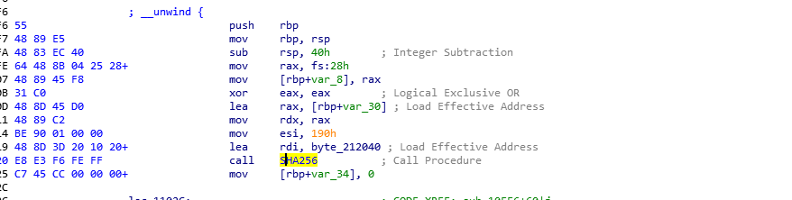

- `SHA256`으로 해쉬화 하여 출력을 한다 즉, 해당 함수는 출력을 해쉬화 하는 과정이고 우리가 알아야 할 것은 어떤 걸 해쉬화를 하는지 입력 값을 바탕으로 어떤 조건을 통해 해쉬화 가되어지는지를 알아야 한다.

## sub_850 함수 분석

**_start**

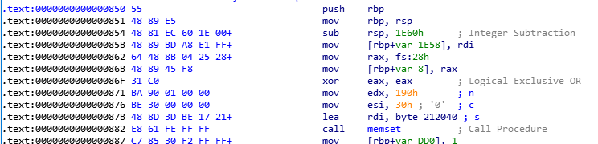

**_end**

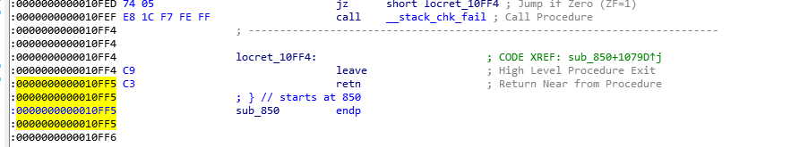

- 무려 시작과 끝의 옵셋 차이가 67493이 가 나는 함수 영역이다. ...

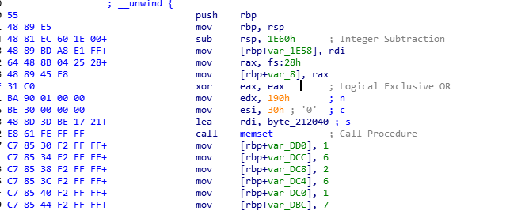
- 처음 프롤로그 부분에서 스택 영역을 `0x1E60` 만큼이나 할당해준 후 무수히 많은 변수에 값을 대입하고 있다.
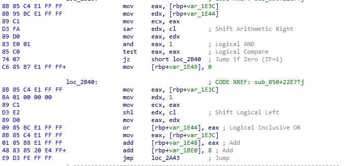

- 비슷한 구조로 한 블록에서 루프를 돌면서 비교를 한 후에 같지 않을 경우 `mov [rbp+var_1E49], 0` 과정을 하는 패턴이 계속 보이는 것을 확인할 수 있으며,
- 같을 경우 `mov [rbp+var_1E48], 0` 패턴을 진행하며 함수의 ret 까지 계속 진행한다.

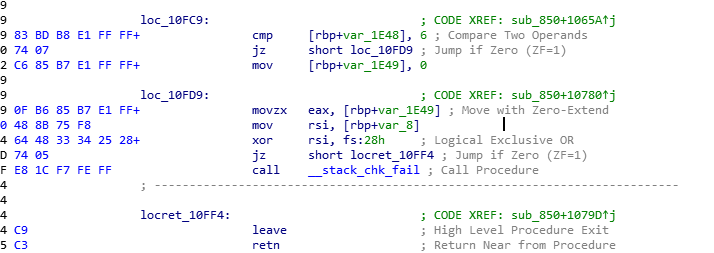

- 결과적으로 반환 되는 함수의 값을 확인해 본 결과 마찬가지로 동일한 패턴으로 되는 것을 알 수 있으며 우리는 해당 반환 값이 0이 아니라 입력 한 값을 바탕으로 해당 함수의 로직으로 생신 값이 필요하기에 `movzx eax, [rbp+var_1E49]` 조건으로 점프할 수 있는 조건이 필요하다.

# 해결 방안

## Solved Code

- 해당 문제를 풀기 위해 angr 모듈을 사용할 것이다. `sub_850` 함수의 조건을 명제 논리식으로 판단하기 위해 `Boolean SATisfiability problem` 방식으로 접근해야 한다.
- True가 될 조건은 `jz` 분기로 점프한 `mov eax, []` 부분일 것이고
- False가 될 조건은 `jz` 분기로 점프를 하지 않은 `mov [rbp+var_1E49], 0` 해당 부분이 될 것이다.
- 피해해야 할 부분의 False는 아주 고맙게도 같은 `C6 85 B7 E1 FF FF 00` 바이트이며

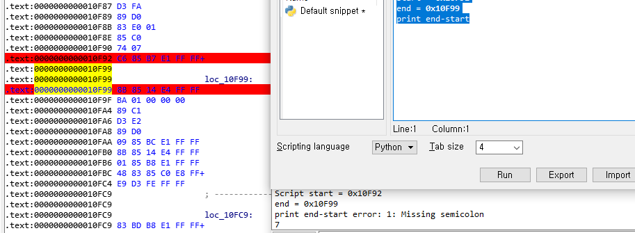

- 오프셋 차이가 `7` 차이가 나기때문에 False의 주소 + 7을 하여 True를 구해내야 하며 또한 허용해야 할 주소 값이 계산되서 나왔다면 전부 값에 넣을 것이 아니라


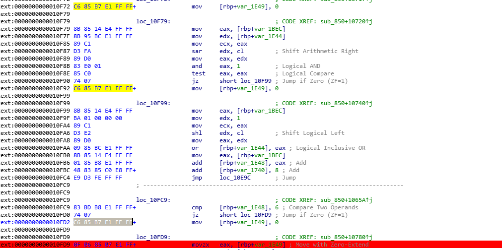

- 첫 번째 , 두 번째 조건은 건너 뛰고 세 번째 부분을 허용 값에 넣어야 한다.
- 그러면 이제 Solve 를 작성해보자

## Solved Code 1

```python
import angr
from pwn import *
PATH='./sakura'

def main():
    global PATH
		# 바이트로 읽어오도록 한다.
    data = open("./sakura", "rb").read()

    find_list = []
    avoid_list = []
    idx = 0
    cnt = 0

    while True:
				# avoid 할 패턴
        res = data.find(b"\xC6\x85\xB7\xE1\xFF\xFF\x00", idx)
        if res == -1:
            break
        # 베이스 주소는 0x100000을 하든 상관 없다.
        avoid_list.append(0x400000 + res)
        # find 조건 
        if cnt % 3 == 2:
            find_list.append(0x400000 + res + 7)
            
        cnt += 1
        idx = res + 1 # aovid 패턴의 오프셋만큼 더해가면서 다음 오프셋을 찾아낸다.

    p = angr.Project('./sakura')
    state = p.factory.entry_state()

    for find in find_list:
        sm=p.factory.simgr(state)
				# 순차적으로 find조건을 만족 하는지르 확인하기 위해 for문을 돌렸다.
				# 루프를 돌리지 않고 한번에 바로 해도 된다.
        sm.explore(find=find, avoid=avoid_list)
        state=sm.found[0]
				print(state)
        
    p=process(PATH) # 프로세스 attach
    p.send(state.posix.dumps(0)) # 출력 값을 read 함수로 보내버린다.
    flag = p.recvline() # 응답 받고 출력
    log.info(repr(flag))

if __name__ == "__main__":
    main()
```

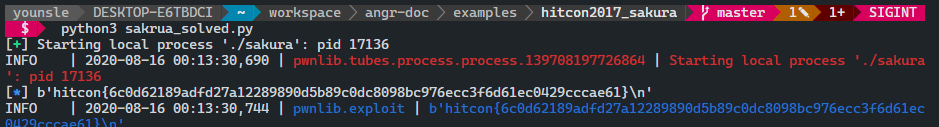


```toc
```
