### Node, Element

- 리스트의 데이터
- 각각의 노드는 데이터와 다음 노드를 가리키는 포인터를 가지고 있다.
- 처음, 끝 부분은 각자만의 `Head Node`, `Tail Node` 갖는다.
- 한 노드 바로 앞에 있는 노드는 `Predecessor Node`
- 한 노드 바로 뒤에 있는 노드는 `Successor Node`

### 연결리스트 구성

- 데이터를 연결 리스트에 삽입할 때 노드용 객체를 만든다.
- 삭제할 때 노드용 객체를 없애면 데이터 추가 삭제를 효율적으로 할 수 있다.

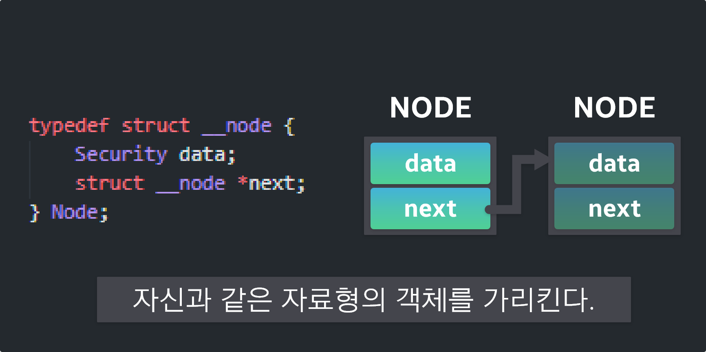

```c
// Node
typedef struct __node {
    Security data;           
    struct __node *next;    
} Node;
```

- Self-referential 형(자기 자신과 같은 자료형의 객체를 가리크는 데이터를 가지고 있는 자료구조)

```c
data : 데이터를 저장할 수 있는 멤버
next : 자기 자신과 같은 구조체를 가리키는 포인터
```

- Tail Node는 next node를 갖지 않기 때문에 next 값은 (NULL) 값을 대입한다.

### 소스 코드

```c
static Node *nodeAlloc(void) {
    return calloc(1, sizeof(Node));
}

static void nodeSet(Node *n, const Security *x, const Node *next) {
    n->data = *x;   
    n->next = (Node*)next; 
}

void Init(List *list) {
    list->head = NULL;  
    list->crnt = NULL;  
}
```

### nodeAlloc 함수

- Node 형 객체를 만들고 만든 객체의 포인터를 반환한다.

### setNode 함수

- 노드의 멤버 값을 설정
- Node형 객체의 두 멈베(data, next)의 값을 설정하는 함수
- 첫 번째 매개 변수 n으로 전달받은 포인터가 가리키는 Node 형 객체에 x가 가리키는 값을 대입
- n의 next에 세 번째 매개변수로 받은 Node 포인터의 next를 대입한다.

### Init 함수

- 연결리스트를 사용하기 전에 초기화하는 함수
- 머리 노드를 가리키는 list→head에 NULL 값을 대입하여 노드가 하나도 없는 텅 빈 연결리스트를 만든다.

```c
head(null)

head->next

heax->next->next
```

### 연결리스트 등록되어 있는 노드가 있는지 판단 하는 방법

- 처음에 초기화 하였을 경우 head는 null 값을 대입하고 있는 하나도 없는 상태이다.

```c
list->head == NULL
```

### 연결리스트 노드 1개 여부 판단 방법

- 노드가 1개 연결되어 있는 경우 변수 list→head가 가리키는 노드는 머리 노드 이다.
- 연결 리스트에는 1개의 노드만 있기 때문에 머리 노드는 리스트의 꼬리 노드이기 도 한다.
- next의 값은 널이다.
- list→head가 기리키는 노드 안의 뒤쪽 포인터 next 값이 널이기 때문에 연결리스트의 노드가 1개인지 판단하는 방법은

```c
list->head->next == NULL
```

### 연결리스트 노드 2개 여부 판단 방법

- 노드가 2개 연결된 상태인 경우 list→head가 가리키는 노드의 next는 다음 노드를 가리킨다. `list->head->next->next`
- 꼬리 노드의 next 값은 널 값을 갖고 있기 때문에 연결 리스트의 노드가 2개인지 판단할시

```c
list->head->next->next == NULL
```

### 연결리스트 머리 노드인지 판단 방법

- 자료형이 Node * 형인 변수 p는 리스트의 노드 중 하나를 가리킨다.
- 변수 p가 가리키는 노드가 연결리스트의 머리 노드인지 판단 할시

```c
p == list->head
```

### 연결리스트 꼬리 노드인지 판단 방법

- 자료형이 Ndoe *형인 변수 p는 리스트의 노드 중 하나를 가리킨다.
- 변수 p가 가리키는 노드가 연결리스트의 꼬리 노드인지 판단 할시

```c
p->next == NULL
```

### Search 함수

- Search 함수는 어떤 조건을 만족하는 노드를 검색한다.
- 반환하는 값은 찾은 노드에 대한 포인터이다.
- 만약 검색에 실패하면 널 값을 반환한다.
- 검색에 사용하는 알고리즘은 선형 검색이며 검색할 노드를 만날 때까지 머리 노드부터 스캔한다.

### Search 함수 종료 조건

```c
c1. 검색 조건을 만족하는 노드를 발견 하지 못하고 꼬리 노드를 지나가기 직전인 경우
c2. 검색 조건을 만족하는 노드를 찾은 경우
```

```c
Node *search(
	List *list,
	const data *x,
	int compare(const data *x, const data *y)
);

list - 검색 대상인 연결 리스트를 가리키는 포인터
x - 검색하는 키 값을 저장한 데이터를 가리키는 포인터
compare - 두 번째 매개 변수 x가 가리키는 객체와 연결리스트의 노드와 데이터를 비교하는 함수를
가리키는 포인터이며 해당 비교 함수는 검색에 성공하면 0을 반환
```

```c
Node *search(List *list, const data *x, int compare(const data *x, const data *y)) {
		// 1
    Node *ptr = list->head;
		//2
    while (ptr != NULL) {
				//3
        if (compare(&ptr->data, x) == 0) {
            list->crnt = ptr;
            return ptr;
        }
				//4
        ptr = ptr->next;
    }
		//5
    return NULL;
}
```

1. 검색하고 있는 노드를 가리크는 변수 ptr을 list→head로 초기화 (머리 노드)
2. ptr 값이 널이 아니면 루프를 돌며 ptr값이 널이면 검색할 노드가 없기 떄문에 while문을 빠져나와 NULL을 리턴한다.
3. 두 번째 조건인 compare 함수를 사용하여 비교를 하였을 경우 노트의 데이터 (ptr→data)와 x 가 가리키는 데이터를 comapre 함수로 비교 compare 함수는 검색에 성공하면 0을 반환하며 list→crnt에 ptr을 대입하고 찾은 노드에 대한 포인터인 ptr을 반환
4. ptr 에 ptr→next 를 대입하여 ptr이 다음 노드를 가리킬수 있도록 한다.
5. 검색 실패시 NULL 반환

### frontInsert 함수

- 연결 리스트의 머리에 노드르 삽입
- 머리 노드 다음 노드에 새로운 노드를 삽입할 시

```c
1. 삽입전에 머리 노드 에 대한 포인터를 ptr에 대입한다
2. 삽입할 노드를 nodeAlloc 함수로 할당하고 새로운 노드를 가리키도록 list->head를 업데이트한다.
3. nodeSet 함수를 호출하여 값을 설정한후 삽입한 다음 머리 노드의 다음을 새로운 노드로 업데이트
```

```c
void fronInsert(List *list, const data *x) {
    Node *ptr = list->head;
    list->head = list->crnt = nodeAlloc();
    nodeSet(list->head , x, ptr);
}
```

### rearInsert 함수

- 연결 리스트 꼬리에 노드를 삽입하는 함수
- 리스트가 비어 있는지 아닌지를 먼저 확인 (list→head == NULL) 하고 경우에 따라 다음 작업을 수행

```c
1. 리스트가 비어 있지 않은 경우
리스트 꼬리에 노드를 삽입한다.
2. 리스트가 비어 있는 경우
머리에 노드를 삽입하는 로직과 같으며 fronInsert 함수로 처리한다.
```

```c
void rearInsert(List *list, const data *x) {
    if (list->head == NULL) {
        frontInsert(list, x);
    } else {
        Node *ptr = list->head;
        while(ptr->next != NULL) {
            ptr = ptr->next;
        }
        ptr->next = list->crnt = nodeAlloc();
        nodeSet(ptr->next, x, NULL);
    }
}
```

### frontRemove 함수

- 머리 노드를 삭제하는 함수
- 리스트가 비어 있지 않은 경우 (list→head ≠ NULL)에만 삭제 실행
- 노드가 A, B, C 연결되어 있는 경우 A를 해제할 경우에 list→head 는 A노드를 가리키고 있을 것이고 B노는 list→head→next로 있을 것이다. A 가 해제될시 list→head는 B를 가리키게 하고 삭제할 A는 메모리 영역을 해제한다.
- 만약 리스트에 노드가 1개만 있어도 삭제하기 전의 머리 노드는 꼬리 노드이기 때문에 다음 노드를 가리키는 list→head→next가 널이다.
- 널은 list→head 에 대입하면 리스트는 빈 상태가 된다.

```c
void frontRemove(List *list) {
    if (list->head != NULL) {
        Node *ptr = list->head->next;  // 두 번째 노드 포인터
        free(list->head);              // 머리 노드를 해제
        list->head = list->crnt = ptr; // 새로운 머리 노드
    }
}
```

### rearRemove 함수

- 꼬리 노드를 삭제하는 함수
- 리스트에 노드가 몇 개 있는지에 따라 그 경우에 해당 하는 작업을 수행

```c
void rearRemove(List *list) {
    if (list->head != null) {
        if ((list->head)->next == NULL) {   // 노드 1개 인경우
            frontRemove(list);              // 머리 노드를 삭제
        } else {
						// while 문이 종료될시 ptr은 꼬리 노드를 가리키고 pre는 꼬리노드 두번째 노드
            Node *ptr = list->head;
            Node *pre;
            while(ptr->next != NULL) {
                pre = ptr;
                ptr = ptr->next;
            }
            pre->next = NULL;
            free(ptr);
            list->crnt = pre;
        }
    }
}
```

```c
1. 리스트에 노드가 1개 만 있을 경우
- 머리 노드를 삭제하는 것과 같다. frontRemove 함수로 처리
2. 리스트에 노드가 2개 이상 있는 경우
- 돌면서 삭제
```

### currentRemove 함수

- 현재 선택한 노드(list→crnt)가 가리키는 노드를 삭제하는 함수
- 선택한 노드가 머리 노드인자 아닌지에 따라 다음 작업 수행
1. **crnt가 머리 노드가 아닌 경우**
- 선택한 노드의 앞 노드를 찾는다. while 문은 머리 노드부터 스캔을 시작한다.
- 선택한 노드ptr의 다음 노드를 가리키는 포인터 (ptr→next) 가 (list→crnt)와 같을 때 까지 반복한다.
- while문이 종료되고 난 다음 ptr이 가리키는 노드는 해제하기 위해 선택한 노드의 앞쪽 노드가 된다.
- 삭제하기 위해 선택한 노드는 다음 노드 포인터 list→crnt→next 를 뒤쪽 노드의 다음 노드 포인터 ptr→next에 대입한다.
- 뒤쪽 노드의 다음 노드 포인터가 가리키는 노드가 선택한 노드 다음 노드로 업데이트 후 선택한 노드를 해제

2. **crnt가 머리 노드인 경우**

- 머리 노드를 삭제하면 되며 frontRemove 함수로 처리한다.

## 전체 소스 코드

### header

**LinkedList.h**

```c
#ifndef __LinkedList
#define __LinkedList
#include "Security.h"

// Node
typedef struct __node {
    Security data;           
    struct __node *next;    
} Node;

typedef struct {
    Node *head;   
    Node *crnt;   
} List;

void Init(List *list);

Node *search(List *list, const Security *x, int compare(const Security *x, const Security *y));

void frontInsert(List *list, const Security *x);

void rearInsert(List *list, const Security *x);

void frontRemove(List *list);

void rearRemove(List *list);

void currentRemove(List *list);

void clearAllList(List *list);

void currentPrint(const List *list);

void currentPrintLn(const List *list);

void Print(const List *list);

void Terminate(List *list);
#endif
```

**Security.h**

```c
#ifndef ___Security
#define ___Security

typedef struct
{
    int no;        
    char name[20]; 
} Security;

#define Security_NAME 2 
#define Security_NO 1 

int SecurityNoCmp(const Security *x, const Security *y);

int SecurityNameCmp(const Security *x, const Security *y);

void PrintSecurity(const Security *x);

void PrintLnSecurity(const Security *x);

Security ScanSecurity(const char *message, int sw);
#endif
```

### src

**LinkedList.c**

```c
#include <stdio.h>
#include <stdlib.h>
#include "Security.h"
#include "LinkedList.h"

static Node *nodeAlloc(void) {
    return calloc(1, sizeof(Node));
}

static void nodeSet(Node *n, const Security *x, const Node *next) {
    n->data = *x;   
    n->next = (Node*)next; 
}

void Init(List *list) {
    list->head = NULL;  
    list->crnt = NULL;  
}

Node *search(List *list, const Security *x, int compare(const Security *x, const Security *y)) {
    Node *ptr = list->head;
    while (ptr != NULL) {
        if (compare(&ptr->data, x) == 0) {
            list->crnt = ptr;
            return ptr;
        }
        ptr = ptr->next;
    }
    return NULL;
}

void frontInsert(List *list, const Security *x) {
    Node *ptr = list->head;
    list->head = list->crnt = nodeAlloc();
    nodeSet(list->head , x, ptr);
}
void rearInsert(List *list, const Security *x) {
    if (list->head == NULL) {
        frontInsert(list, x);
    } else {
        Node *ptr = list->head;
        while(ptr->next != NULL) {
            ptr = ptr->next;
        }
        ptr->next = list->crnt = nodeAlloc();
        nodeSet(ptr->next, x, NULL);
    }
}

void frontRemove(List *list) {
    if (list->head != NULL) {
        Node *ptr = list->head->next;
        free(list->head);
        list->head = list->crnt = ptr;
    }
}
void rearRemove(List *list) {
    if (list->head != NULL) {
        if ((list->head)->next == NULL) {
            frontRemove(list);
        } else {
            Node *ptr = list->head;
            Node *pre;
            while(ptr->next != NULL) {
                pre = ptr;
                ptr = ptr->next;
            }
            pre->next = NULL;
            free(ptr);
            list->crnt = pre;
        }
    }
}
void currentRemove(List *list) {
    if (list->head != NULL) {
        if (list->crnt == list->head) {
            frontRemove(list);
        } else {
            Node *ptr = list->head;
            while(ptr->next != list->crnt) {
                ptr = ptr->next;
            }
            ptr->next = list->crnt->next;
            free(list->crnt);
            list->crnt = ptr;
        }
    }
}
void clearAllList(List *list) {
    while(list->head != NULL) {
        frontRemove(list);
    }
    list->crnt = NULL;
}
void currentPrint(const List *list) {
    if (list->crnt == NULL) {
        printf("선택된 노드가 없습니다.\n");
    } else {
        PrintLnSecurity(&list->crnt->data);
    }
}
void currentPrintLn(const List *list) {
    currentPrint(list);
    putchar('\n');
}

void Print(const List *list) {
    if (list->head == NULL) {
        puts("노드가 없다.");
    } else {
        Node *ptr = list->head;
        puts("[전체 노드 확인]");
        while (ptr != NULL) {
            PrintLnSecurity(&ptr->data);
            ptr = ptr->next;
        }
    }
}
void Terminate(List *list) {
    clearAllList(list);
}
```

**Security.c**

```c
#include <stdio.h>
#include <string.h>
#include "Security.h"

int SecurityNoCmp(const Security *x, const Security *y)
{
    return x->no < y->no ? -1 : x->no > y->no ? 1 : 0;
}

int SecurityNameCmp(const Security *x, const Security *y)
{
    return strcmp(x->name, y->name);
}

void PrintSecurity(const Security *x)
{
    printf("%d %s", x->no, x->name);
}

void PrintLnSecurity(const Security *x)
{
    printf("%d %s\n", x->no, x->name);
}

Security ScanSecurity(const char *message, int sw)
{
    Security temp;
    printf("%s하는 보안 코드를 입력하세요.\n", message);
    if (sw & Security_NO)
    {
        printf("번호 : ");
        scanf("%d", &temp.no);
    }
    if (sw & Security_NAME)
    {
        printf("이름 : ");
        scanf("%s", temp.name);
    }
    return temp;
}
```

**main.c**

```c
#include <stdio.h>
#include "Security.h"
#include "LinkedList.h"

/*Menu*/
typedef enum
{
    TERMINATE,
    INS_FRONT,
    INS_REAR,
    RMV_FRONT,
    RMV_REAR,
    PRINT_CRNT,
    RMV_CRNT,
    SRCH_NO,
    SRCH_NAME,
    PRINT_ALL,
    CLEAR,
} Menu;

/*Menu select*/
Menu SelectMenu(void)
{
    int i, ch;
    char *mstring[] = {
        "머리에 노드를 삽입",
        "꼬리에 노드를 삽입",
        "머리 노드를 삭제",
        "꼬리 노드를 삭제",
        "선택한 노드를 출력",
        "선택한 노드를 삭제",
        "번호로 검색",
        "이름으로 검색",
        "모든 노드를 출력",
        "모든 노드를 삭제",
    };
    do
    {
        for (i = TERMINATE; i < CLEAR; i++) 
        {
            printf("(%2d) %-40s ", i + 1, mstring[i]);
            if ((i % 3) == 2)
                putchar('\n');
        }
        printf("(0) 종료 : ");
        scanf("%d", &ch);
    } while (ch < TERMINATE || ch > CLEAR);
    return (Menu)ch;
}

/*Main*/
int main(void)
{
    Menu menu;
    List list;
    Init(&list); 

    do
    {
        Security x;

        switch (menu = SelectMenu())
        {
        case INS_FRONT:
            x = ScanSecurity("머리에 삽입", Security_NO | Security_NAME);
            frontInsert(&list, &x);
            break;

        case INS_REAR:
            x = ScanSecurity("꼬리에 삽입", Security_NO | Security_NAME);
            rearInsert(&list, &x);
            break;

        case RMV_FRONT:
            frontRemove(&list);
            break;

        case RMV_REAR:
            rearRemove(&list);
            break;

        case PRINT_CRNT:
            currentPrint(&list);
            break;

        case RMV_CRNT:
            currentRemove(&list);
            break;

        case SRCH_NO:
            x = ScanSecurity("검색", Security_NO);
            if (search(&list, &x, SecurityNoCmp) != NULL)
                currentPrintLn(&list);
            else
                puts("그 번호의 데이터가 없다.");
            break;

        case SRCH_NAME:
            x = ScanSecurity("검색", Security_NAME);
            if (search(&list, &x, SecurityNoCmp) != NULL)
                currentPrintLn(&list);
            else
                puts("그 이름의 데이터가 없다.");

            break;

        case PRINT_ALL:
            Print(&list);
            break;

        case CLEAR:
            clearAllList(&list);
            break;
        default:
            break;
        }
    } while (menu != TERMINATE);
    Terminate(&list); /*연결리스트 종료*/

    return 0;
}
```

### build MAKEFILE

```c
LinkedList
	- include
		- LinkedList.h
		- Security.h
	- src
		- LinkedList
			- LinkedList.c
			- Security.c
		- main.c
	- Makefile
```

```c
LINKEDLISTPATH = LinkedList/
LINKEDLISTFILES = LinkedList.c Security.c
LINKEDLIST = $(addprefix $(LINKEDLISTPATH), $(LINKEDLISTFILES))

SRCPATH = ./src/
SRCFILES = main.c $(LINKEDLIST)
SRCS = $(addprefix $(SRCPATH), $(SRCFILES))

OBJECTS = $(SRCS:.c=.o)

INC = -I./include/

CC = gcc
CFLAGS = -Wall -Werror -Wextra $(INC)

NAME = main
RM = rm -fr

.c .o :
		$(CC) $(CFLAGS) -c

all : $(NAME)

$(NAME) : $(OBJECTS)
		$(CC) $(CFLAGS) $(OBJECTS) -o $(NAME)
		@make clean

clean :
		$(RM) $(OBJECTS) core

fclean : clean
		$(RM) $(NAME)

re : fclean all

.PHONY : re fclean clean all
```

# Intel arch disassembly

### nodeAlloc function

```c
static Node *nodeAlloc(void) {
    return calloc(1, sizeof(Node));
}

Dump of assembler code for function nodeAlloc:
   0x00005555555555ff <+0>:     endbr64 
   0x0000555555555603 <+4>:     push   rbp
   0x0000555555555604 <+5>:     mov    rbp,rsp
   0x0000555555555607 <+8>:     mov    esi,0x20
   0x000055555555560c <+13>:    mov    edi,0x1
   0x0000555555555611 <+18>:    call   0x555555555110 <calloc@plt>
   0x0000555555555616 <+23>:    pop    rbp
   0x0000555555555617 <+24>:    ret
```

- nodeAlloc function은 Node 구조체 size 만큼 메모리를 할당한후 반환하는 구조이다 보니 해당 로직을 바탕으로 Node 구조체 정의를 분석해보자

### **pseudo C Code**

```c
__int64 nodeAlloc()
{
  __asm { endbr64 }
  return calloc(1LL, 32LL);
}
```

### Node Struct IDA

*Struct menu*

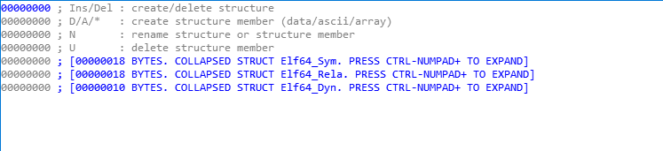

- 구조체가 정의 되어 있지 않아 분석시 불편하기에 구조체 생성을 해보도록 하겠다.
- IDA내에서 구조체 탭을 선택한후 `Insert` 키를 눌러 이름을 선택한후 구조체를 추가한다.

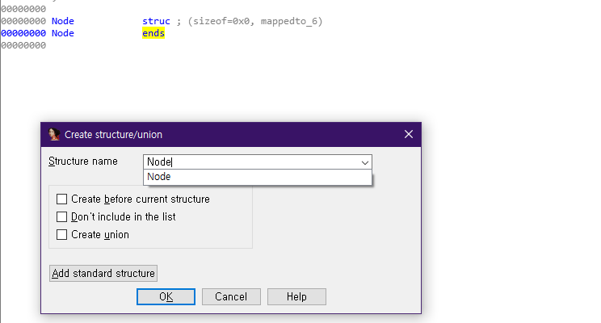
- `ends` 를 클릭한후 `d` key를 눌러 멤버를 추가한다.

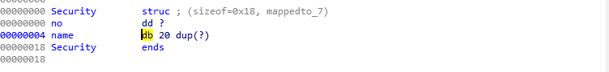

- 먼저 Security 구조체를 정의 해보자
- 앞에서 말한거와 동일하게 해당 구조체 멤버를 추가한후 오른쪽 데이터 타입을 클릭한후 d 를 누르면 타입 변경이 가능하다.
- 또한 멤버 이름을 클릭한후 `n` key를 눌러 이름을 변경한다.
- name 멤버는 20바이트의 배열이기 때문에 byte로 설정한후 `*` key를 눌러 20바이트 설정을 마친다.

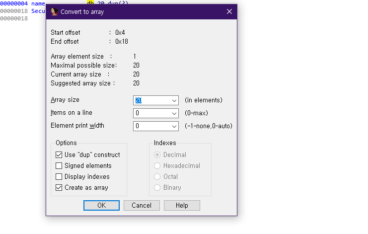
### Struct 정의

```c
// Node
typedef struct __node {
    Security data;           
    struct __node *next;    
} Node;

typedef struct {
    Node *head;   
    Node *crnt;   
} List;

// Security.h
typedef struct
{
    int no;        
    char name[20]; 
} Security;
```

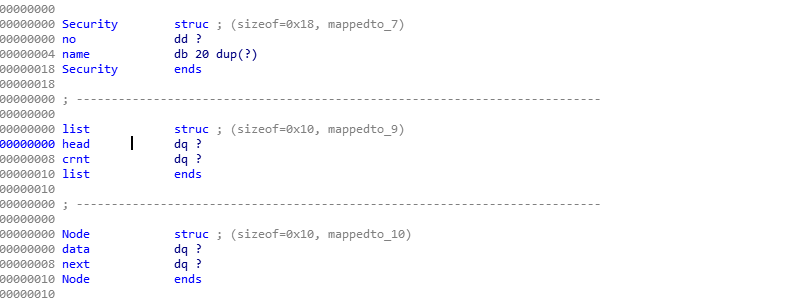

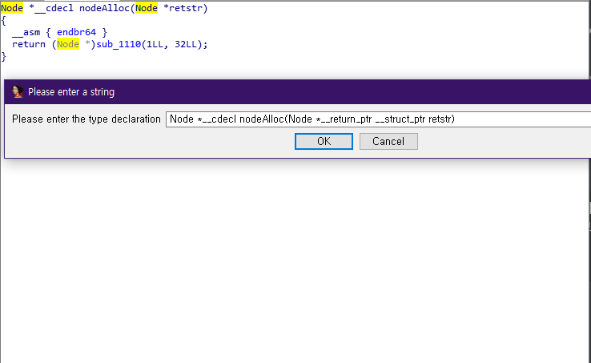
- `Y` key를 눌러 구조체 데이터 타입을 지정한 타입으로 변경하여 데이터 타입을 변경한다.

### nodeSet function

```c
static void nodeSet(Node *n, const Security *x, const Node *next) {
    n->data = *x;   
    n->next = (Node*)next; 
}

Dump of assembler code for function nodeSet:
   0x0000555555555618 <+0>:     endbr64 
   0x000055555555561c <+4>:     push   rbp
   0x000055555555561d <+5>:     mov    rbp,rsp
   0x0000555555555620 <+8>:     mov    QWORD PTR [rbp-0x8],rdi
   0x0000555555555624 <+12>:    mov    QWORD PTR [rbp-0x10],rsi
   0x0000555555555628 <+16>:    mov    QWORD PTR [rbp-0x18],rdx
   0x000055555555562c <+20>:    mov    rcx,QWORD PTR [rbp-0x8]
   0x0000555555555630 <+24>:    mov    rsi,QWORD PTR [rbp-0x10]
   0x0000555555555634 <+28>:    mov    rax,QWORD PTR [rsi]
   0x0000555555555637 <+31>:    mov    rdx,QWORD PTR [rsi+0x8]
   0x000055555555563b <+35>:    mov    QWORD PTR [rcx],rax
   0x000055555555563e <+38>:    mov    QWORD PTR [rcx+0x8],rdx
   0x0000555555555642 <+42>:    mov    rax,QWORD PTR [rsi+0x10]
   0x0000555555555646 <+46>:    mov    QWORD PTR [rcx+0x10],rax
   0x000055555555564a <+50>:    mov    rax,QWORD PTR [rbp-0x8]
   0x000055555555564e <+54>:    mov    rdx,QWORD PTR [rbp-0x18]
   0x0000555555555652 <+58>:    mov    QWORD PTR [rax+0x18],rdx
   0x0000555555555656 <+62>:    nop
   0x0000555555555657 <+63>:    pop    rbp
   0x0000555555555658 <+64>:    ret
```

- 호출전 3개의 인자 Node 구조체, Security 구조체,다음 노드의 구조체 를 전달받아 스택상에 8바이트 차이로 0x8~0x18 공간에 대입 하는 것을 확인할 수 있다.

```c
   0x0000555555555630 <+24>:    mov    rsi,QWORD PTR [rbp-0x10]
   0x0000555555555634 <+28>:    mov    rax,QWORD PTR [rsi]
   0x0000555555555637 <+31>:    mov    rdx,QWORD PTR [rsi+0x8]
   0x000055555555563b <+35>:    mov    QWORD PTR [rcx],rax
```

- Security 구조체 타입의 데이터를 해당 스택 공간에 할당하고 `[rsi]` 역참조하여 rax 레지스터에 대입한후 해당 값을 `n->data` = *x 해당 구조로 대입하는 것을 확인할 수 있다.

### pseudo C Code

```c
void __fastcall nodeSet(Node *a1, Security *a2, Node *a3)
{
  Node *node; // rcx
  Security *x; // rsi
  __int64 v5; // rdx
  __int64 v6; // [rsp-8h] [rbp-8h]

  __asm { endbr64 }
  *(&v6 - 1) = (__int64)a1;
  *(&v6 - 2) = (__int64)a2;
  *(&v6 - 3) = (__int64)a3;
  node = (Node *)*(&v6 - 1);
  x = (Security *)*(&v6 - 2);
  v5 = *(_QWORD *)&x->name[4];
  node->data = *(_QWORD *)&x->no;
  node->next = v5;
  node[1].data = *(_QWORD *)&x->name[12];
  *(_QWORD *)(*(&v6 - 1) + 24) = *(&v6 - 3);
}
```

### Init function
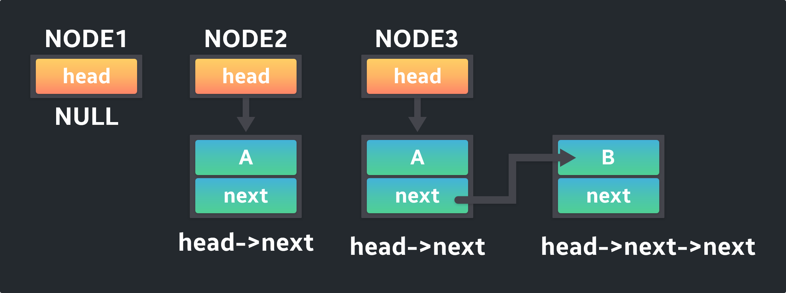

```c
//c 
void Init(List *list) {
    list->head = NULL;  
    list->crnt = NULL;  
}

Dump of assembler code for function Init:
=> 0x0000555555555659 <+0>:     endbr64 
   0x000055555555565d <+4>:     push   rbp
   0x000055555555565e <+5>:     mov    rbp,rsp
   0x0000555555555661 <+8>:     mov    QWORD PTR [rbp-0x8],rdi
   0x0000555555555665 <+12>:    mov    rax,QWORD PTR [rbp-0x8]
   0x0000555555555669 <+16>:    mov    QWORD PTR [rax],0x0
   0x0000555555555670 <+23>:    mov    rax,QWORD PTR [rbp-0x8]
   0x0000555555555674 <+27>:    mov    QWORD PTR [rax+0x8],0x0
   0x000055555555567c <+35>:    nop
   0x000055555555567d <+36>:    pop    rbp
   0x000055555555567e <+37>:    ret
```

- main에서 인자로 받아온 `list` 구조체를 해당 NULL 값으로 세팅해주는 것을 확인할 수 있다.
- 두 멤버는 각 포인터 타입으로 0x8 바이트 차이가 난다.

### pseudo C Code

```c
void __fastcall Init(list *a1)
{
  list *list; // [rsp-8h] [rbp-8h]

  __asm { endbr64 }
  *(&list - 1) = a1;
  (*(&list - 1))->head = 0LL;
  (*(&list - 1))->crnt = 0LL;
}
```

### frontInsert function
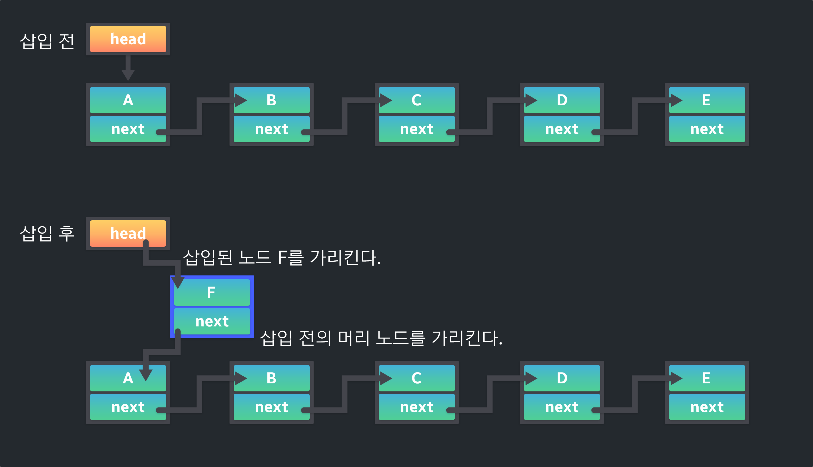
```c
void frontInsert(List *list, const Security *x) {
    Node *ptr = list->head;
    list->head = list->crnt = nodeAlloc();
    nodeSet(list->head , x, ptr);
}

Dump of assembler code for function frontInsert:
   0x00005555555556e8 <+0>:     endbr64 
   0x00005555555556ec <+4>:     push   rbp
   0x00005555555556ed <+5>:     mov    rbp,rsp
   0x00005555555556f0 <+8>:     sub    rsp,0x20
   0x00005555555556f4 <+12>:    mov    QWORD PTR [rbp-0x18],rdi
   0x00005555555556f8 <+16>:    mov    QWORD PTR [rbp-0x20],rsi
   0x00005555555556fc <+20>:    mov    rax,QWORD PTR [rbp-0x18]
   0x0000555555555700 <+24>:    mov    rax,QWORD PTR [rax]
   0x0000555555555703 <+27>:    mov    QWORD PTR [rbp-0x8],rax
   0x0000555555555707 <+31>:    call   0x5555555555ff <nodeAlloc>
   0x000055555555570c <+36>:    mov    rdx,QWORD PTR [rbp-0x18]
   0x0000555555555710 <+40>:    mov    QWORD PTR [rdx+0x8],rax
   0x0000555555555714 <+44>:    mov    rax,QWORD PTR [rbp-0x18]
   0x0000555555555718 <+48>:    mov    rdx,QWORD PTR [rax+0x8]
   0x000055555555571c <+52>:    mov    rax,QWORD PTR [rbp-0x18]
   0x0000555555555720 <+56>:    mov    QWORD PTR [rax],rdx
   0x0000555555555723 <+59>:    mov    rax,QWORD PTR [rbp-0x18]
   0x0000555555555727 <+63>:    mov    rax,QWORD PTR [rax]
   0x000055555555572a <+66>:    mov    rdx,QWORD PTR [rbp-0x8]
   0x000055555555572e <+70>:    mov    rcx,QWORD PTR [rbp-0x20]
   0x0000555555555732 <+74>:    mov    rsi,rcx
   0x0000555555555735 <+77>:    mov    rdi,rax
   0x0000555555555738 <+80>:    call   0x555555555618 <nodeSet>
   0x000055555555573d <+85>:    nop
   0x000055555555573e <+86>:    leave  
   0x000055555555573f <+87>:    ret
```

```c
0x0000555555555414 in main ()
(gdb) 
머리에 삽입하는 보안 코드를 입력하세요.
번호 : 10
이름 : AAAAAAAA

[----------------------------------registers-----------------------------------]
RAX: 0x7fffffffd9e0 --> 0x0 
RBX: 0x555555555c40 (<__libc_csu_init>: endbr64)
RCX: 0x7fffffffd9b0 --> 0x414141410000000a ('\n')
RDX: 0x7fffffffd9f0 --> 0x414141410000000a ('\n')
RSI: 0x7fffffffd9f0 --> 0x414141410000000a ('\n')
RDI: 0x7fffffffd9e0 --> 0x0 
RBP: 0x7fffffffda10 --> 0x0 
RSP: 0x7fffffffd9b0 --> 0x414141410000000a ('\n')
RIP: 0x55555555543f (<main+199>:        call   0x5555555556e8 <frontInsert>)
R8 : 0xa ('\n')
R9 : 0x9 ('\t')
R10: 0x55555555626b --> 0x31b010000007325 
R11: 0x246 
R12: 0x555555555140 (<_start>:  endbr64)
R13: 0x7fffffffdb00 --> 0x1 
R14: 0x0 
R15: 0x0
EFLAGS: 0x246 (carry PARITY adjust ZERO sign trap INTERRUPT direction overflow)
[-------------------------------------code-------------------------------------]

```

- 머리 노드에 insert 할시 해당 인자를 확인한 결과 첫 번째 rsi 레지스터에 list 구조체 첫 번째 주소 값과, Security 구조체의 첫 번째 주소 값을 확인할 수 있으며 해당 데이터를 입력한 결과를 `0x7fffffffd9f0` 에 존재한 것을 확인할 수 있다.

```c
0x5555555556fc <frontInsert+20>:     mov    rax,QWORD PTR [rbp-0x18]
   0x555555555700 <frontInsert+24>:     mov    rax,QWORD PTR [rax]
   0x555555555703 <frontInsert+27>:     mov    QWORD PTR [rbp-0x8],rax
=> 0x555555555707 <frontInsert+31>:     call   0x5555555555ff <nodeAlloc>
   0x55555555570c <frontInsert+36>:     mov    rdx,QWORD PTR [rbp-0x18]
   0x555555555710 <frontInsert+40>:     mov    QWORD PTR [rdx+0x8],rax
   0x555555555714 <frontInsert+44>:     mov    rax,QWORD PTR [rbp-0x18]
   0x555555555718 <frontInsert+48>:     mov    rdx,QWORD PTR [rax+0x8]
```

- nodeAlloc 함수를 호출하여 새로운 노드를 머리 부분에 추가한 것을 확인할 수 있다

```c
gdb-peda$ parseheap
addr                prev                size                 status              fd                bk                
0x555555559000      0x0                 0x290                Used                None              None
0x555555559290      0x0                 0x410                Used                None              None
0x5555555596a0      0x0                 0x410                Used                None              None
↓↓↓↓↓↓
gdb-peda$ parseheap
addr                prev                size                 status              fd                bk                
0x555555559000      0x0                 0x290                Used                None              None
0x555555559290      0x0                 0x410                Used                None              None
0x5555555596a0      0x0                 0x410                Used                None              None
0x555555559ab0      0x0                 0x30                 Used                None              None
```

```c
0x55555555572e <frontInsert+70>:     mov    rcx,QWORD PTR [rbp-0x20]
   0x555555555732 <frontInsert+74>:     mov    rsi,rcx
   0x555555555735 <frontInsert+77>:     mov    rdi,rax
=> 0x555555555738 <frontInsert+80>:     call   0x555555555618 <nodeSet>
   0x55555555573d <frontInsert+85>:     nop
   0x55555555573e <frontInsert+86>:     leave  
   0x55555555573f <frontInsert+87>:     ret    
   0x555555555740 <rearInsert>: endbr64
Guessed arguments:
arg[0]: 0x555555559ac0 --> 0x0 
arg[1]: 0x7fffffffd9f0 --> 0x414141410000000a ('\n')
arg[2]: 0x0 
arg[3]: 0x7fffffffd9f0 --> 0x414141410000000a ('\n')
```

- nodeSet 함수를 바탕으로 입력한 data 를 세팅한다. 첫 번째 인자 list 구조체의 head 멤버 주소 값과 두 번째 인자 는 Security 구조체의 data 즉 입력한 값들 세 번째 인자는 새롭게 할당 받은 영역임을 확인할 수 있다.

```c
gdb-peda$ x/10gx 0x555555559ab0
0x555555559ab0: 0x0000000000000000      0x0000000000000031
0x555555559ac0: 0x414141410000000a      0x0000004141414141
0x555555559ad0: 0x0000000000000000      0x0000000000000000
0x555555559ae0: 0x0000000000000000      0x0000000000020521
0x555555559af0: 0x0000000000000000      0x0000000000000000
```

- 힙 영역에 size 구간을 지나 data 영역 에 값이 추가가 도니 것을 확인할 수 있다. 이처럼 첫 노드가 추가 될 때 list 구조체를 지나 `list->head` = NEW memory 로 추가가 된다.

### rearInsert function
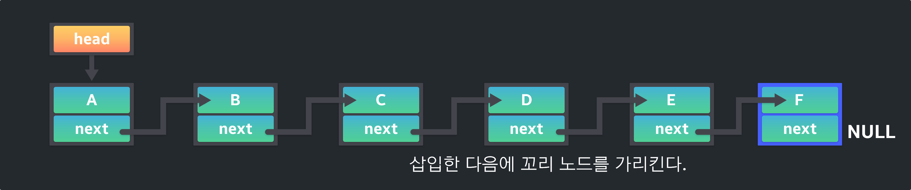

- 추가로 꼬리 부분에 노드를 추가할 경우를 따졌을 때

```c
0x55555555547d <main+261>:   lea    rax,[rbp-0x30]
   0x555555555481 <main+265>:   mov    rsi,rdx
   0x555555555484 <main+268>:   mov    rdi,rax
=> 0x555555555487 <main+271>:   call   0x555555555740 <rearInsert>
   0x55555555548c <main+276>:   jmp    0x5555555555ce <main+598>
   0x555555555491 <main+281>:   lea    rax,[rbp-0x30]
   0x555555555495 <main+285>:   mov    rdi,rax
   0x555555555498 <main+288>:   call   0x5555555557d7 <frontRemove>
Guessed arguments:
arg[0]: 0x7fffffffd9e0 --> 0x555555559ac0 --> 0x414141410000000a ('\n')
arg[1]: 0x7fffffffd9f0 --> 0x4242424200000014 
arg[2]: 0x7fffffffd9f0 --> 0x4242424200000014
```

- 인자로 첫 번째 인자인 list 구조체의 주소이며 앞에서 데이터를 추가하였기에 현재 `list→head` 값이 들어가 있는 것을 확인할 수 있다.
- 두 번째 인자는 추가할려는 데이터이다.

```c
0x0000555555555758 <+24>:    mov    rax,QWORD PTR [rax]
=> 0x000055555555575b <+27>:    test   rax,rax
   0x000055555555575e <+30>:    jne    0x555555555775 <rearInsert+53>
   0x0000555555555760 <+32>:    mov    rdx,QWORD PTR [rbp-0x20]
   0x0000555555555764 <+36>:    mov    rax,QWORD PTR [rbp-0x18]
   0x0000555555555768 <+40>:    mov    rsi,rdx
   0x000055555555576b <+43>:    mov    rdi,rax
   0x000055555555576e <+46>:    call   0x5555555556e8 <frontInsert>
```

- list→head 의 데이터를 확인하여 해당 값이 NULL 일 경우 노드가 없다 판단하여 frontInsert 함수를 호출할 수 있는 로직 부분이다.

```c
0x0000555555555780 <+64>:    jmp    0x55555555578e <rearInsert+78>
   0x0000555555555782 <+66>:    mov    rax,QWORD PTR [rbp-0x8]
   0x0000555555555786 <+70>:    mov    rax,QWORD PTR [rax+0x18]
   0x000055555555578a <+74>:    mov    QWORD PTR [rbp-0x8],rax
   0x000055555555578e <+78>:    mov    rax,QWORD PTR [rbp-0x8]
   0x0000555555555792 <+82>:    mov    rax,QWORD PTR [rax+0x18]
   0x0000555555555796 <+86>:    test   rax,rax
   0x0000555555555799 <+89>:    jne    0x555555555782 <rearInsert+66>
   0x000055555555579b <+91>:    call   0x5555555555ff <nodeAlloc>
```

- list→head 의 데이터가 존재할 경우 즉 노드가 1라도 있다면 loop을 돌면서 마찬가지로 next 멤버가 NULL 값 여부에 따라 끝을 찾은 후 할당하고 설정한다.

```c
gdb-peda$ parseheap
addr                prev                size                 status              fd                bk                
0x555555559000      0x0                 0x290                Used                None              None
0x555555559290      0x0                 0x410                Used                None              None
0x5555555596a0      0x0                 0x410                Used                None              None
0x555555559ab0      0x0                 0x30                 Used                None              None
0x555555559ae0      0x0                 0x30                 Used                None              None
gdb-peda$ x/30gx 0x555555559ab0
0x555555559ab0: 0x0000000000000000      0x0000000000000031
0x555555559ac0: 0x414141410000000a      0x0000004141414141
0x555555559ad0: 0x0000000000000000      0x0000555555559af0
0x555555559ae0: 0x0000000000000000      0x0000000000000031
0x555555559af0: 0x4242424200000014      0x0000550042424242
0x555555559b00: 0x0000000000000000      0x0000000000000000
0x555555559b10: 0x0000000000000000      0x00000000000204f1
```

- 데이터가 추가가 되어 힙 청크가 하나가 추가가로 생긴것을 확인할 수 있다. 현재 두 개의 노드가 활동중이다.

### rearRemove function
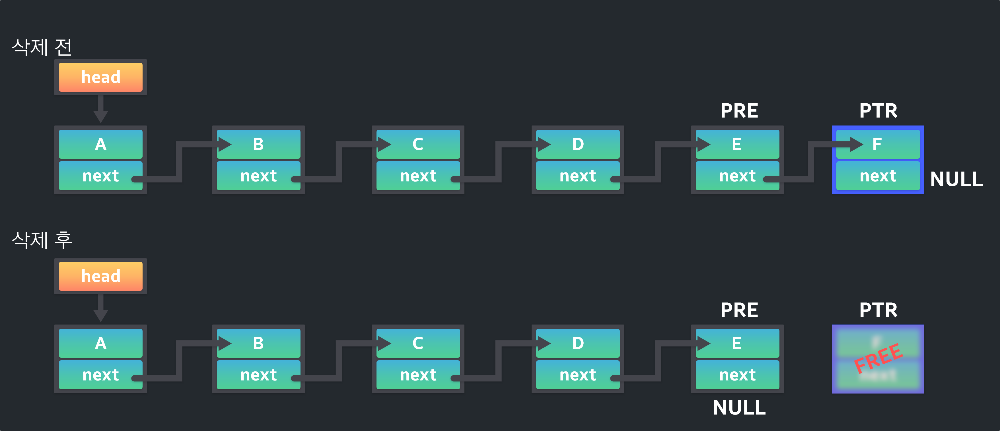

```c
[-------------------------------------code-------------------------------------]
   0x55555555549d <main+293>:   jmp    0x5555555555ce <main+598>
   0x5555555554a2 <main+298>:   lea    rax,[rbp-0x30]
   0x5555555554a6 <main+302>:   mov    rdi,rax
=> 0x5555555554a9 <main+305>:   call   0x55555555582f <rearRemove>
   0x5555555554ae <main+310>:   jmp    0x5555555555ce <main+598>
   0x5555555554b3 <main+315>:   lea    rax,[rbp-0x30]
   0x5555555554b7 <main+319>:   mov    rdi,rax
   0x5555555554ba <main+322>:   call   0x55555555599a <currentPrint>
Guessed arguments:
arg[0]: 0x7fffffffd9e0 --> 0x555555559ac0 --> 0x414141410000000a ('\n')
```

- 꼬리 노드를 삭제할 경우 해당 함수에서는 list 구조체의 주소 값을 인자로 사용하여 호출하는 것을 확인할 수 있다.

```c
0x0000555555555846 <+23>:    test   rax,rax
   0x0000555555555849 <+26>:    je     0x5555555558bb <rearRemove+140>
   0x000055555555584b <+28>:    mov    rax,QWORD PTR [rbp-0x18]
   0x000055555555584f <+32>:    mov    rax,QWORD PTR [rax]
   0x0000555555555852 <+35>:    mov    rax,QWORD PTR [rax+0x18]
   0x0000555555555856 <+39>:    test   rax,rax
   0x0000555555555859 <+42>:    jne    0x555555555869 <rearRemove+58>
   0x000055555555585b <+44>:    mov    rax,QWORD PTR [rbp-0x18]
   0x000055555555585f <+48>:    mov    rdi,rax
   0x0000555555555862 <+51>:    call   0x5555555557d7 <frontRemove>
```

- 두번의 조건을 거치는 것을 확인할 수 있다. 첫 번째 조건에서 list→head 가 NULL 이 아닐 경우에 따라서 두 번째 조건으로 넘어간다.
- list→head→next 가 NULL 값 일경우 꼬리이기 때문에 fronRemove 함수를 호출하여 노드를 바로 해제 할 수 있도록 하였다.
- 꼬리를 찾을 때까지 반복하면서 찾는 과정이며 이때 list→head 에 대한 변수를 하나 생성, 이전 노드의 주소 값을 갖는 변수 두개를 선언하여 반복을 돈다.
- 꼬리를 찾을 경우 이전 노드의 next 멤버에 null을 대입한후 현재 노드를 해제하여 노드를 삭제하는 과정을 거친다.

```c
addr                prev                size                 status              fd                bk                
0x555555559000      0x0                 0x290                Used                None              None
0x555555559290      0x0                 0x410                Used                None              None
0x5555555596a0      0x0                 0x410                Used                None              None
0x555555559ab0      0x0                 0x30                 Used                None              None
0x555555559ae0      0x0                 0x30                 Freed                0x0              None
gdb-peda$ heapinfoall

(0x20)     fastbin[0]: 0x0
(0x30)     fastbin[1]: 0x0
(0x40)     fastbin[2]: 0x0
(0x50)     fastbin[3]: 0x0
(0x60)     fastbin[4]: 0x0
(0x70)     fastbin[5]: 0x0
(0x80)     fastbin[6]: 0x0
(0x90)     fastbin[7]: 0x0
(0xa0)     fastbin[8]: 0x0
(0xb0)     fastbin[9]: 0x0
                  top: 0x555555559b10 (size : 0x204f0) 
       last_remainder: 0x0 (size : 0x0) 
            unsortbin: 0x0
(0x30)   tcache_entry[1](1): 0x555555559af0
```

- 힙을 해제하여 해당 데이터가 tcache 에 맞는 size여서 tcache freelist에 참조가 된것을 확인할 수 있다.

```toc
```