# MetaVersPloit

# Vulnerability analysis of commercial metaverse-based virtual office platform

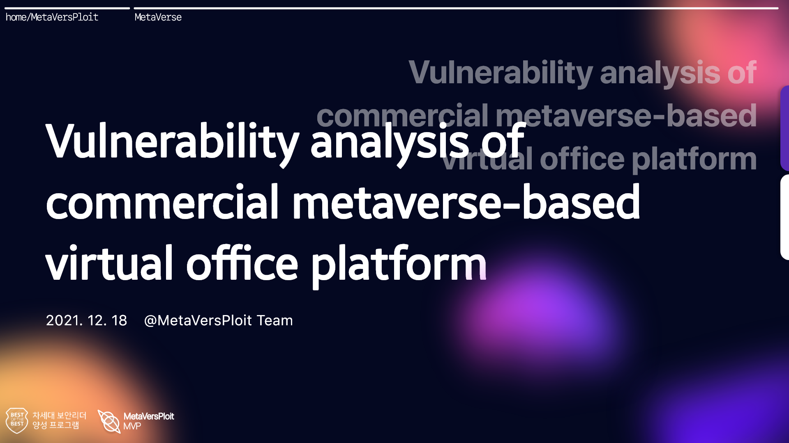

# Author

<aside>
💡 Best of the Best 10기 취약점 분석 트랙 MetaVersPloit(이하 MVP) 팀

</aside>

- 김재기 멘토 (주), 정광운 멘토 (부)
- 강우원 PL
- 김영운 PM, 김두영, 김용식, 안희성, 조준희, 전예찬

# Goal 🚀

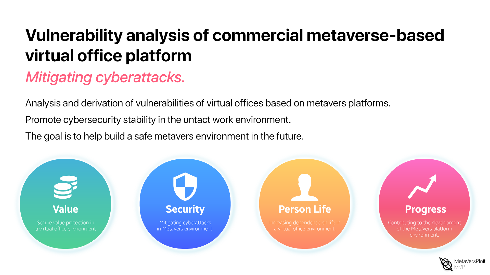

 근 미래 메타버스는 현재의 모바일 시장을 넘어서 시공간 제약 없이 사용할 수 있어 기업, 민간, 정부 등 다양한 인프라가 구축되어 인간과 밀접한 관계성이 생성되기 때문에 물리적인 위협이 아닌 보안에 대한 위협이 증가하게 되어 안정성이 떨어질 수 있습니다.

 이번 프로젝트의 목적은 메타버스 플랫폼의 급격한 성장 속에 파고드는 보안 위협을 새싹부터 자르기 위해 메타버스 기반 가상오피스 플랫폼 서비스를 시작하는 스타트 업부터 시작해서 현재 Meta 회사 사명을 바꾼 Facebook의 Horizon 취약점 연구를 진행하였습니다.

 

 메타버스 가상오피스 플랫폼의 공통적인 기능, 공격 벡터를 산출하고 이를 기반으로 취약점 분석을 진행하여 공통적인 취약점과 다양한 연구를 진행함으로써 인간의 안전을 지키기 위해 수행하였던 메타버스 기반 가상 오피스 플랫폼의 사이버 공격 완화에 기여하고자 합니다.

# Introduction

## What is Virtual office?

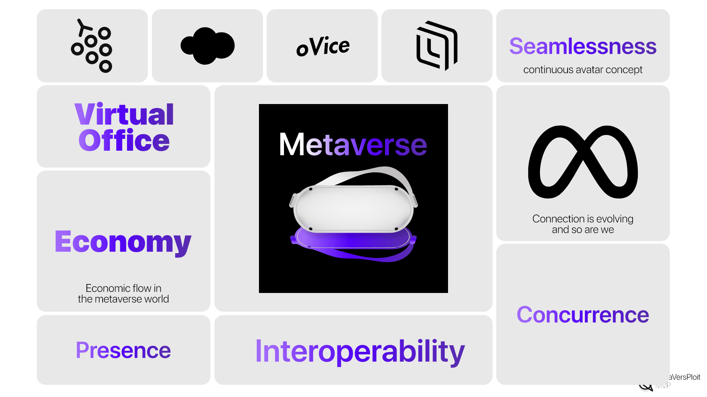

 `메타버스`라는 키워드는 다양한 분야에서 사용되고 다양한 속성이 부여되어 독특한 특성을 갖게 되어집니다. 다양한 특성중에 크게 5가지 의 특성을 살펴볼 수 있습니다. 

- Seamlessness : 메타버스 와 현실간의 연속된 작업 진행
- Presence : 메타버스 속 현실에 가까운 실재감
- Interoperability : 메타버스 와 현실의 실시간 정보 공유를 바탕으로 다양한 경험 획득
- Concurrence : 시공간의 제약 없이 다양한 사람들과 서로 다른경험을 할 수있는 환경
- Economy : 메타버스 속 경제의 흐름

 이러한 특성은 공통으로 현실과 가상세계의 실시간 상호작용으로 볼 수 있겠습니다.

 메타버스속 가상 오피스는 앞선 특성을 포함한 체 가상 오피스만의 기능을 활용하여 또 하나의 가상 세계라고 볼 수 있겠습니다. 현실 세계의 오피스 환경이 메타버스와 실시간으로 상호작용하면서 사용 자간의 다양한 경험을 시공간 제약 없이 어디서든지 연속적으로 접근하며 기업의 경제적 흐름을 더욱더 증진합니다.

 가상 오피스는 회의실, 사무실, 문서 작업, 미팅 등 현실 속 회사 업무의 환경을 그대로 메타버스 로 결합한 형태입니다.

## MetaVerse Virtual office platform Service statistics

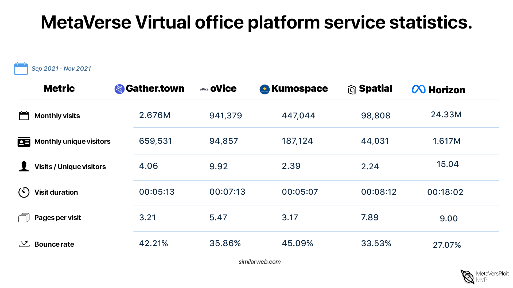

 메타버스를 기반으로 서비스를 운영 중인 Gather, oVice, Kumospace, Spatial, Horizon 플랫폼의 최근 약 4개월간의 Monthly visits, Monthly unique visitors, visits/unique visitors, visit duration, pages per visit, Bounce rate 데이터를 표로 나열하였습니다.

 해당 데이터를 통해 COVID-19 로 인해 언택트 업무가 증가함에 따라 메타버스 가상 오피스 서비스가 추세적 상승을 하는 것을 확인할 수 있으며 뿐만 아니라 전 세계 적으로 “언택트 업무가 더 효율적이다.” 의견이 많아짐에 따라 가상 오피스에 관심이 커지고 있습니다.

# Project Approach Methodology

## Project Point

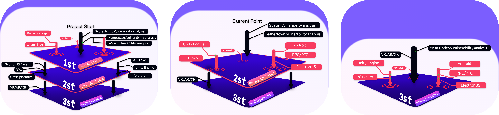

 우리는 약 4개월의 시간 동안 계층적으로 메타버스 가상오피스 플랫폼 취약점에 대해 연구를 진행했습니다. 메타버스 가상오피스 플랫폼 환경의 취약성을 판단하기 위해 웹 애플리케이션 상에서 서비스 기능과 권한 전반적인 기술 스택을 분석하였습니다. 취약성이 판단된 부분에 대해서 바이너리 애플리케이션 환경에서 해당 기능이 다른 애플리케이션에 대해 교차 검증 및 각 기술 스택에서 발생하는 취약성 및 공통적인 기능 에 대한 취약성 등을 분석하여 계층적으로 깊이 있는 분석을 진행하여 취약점을 발견할 수 있었습니다.

## Vulnerability analysis methodology

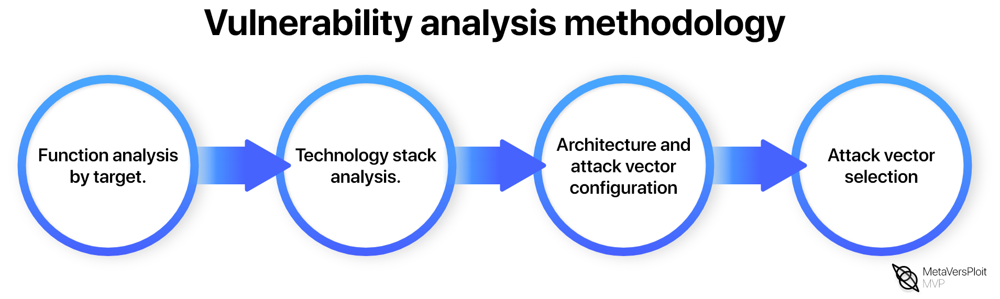

 우리는 취약점 분석 방법론을 구축하여 대상 애플리케이션에 대한 취약점을 분석하였습니다. 

1. Function analysis by target
2. Technology stack analysis
3. Architecture and attack vector configuration
4. Attack Vector Selection

4가지 순서대로 취약점 점검을 진행하는 대상 애플리케이션에 대한 기능을 분석하여 열거를 하였습니다. 분석 대상마다 서로 다른 기능이 존재 하지만 공통적인 기능이 존재하여 이를 분류하는 작업과 취약한 부분이 있을 경우 매칭하여 리스트를 만들었습니다.

 웹/바이너리 애플리케이션 환경에서 분석한 데이터를 기반으로 기술 스택 리스트를 만들어 기능 리스트와 매칭하여 각 플랫폼 마다 아키텍처를 구성하였습니다. 구성된 아키텍처에서 취약한 공격 벡터를 구성하여 최종적인 공격 벡터를 선정하였습니다. 

## Common functions for each MetaVerse Virtual office platform

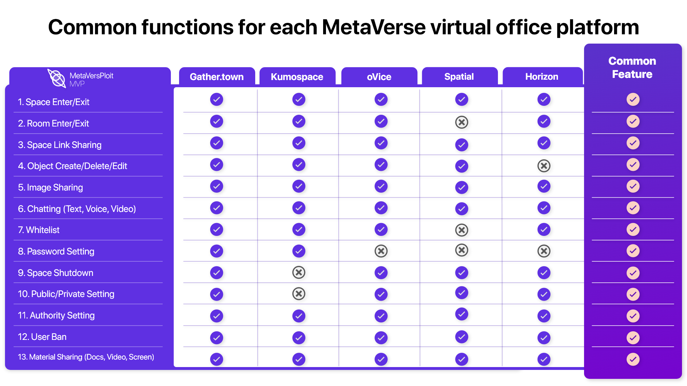

 리스트는 선정한 5가지의 메타버스 기반 가상 오피스 플랫폼별 기능 중 팀에서 연구를 통해 수많은 기능 중 공통된 13가지의 기능 리스트입니다. 세부적으로 가상 오피스 내부 공간을 space라 칭하며space 출근/퇴근 기능, 회의실 출근/퇴근, space에 초대하는 기능, Space/Room 내부에 다양한 Object를 생성/삭제/수정, 내부 콘텐츠를 공유, 채팅 (음성, 영상, 글), 접근 통제, Space 생성/삭제/수정, 사용자 권한, 외부 문서 공유 기능으로 나누었습니다. 산출된 공통 기능들 중 플랫폼별 체크리스트 형태로 정리를 하였습니다.

## Technology Stacks to MetaVerse Virtual office platform Enumeration

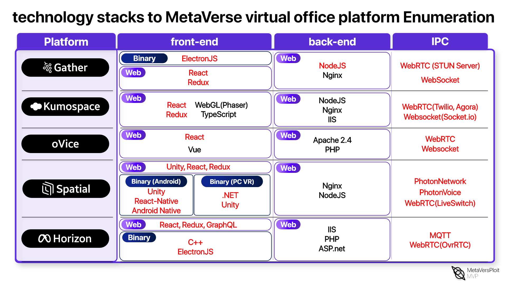

 앞서 13가지 공통 기능과 함께 아키텍처를 구성하기 위해 기술 스택 분석을 진행하였습니다. 해당 리스트는 선정한 5가지의 메타버스 기반 가상오피스 플랫폼 별 기술 스택을 정리하였습니다. 각 플랫폼 마다 바이너리/웹 애플리케이션 환경에서 사용되는 중요 기술에 대해 구분을 지었으며 공통적으로 핵심 기술 스택 부분인 front-end, back-end, ipc 카테고리로 분류하였습니다. 

 13가지 기능과 기술 스택을 매칭하여 가중치가 높게 나온 기술 부분에 대해 중점적인 취약점 분석을 진행하였습니다.

## Architecture and attack vectors by platform

 아키텍처 및 공격 벡터 선정에 있어 앞서 메타버스 기반 가상 오피스 플랫폼 별 기술 스택과 공통 기능 리스트를 분석을 통해 산출된 데이터를 기반으로 구성을 진행하였습니다. 

- kumospace (web)
- oVice (web)
- Gather (web/PC binary)
- Spatial (web/mobile/PC VR)
- Horizon workrooms (web/mobile/VR)

선정한 5가지 플랫폼에 대한 아키텍처를 구성한 후 공통 기능 13가지 부분에 대해서는 hotspot point를 잡았고 나머지 Unique 한 기능에 대해서는 cold Spot point로 잡아 최종적인 공격 벡터를 선정하였습니다.

선정된 공격 벡터는 IPC 개념에서의 Web Socket 통신을 활용해 Avatar, Map, Theme 등 실시간으로 적용되는 콘텐츠와 Voice, Screen Sharing을 위한 WEB RTC 통신 과정에 대해 Hooking과 클라이언트 처리 과정에 대해서 Code Auditing을 진행하였습니다.

Origin-API, Third-Party API 개념의 공격 벡터는 각 웹/바이너리 환경에서 특정 네트워크 처리를 진행하는 부분과 base Language에 관련된 모듈을 Code Auditing과 Application Request/Response 과정을 분석하였습니다.

oculus VR 장비의 Application으로 Android APK의 전반적인 공격 벡터로 Code Auditing과 관련 모듈에 대해 JNI, Third-party lb에 대해서 Hooking을 통해 흐름 분석을 진행하였습니다.

각 플랫폼별 내부 콘텐츠/오브젝트에 관해 구현된 언어와 기능적 부분을 공격 벡터로 선정하여 로직 버그 및 보호 대책 미흡 부분을 우회하는 방안으로 분석을 진행하였습니다.


### Kumospace

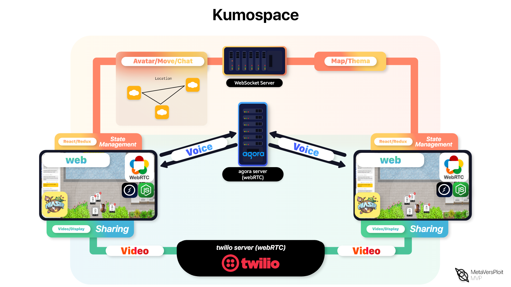

### oVice

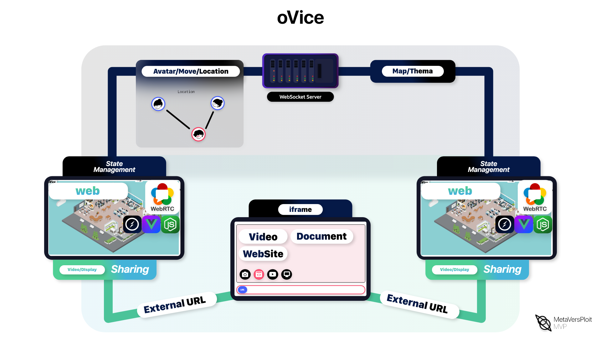

### Gather

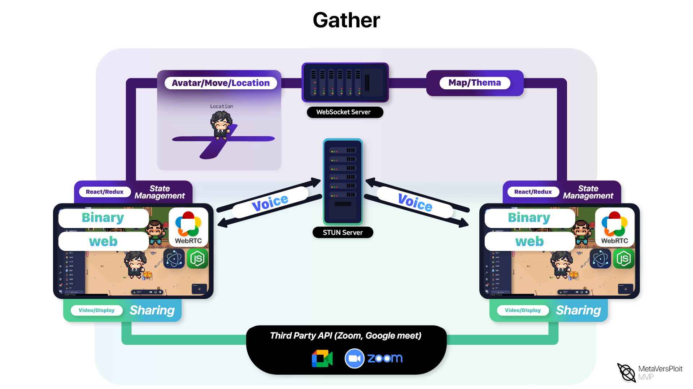

### Spatial

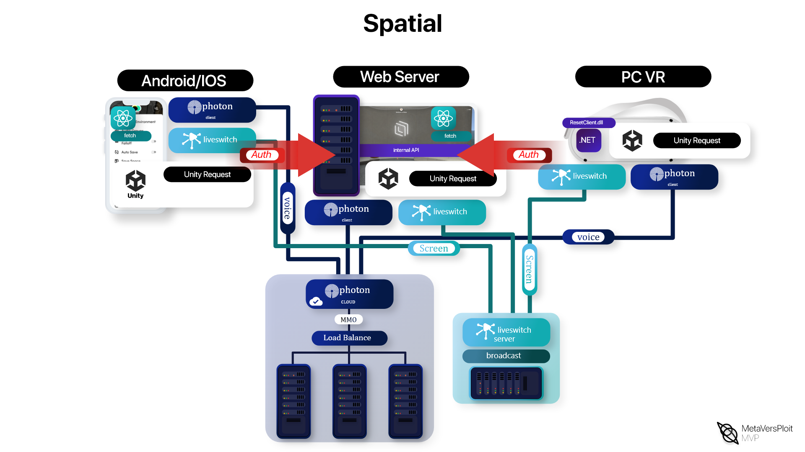

### Horizon Workrooms

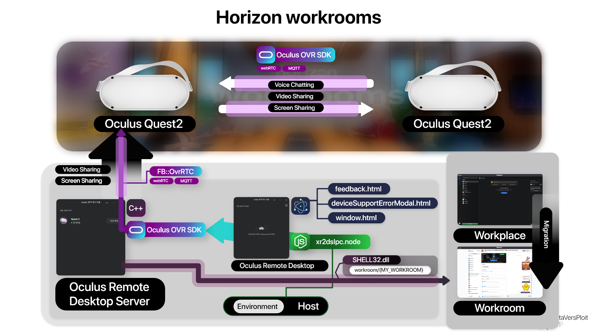

## MetaVerse Virtual Office Platform Common Attack Impact List

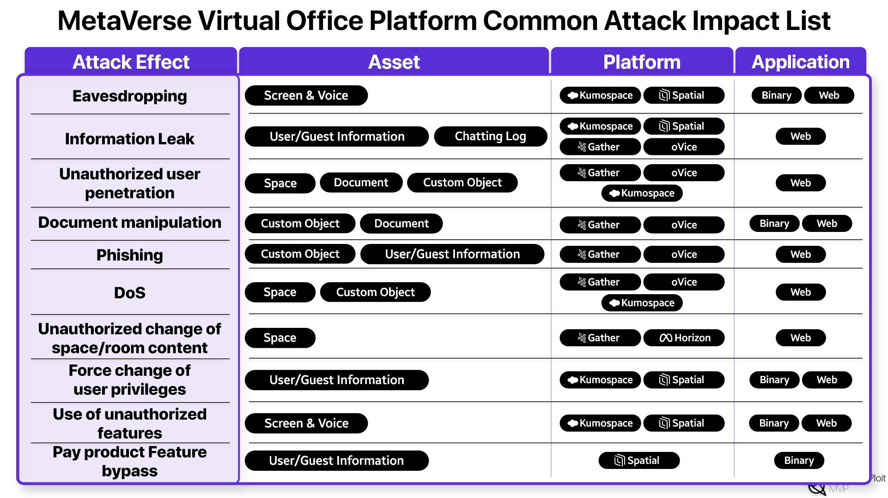

 메타버스 가상오피스 플랫폼에서만 발생할 수 있는 공격 영향을 선정하여 실제 가상 오피스에서 보안 위협이 발생하였을 때 위협이 될 만한 자원 대상별 공격 영향을 산출하였다. 각 공격 영향을 산출하여 핵심적으로 취약점과 연관된 영향 총 10가지를 선정하였다. 도청은 가상 오피스에서 회의 나 1:1 대화 시 송수신되는 데이터를 중간에서 가로채는 방식으로 엿듣는 과정이 실제 물리적 환경이 아닌 사이버 공간에서 발생하여 파급력이 높으며 시공간 제약 없이 내부 데이터를 실시간으로 훔쳐 올 수 있는 피해가 존재합니다.

 정보 노출은 현실의 기업에서도 내부 기밀 유출에 대해 내부, 외부 상관없이 보안 측면에서 신경을 많이 쓰지만 사이버 공간에서 데이터가 밀접하게 노출된 가상 오피스에서는 민감 데이터의 노출 여부가 엄청난 파급력이 발생합니다.

 그 외에도 다양한 리스트에 정리한 임팩트 부분에서 실제 물리적 환경에서 발생할 수 없는 케이스로 DOS로 가상의 공간에서 DOS로 인해 회사 업무를 처리할 수 없는 상황이 발생할 수 있으며 외부의 사용자가 회사 내에 접근하여 데이터 탈취가 가능할 수 있고 실제 회사에서만 사용할 수 있는 기능, 제품을 강제로 사용할 수 있는 부분 등 리스트에 열거한 공격 임팩트가 가상 오피스에 발생할 수 있습니다.

 다음 대표적으로 가상 오피스를 운영하는 애플리케이션 환경에서 로직 적 결함 및 버그 케이스로 인하여 RCE 취약점이 허용되면 기존의 물리적 환경에서의 기업을 운영하는 처지에서 기업 내부망에 결함이 생긴 것은 동일하지만 왜/내부망 상관없이 가상 오피스에서는 실제 기업 환경의 내부에 침입하여 매우 위험한 상황이 발생할 수 있습니다.

# Conclusion

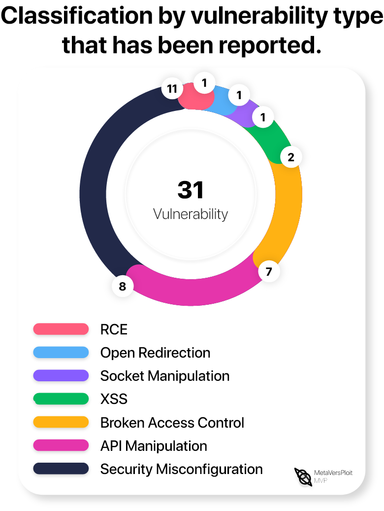

 BoB 프로젝트를 통해 약 4개월간 취약점에 대한 경각심을 갖고 사용 메타버스 기반 가상 오피스 플랫폼에 대한 보안성 향상을 목적으로 분석을 진행하였습니다. 총 31건의 취약점을 발견할 수 있었습니다. 분석을 진행하였던 5개의 플랫폼에서 각기 다른 웹/바이너리 애플리케이션 환경에서 저희가 구성한 취약점 분석 방법론에 맞춰서 분석을 진행하였습니다. 공격 벡터 선정에 있어서 13가지의 가상 오피스 공통 기능과 기술 스택을 기반으로 아키텍처를 구성하여 각각의 hotspot, coldspot 영역을 참고하면서 기능적 흐름에서 버그가 발생하는 부분에 대해 Security Misconfiguration 취약점이 큰 비중을 차지하여 로직 버그가 발생하였습니다. 로직 버그 취약점을 활용하여 공격 시나리오에서 연계 공격으로 DOS, 기능 우회 방안 등 이용할 수 있었습니다.

 대상 애플리케이션 환경에서 Third-party API와 Origin-API를 활용하여 통신하는 과정에서 API Manipulation 취약점을 활용해 특이성을 발생 시켜 권한 상승, 정보 노출 등 크리티컬한 취약점까지 연계가 가능하였습니다. 가상 오피스에서 자신의 아바타를 이동하거나, 다양한 콘텐츠를 활용하는 경우 web Socket을 활용하여 실시간으로 데이터를 처리하는 데 있어 클라이언트 환경에서 서버 측으로 받아온 데이터 처리가 미흡하여 발생한 Socket Manipulation 취약성을 통해 음성, 영상 도청 등 내부 콘텐츠에 대한 취약성을 찾을 수 있었습니다.

 현실의 물리적 공간으로 사용되는 회의실, 미팅룸 등 공간적인 개념을 가상 오피스에서는  Space, Room 개체를 활용해서 내부에 Object를 생성하는 기능을 구현하는 데 있어서 각기 다른 방식으로 개발을 진행합니다. 공통된 기능이지만, 오피스에 속하지 않는 사람이 실제 해당 오피스에 접근할 수 없도록 권한 분리 및 접근 통제 기능이 구현되어 있습니다. 하지만 이러한 기능에서 개발적인 실수 로 인하여 접근할 수 없는 사람이 강제적으로 해당 오피스에 접근을 할 수 있어 가상 오피스 내에 데이터를 탈취하거나, 모든 데이터를 삭제하는 등 악의적인 행위를 발생할 수 있는 취약성이 존재하였습니다. 각기 다른 방식으로 구현된 가상 오피스에서는 웹/바이너리에 사용되는 기술에서 Unity Engine과 멀티 플레이 최적화를 위해 Photon Server와 실시간 통신을 하기 위한 WEB RTC 개념이 사용되고 있지만, 개발 당시 클라이언트, 서버 측에서 제대로 권한 관리 및 세션 노출 등 교차 검증이 미흡하여 손쉽게 공격자가 중간에서 데이터를 탈취하거나 데이터를 악의적으로 변조하여 클라이언트 측에서 공격을 수행하는 과정이 발생하였습니다.

 특정 가상 오피스 애플리케이션 환경에서는 구현된 내부 오브젝트로 가상의 책상, 화이트보드, 화면, 화분 등이 사용되고 있습니다. 물리적 환경에서의 회사는 이러한 물건들을 대상으로 시각적인 효과 기능적인 요소로 사용되고 있지만, 가상의 공간에서는 사용자와 밀접한 연관이 있게 되며 평범한 오브젝트라도 사용자 클라이언트 측에서 자원을 사용하게 되어 같은 메모리 공간에 존재하기 때문에 해당 객체의 기능적 결함으로 인한 취약점이 발생하여 사용자에게 공격이 가능한 벡터가 존재합니다. 이번 취약점 분석에서 웹 애플리케이션 환경의 외부 콘텐츠를 불러올 수 있는 객체 기능의 보안 결함으로 XSS 취약점이 발생하여 해당 취약점을 이용해 권한 상승 및 다른 사용자들의 세션 탈취, 내부 함수를 이용한 특정 DOS 등 다양한 공격이 연계될 수 있었으며 또한 code Execution이 가능하여 실제 window/mac OS 환경에서 Remote Code Execution 취약점까지 수행이 되어 실제 가상 사무실을 이용하였을 때 크리티컬한 취약점이 수행될 수 있었습니다.

 본 팀은 기간 내에 성공적으로 목표 달성을 수행하며, 상용 메타버스 기반 가상 오피스 플랫폼 취약점을 연구하고 관련 취약한 부분에 대한 대응책과 취약점 분석 방법론을 공유하며 이후 계속해서 발전하는 메타버스 환경의 취약점을 분석하는 사람들에게 도움이 되었으면 합니다.


```toc
```