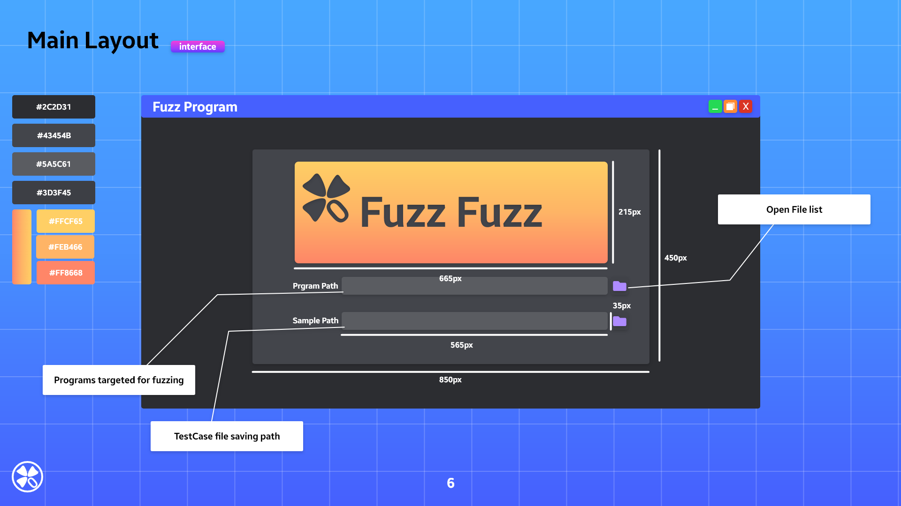
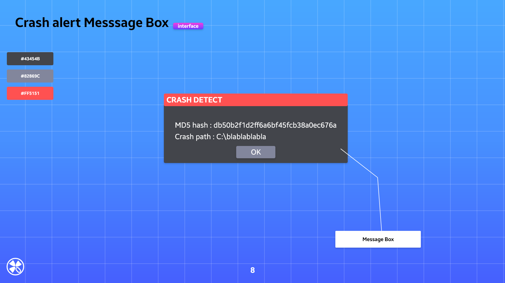
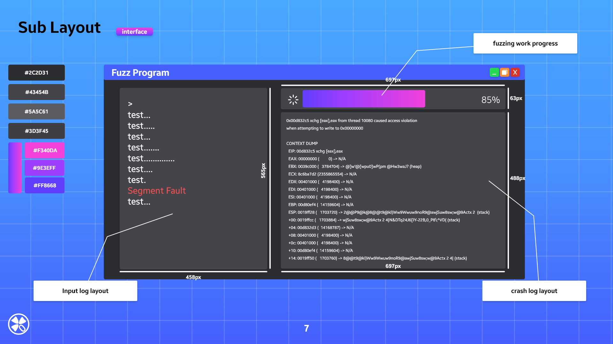

# Fuzz

**Fuzzing** or **fuzz testing** is an automated [software testing](https://en.wikipedia.org/wiki/Software_testing) technique that involves providing invalid, unexpected, or [random data](https://en.wikipedia.org/wiki/Random_data) as inputs to a [computer program](https://en.wikipedia.org/wiki/Computer_program). The program is then monitored for exceptions such as [crashes](https://en.wikipedia.org/wiki/Crash_(computing)), failing built-in code [assertions](https://en.wikipedia.org/wiki/Assertion_(software_development)), or potential [memory leaks](https://en.wikipedia.org/wiki/Memory_leak). Typically, fuzzers are used to test programs that take structured inputs. This structure is specified, e.g., in a [file format](https://en.wikipedia.org/wiki/File_format) or [protocol](https://en.wikipedia.org/wiki/Communications_protocol) and distinguishes valid from invalid input. An effective fuzzer generates semi-valid inputs that are "valid enough" in that they are not directly rejected by the parser, but do create unexpected behaviors deeper in the program and are "invalid enough" to expose [corner cases](https://en.wikipedia.org/wiki/Corner_case) that have not been properly dealt with.

For the purpose of security, input that crosses a [trust boundary](https://en.wikipedia.org/wiki/Trust_boundary) is often the most interesting. For example, it is more important to fuzz code that handles the upload of a file by any user than it is to fuzz the code that parses a configuration file that is accessible only to a privileged user.

[*https://en.wikipedia.org/wiki/Fuzzing*](https://en.wikipedia.org/wiki/Fuzzing)

## Fuzzer tool

```python
1. Window PE file fuzzing operation
2. dumb fuzzer
3. Customizable TestCase
4. GUI Interface using PyQt
5. Message Box notification when Crash is detected
```

## Required installation

- [PaiMei-1.1.win32.exe](https://vallhalla-edition.tistory.com/attachment/cfile23.uf@9959693E5C98A9A80FBC86.exe)

```python
######################################################################
#  This file should be kept compatible with Python 2.3, see PEP 291. #
######################################################################
"""create and manipulate C data types in Python"""

import os as _os, sys as _sys

__version__ = "1.1.0"

from _ctypes import Union, Structure, Array
from _ctypes import _Pointer
from _ctypes import CFuncPtr as _CFuncPtr
from _ctypes import __version__ as _ctypes_version
from _ctypes import RTLD_LOCAL, RTLD_GLOBAL
from _ctypes import ArgumentError

from _ctypes import Structure as _ctypesStructure       # Add for Paimei
from struct import calcsize as _calcsize
class Structure (_ctypesStructure): pass                # Add for Paimei

if __version__ != _ctypes_version:
    raise Exception("Version number mismatch", __version__, _ctypes_version)
```

- For compatibility with python 2.7.x version, modify the **init**.py file.
`PATH: C:\Python27\Lib\ctypes\**init**.py`
- If you added the code in lines 17 and 19, download the rebuilt pydasm.pyd file for Python 2.7.x.
- After that, copy it to the C:\Python27\Lib\site-packages\pydbg folder.
If there is an existing pydasm.pyd file, it will be overwritten.
- [pydasm.pyd](https://vallhalla-edition.tistory.com/attachment/cfile27.uf@99B4814F5C98AB6A29F4DB.pyd)

**pydasm test**

```python
import pydbg
print "Hello, pydbg!"
```

- success!

## Options (CLI)

```python
-t, --target : Binary to fuzz
-s, --sample : Sample folder name (Test Case file)
-h, --help : help
```

## BluePrint (GUI)








```toc
```