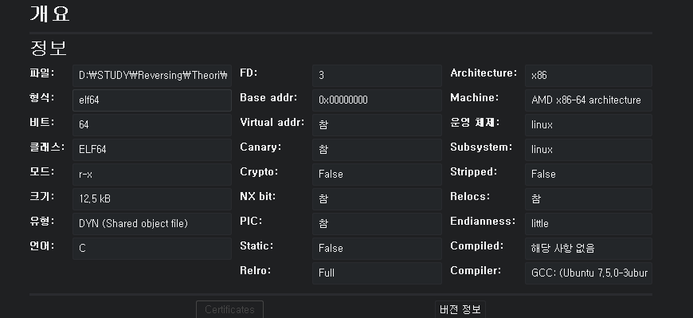
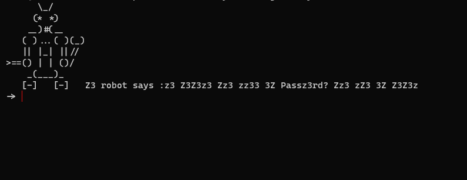
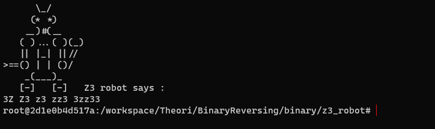
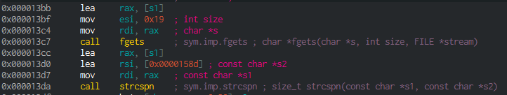
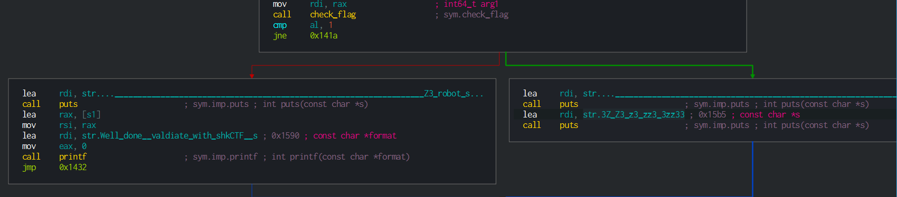
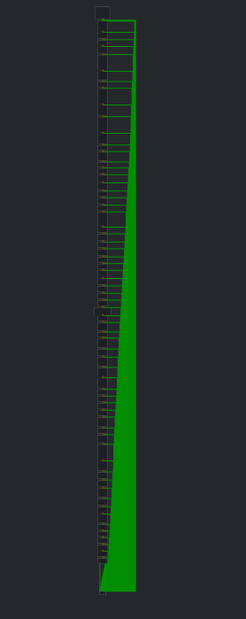

# 취약점 분석 

## 바이너리 정보


## 바이너리 실행



- 입력 값을 받을 수 있도록 하며 임의의 문자열을 입력할 시 `3Z Z3 z3 zz3 3zz33` 해당 문자열을 출력하는 것을 알 수 있다.





- `fgets` 함수 호출 인자 `char *s`, `0x19`, `s1`
- `strcspn` 함수 호출 인자 `const char *s1`, `const char *s2`, `s1`
    - str1에 있는 문자열에서 str2 문자가 있을 경우 그 문자 까지의 개수를 리턴한다.



- flag 값을 얻기 위해서는 `check_flag` 함수를 거쳐서 반환 값이 1이어야 한다.

- 반환 값을 얻기 까지의 조건들이 너무 더럽다....



```cpp
_BOOL8 __fastcall check_flag(char *a1)
{
  return ((unsigned __int8)a1[20] ^ 0x2B) == a1[7]
      && a1[21] - a1[3] == -20
      && !(a1[2] >> 6)
      && a1[13] == 116
      && 4 * a1[11] == 380
      && a1[7] >> a1[17] % 8 == 5
      && ((unsigned __int8)a1[6] ^ 0x53) == a1[14]
      && a1[8] == 122
      && a1[5] << a1[9] % 8 == 392
      && a1[16] - a1[7] == 20
      && a1[7] << a1[23] % 8 == 190
      && a1[2] - a1[7] == -43
      && a1[21] == 95
      && ((unsigned __int8)a1[2] ^ 0x47) == a1[3]
      && *a1 == 99
      && a1[13] == 116
      && (a1[20] & 0x45) == 68
      && (a1[8] & 0x15) == 16
      && a1[12] == 95
      && a1[4] >> 4 == 7
      && a1[13] == 116
      && *a1 >> *a1 % 8 == 12
      && a1[10] == 95
      && (a1[8] & 0xAC) == 40
      && a1[16] == 115
      && (a1[22] & 0x1D) == 24
      && a1[9] == 51
      && a1[5] == 49
      && 4 * a1[19] == 456
      && a1[20] >> 6 == 1
      && a1[7] >> 1 == 47
      && a1[1] == 108
      && a1[3] >> 4 == 7
      && (a1[19] & 0x49) == 64
      && a1[4] == 115
      && ((unsigned __int8)a1[2] & (unsigned __int8)a1[11]) == 20
      && *a1 == 99
      && a1[4] + a1[5] == 164
      && a1[15] << 6 == 6080
      && ((unsigned __int8)a1[10] ^ 0x2B) == a1[17]
      && ((unsigned __int8)a1[12] ^ 0x2C) == a1[4]
      && a1[19] - a1[21] == 19
      && a1[12] == 95
      && a1[15] >> 1 == 47
      && a1[19] == 114
      && a1[17] + a1[18] == 168
      && a1[22] == 58
      && ((unsigned __int8)a1[23] & (unsigned __int8)a1[21]) == 9
      && a1[6] << a1[19] % 8 == 396
      && a1[3] + a1[7] == 210
      && (a1[22] & 0xED) == 40
      && (a1[12] & 0xAC) == 12
      && ((unsigned __int8)a1[18] ^ 0x6B) == a1[15]
      && (a1[16] & 0x7A) == 114
      && (*a1 & 0x39) == 33
      && ((unsigned __int8)a1[6] ^ 0x3C) == a1[21]
      && a1[20] == 116
      && a1[19] == 114
      && a1[12] == 95
      && a1[2] == 52
      && a1[23] == 41
      && a1[10] == 95
      && ((unsigned __int8)a1[22] & (unsigned __int8)a1[9]) == 50
      && a1[3] + a1[2] == 167
      && a1[17] - a1[14] == 68
      && a1[21] == 95
      && ((unsigned __int8)a1[19] ^ 0x2D) == a1[10]
      && 4 * a1[12] == 380
      && a1[6] & 0x40
      && ((unsigned __int8)a1[12] & (unsigned __int8)a1[22]) == 26
      && a1[7] << a1[19] % 8 == 380
      && ((unsigned __int8)a1[20] ^ 0x4E) == a1[22]
      && a1[6] == 99
      && a1[12] == a1[7]
      && a1[19] - a1[13] == -2
      && a1[14] >> 4 == 3
      && (a1[12] & 0x38) == 24
      && a1[8] << a1[10] % 8 == 15616
      && a1[20] == 116
      && a1[6] >> a1[22] % 8 == 24
      && a1[22] - a1[5] == 9
      && a1[7] << a1[22] % 8 == 380
      && a1[22] == 58
      && a1[16] == 115
      && ((unsigned __int8)a1[23] ^ 0x1D) == a1[18]
      && a1[23] + a1[14] == 89
      && ((unsigned __int8)a1[5] & (unsigned __int8)a1[2]) == 48
      && (a1[15] & 0x9F) == 31
      && a1[4] == 115
      && ((unsigned __int8)a1[23] ^ 0x4A) == *a1
      && ((unsigned __int8)a1[6] ^ 0x3C) == a1[11];
}
```

- 해당 조건을 디컴파일 한 결과 조건을 만족할 시 반환 되는 값은 1이다. 문제 제목 처럼 Z3를 통해 풀어보도록 하겠다.

# 해결 방안
```python
from z3 import *

s = Solver()
a1 = []

# 사용자의 입력으로 들어갈 인풋을 BitVec 타입으로 정의한다.
for x in range(25):
    a1.append(BitVec(x, 8))

s.add((a1[20] ^ 0x2B) == a1[7])
s.add(a1[21] - a1[3] == -20)
s.add((a1[2] >> 6) == 0)
s.add(a1[13] == 116)
s.add(4 * a1[11] == 380)
s.add(a1[7] >> (a1[17] % 8) == 5)                
s.add((a1[6] ^ 0x53) == a1[14])
s.add(a1[8] == 122)
s.add(a1[5] << (a1[9] % 8) == 392)
s.add(a1[16] - a1[7] == 20)
s.add(a1[7] << (a1[23] % 8) == 190)
s.add(a1[2] - a1[7] == -43)
s.add(a1[21] == 95)
s.add((a1[2] ^ 0x47) == a1[3])
s.add(a1[0] == 99)
s.add(a1[13] == 116)
s.add((a1[20] & 0x45) == 68)
s.add((a1[8] & 0x15) == 16)
s.add(a1[12] == 95)
s.add(a1[4] >> 4 == 7)
s.add(a1[13] == 116)
s.add(a1[0] >> (a1[0] % 8) == 12)
s.add(a1[10] == 95)
s.add((a1[8] & 0xAC) == 40)
s.add(a1[16] == 115)
s.add((a1[22] & 0x1D) == 24)
s.add(a1[9] == 51)
s.add(a1[5] == 49)
s.add(4 * a1[19] == 456)
s.add(a1[20] >> 6 == 1)
s.add(a1[7] >> 1 == 47)
s.add(a1[1] == 108)
s.add(a1[3] >> 4 == 7)
s.add((a1[19] & 0x49) == 64)
s.add(a1[4] == 115)
s.add(a1[2] & a1[11] == 20)
s.add(a1[0] == 99)
s.add(a1[4] + a1[5] == 164)
s.add(a1[15] << 6 == 6080)
s.add(a1[10] ^ 0x2B == a1[17])
s.add(a1[12] ^ 0x2C == a1[4])
s.add(a1[19] - a1[21] == 19)
s.add(a1[12] == 95)
s.add(a1[15] >> 1 == 47)
s.add(a1[19] == 114)
s.add(a1[17] + a1[18] == 168)
s.add(a1[22] == 58)
s.add(a1[23] & a1[21] == 9)
s.add(a1[6] << (a1[19] % 8) == 396)
s.add(a1[3] + a1[7] == 210)
s.add((a1[22] & 0xED) == 40)
s.add((a1[12] & 0xAC) == 12)
s.add((a1[18] ^ 0x6B) == a1[15])
s.add((a1[16] & 0x7A) == 114)
s.add((a1[0] & 0x39) == 33)
s.add((a1[6] ^ 0x3C) == a1[21])
s.add(a1[20] == 116)
s.add(a1[19] == 114)
s.add(a1[12] == 95)
s.add(a1[2] == 52)
s.add(a1[23] == 41)
s.add(a1[10] == 95)
s.add((a1[22] & a1[9]) == 50)
s.add(a1[3] + a1[2] == 167)
s.add(a1[17] - a1[14] == 68)
s.add(a1[21] == 95)
s.add((a1[19] ^ 0x2D) == a1[10])
s.add(4 * a1[12] == 380)
s.add(a1[6] & 0x40 >= 1)
s.add((a1[12] & a1[22]) == 26)
s.add(a1[7] << (a1[19] % 8) == 380)
s.add((a1[20] ^ 0x4E) == a1[22])
s.add(a1[6] == 99)
s.add(a1[12] == a1[7])
s.add(a1[19] - a1[13] == -2)
s.add(a1[14] >> 4 == 3)
s.add((a1[12] & 0x38) == 24)
s.add(a1[8] << (a1[10] % 8) == 15616)
s.add(a1[20] == 116)
s.add(a1[6] >> (a1[22] % 8) == 24)
s.add(a1[22] - a1[5] == 9)
s.add(a1[7] << (a1[22] % 8) == 380)
s.add(a1[22] == 58)
s.add(a1[16] == 115)
s.add((a1[23] ^ 0x1D) == a1[18])
s.add(a1[23] + a1[14] == 89)
s.add((a1[5] & a1[2]) == 48)
s.add((a1[15] & 0x9F) == 31)
s.add(a1[4] == 115)
s.add((a1[23] ^ 0x4A) == a1[0])
s.add((a1[6] ^ 0x3C) == a1[11])

# 앞의 조건을 만족한다면 Solver 클래스의 만족 결과가 충족하는지 검사한다.
assert s.check() == sat

model = s.model()

flag =''
for i in range(len(model)):
    flag +=chr(model[a1[i]].as_long())

print flag
```

- SAT (Boolean SATisfiability problem)
    - 주어진 Boolean 식을 충족시키는 해 (True로 표현되는 해)가 존재하는지 결정하는 문제
    - SAT는 명제논리식이기 때문에 각 변수에 True/False만 할당한다.

``` toc
```